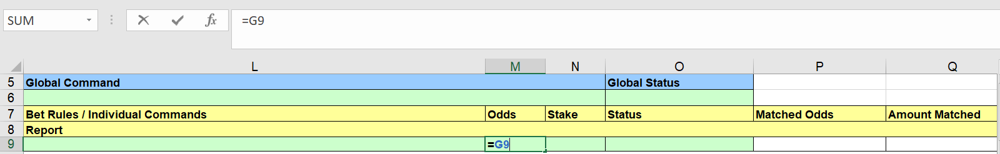

# Bet Angel - ratings automation

---
### Automating a ratings based strategy using Bet Angel


We all love getting some good racing tips, but who has time to sit and place bets all day? Wouldn't it be easier if you could take those tips and get a program to automatically place the bets on your behalf? 

This is what we're going to explore here - we'll be using Bet Angel Pro to place bets automatically based on a set of tips. This is my first time using Bet Angel for this approach, and am very open to any thoughts about more effecitve ways of implementing this sort of strategy. You're welcome to reach out to me on bdp@betfair.com.au with your feedback and opinions. 

--- 
### The plan

Let's say you have a set of tips that you want to bet on each day, but don't want to have to go to the hassle of manually placing those bets. Bet Angel Pro's 'Guardian' funcationality has the capacity to let you create rules that can then be applied to specific selections.

Here I'll step through how I went about getting Bet Angel Pro to place bets using the ratings from [Betfair's DataScientists' Greyhound Ratings Model](https://www.betfair.com.au/hub/tools/models/greyhound-ratings-model/). Once it's set up the goal is to be able to upload a new set of ratings, choose your races, set the program running and be able to walk away.


!!! note "Resources"
    - Tips: [Betfair Data Scientists' Greyhound Ratings Model](https://www.betfair.com.au/hub/tools/models/greyhound-ratings-model/)
    - Rules: here's the spreadsheet I set up with my rules included, but you'll need to tweak it to suit your strategy and the format of your ratings 
    - Tool: [Bet Angel Pro](https://www.betangel.com/bet-angel-professional/)

---
### Set up 

Make sure you've downloaded and installed Bet Angel Pro, and signed in.

Once you open the program up click on the 'G' Guardian icon and open the Guardian functionality up. 


---
### Finding & formatting ratings

Here I'm using the ratings shared by our Data Scientists on the Hub. This makes for a bit of prep work, copying the list of runners and their rating into an Excel spreadsheet. As a minimum you'll need a list of runner names (including the runner number followed by a full stop, i.e. 1. Runner Name) in one column and their rating in another in an Excel sheet. 

If you have a list of ratings already in a spreadsheet that's even better - you'll be able to tweak the Excel formulas to work with whatever format your data is in.

Wherever your ratings come from, you'll need to open up the BetAngel template (or if you prefer you can use this version that I edited for this strategy), and then create a new sheet and copy in your ratings. In my example I've called this tab RATINGS.


---
### Writing a rule 

As with any automated strategy, one of the most important steps is deciding what logical approach you want to take, and writing rules that suit. 

I'm using the default Bet Angel template Excel sheet to implement my strategy to make betting decisions based on my ratings. Excel is an excellent tool, but it can take an investment of time to be able to use it effectively. 

Here's how I used Excel to implement my set of rules. 


#### Trigger to place bet

In short, I want to back runners when:

- the available to back price is better than the rating for that runner by at least 10%
- they have a rating less than 5
- the scheduled event start time is less than 2 minutes away 
- there isn't a bet already placed on the runner 
- the event isn't in play


**This is my trigger on Excel formula:**

``` excel tab="Multi line"
=IF(
    AND(
        G9 > (INDEX(RATINGS!B:B,MATCH(B9,RATINGS!A:A,0))*1.1),
        INDEX(RATINGS!B:B,MATCH(B9,RATINGS!A:A,0)) < 5, 
        Sheet2!$E$4 < 120, 
        AB10 < 1,
        ISBLANK($G$1)),
    "BACK",
    ""
)
```

``` excel tab="Single line"
=IF(AND(G9 > (INDEX(RATINGS!B:B,MATCH(B9,RATINGS!A:A,0))*1.1),INDEX(RATINGS!B:B,MATCH(B9,RATINGS!A:A,0)) < 5, Sheet2!$E$4 < 120, AB10 < 1, ISBLANK($G$1)),"BACK","")
```

Stepping through each step:

- **Price > rating:** check whether the available to back price is better tha the runner's rating multipled by 1.1 (10%) - it does this by using the runner name in column B and looking up the corresponding rating from the RATINGS sheet

``` excel hl_lines="3"
=IF(
    AND(
        G9 > (INDEX(RATINGS!B:B,MATCH(B9,RATINGS!A:A,0))*1.1),
        INDEX(RATINGS!B:B,MATCH(B9,RATINGS!A:A,0)) < 5, 
        Sheet2!$E$4 < 120, 
        AB10 < 1,
        ISBLANK($G$1)),
    "BACK",
    ""
)
```

- **Rating < 5:** check whether the runner's rating is less than 5 (because I only want to bet on the favourite few runners)

``` excel hl_lines="4"
=IF(
    AND(
        G9 > (INDEX(RATINGS!B:B,MATCH(B9,RATINGS!A:A,0))*1.1),
        INDEX(RATINGS!B:B,MATCH(B9,RATINGS!A:A,0)) < 5, 
        Sheet2!$E$4 < 120, 
        AB10 < 1,
        ISBLANK($G$1)),
    "BACK",
    ""
)
```

- **Time < 2:** check whether the seconds left on the countdown are smaller than 120 (2 minutes), as the majority of markets don't fully form until the last few minutes before the off. This one's a bit complicated, as the time is actually returned as a percentage of a 24 hour day, which you need to convert into positive or negative seconds. [You can read about the formula here](https://www.betangel.com/forum/viewtopic.php?t=7657) or just keep it simple by referencing the value in cell E4 of Sheet2.

``` excel hl_lines="5"
=IF(
    AND(
        G9 > (INDEX(RATINGS!B:B,MATCH(B9,RATINGS!A:A,0))*1.1),
        INDEX(RATINGS!B:B,MATCH(B9,RATINGS!A:A,0)) < 5, 
        Sheet2!$E$4 < 120, 
        AB10 < 1,
        ISBLANK($G$1)),
    "BACK",
    ""
)
```

- **Existing bet:** checking whether a bet's already been placed on the runner (a number show in column AB when there's a bet on that runner)

``` excel hl_lines="6"
=IF(
    AND(
        G9 > (INDEX(RATINGS!B:B,MATCH(B9,RATINGS!A:A,0))*1.1),
        INDEX(RATINGS!B:B,MATCH(B9,RATINGS!A:A,0)) < 5, 
        Sheet2!$E$4 < 120, 
        AB10 < 1,
        ISBLANK($G$1)),
    "BACK",
    ""
)
```

- **In play:** checking whether the event has gone in play - as odds change so much in the run I only want to use this strategy pre-play. If this cell is blank it means it's not displaying the 'in-play' flag, so it's safe to place.

``` excel hl_lines="7"
=IF(
    AND(
        G9 > (INDEX(RATINGS!B:B,MATCH(B9,RATINGS!A:A,0))*1.1),
        INDEX(RATINGS!B:B,MATCH(B9,RATINGS!A:A,0)) < 5, 
        Sheet2!$E$4 < 120, 
        AB10 < 1,
        ISBLANK($G$1)),
    "BACK",
    ""
)
```

- **Result:** if all of this is true, the formula returns "BACK", at which point the bet will trigger, otherwise the cell will stay blank and nothing will happen

``` excel hl_lines="8 9"
=IF(
    AND(
        G9 > (INDEX(RATINGS!B:B,MATCH(B9,RATINGS!A:A,0))*1.1),
        INDEX(RATINGS!B:B,MATCH(B9,RATINGS!A:A,0)) < 5, 
        Sheet2!$E$4 < 120, 
        AB10 < 1,
        ISBLANK($G$1)),
    "BACK",
    ""
)
```

!!! note "Excel functions"

    - [IF statement: IF(if this is true,do this,else do this)](https://support.office.com/en-us/article/if-function-69aed7c9-4e8a-4755-a9bc-aa8bbff73be2)
    - [AND statement: AND(this is true,so is this,so is this) - returns true or false](https://support.office.com/en-us/article/and-function-5f19b2e8-e1df-4408-897a-ce285a19e9d9)
    - [Absolute references: if you're copy/pasting forumlas it's important that you make links absolute when you don't want the cell being referenced to change relative to the new cell the foruma is being pasted into.](https://support.office.com/en-us/article/switch-between-relative-absolute-and-mixed-references-dfec08cd-ae65-4f56-839e-5f0d8d0baca9)

---
### Preparing the spreadsheet

You need to copy/paste these three formulas in the relevant cell on each green row - I did a few extra rows than the runner in the markets I was looking at, just in case. Excel is clever enough to automatically update the relative links in the formulas, so you should be able to copy/paste the same formula in each cell. 

**Trigger bet rule**

This is the trigger on Excel forumula we created earlier, and it needs to go in column L (L9 for the first runner).

``` excel tab="Multi line"
=IF(
    AND(
        G9 > (INDEX(RATINGS!B:B,MATCH(B9,RATINGS!A:A,0))*1.1),
        INDEX(RATINGS!B:B,MATCH(B9,RATINGS!A:A,0)) < 5, 
        Sheet2!$E$4 < 120, 
        AB10 < 1,
        ISBLANK($G$1)),
    "BACK",
    ""
)
```

``` excel tab="Single line"
=IF(AND(G9 > (INDEX(RATINGS!B:B,MATCH(B9,RATINGS!A:A,0))*1.1),INDEX(RATINGS!B:B,MATCH(B9,RATINGS!A:A,0)) < 5, Sheet2!$E$4 < 120, AB10 < 1, ISBLANK($G$1)),"BACK","")
```


**Odds**

Initially I was using the rating as the price, but I got a bet placement error for some of the selections - eventually I realised that the odds need to be [valid Betfair 'ticks'](https://docs.developer.betfair.com/display/1smk3cen4v3lu3yomq5qye0ni/placeOrders#placeOrders-BetfairPriceIncrements). For simplicity's sake I'm now just using the current back odds (cell G9 for the first runner). This goes in column M (M9 for the first runner).

```=G9```



**Stake**

It's up to you what staking approach you want to take. I've kept it simple, and am using a 'to win' strategy. Each bet aims to win $10 at the currently available odds. The formula divides $10 by the current available best back odds (cell G9 for the first runner) minus one to get the stake required to win $10. This goes in column N (N9 for the first runner).

```=10/(G9-1)```


---
### Selecting markets

I used the markets menu to navigate to the tracks I have ratings for, then multi-slected all the win markets by holding down the control key and clicking on each win market.

If you wanted to include all horse or greyhound races for a day you could use the 'quick picks' tab. 

Once you've chosen the races you're interested in click the 'add' button and you'll see them appear in the main body of the screen. 


---
### Linking the spreadsheet

Open the 'Excel' tab in Guardian, then use the browse functionality to choose the spreadsheet you've been working on. From there, click on 'open workbook', then make sure you have 'connect', 'auto-bind Bet Angel sheets and 'auto-clear Bet Angel bindings' all selected.


---
### To note about Bet Angel

Here are some Bet Angel features that you'll need to consider:

- **Clearing status cells:** if there is a value in the status cell then no bets will place for that runner, to avoid placing duplicate bets accidentally. As we want to use the same sheet for multiple races, and our bet trigger rule includes a check to see whether we already have a bet on the runner, I created a macro in the Excel sheet that auto-clears the status cells every 5 seconds. This was based on some logic I found in [a forum discussion on Bet Angel](https://www.betangel.com/forum/viewtopic.php?f=31&t=1879&start=10).
- **Turning off bet confirmation:** unless you want to manually confirm each individual bet placed (which you definitely might want to leave turned on until you feel comfortable that the program and strategy are behaving as you expect) you'll need to go into the 'Settings' tab on the main Bet Angel Pro program, click 'Edit settings', go to the 'Behaviour' tab, and remove the tick at the top next to 'Confirm Bets?'. You can then save these settings, but you'll need to go into the settings tab and choose the saved file each time you open the program.
- **Editing the spreadsheet:** the spreadsheet really doesn't like it when you try and edit it 'live' - make sure you untick 'connect' on the Excel tab in Guardian while you're editing the spreadsheet, save changes, then tick 'connect' again when you've finished your edits. 

---
### Areas for improvement

There are parts of this approach that I'm still trying to get to work to my liking, and I'll update this article as I find better solutions. If you have any suggestions for improvements please reach out to bdp@betfair.com.au - I'd love to hear your thoughts. 

These are some of the issues I'm having that I'm still looking for solutions to:

- The spreadsheet only binds with one market at a time, so if one market gets delayed and runs overtime the program won't be able to move on to the next market - I missed some races because of this. 

---
### And you're set!

Once you've set your spreadsheet set up and you're comfortable using Bet Angel Pro it should only take a number of seconds to load your markets and ratings up and set your strategy running for the day.

Note: you will need to leave your computer up and running for the duration of the chosen markets, as the program needs the computer to be 'awake' to be able to run.

---
### What next? 

We're working through some of the popular automation tools and creating articles like this one to help you learn how to use them to implement different styles of strategies. If you have any thoughts or feedback on this article or other programs you'd like to see us explore please reach out to bdp@betfair.com.au 

---
### Disclaimer

Note that whilst automated strategies are fun and rewarding to create, we can't promise that your betting strategy will be profitable. If you're implementing your own strategies please gamble responsibly and note that you are responsible for any winnings/losses incurred.