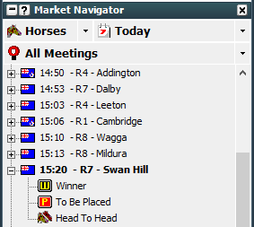
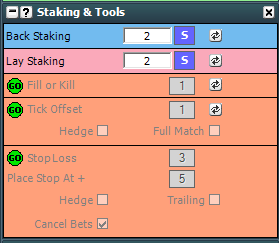

# Geeks Toy: Setting-up basic market view and One click betting
---
## **Setting-up basic market view**

1. Select market type and location 

     

1. Expand Track/Meet/Game and select Market 

     

1. This will open the market in a new window 

     

**Setting Default Stake** 

Click Staking and Tools 

 

Set the desired default stake. 

**Laying for default liability** 

Click the coloured button to the right of the stake and select “Liability” 

 

Set the desired default Liability. 

## **Setting up one click betting**

Open a Market and right click the top then go to:

* Advanced Betting – Available Stake Click – One Click 
* And Advanced Betting – Price Click – One Click 

 

This will allow you to instantly place a bet with one click with your default Stake/Liability by clicking on a runner in the market. 