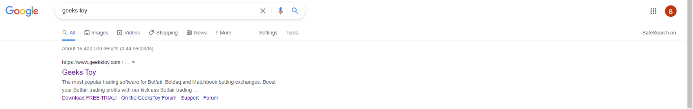
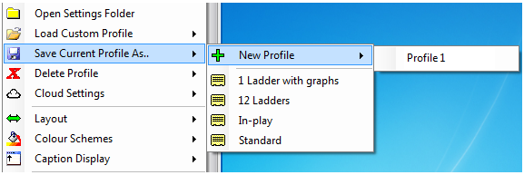

# Geeks Toy: Installation and Set-up
Geeks Toy is a 3rd party program that uses the Betfair API. Essentially, it is a dedicated platform that can utilise the Exchange in ways the website and mobile app cannot. It is built to be able to enhance the experience of the Exchange for the punters and potentially increase the amount the punters benefit from the exchange. This guide aims to help get a better look into Geeks Toy and how to set it up and take a further look into the features that it offers. 
## **Installation** 
So, Geeks Toy sounds like something to check out, but how is it installed on my device? It is worth noting that Geeks Toy is only available on a computer or laptop and is not available for mobile devices. With that being said, let us look into how to install Geeks Toy. 

1. Open your browser of choice. 
1. Either type “Geeks Toy” into your browser or in your URL bar, type in [www.geekstoy.com](http://www.geekstoy.com/)  

    ` `
    *View of the Search engine results and the correct link to click on.* 

1. Welcome to Geeks Toy! Feel free to look around and explore the website and when ready, click on the download button. 

    ` `

    *The main screen of Geeks Toy. Download button highlighted.* 

1. Next, click the “Download for Betfair” button, this will start a download for the program installer (commonly called the install wizard). 

    ` `

    *Download page and install wizard download highlighted.* 

1. Follow the prompts on your install wizard and once complete, open Geeks Toy. 
1. Sign in using your Betfair login details to access Geeks Toy. One thing to be aware of, you can set the program to operate under a training mode, so you can get a better understanding of Geeks Toy before betting from your actual Betfair account. You can change it from this initial login screen under “*Operation Mode.”* Once logged in, you have successfully installed and are now able to use Geeks Toy.

` ` 

## **Basic Set Up & Settings** 
Congratulations, now you have access to one of Betfair’s most popular 3rd party apps. But where do you go from here? Next, we will look at the basic set up and settings that Geeks toy has to offer so that you may be able to maximise your experience using Geeks Toy. 

**Market Navigator** 

The first screen you will see once logged in is the “Market Navigator” screen. 

*Market Navigator Screen*  

This is the main screen you will see when logging into Geeks Toy. From here You will be able to access all the markets that are available via the Betfair Exchange. By navigating through the menus, you will be able to find any horse race, any soccer or AFL match that you would normally find through the Betfair website. From this screen, you will also be able to select which market you would like to be involved in the event. You can also access a whole host of other options from this screen by right clicking. 

*Market Navigator Screen with more options by right clicking.*

**Customizable Widgets and Interface** 

 

*A list of potential widgets ready to customise.* 

A unique and attractive feature of Geeks Toy is its fully customisable interface in that you can pick and choose what you would like to see, make it as big or small as you like. This allows for an experience and for punting that suits your needs. 

**Profiles can be Saved and Opened after creation** 

Once you have gotten your ideal view or setup, you may realise that this is ideal for horse racing, but not so much for a soccer game. You can then choose to save your horse racing “profile” so that you may create another view that is better for soccer, which when created you can save as your soccer “profile”. The profile in this case is the way you have manipulated the widgets to get the specific experience you are wanting to achieve. The handiness of this feature is it allows quick and easy access between different profiles, and more importantly, not having to construct the profile each time. If you are having troubles figuring out a profile to begin with, click [here](https://www.youtube.com/watch?v=EcW2pSAI8Io) to watch pro Geeks Toy trader, Caan Berry, do a tutorial on setting up a profile. 

` `

*A view of where to save and load profiles menu.*

**Ladder View of the markets** 

One of the other features that Geeks Toy offers is the “Ladder view” of the markets. Essentially, the ladder view is beneficial to punters as it can show not only the best back and lay prices, as well as the next 2 best prices on both sides, but it goes into greater depth in that it is able to go back further and still show how much money is available. This then helps give a better idea of how the selection has traded thus far and where the money is currently, so that you may be able to get those better odds, all refreshing with Geeks Toy impressive 200 millisecond refresh rate.  

**Market Selection** 

Now that you have set up some profiles and played with the settings, now it is time to select the market you wish to bet into. 

1. On the Market Navigator screen, select which Sport or Race type (Horse Racing or Greyhounds) 

    ` `

1. Once you have selected the Sport or Race type you would like, now it is time to choose a league or racecourse. 

     

    *Horse Racing -> Great Britain Races -> Newbury Races, 13th May.* 

1. Lastly, is to select the Match or Race that you are wanting to bet into. Also, when doing this making sure you are in the correct market within that Match or Race, for example, Winners Market or Place Market for races and Match Odds or Handicap Market for sports. 

     

    *Newbury Races, 13th May -> Select race number.* 

1. Now that you have selected your desired market, you are able to place the bet you want and start trading on the exchange.  

                        

    *The Race Market Grid View – Alternative to the Ladder View.* 

