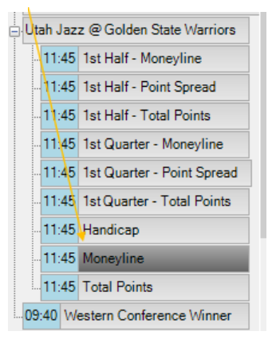
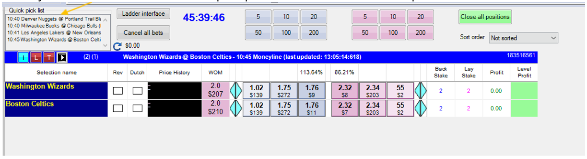

# Gruss Betting Assistant: Setting up basic market view and one click betting

---
## Setting up basic market view 

These steps provided below are a simple way to navigate into the market’s you wish to place bets or trade in. When Gruss is opened you will see the market tree on the left hand side of the program. 

Step 1. Select what market you would like to bet in. 

 

Step 2. What event/track you would like to bet in. 

 

Step 3. Select the market you wish to place a bet in. 

 

<!-- Step 4. Select the market you wish to place a bet in. 

  -->

---
## Quick pick list 

Quick pick list has been filtered from the main markets to allow quicker access into your markets without having to manually search for them.  

 

There are numerous ways to add markets to your quick picks. 

1. Click and drag the market to the quick pick list. 
2. Click into the market you want to enter and once it is highlighted press Q. 
3. Once you are in a market, you can highlight the market selection at the top of Gruss, select add to quick pick list. Then select this market and it will add it to your quick picks. 

 

When you have added markets to quick pick they will appear like this:

 

Once the markets are over or you no longer need to place bets or trade you can delete the markets out of your quick picks. 

1. Click on the market and press the key ‘delete’ when it is highlighted. 
2. Right click on your mouse once the market is highlighted, this will bring up numerous options to clear your Quick pick list. `Delete market` will remove the market you wish to remove from the Quick pick list. 

 

The overall market view is similar to the Exchange, however with the added Gruss features that enable faster betting and easier market overview for live betting. 

 

- `Selection name` – name of the teams or selections you wish to bet or trade on. 
- `Rev` (reverse) – this can be selected to make the lay on the left side of the market and the back on the right side of the market. 
- `Dutch` – this can be selected to back multiple selections to get a potential profit on both or multiple selections in your selected market. 
- `Price history` – This is a graph that shows the movement of the back or lay prices throughout the match. 
- `WOM` (Weight of Money) – This is a calculation of the three amounts available to back and lay divided by each other. If it is pink it may indicate that the price is likely to go out so you can lay and back later at a higher price. If its blue, then you may be able to lay it at a lower price. 
- `Blue arrows` – these can be used to move your odds down or up to place your bets at higher or lower odds. Once you change the odds using the arrows it will stay fixed at those odds and will not update. The best price will continue to update as normal. 
- `Percentage of market` - the book % for the back odds and likewise above the best lay odds. You can right click on these percentages to sort the grid either by the back odds or lay odds in ascending or descending order. 
- `Back stake` – This is how much you are willing to back on the selection. 
- `Lay Stake` – This is how you are willing to lay on the selection. 
- `Profit` – This will show you your potential profit if that selection were to win depending on if you have backed or laid the selection. 
- `Level Profit` – This can also be referred to as a green book or greening up. You can hover the mouse over the level profit column selection to see if there is a opportunity to lock in profit or minimise your loses. The column will then display the potential that can be taken against each selection in the market. 

---
## One click betting 

**Make sure you are happy to not confirm bets before turning this off!**

By unticking the ‘verify bets’ box it will allow you to bet into the market without having to verify your bets, allowing the one click betting feature to be enabled. This can be used to place bets into the market fast and efficiently especially if there are small amounts of liquidity in the market. 

 

To stop the one click betting feature all you have to do is click the ‘verify bets’ box which will now bring up a verify bets page. This feature allows you to verify and ensure you are placing the correct bets into the market. 

` `

---

## Disclaimer
Note that whilst automated strategies are fun and rewarding to create, we can't promise that your betting strategy will be profitable, and we make no representations in relation to the information on this page. If you're implementing your own strategies, you do so entirely at your own risk and you are responsible for any winnings/losses incurred. Under no circumstances will Betfair be liable for any loss or damage you suffer.