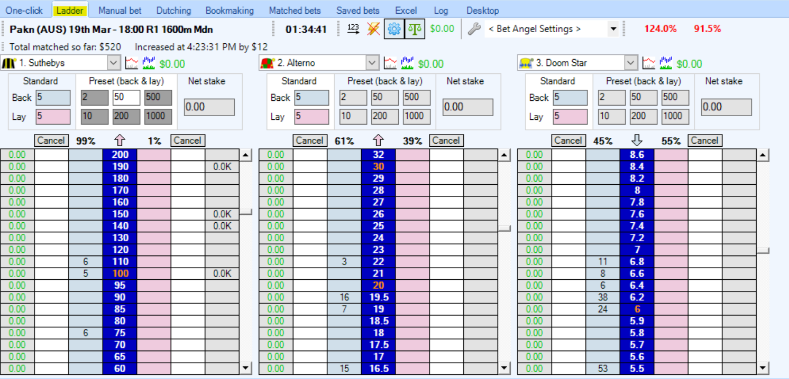

# Bet Angel: An Intermediate guide
---
## The Ladder interface

The Bet Angel Ladder interface allows you to gain a deeper view of how bets are being placed on a small number of runners as opposed to the high-level overview of a market that we get from the ‘One-Click’ view. This also allows you to get an idea of any potential trends and help you make a more informed decision about your own bets.

By default, the ladder interface will show you the first three runners in a market. A handy button to keep in mind is the ‘123’ button which will automatically adjust which runners you see and order them in ascending price order with the favourite placed in ‘Ladder 1’ position. 

You can also easily specify the runners you would like to look at by simply selecting them from the drop-down box above each ladder. 

Just like the ‘One-click screen’, you can click within the blue (back) or pink (lay) columns to place a bet at those specific odds, allowing you to not only get a more detailed view of what the market is doing but quickly place bets of your own.  

## In-Play trader view

The in-play trader view is an alternative way to look and place bets on markets which are in-play. It gives an overview of the highest and lowest price points traded for runners and allows you to easily place bets onto the market.  

To open the in-play trader view:  

click the in-play trader icon  near the top right of the main Bet Angel screen.

Once you’ve clicked the button, a new window will open up showing every runner in the race. 

As you can see, there are a number of dots and lines which give us specific information relating to where bets are being placed for each runner. The blue dot indicates the last back price, the pink shows the last lay price and the yellow indicates the last traded price. The grey bar gives us the highest and lowest traded range of that particular runner.  

You’ll also notice that there are a number of options that you can use to customize your experience with the tool depending on what information is important to you.   

- At the top left of the window from left to right, you can hide the blue, pink and yellow dots to simplify your view
- change the window to reflect the win percentage scale or tick scale
- sort your runner list depending of a range of factors
- change the height of your runner rows
- adjust the labels for the dots to reflect different information

You can also use the in-play trader view to place bets just like in the one-click screen or ladder view. You can customise what betting action to take when the left mouse button is clicked (place a back bet, a lay bet or even set that the left mouse button will back while the right button lays).  

By default, the odds that bets are placed at and the runner you bet on in this view will be determined by the location of your mouse cursor.  

It pays to be mindful of this when using this view, especially if you have confirm bets turned off as an accidental click on the in-play trader view may cause you to place a bet that you didn’t want. This being said, the price that bets are placed at can be easily changed to a different factor such as the best available back price instead of the mouse cursor location.  

## Custom Columns

Custom columns are an extremely helpful way to speed up how you bet in Bet Angel markets. They allow you customize not only the information that you see in the one-click betting screen, but also lets you place specific bets faster into the market. This is particularly useful when placing bets in-play and speed is a considerable factor for your strategy.

To get started with your own custom columns 

- click the yellow star icon which will bring up the custom column's editor. 

Once the editor window pops up: 

- Click ‘New’ 
- Then enter a Profile Name for your custom column and click ‘OK’ 
- Choose from the configure options (see below) 
- Then click ‘Save Column’ 

You will have a range of options to configure your columns: 

- Custom Column Profiles – Create multiple profiles for different betting strategies that you may implement. Each profile can have different columns that do different things and these profiles allow you to easily switch between different modes depending on what you’re wanting to do in Bet Angel. 

- General: 
    - Title – Give your column a name to make it easily identifiable (this will be the name of the column in the column chooser list and title in the column header on the Bet Angel screen)
    - ToolTip – a custom info box that appears when the mouse is hovered over your custom column 
    - Action – Specify what happens when you click on the column, whether it places a back or lay bet, cancels a bet or triggers an automation to run 
    - Button colour – customise the colour of your column to make it easily distinguishable 
    - Display – Choose whether each box within your custom column is populated with the runners odds or text 

- Odds – If you decide to have odds populated in your custom column, you can choose from: 
    - fixed odds,  
    - ticks offset from the best back price 
    - ticks offset from the best lay price  
    - a percentage offset from best lay price 

- Stake – This allows you to program a pre-determined stake that can be triggered when you click in the column, essentially giving you your own bet placement shortcut buttons.  

Once you have set up your custom column the way that you would like it to operate, the next step is to make it visible on your screen so you can use it.  

- Select your custom column name from the drop down box next to the yellow star icon 
- Click on  icon
- Scroll through the list and choose your custom column
 
Your custom column should now be added to the right of the existing columns (see image below) 

If you haven’t created a profile for your custom columns, click the settings button (see below), then choose columns where pop up window will appear. Find your custom column from the list and tick the box next to it. 

## Offset Bets

Offset bets are extremely easy to achieve in Bet Angel thanks to a simple to use tool at the top of the One-click screen. Here you can choose to use a number of different offset bet actions and specify the number of ticks or percentage that you want your offset bet to be placed at.  

In the above example, if I placed a back bet on the runner named “1. Andrew Swagger”, the back bet will be placed at $55 and then Bet Angel will automatically place a lay bet on the same runner 2 ticks lower.  

## Dutching 

The dutching screen within Bet Angel is often overlooked by Bet Angel users but is extremely handy, especially if your preference is lower risk (and lower profit/loss). The dutching screen will only place back bets into a market (while the bookmaking screen will only place lay bets-see next section). Bet Angel makes dutching a lot easier by allowing you to select a number of runners within a market that you think that the runner may be amongst and place bets with a specific stake, achieve a target profit or set a minimum stake for Bet Angel to use.  

In the above example, we’ve selected 5 runners, out of a market of 10, who we think could possibly win the race. Our aim in this scenario is to come away with a profit of $20 if one of our selected runners win. Bet Angel will do all the calculations for you to work out the odds and stake for each runner, but you do have the ability to override a specific runners target profit – especially handy if you're not completely confident that a particular runner will win or not but you hold more or less confidence than the rest of your selections.  

For example, for 8. Nobodys Puppet, which the best available back price is 10.5, we may think that there is still a possibility for it to win, so we can override the target profit for that runner to be $0 which will mean that if it wins, we won't make any profit but we also won't lose our stake.  

You’ll notice that there are 3 check box columns: Back, Lay and Manual. These refer to the odds that you’ll be using. If the back-check box is selected, then you’ll be using the best available back odds and the same concept applies if you have the lay check box selected. Manual will allow you to set your own odds for bets to be placed onto the market.  

Bet Angel will also display the total stake for all of the bets to be placed based on your settings as well as the potential profit (indicated in green) should one of your selections win and the potential loss should they lose (indicated in red).  

For a more in depth run-through of the Dutching functionality, check out the Bet Angel YouTube video [here](https://www.youtube.com/watch?v=sK5OSmjfOUk). 

## Bookmaking

The bookmaking screen operates almost identically to the Dutching screen except that it will only place lay bets into the market. The aim of the game in this screen to create a book that ends up being over 100% so that we can secure a profit.  

To see an example of the bookmaking screen in action, take a look at the Bet Angel video on Youtube [here](https://www.youtube.com/watch?v=2QgD0mElPxc). 

## Charting

One of the main benefits to using programs such as Bet Angel is the functionality that allows you to gain a more in depth insight into how a market is going, see trends and help you make smarter calls when it comes to placing your own bets. Charts within Bet Angel takes the information from the Betfair exchange and illustrates it in a way that allows you to interpret complex data in a more concise visual format. Advanced charting is a feature that is easily accessed from the One-click, Ladder and manual bet screens and can be accessed by clicking the graph icon next to a runners name. 

From here, a chart window will appear with various graphs and options to change the type of graph and the data being displayed.  

For more detail and information regarding Bet Angels advanced charts, check out their video tutorial [here](https://www.youtube.com/watch?time_continue=1261&v=kvlB080Mteg&feature=emb_title).  

## Resources

- [Betfair's interview with Bet Angel's creator, Peter Webb](https://www.betfair.com.au/hub/peter-webb/)

- [Bet Angel user guide](https://www.betangel.com/user-guide/)
    - [Ladder Mode](https://www.betangel.com/user-guide/ladder_interface.html?ms=GgBAAAQAFBAIASA%3D&st=MA%3D%3D&sct=MA%3D%3D&mw=Mzkx)
    - [In-Play trader view](https://www.betangel.com/user-guide/bet_angel___inplay_trader.html?ms=GgBAAAQAEEAIASA%3D&st=MA%3D%3D&sct=MjAw&mw=Mzkx)
    - [Custom columns](https://www.betangel.com/user-guide/custom_columns.html?ms=GgAAAAAAEEAI&q=Q3VzdG9tIENvbHVtbnM%3D&st=Mg%3D%3D&sct=MA%3D%3D&mw=Mzkx)
    - [Offset bets](https://www.betangel.com/user-guide/offsetting_by_ticks_or_percentages.html)
    - [Dutching]( https://www.betangel.com/user-guide/bet_angel_advanced_dutching.html?ms=GgAAAAAAMUAI&q=RHV0Y2hpbmc%3D&st=Mg%3D%3D&sct=MA%3D%3D&mw=Mzkx)
    - [Bookmaking](https://www.betangel.com/user-guide/bookmaking____being_the_bookmaker_.html?ms=AgAAAAAAAg%3D%3D&q=Qm9va21ha2luZw%3D%3D&st=Mg%3D%3D&sct=MA%3D%3D&mw=MzIw)
    
- [Youtube](https://www.youtube.com/user/betangeltv)
    - [Ladder Mode](https://www.youtube.com/watch?v=CBfqOQgtVLo&list=PLVgQjBRi6AcmcuL11TtqQUHC4NbmWsUZl)
    - [In-Play trader view](https://www.youtube.com/watch?v=z5tLOl-miYU&t=37s)
    - [Custom Columns](https://www.youtube.com/watch?v=YxAl2qOnY8c)
    - [Dutching](https://www.youtube.com/watch?v=sK5OSmjfOUk)
    - [Bookmaking](https://www.youtube.com/watch?v=2QgD0mElPxc)

---
## What next? 

Now that you've got the intermediate level sorted, take the next step and have a look at our [Advanced guide to Bet Angel](/autoTools/betAngeladvanced).

---
## Disclaimer

Note that whilst automated strategies are fun and rewarding to create, we can't promise that your betting strategy will be profitable, and we make no representations in relation to the information on this page. If you're implementing your own strategies, you do so entirely at your own risk and you are responsible for any winnings/losses incurred.  Under no circumstances will Betfair be liable for any loss or damage you suffer.