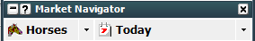

# Geeks Toy: Setup basic market view and one click betting
---
## Setup basic market view

1. Select market type and location 

     

1. Expand Track/Meet/Game and select Market 

     

1. This will open the market in a new window 

     

**Setting Default Stake** 

Click Staking and Tools 

 

Set the desired default stake. 

**Laying for default liability** 

Click the coloured button to the right of the stake and select “Liability” 

 

Set the desired default Liability. 

---

## Setup one click betting

**Make sure you are happy to not confirm bets before turning this off!**

Open a Market and right click the top then go to:

* Advanced Betting – Available Stake Click – One Click 
* And Advanced Betting – Price Click – One Click 

 

This will allow you to instantly place a bet with one click with your default Stake/Liability by clicking on a runner in the market. 

---
## Disclaimer
Note that whilst automated strategies are fun and rewarding to create, we can't promise that your betting strategy will be profitable, and we make no representations in relation to the information on this page. If you're implementing your own strategies, you do so entirely at your own risk and you are responsible for any winnings/losses incurred. Under no circumstances will Betfair be liable for any loss or damage you suffer.