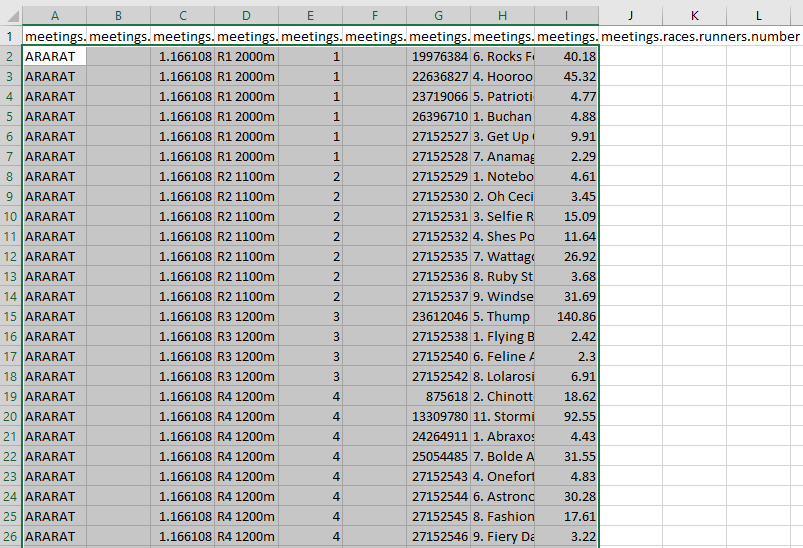
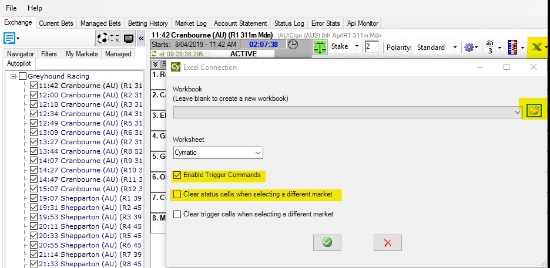

# Cymatic Trader: Ratings automation

---
## Automating a thoroughbred ratings strategy using Cymatic Trader   

Using ratings from reputable sources can be a great way to increase your wagering IQ. In this tutorial, we'll be following a similar process to the ratings tutorials for Bet Angel and Gruss, but here we'll be using the ratings for thoroughbreds, created by the data science team at Betfair and incorporate them into our automation in Cymatic Trader. 

Cymatic Trader has a spreadsheet functionality that lets you place bets using your own variables and information from the live market, which is what we've used here to automate these ratings. There are so many different ways to use this part of Cymatic Trader and we're very open to any thoughts about more effective ways of implementing this sort of strategy. You're welcome to reach out to us on automation@betfair.com.au with your feedback and opinions. 

--- 
## - The plan

We'll step through how we went about getting Cymatic Trader to place bets using the [Betfair's Data Scientists' thoroughbred ratings model](https://www.betfair.com.au/hub/racing/horse-racing/predictions-model/). Once it's set up the goal is to be able to upload a new set of ratings, choose your races, set the program to run and be able to walk away. You'll also be able to use this approach to automate using your own ratings. 


!!! info "Resources"
    - Ratings: [Betfair's Data Scientists' thoroughbred ratings model](https://www.betfair.com.au/hub/racing/horse-racing/predictions-model/)
    - Rules: [here's the spreadsheet](./assets/CT_Ratings_Automation_Tutorial.xlsx) We set up with our macros and rules included, but you'll obviously need to tweak it to suit your strategy and the format of your ratings 
    - Tool: [Cymatic Trader](http://www.cymatic.co.uk/)

---
### - Set up 

Make sure you've downloaded and installed Cymatic Trader, and signed in.
Once you open the program, you will see an Excel icon which is where we will link our spreadsheet to Cymatic Trader 


---
### - Downloading & formatting ratings

Here we're using the [Betfair's Data Scientists' thoroughbred ratings model](https://www.betfair.com.au/hub/racing/horse-racing/predictions-model/) for horse racing but alternatively you can follow the same process using the [Betfair's Data Scientists' Greyhound Ratings Model](https://www.betfair.com.au/hub/models/greyhound-predictions-model/) which is also available on the hub. When there are ratings made available, you will have the options to download them as a CSV or JSON file. For this tutorial, we'll go ahead and download the ratings as a CSV file. 


Once we've downloaded the ratings, we'll go ahead and open up the files in Excel and copy the contents (Excluding the column headers) from cell A2, across all applicable columns which in this example is column N. Make sure to copy all rows that has data in them. 



Copy the ratings data over to the [customised Cymatic Trader template Excel sheet](./assets/CT_Ratings_Automation_Tutorial.xlsx) 'RATINGS' worksheet, being sure that cell A2 is selected when pasting the data. In the Excel template that we've provided, we've coloured the cells green where the data should be populated. 


---
### - Writing your rules

As with any automated strategy, one of the most important steps is deciding what logical approach you want to take, and writing rules that suit. 

We're using a [customised Cymatic Trader template Excel sheet](./assets/CT_Ratings_Automation_Tutorial.xlsx) to implement our strategy, so it can make betting decisions based on our ratings. Excel is an excellent tool, but it can take an investment of time to be able to use it effectively. 

This is how we used Excel to implement our set of rules. 


### - Trigger to place bet

In short, we want to back or lay runners when:

- The available to back price is greater than the rating for that runner, then we will back the runner
- The available to back price is less than the rating for that runner, then we will lay the runner
- Back market percentage is less than a certain value that we choose
- The scheduled event start time is less than a certain number of seconds that we choose
- The event isn't in play 

### - Using cell references to simplify formulas

Throughout this tutorial, we'll be referencing certain cells with custom names that will make it easier to understand and follow the formulas as we progress. This is an especially effective method to
keep on top of more complex strategies that require long formaulas to implement.
 
!!! info "Cell names used in this tutorial"

     - **Ratings** refers to the entire Column I in the 'RATINGS' worksheet

     - **RunnerName** refers to the entire column H in the 'RATINGS' worksheet

     - **Overrounds** refers to cell BJ7 in the 'CYMATIC'worksheet, where the overrounds for the current market are calculated. 

     - **UserOverround** refers to cell G4 in the 'SETTINGS' worksheet which allows you to change a single value that will automatically update the formulas for all runners

     - **TimeTillJump** refers to cell D4 in the 'SETTINGS' worksheet

     - **UserTimeTillJump** refers to cell G3 in the 'SETTINGS' worksheet which allows you to change a single value that will automatically update the formulas for all runners

     - **InPlay** refers to cell E4 in the 'CYMATIC' worksheet. Cymatic Trader will populate a 'FALSE' flag leading up to the jump

     - **BACKLAY** refers to cell G5 in the 'SETTINGS' worksheet which allows you to easily switch between Back and Lay bet typers via a drop-down box and will automatically update the formulas for all runners


**This is our Excel formula trigger:**

``` excel tab="Multi line"
=IF(
    AND(
        OR(
             AND(BACKLAY = "BACK", (H8 > (INDEX(Ratings,MATCH(A8,RunnerName,0))))),
             AND(BACKLAY = "LAY", (H8 < (INDEX(Ratings,MATCH(A8,RunnerName,0)))))),
        Overrounds<UserOverround,
        TimeTillJump<UserTimeTillJump,
        InPlay="FALSE"),
        BACKLAY,
    ""
)
```

``` excel tab="Single line"
=IF(AND(OR(AND(BACKLAY = "BACK", (H8 > (INDEX(Ratings,MATCH(A8,RunnerName,0))))),AND(BACKLAY = "LAY", (H8 < (INDEX(Ratings,MATCH(A8,RunnerName,0)))))),Overrounds<UserOverround,TimeTillJump<UserTimeTillJump,InPlay="FALSE"),BACKLAY,"")
```

Stepping through each step:

 **Checking market odds based on back or lay bet type:** Here we're checking which bet type we've chosen from the dropdown box in the 'SETTINGS' worksheet (cell G5). If a BACK bet has been selected, the best available back bet must greater than our ratings that have been defined for that particular runner in the 'RATINGS' worksheet. On the flip side, if a LAY bet has been selected, then the best available back bet must be less than our ratings.

``` excel hl_lines="4 5"
=IF(
    AND(
        OR(
             AND(BACKLAY = "BACK", (H8 > (INDEX(Ratings,MATCH(A8,RunnerName,0))))),
             AND(BACKLAY = "LAY", (H8 < (INDEX(Ratings,MATCH(A8,RunnerName,0)))))),
        Overrounds<UserOverround,
        TimeTillJump<UserTimeTillJump,
        InPlay="FALSE"),
        BACKLAY,
    ""
)
```

- **Back market percentage (Overrounds) is less than what we define (UserOverround):** Here we're making a calculation for each runner (100 / best back price) and then calculating the sum of all of the runners together to give us the back market percentage. As the closer the BMP is to 100%, the fairer the market is, we use this to ensure that we only place bets when the market is less than what we define in the 'RATINGS' worksheet. [Additional information relating to over-rounds can be found here](https://caanberry.com/understanding-the-over-round-in-betting-markets/)

``` excel hl_lines="6"
=IF(
    AND(
        OR(
             AND(BACKLAY = "BACK", (H8 > (INDEX(Ratings,MATCH(A8,RunnerName,0))))),
             AND(BACKLAY = "LAY", (H8 < (INDEX(Ratings,MATCH(A8,RunnerName,0)))))),
        Overrounds<UserOverround,
        TimeTillJump<UserTimeTillJump,
        InPlay="FALSE"),
        BACKLAY,
    ""
)
```

- **Time until the jump is less than what we define:** Check whether the seconds left on the countdown timer are less than what we define in cell G3 in the 'SETTINGS' worksheet. This one's a bit complicated, as the time is actually returned as a percentage of a 24-hour day, which you need to convert into positive or negative seconds. [You can read about the formula here](https://www.betangel.com/forum/viewtopic.php?t=7657) or just keep it simple by referencing the value in cell D4 of the 'SETTINGS' worksheet (named 'TimeTillJump'), where we've already done the calculations for you. 

``` excel hl_lines="7"
=IF(
    AND(
        OR(
             AND(BACKLAY = "BACK", (H8 > (INDEX(Ratings,MATCH(A8,RunnerName,0))))),
             AND(BACKLAY = "LAY", (H8 < (INDEX(Ratings,MATCH(A8,RunnerName,0)))))),
        Overrounds<UserOverround,
        TimeTillJump<UserTimeTillJump,
        InPlay="FALSE"),
        BACKLAY,
    ""
)
```

- **Not in play:** checking whether the event has gone in play - as odds change so much in the run we only want to use this strategy pre-play. If this cell is populated with the 'FALSE' flag, it's safe to place bets. 

``` excel hl_lines="8"
=IF(
    AND(
        OR(
             AND(BACKLAY = "BACK", (H8 > (INDEX(Ratings,MATCH(A8,RunnerName,0))))),
             AND(BACKLAY = "LAY", (H8 < (INDEX(Ratings,MATCH(A8,RunnerName,0)))))),
        Overrounds<UserOverround,
        TimeTillJump<UserTimeTillJump,
        InPlay="FALSE"),
        BACKLAY,
    ""
)
```

- **Result:** if the statement above is true, the formula returns either a "BACK" or "LAY" depending on what has been selected from the 'SETTINGS' worksheet, at which point the bet will trigger, otherwise the cell will remain blank and no bet will be placed.

``` excel hl_lines="9 10"
=IF(
    AND(
        OR(
             AND(BACKLAY = "BACK", (H8 > (INDEX(Ratings,MATCH(A8,RunnerName,0))))),
             AND(BACKLAY = "LAY", (H8 < (INDEX(Ratings,MATCH(A8,RunnerName,0)))))),
        Overrounds<UserOverround,
        TimeTillJump<UserTimeTillJump,
        InPlay="FALSE"),
        BACKLAY,
    ""
)
```

!!! info "Excel functions"

    - [IF function:](https://support.office.com/en-us/article/if-function-69aed7c9-4e8a-4755-a9bc-aa8bbff73be2) IF(if this is true, do this, else do this)
    - [AND function:](https://support.office.com/en-us/article/and-function-5f19b2e8-e1df-4408-897a-ce285a19e9d9) AND(this is true, and so is this, and so is this) - returns true or false
    - [AND OR function:](https://support.office.com/en-us/article/use-and-and-or-to-test-a-combination-of-conditions-e1ed88d7-1de3-4422-ae41-45291a69f9e1) checks that the statement meets more than one condition. If this OR that, then do the following. 
    - [Absolute references:](https://support.office.com/en-us/article/switch-between-relative-absolute-and-mixed-references-dfec08cd-ae65-4f56-839e-5f0d8d0baca9) if you're copy/pasting formulas it's important that you make links absolute when you don't want the cell being referenced to change relative to the new cell the formula is being pasted into. You do this by putting a $ in front of the parts of the reference you don't want to 'move'. 

---
### - Preparing the spreadsheet

You need to copy/paste the trigger formula into the relevant cells on each row in the 'Command' (BA) column. Excel is clever enough to automatically update the relative links in the formulas, so you should be able to copy/paste the same formula into each cell as long as you've got your [relative and absolute references straight](https://support.office.com/en-us/article/switch-between-relative-absolute-and-mixed-references-dfec08cd-ae65-4f56-839e-5f0d8d0baca9). 

- **Trigger bet rule:** this is the bet trigger Excel formula we created earlier, and it needs to go in column BA (BA8 for the first runner).

``` excel tab="Multi line"
=IF(
    AND(
        OR(
             AND(BACKLAY = "BACK", (H8 > (INDEX(Ratings,MATCH(A8,RunnerName,0))))),
             AND(BACKLAY = "LAY", (H8 < (INDEX(Ratings,MATCH(A8,RunnerName,0)))))),
        Overrounds<UserOverround,
        TimeTillJump<UserTimeTillJump,
        InPlay="FALSE"),
        BACKLAY,
    ""
)
```

``` excel tab="Single line"
=IF(AND(OR(AND(BACKLAY = "BACK", (H8 > (INDEX(Ratings,MATCH(A8,RunnerName,0))))),AND(BACKLAY = "LAY", (H8 < (INDEX(Ratings,MATCH(A8,RunnerName,0)))))),Overrounds<UserOverround,TimeTillJump<UserTimeTillJump,InPlay="FALSE"),BACKLAY,"")
```


---

- **Odds:** initially we were using the runner's rating as the price, but we got a bet placement error for some of the selections - eventually we realised that the odds the bet's being placed at need to be [valid Betfair 'ticks'](https://docs.developer.betfair.com/display/1smk3cen4v3lu3yomq5qye0ni/placeOrders#placeOrders-BetfairPriceIncrements). For simplicity's sake we're now just using the currently available back odds (cell I8 for the first runner). This goes in column BB (BB8 for the first runner). Another option would be to create a look up table that rounded your rating to the nearest ['tick' price](https://docs.developer.betfair.com/display/1smk3cen4v3lu3yomq5qye0ni/placeOrders#placeOrders-BetfairPriceIncrements) - if you do this, please do [send us](mailto:automation@betfair.com.au) through your formula and we'll add it to this article. 

!!! info "Note:" 
    The IF statement in both the odds and stake cells is purely to keep our document clean of clutter when there are cells that are not populated with runners. A similar effect to IFERROR, if Cymatic Trader hasn't populated cell A8 with a runner name, then dont populate this cell at all.

```=IF(A8=0,"",I8)```


- **Stake:** It's completely up to you what staking approach you want to take. We've kept it simple and are just using a 'to win / to lose' strategy. Each bet aims to win whatever value has been entered in the 'SETTINGS' worksheet on that runner at the current odds if the bet type has been set to BACK. If the bet type has been changed to LAY, then the stake becomes the liability - again, easily changed in the 'SETTINGS' worksheet. We've got some [good resources on the Hub](https://www.betfair.com.au/hub/education/racing-strategy/staking-and-money-management/) that look at different staking approaches - these might be useful in helping you decide which strategy you want to use. 

```=IF(A8="","",IF(BACKLAY="BACK", stake/(I8-1), stake*(J8/(J8-1))-stake))```


---
### - Selecting markets

We used the Navigator menu in Cymatic Trader to navigate to the tracks we had ratings for.
If you wanted to include all horse or greyhound races for a day you could use the 'autopilot' tool to do this more efficiently. 
Once you've chosen the races you're interested in tick the 'autopilot' button and Gruss will automatically cycle through each market for you. 


---
### - Linking the spreadsheet

Click the Excel icon in the main tool bar and then 'connect Excel' from the drop down menu. From here, you will be able to point Cymatic Trader in the direction of where your Excel sheet is located on your computer. Make sure 'Enable Trigger Commands' is selected and 'Clear status cells when selecting different market" if you are automating a series of markets. 



---
## And you're set!

Once you've set your spreadsheet set up and you're comfortable using Cymatic Trader it should only take a number of seconds to load your markets and ratings up and set your strategy running for the day. Just make sure you have all of the app settings correctly selected before you leave the bot to run, as some of them reset by default when you turn the program off.

!!! info "Note:" 
    you will need to leave your computer up and running for the duration of the chosen markets, as the program needs the computer to be 'awake' to be able to run.
    
---
## Areas for improvement

There are parts of this approach that we're still trying to get to work to our liking, and we'll update this article as we find better solutions. If you have any suggestions for improvements please reach out to automation@betfair.com.au - we'd love to hear your thoughts. 

---
## What next? 

We're working through some of the popular automation tools and creating articles like this one to help you learn how to use them to implement different styles of strategies. If you have any thoughts or feedback on this article or other programs you'd like to see us explore please reach out to automation@betfair.com.au - this article has already been updated with extra learnings including variable percentages and new macros.

---
## Disclaimer

Note that whilst automated strategies are fun and rewarding to create, we can't promise that your betting strategy will be profitable, and we make no representations in relation to the information on this page. If you're implementing your own strategies, you do so entirely at your own risk and you are responsible for any winnings/losses incurred.  Under no circumstances will Betfair be liable for any loss or damage you suffer.