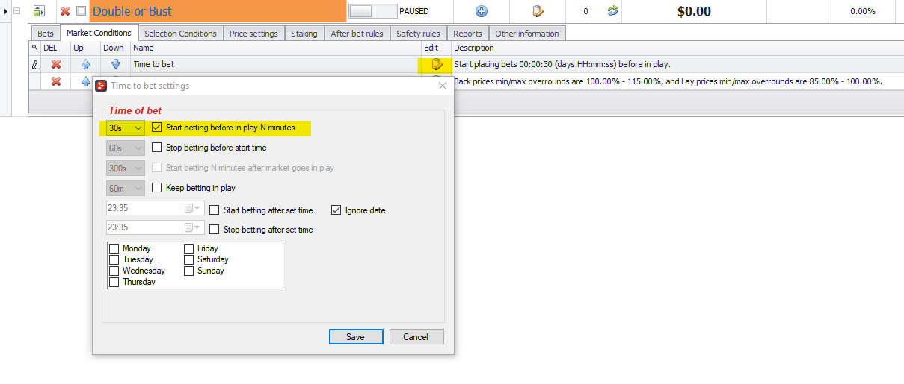
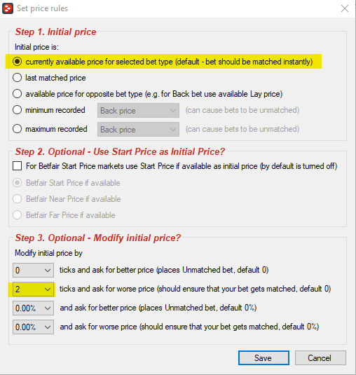
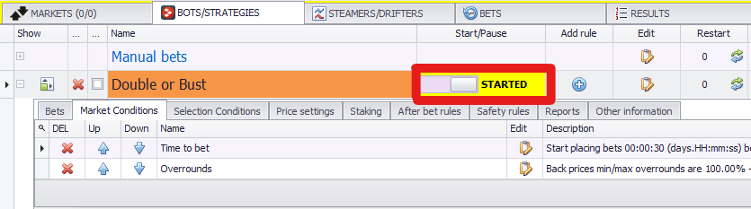

# BF Bot Manager: Double or bust

---
## Dobbing using BF Bot Manager automation rules 

BF Bot Manager may not have Excel automation integration like Gruss or Bet Angel, but it does make up for it with an intuitive rule based automation system which is great if you're starting out with automation in general. There are hundreds of ways to implement different strategies using rules in BF Bot Manager but if you have any specific tutorial ideas that you would like to see here, please get in contact with us at bdp@betfair.com.au - We'd love to hear from you.

--- 
## The plan

In this tutorial, we're going over the implementation of a strategy called "DOBBING" which means Double Or Bust. The idea behind Dobbing is to place bets on the movement of prices within a market rather than the actual race result itself. More specifically, backing a horse and then hedging that bet – by laying it, to achieve an evens money return – no matter the outcome of the race.

If you want to follow along and try this approach yourself you'll need to download [BF Bot Manager](https://www.bfbotmanager.com/) and sign up for either a subscription or at least a test period. They have a [5 day free trial](https://www.bfbotmanager.com/trial) that's valuable for establishing whether this tool will do what you want it to for your specific strategy. 

!!! note "Resources"
    - [Additional information on Dobbing](https://caanberry.com/what-is-dobbing-in-horse-racing/)
    - Tool: [BF Bot Manager](https://www.bfbotmanager.com/)
    - [BF Bot Manager Manuals](https://www.bfbotmanager.com/help/2)

--- 
#### Set up

First up we need to make sure we've downloaded and installed BF Bot Manager, and signed in.

Once you open the program up click on the 'STRATEGIES' tab and then 'Add new' button. 

This will prompt a pop-up window to appear where you choose the name of the strategy and select a colour for it. I've named my strategy "Double or Bust" and set the colour as orange to make it easily identifiable which is a good idea, especially if you have a range of different strategies.

#### Creating a new strategy

Once the strategy has been created, several conditions will also be automatically applied.

Under 'Market Conditions': 

- 'Overrounds' will check to make sure that overrounds for Back are between 100% and 115% and 85% and 100% for lay as default. We will keep this as is for our strategy.

- 'Time to bet' will check that the time till jump is 5 minutes or less as default before placing bets. For our strategy, we will change this to 30 seconds by clicking the edit icon. 

Under 'Selection Conditions':

- 'Back and Lay price ratio' will check to see if the difference between the back and lay price is no more than 15% as default. Just like how we changed the 'Time to bet' condition above, we will change this condition to 50%.

- 'Min/Max Selection Price' will ensure that the lay price for any runner is within price range of 1.5 and 10. We will delete this condition completely and replace it with a condition called 'Bet on my favourites only' We will do this in the next section of the tutorial. 

All These conditions must be met before the strategy will trigger any bet. 

#### Conditions

First, we will create the condition 'Bet on "My Selections" Only'. Click the plus icon and set the condition group as 'Selection Conditions' and then choose the 'Bet on "My Selections" Only' and click add.  

Make sure that Back is selected from the options box that will appear.

#### Rules
Next, we are going to add a price rule to our strategy. Using the same process that used to create the 'Bet on My Selections only' condition, select the 'Price Rules' rule from the 'Price Settings' group. In the set price rules option box, select the following options:

The next rule we're going to create will be under the Staking category called 'Level/Initial stake'. You can choose whatever default stake you are comfortable starting out with. 

Finally, we need to create an after bet rule that will allow us to trade out. This rule is called 'Trade out (second) bet' under the 'After bet rules' category. See below the options that I have selected for this rule. 

!!! tip "TIP: BF Bot Manager strategies manual"
    We recommend taking a look at the [strategies manual](https://www.bfbotmanager.com/documents/manuals/bf_bot_manager_v3_strategies_manual.pdf) if you get stuck or aren't sure how any of the conditions / rules work. It's an exteremly good resource that goes into detail about each of the various functions and abilites that are available. 

---
## And you're set!

Once you've set your rules up and got comfortable using BF Bot Manager it should only take number of seconds to load the markets up and choose your selections for the day. Make sure that the strategy is set to run, and BF Bot Manager will do the rest for you.

!!! info "Note:" 
    you will need to leave your computer up and running for the duration of the chosen markets, as the program needs the computer to be 'awake' to be able to run.

---
## What next? 

We're working through some of the popular automation tools and creating articles like this one to help you learn how to use them to implement different styles of strategies. If you have any thoughts or feedback on this article or other programs you'd like to see us explore please reach out to bdp@betfair.com.au 

---
## Disclaimer

Note that whilst automated strategies are fun and rewarding to create, we can't promise that your betting strategy will be profitable. If you're implementing your own strategies please gamble responsibly and note that you are responsible for any winnings/losses incurred.