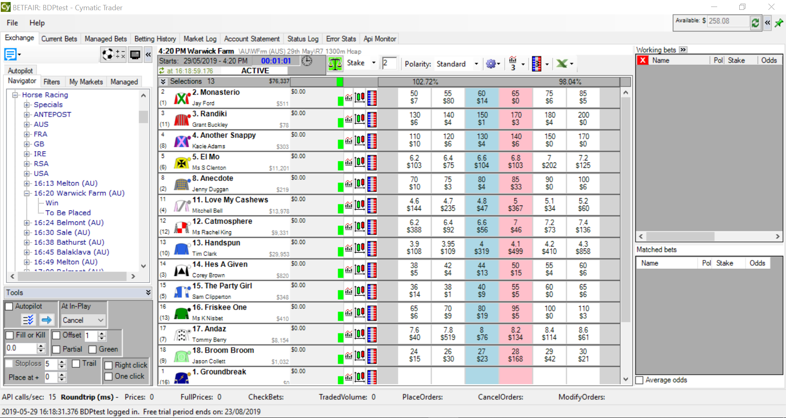

Taking trading to another level, this fully featured, super fast trading software has many unique features developed over a number of years.  Intuitive throughout, it was designed for professional traders but is equally welcomed by novices.

It was the first program to actually reveal your estimated position in the exchange order book queue (PIQ), helping you gain an advantage when trading manually or with the built in robot.  PIQ is now an essential feature for many traders.

You can open multiple markets simultaneously and perform one-click trading using customizable ladders or grids.  Greening, tick-offset, stop-loss and a range of other features are included, as you’d expect in a great low-latency trading app.

The Excel integration capability enables you to view real-time prices in Excel, trigger orders from Excel and even create your own fully automated trading robot!

The integrated advanced charting is capable of displaying candle-stick, bar or line charts, in various time frames, plus a huge range of technical analysis indicators. Zooming, panning and drawing magnetic trend lines are all made easy.

Another unique feature is the ‘API Monitor’, it can instantly reveal errors or bottlenecks caused by the internet or the exchange – thus helping you avoid trading during bad periods that other traders may often be oblivious to.  It also calculates real time statistics such as the latency of various types of calls to the Betfair API for your current trading session.  Warning messages and statistical reports can even be automatically emailed to you by the software.

The software is well suited to single or multiple monitor scenarios.  Downloading/filtering of betting history and account statements is also included.

!!! info "GRUSS KEY FEATURES"
    - Unbeatable speed – super fast trading and real time Betfair prices
    - Grid Interface – single click trading, compact Betfair-style trading grid
    - Ladder Interface – full depth of market, single click trading, queue position (see below) and built-in robot
    - Position in Queue (PIQ) – provides a real-time estimated PIQ, arguably the most important and unique feature of the ladder!
    - Excel Integration – view real-time prices in Excel, trigger bets from Excel and even build your own completely automated trading robot!
    - Automated Trading Robot – included is a unique Betfair bot, watch it trade on the ladder for you!
    - Multi-Market – trade several different markets simultaneously
    - Managed Markets (Guardian) – works in the background to gather data from multiple ‘managed’ markets and maintain offset bets
    - Tick Offset / Stop Loss – automatically sends an opposing bet, after you get matched, in order to take profit or restrict a loss
    - Racing Autopilot – it can automatically select each horse race and move forward
    - Greening – a single click to lock in your profit (or loss) regardless of the outcome
    - Betfair Live Video – watch live sporting events in a compact re-sizeable window
    - Advanced Charts – possibly the most comprehensive integrated charting available in any Betfair application, with 31 technical analysis indicators and magnetic trend lines
    - Customize – easily customize ladders and charts. Save unlimited layouts to files.
    - API Monitoring – for real-time overview and management of internet and exchange issues, including automatic instant email notifications of errors and API Monitor reports.
    - Accounting – downloading/filtering of betting history and account statements 

    

---

To find out more and to sign up for a FREE 14 Day trial, head to the [Cymatic Trader Website](http://www.cymatic.co.uk/).