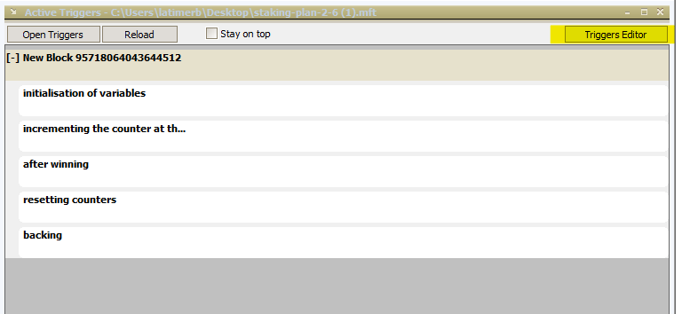
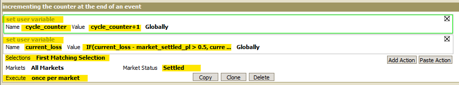
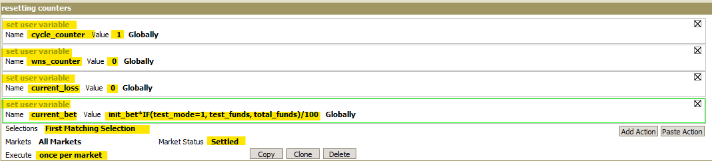

# MarketFeeder Pro: 2-6 Staking

---
## Automating a 2-6 Staking strategy using MarketFeeder Pro

In other tutorials available on the automation hub, the primary focus has been on choosing which runner to place a bet on. For this tutorial, we're going to look into something a little different. We will go through the steps to automate our stakes based on the percentage of our bank. This is a good method to keep the stakes that we're placing on the exchange under control and is primarily intended for backing on favourites.

--- 
## Lets do this
###- The plan

If you want to follow along and try this approach yourself you'll need to download [MarketFeeder Pro](http://marketfeeder.co.uk/buy/) and sign up for either a subscription or at least a test period. They have a [1 month free trial](http://marketfeeder.co.uk/buy/) that's valuable for establishing whether this tool will do what you want it to for your specific strategy. 

!!! note "Resources"
    - Tool: [MarketFeeder Pro](http://marketfeeder.co.uk/buy/)
    - [MarketFeeder Pro Forum](https://community.welldonesoft.com/)


The idea behind this staking strategy is to win 2 bets out of a sequence of 6 opportunities. Each bet in the sequence is multiplied by predefined values from a list:

1, 2, 4, 6, 8, 12

For example, if we start with $10, we are aiming to win the following amounts:

$10, $20, $40, $60, $80, $120

If there are any losses after each of these bets, the loss is included in the following bet. Once 2 bets have been won, the automation cycle will restart and likewise, if we reach the end of the cycle and 2 bets havn't been won the cycle will also restart. After each restart, the stake is recalculated as a percentage of our current bank.

!!! warning "Please Note"
    This strategy is designed to work while betting on favourites (back bets only)

--- 
###- Set up

First up we need to make sure we've downloaded and installed MarketFeeder Pro, and signed in.

Once you open the program up click on the 'Triggers' icon and open the triggers window. 


Once the 'Active Triggers' window appears, click the triggers editor button which will open another window where we will create this strategy.



Click 'New File' and we're ready to start creating our strategy.

---
###- Constants

First, we will create the constants and enter the values that will be used by our strategy. Click the 'Add constant' button 3 times which will give us 3 variables that we can start editing. 


We want to have 3 variables: 'cycle_length', 'bet_target' and 'init_bet'. As covered above, the cycle lenth will be 6 (the 6 opportunities in our planned sequence), bet target will be 2 (aim to win 2 bets before the cycle is restarted) and initial bet will be 1 (relating to trying to win 10% of our bank).


---
###- Trigger 1: initialisation of variables

Next, we're going to create the necessary triggers which will contain the variables necessary for our strategy to work. In the Triggers window that we already have open, click the 'Add Block' button and then 'Add Trigger' 


Change the action from 'Lay' by clicking on it and selecting 'Set user variable' from the drop down box that appears. Then Rename it to 'Cycle_Counter' and give the value of 1. 

Create a further 3 actions by clicking the 'Add action' button named 'wns_counter' with a value of 0, 'current_loss' with a value of 0, 'Current bet' entering the below formula as the value:

``` excel tab="formula for 'Current bet' action "
init_bet*IF(test_mode=1,test_funds,total_funds)/100
```

Change the trigger selections to 'First Matching Session' and Execute 'One time Only'


!!! tip "TIP: Naming triggers"
    It's a good idea to give meaningful names to your triggers that help identify what they are and what they do. For this first trigger that we've created, I've renamed it to 'Initialisation of Variables'

---

###- Trigger 2: incrementing the counter at the end of an event

For our next trigger which we will name 'incrementing the counter at the end of an event', we will create two actions, both as 'Set user variables'.

The first will be named 'cycle-counter' and contain a value as the formula:

``` excel tab="formula for 'cycle_counter'"
cycle_counter+1
```

The second will be named 'current_loss' with a value of: 

``` excel tab="formula for 'cycle_loss'"
IF(current_loss - market_settled_pl > 0.5, current_loss - market_settled_pl, 0)
```

Again, we will be setting the selections for this trigger as 'First matching selection' but the Execute will be set as 'Once Per market'. We will also be setting the Market status to 'Settled'.



---
###- Trigger 3: after Winning

Our third trigger called 'After Winning' will only contain one action called 'wns_counter'. Follow the same process set above to complete the trigger. The formula we'll be using for this value will be: 

``` excel tab="formula for 'wns_counter'"
wns_counter+1
```


---
###- Trigger 4: resetting counters

The fourth trigger will contain 4 actions: 'cycle_counter', 'wns_counter', 'current_loss' and 'current_bet'. The last action will be using the formula: 

``` excel tab="formula for 'current_bet'"
init_bet*IF(test_mode=1, test_funds, total_funds)/100
```



---
###- Trigger 5: backing

Our fifth and final trigger called 'backing' is a little different from the previous triggers and actions. Instead of it being a 'Set user variable' it will be changed to 'back'. The back price will need to be changed to 'back_price' and the amount will need the following formula:

``` excel tab="formula for 'backing'"
(current_bet*IF(cycle_counter=1, multiplier1, IF(cycle_counter=2, multiplier2, IF(cycle_counter=3, multiplier3, IF(cycle_counter=4, multiplier4, IF(cycle_counter=5, multiplier5, multiplier6))))) + current_loss)/(back_price-1)
```

Selections gets changed to 'Favourite, Execute changed to 'Once per Market' and market status to 'All Except Settled'


Once all of the triggers and actions have been added, it should look like this: 


!!! tip "TIP: Reorder triggers"
    If your triggers are not listed in the same order as shown above, you can click and drag the triggers to re-order them correctly. 

---
## And you're set!

Once you've set your rules up and got comfortable using MarketFeeder Pro it should only take  number of seconds to load the markets up and choose your selections for the day. 

!!! info "Note:" 
    you will need to leave your computer up and running for the duration of the chosen markets, as the program needs the computer to be 'awake' to be able to run.

---
## What next? 

We're working through some of the popular automation tools and creating articles like this one to help you learn how to use them to implement different styles of strategies. If you have any thoughts or feedback on this article or other programs you'd like to see us explore please reach out to bdp@betfair.com.au 

---
## Disclaimer

Note that whilst automated strategies are fun and rewarding to create, we can't promise that your betting strategy will be profitable. If you're implementing your own strategies please gamble responsibly and note that you are responsible for any winnings/losses incurred.