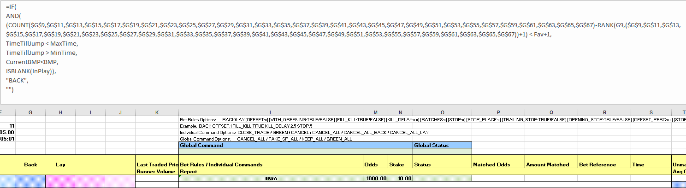
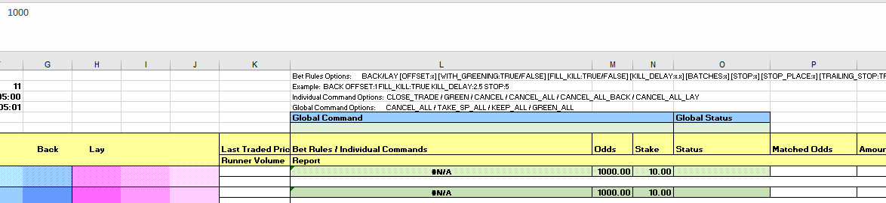
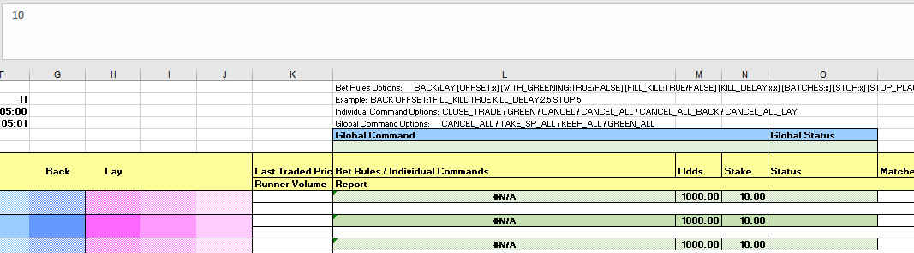
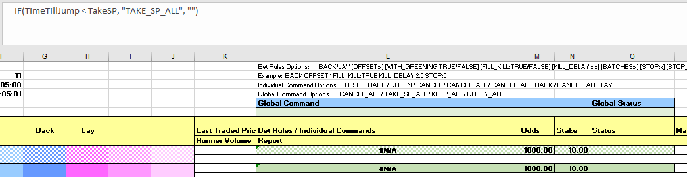

# Bet Angel Pro: Market favourite automation

---
## Automating a market favourite strategy using Bet Angel Pro

Here we explore how to implement an automated strategy to place [Betfair Starting Price (BSP)](https://www.betfair.com.au/hub/tools/betting-tools/betfair-starting-price-bsp/) bets on the top two runners in the market. This lets you choose your selections based on market sentiment close to the jump, and not worry about current market price by using BSP to place your bets. You could equally use effectively the same approach if you wanted to lay the favourite(s) instead of backing them.

Building on our [previous articles](../betAngelBetsmartRatingsAutomation/), we're using the spreadsheet functionality available in Bet Angel Pro to implement this strategy. If you haven't already we'd recommend going back and having a read of [this article](../betAngelBetsmartRatingsAutomation/), as the concepts here do build on what we covered previously. As we've said before, there are so many different ways to use this part of Bet Angel and we're very open to any thoughts about more effective ways of implementing this sort of strategy. You're welcome to reach out to us at automation@betfair.com.au with your feedback and opinions. 

--- 
## - The plan

Given that we're simply choosing our selections based on the market we don't need any ratings for this strategy. The plan is to look at the market a couple of minutes before the scheduled jump and place BSP bets based on its formation. 

Our approach here, and how we've set up the accompanying spreadsheet, backs the top two runners in the market two minutes out from the scheduled start time using the Betfair Starting Price. 

!!! info "Resources"
    - Rules: [here's the spreadsheet](./assets/BetAngel_MarketFavouriteAutomation.xls) we set up with our macros and rules included, but you'll obviously need to tweak it to suit your strategy and approach
    - Tool: [Bet Angel Pro](https://www.betangel.com/bet-angel-professional/)

---
###- Set up 

Make sure you've downloaded and installed Bet Angel Pro, and signed in.

Once you open the program up click on the 'G' Guardian icon and open the Guardian functionality up. 


---
###- Writing your rules

As with any automated strategy, one of the most important steps is deciding what logical approach you want to take and writing rules that suit. 

We're using a [customised version of the default Bet Angel template Excel sheet](./assets/BetAngel_MarketFavouriteAutomation.xls) to implement our strategy, so it can make betting decisions based on the favourites being shown in the market. Excel is an excellent tool, but it can take an investment of time to be able to use it effectively. 

This is how we used Excel to implement our set of rules. 


###- Trigger to place bet

In short, we want to back runners when:

- the selection's available to back price (Column G) is either the lowest or second lowest in the market - the top two market favourites with the ability to easily change this
- the scheduled event start time is less and greater than what we specify
- Back market percentage is less than a certain value that we choose
- the event isn't in play 

###- Using cell references to simplify formulas

Throughout this tutorial, we'll be referencing certain cells with custom names that will make it easier to understand and follow the formulas as we progress. This is an especially effective method to
keep on top of more complex strategies that require long formaulas to implement.
 
!!! info "Cell names used in this tutorial"

    - **Fav** refers to cell C4 in the 'OPTIONS' worksheet

    - **Overrounds1, Overrounds2 and Overrounds3** refers to cell AF8 in the 'BET ANGEL', 'BET ANGEL 2' and 'BET ANGEL 3' worksheets repectively, where the overrounds are calculated. Each worksheet needs to contain their own formula calculations as they will each be working off different markets

    - **UserOverround** refers to cell C3 in the 'OPTIONS' worksheet which allows you to change a single value that will automatically update the formulas for all runners

    - **TimeTillJump1, TimeTillJump2 and TimeTillJump3** refers to cell E9, E13 and E17 in the 'SETTINGS' worksheet respectively. Just like the overrounds, each worksheet needs their own TimeTillJump calculation - one for each market

    - **MinTime** refers to cell C2 in the 'OPTIONS' worksheet which allows you to change a single value that will automatically update the formulas for all runners

    - **MaxTime** refers to cell E2 in the 'OPTIONS' worksheet which allows you to change a single value that will automatically update the formulas for all runners

    - **InPlay1, InPlay2, InPlay3** refers to cell G1 in the 'BET ANGEL', 'BET ANGEL 2' and 'BET ANGEL 3' worksheets respectively. Bet Angel will populate a status in these worksheet cells such as "In Play" or "Suspended" for each market

    - **TakeSP** refers to cell C5 in the 'OPTIONS' worksheet which allows you to change a single value more easily.


**This is our trigger on Excel formula:**

``` excel tab="Multi line"
=IF(
    AND(
        (COUNT($G$9,$G$11,$G$13,$G$15,$G$17,$G$19,$G$21,$G$23,$G$25,$G$27,$G$29,$G$31,$G$33,$G$35,$G$37,$G$39,$G$41,$G$43,$G$45,$G$47,$G$49,$G$51,$G$53,$G$55,$G$57,$G$59,$G$61,$G$63,$G$65,$G$67)-RANK(G9,($G$9,$G$11,$G$13,$G$15,$G$17,$G$19,$G$21,$G$23,$G$25,$G$27,$G$29,$G$31,$G$33,$G$35,$G$37,$G$39,$G$41,$G$43,$G$45,$G$47,$G$49,$G$51,$G$53,$G$55,$G$57,$G$59,$G$61,$G$63,$G$65,$G$67))+1) < Fav+1,
        TimeTillJump1 < MaxTime,
        TimeTillJump1 > MinTime,
        Overrounds1<UserOverrounds,
        ISBLANK(InPlay1)),
    "BACK",
"")

```

``` excel tab="Single line"
=IF(AND((COUNT($G$9,$G$11,$G$13,$G$15,$G$17,$G$19,$G$21,$G$23,$G$25,$G$27,$G$29,$G$31,$G$33,$G$35,$G$37,$G$39,$G$41,$G$43,$G$45,$G$47,$G$49,$G$51,$G$53,$G$55,$G$57,$G$59,$G$61,$G$63,$G$65,$G$67)-RANK(G9,($G$9,$G$11,$G$13,$G$15,$G$17,$G$19,$G$21,$G$23,$G$25,$G$27,$G$29,$G$31,$G$33,$G$35,$G$37,$G$39,$G$41,$G$43,$G$45,$G$47,$G$49,$G$51,$G$53,$G$55,$G$57,$G$59,$G$61,$G$63,$G$65,$G$67))+1) < Fav+1,TimeTillJump1 < MaxTime,TimeTillJump1 > MinTime,Overrounds1<UserOverrounds,ISBLANK(InPlay1)),"BACK","")
```

Stepping through each step:

- **Finding the top two selections in the market:** check each runner to see if they're one of the two market favourites - We're doing this by going through the best available to back (column G) price for each runner, ranking them in order (which sorts them from highest to lowest - which is the opposite of what we want) then subtracting that rank number from the total number of selections available to inverse the order. Finally, we plus one to the resulting rank - if we didn't do this then you'd have a rank order that started at 0, not 1, and we thought that would just confuse matters!

Once it's established what each selection's rank is, we then check if that rank is less than three, and if it is we know that the runner in question is one of the top two in the market, based on the current available to back prices.

``` excel hl_lines="3"
=IF(
    AND(
        (COUNT($G$9,$G$11,$G$13,$G$15,$G$17,$G$19,$G$21,$G$23,$G$25,$G$27,$G$29,$G$31,$G$33,$G$35,$G$37,$G$39,$G$41,$G$43,$G$45,$G$47,$G$49,$G$51,$G$53,$G$55,$G$57,$G$59,$G$61,$G$63,$G$65,$G$67)-RANK(G9,($G$9,$G$11,$G$13,$G$15,$G$17,$G$19,$G$21,$G$23,$G$25,$G$27,$G$29,$G$31,$G$33,$G$35,$G$37,$G$39,$G$41,$G$43,$G$45,$G$47,$G$49,$G$51,$G$53,$G$55,$G$57,$G$59,$G$61,$G$63,$G$65,$G$67))+1) < Fav+1,
        TimeTillJump1 < MaxTime,
        TimeTillJump1 > MinTime,
        Overrounds1<UserOverrounds,
        ISBLANK(InPlay1)),
    "BACK",
"")
```

- **TimeTillJump1 < MaxTime and > MinTime:** check whether the seconds left on the countdown are smaller than what is defined in cell C2 and greater than cell E2 in the 'OPTIONS' worksheet (named 'MinTime' and 'MaxTime' respectively), as we need to both place the bet and then convert it to a BSP bet before the off (more on this later). This one's a bit complicated, as the time is actually returned as a percentage of a 24 hour day, which you need to convert into positive or negative seconds. [You can read about the formula here](https://www.betangel.com/forum/viewtopic.php?t=7657) or just keep it simple by referencing the value in cell E4 (named 'TimeTillJump1')in the 'SETTINGS' worksheet, where we've already done the calculations for you.

``` excel hl_lines="4 5"
=IF(
    AND(
        (COUNT($G$9,$G$11,$G$13,$G$15,$G$17,$G$19,$G$21,$G$23,$G$25,$G$27,$G$29,$G$31,$G$33,$G$35,$G$37,$G$39,$G$41,$G$43,$G$45,$G$47,$G$49,$G$51,$G$53,$G$55,$G$57,$G$59,$G$61,$G$63,$G$65,$G$67)-RANK(G9,($G$9,$G$11,$G$13,$G$15,$G$17,$G$19,$G$21,$G$23,$G$25,$G$27,$G$29,$G$31,$G$33,$G$35,$G$37,$G$39,$G$41,$G$43,$G$45,$G$47,$G$49,$G$51,$G$53,$G$55,$G$57,$G$59,$G$61,$G$63,$G$65,$G$67))+1) < Fav+1,
        TimeTillJump1 < MaxTime,
        TimeTillJump1 > MinTime,
        Overrounds1<UserOverrounds,
        ISBLANK(InPlay1)),
    "BACK",
"")
```

- **Overrounds1 < UserOverrounds:** checking whether the market overrounds are less than the specific value that is specified in cell C3 of the 'OPTIONS' worksheet

``` excel hl_lines="6"
=IF(
    AND(
        (COUNT($G$9,$G$11,$G$13,$G$15,$G$17,$G$19,$G$21,$G$23,$G$25,$G$27,$G$29,$G$31,$G$33,$G$35,$G$37,$G$39,$G$41,$G$43,$G$45,$G$47,$G$49,$G$51,$G$53,$G$55,$G$57,$G$59,$G$61,$G$63,$G$65,$G$67)-RANK(G9,($G$9,$G$11,$G$13,$G$15,$G$17,$G$19,$G$21,$G$23,$G$25,$G$27,$G$29,$G$31,$G$33,$G$35,$G$37,$G$39,$G$41,$G$43,$G$45,$G$47,$G$49,$G$51,$G$53,$G$55,$G$57,$G$59,$G$61,$G$63,$G$65,$G$67))+1) < Fav+1,
        TimeTillJump1 < MaxTime,
        TimeTillJump1 > MinTime,
        Overrounds1<UserOverrounds,
        ISBLANK(InPlay1)),
    "BACK",
"")
```

- **InPlay1:** checking whether the event has gone in play, as this is purely a pre-play strategy, though you could certainly take a similar approach to in-play markets. InPlay refers to G1 in the 'BET ANGEL' worksheet, if this cell is blank it means it's not displaying the 'in-play' flag, so it's safe to place bets. 

``` excel hl_lines="7"
=IF(
    AND(
        (COUNT($G$9,$G$11,$G$13,$G$15,$G$17,$G$19,$G$21,$G$23,$G$25,$G$27,$G$29,$G$31,$G$33,$G$35,$G$37,$G$39,$G$41,$G$43,$G$45,$G$47,$G$49,$G$51,$G$53,$G$55,$G$57,$G$59,$G$61,$G$63,$G$65,$G$67)-RANK(G9,($G$9,$G$11,$G$13,$G$15,$G$17,$G$19,$G$21,$G$23,$G$25,$G$27,$G$29,$G$31,$G$33,$G$35,$G$37,$G$39,$G$41,$G$43,$G$45,$G$47,$G$49,$G$51,$G$53,$G$55,$G$57,$G$59,$G$61,$G$63,$G$65,$G$67))+1) < Fav+1,
        TimeTillJump1 < MaxTime,
        TimeTillJump1 > MinTime,
        Overrounds1<UserOverrounds,
        ISBLANK(InPlay1)),
    "BACK",
"")
```

- **Result:** if the statement above is true, the formula returns 'BACK', at which point the bet will trigger, otherwise the cell will remain blank and no bet will be placed.

``` excel hl_lines="8 9"
=IF(
    AND(
        (COUNT($G$9,$G$11,$G$13,$G$15,$G$17,$G$19,$G$21,$G$23,$G$25,$G$27,$G$29,$G$31,$G$33,$G$35,$G$37,$G$39,$G$41,$G$43,$G$45,$G$47,$G$49,$G$51,$G$53,$G$55,$G$57,$G$59,$G$61,$G$63,$G$65,$G$67)-RANK(G9,($G$9,$G$11,$G$13,$G$15,$G$17,$G$19,$G$21,$G$23,$G$25,$G$27,$G$29,$G$31,$G$33,$G$35,$G$37,$G$39,$G$41,$G$43,$G$45,$G$47,$G$49,$G$51,$G$53,$G$55,$G$57,$G$59,$G$61,$G$63,$G$65,$G$67))+1) < Fav+1,
        TimeTillJump1 < MaxTime,
        TimeTillJump1 > MinTime,
        Overrounds1<UserOverrounds,
        ISBLANK(InPlay1)),
    "BACK",
"")
```

!!! info "updating the trigger for 'BET ANGEL 2' and 'Bet ANGEL 3' worksheets"

     You will need to ensure that the reference names for Overrounds, TimeTillJump and InPlay are changed so that they are referencing the cells that are applicable for those specific worksheets. Forgetting to do this can lead to the automation working off information from the wrong market.  


- **Trigger for 'BET ANGEL 2' worksheet:** Note that Overrounds has been changed to Overrounds2, TimeTillJump1 to TimeTillJump2 and InPlay1 to InPlay2

``` excel hl_lines="5 6 7 8"
=IF(
    AND(
        (COUNT($G$9,$G$11,$G$13,$G$15,$G$17,$G$19,$G$21,$G$23,$G$25,$G$27,$G$29,$G$31,$G$33,$G$35,$G$37,$G$39,$G$41,$G$43,$G$45,$G$47,$G$49,$G$51,$G$53,$G$55,$G$57,$G$59,$G$61,$G$63,$G$65,$G$67)-RANK(G9,($G$9,$G$11,$G$13,$G$15,$G$17,$G$19,$G$21,$G$23,$G$25,$G$27,$G$29,$G$31,$G$33,$G$35,$G$37,$G$39,$G$41,$G$43,$G$45,$G$47,$G$49,$G$51,$G$53,$G$55,$G$57,$G$59,$G$61,$G$63,$G$65,$G$67))+1) < Fav+1,
        TimeTillJump2 < MaxTime,
        TimeTillJump2 > MinTime,
        Overrounds2<UserOverrounds,
        ISBLANK(InPlay2)),
    "BACK",
"")
```

- **Trigger for 'BET ANGEL 3' worksheet:** Note that Overrounds has been changed to Overrounds3, TimeTillJump1 to TimeTillJump3 and InPlay1 to InPlay3

``` excel hl_lines="5 6 7 8"
=IF(
    AND(
        (COUNT($G$9,$G$11,$G$13,$G$15,$G$17,$G$19,$G$21,$G$23,$G$25,$G$27,$G$29,$G$31,$G$33,$G$35,$G$37,$G$39,$G$41,$G$43,$G$45,$G$47,$G$49,$G$51,$G$53,$G$55,$G$57,$G$59,$G$61,$G$63,$G$65,$G$67)-RANK(G9,($G$9,$G$11,$G$13,$G$15,$G$17,$G$19,$G$21,$G$23,$G$25,$G$27,$G$29,$G$31,$G$33,$G$35,$G$37,$G$39,$G$41,$G$43,$G$45,$G$47,$G$49,$G$51,$G$53,$G$55,$G$57,$G$59,$G$61,$G$63,$G$65,$G$67))+1) < Fav+1,
        TimeTillJump2 < MaxTime,
        TimeTillJump2 > MinTime,
        Overrounds2<UserOverrounds,
        ISBLANK(InPlay2)),
    "BACK",
"")

```     


- **Convert bets to Betfair Starting Price:** Bet Angel Pro doesn't offer the option to place straight BSP bets, so  we've got around that here by placing the bets initially at odds of 1000 (which won't get matched for short favourites), and then at certain amount of seconds from the scheduled start using what Bet Angel calls a 'Global Command' to convert all unmatched bets to BSP. The exact number of seconds can be easily changed by updating cell C5 from the 'OPTIONS' worksheet. This formula goes in cell L6 of the 'BET ANGEL' worksheet, and once it's triggered the bets will automatically convert. Remember, just like the main trigger, each worksheet's global command will need to be updated to reference its respective TimeTillJump calculation. 

-- 'BET ANGEL' worksheet global command formula
    ``` excel hl_lines="1"
    =IF(TimeTillJump1 < TakeSP, "TAKE_SP_ALL", "")
    ```

-- 'BET ANGEL 2' worksheet global command formula
    ``` excel hl_lines="1"
    =IF(TimeTillJump2 < TakeSP, "TAKE_SP_ALL", "")
    ```

-- 'BET ANGEL 3' worksheet global command formula
    ``` excel hl_lines="1"
    =IF(TimeTillJump3 < TakeSP, "TAKE_SP_ALL", "")
    ```

!!! info "Excel functions"

    - [IF statement:](https://support.office.com/en-us/article/if-function-69aed7c9-4e8a-4755-a9bc-aa8bbff73be2) IF(if this is true, do this, else do this)
    - [AND statement:](https://support.office.com/en-us/article/and-function-5f19b2e8-e1df-4408-897a-ce285a19e9d9) AND(this is true, and so is this, and so is this) - returns true or false
    - [COUNT function:](https://support.office.com/en-us/article/count-function-a59cd7fc-b623-4d93-87a4-d23bf411294c) returns number of cells in the range you pass in tha contain a number
    - [RANK function:](https://support.office.com/en-us/article/rank-function-6a2fc49d-1831-4a03-9d8c-c279cf99f723) returns the rank of a number in a list of numbers, with the smallest number returning the highest rank.
    - [Absolute references:](https://support.office.com/en-us/article/switch-between-relative-absolute-and-mixed-references-dfec08cd-ae65-4f56-839e-5f0d8d0baca9) if you're copy/pasting formulas it's important that you make links absolute when you don't want the cell being referenced to change relative to the new cell the formula is being pasted into. You do this by putting a $ in front of the parts of the reference you don't want to 'move'. 

---
###- Preparing the spreadsheet

You need to copy/paste these three formulas into the relevant cell on each green row - We copied ours into all of the coloured cells in the sheet, just in case the fields are bigger in future events. Excel is clever enough to automatically update the relative links in the formulas, so you should be able to copy/paste the same formula into each cell as long as you've got your [relative and absolute references straight](https://support.office.com/en-us/article/switch-between-relative-absolute-and-mixed-references-dfec08cd-ae65-4f56-839e-5f0d8d0baca9). 

- **Trigger bet rule:** this is the bet trigger Excel formula we created earlier, and it needs to go in column L (L9 for the first runner).

``` excel tab="Multi line"
=IF(
    AND(
        (COUNT($G$9,$G$11,$G$13,$G$15,$G$17,$G$19,$G$21,$G$23,$G$25,$G$27,$G$29,$G$31,$G$33,$G$35,$G$37,$G$39,$G$41,$G$43,$G$45,$G$47,$G$49,$G$51,$G$53,$G$55,$G$57,$G$59,$G$61,$G$63,$G$65,$G$67)-RANK(G9,($G$9,$G$11,$G$13,$G$15,$G$17,$G$19,$G$21,$G$23,$G$25,$G$27,$G$29,$G$31,$G$33,$G$35,$G$37,$G$39,$G$41,$G$43,$G$45,$G$47,$G$49,$G$51,$G$53,$G$55,$G$57,$G$59,$G$61,$G$63,$G$65,$G$67))+1) < Fav+1,
        TimeTillJump1 < MaxTime,
        TimeTillJump1 > MinTime,
        Overrounds1<UserOverrounds,
        ISBLANK(InPlay1)),
    "BACK",
"")
```

``` excel tab="Single line"
=IF(AND((COUNT($G$9,$G$11,$G$13,$G$15,$G$17,$G$19,$G$21,$G$23,$G$25,$G$27,$G$29,$G$31,$G$33,$G$35,$G$37,$G$39,$G$41,$G$43,$G$45,$G$47,$G$49,$G$51,$G$53,$G$55,$G$57,$G$59,$G$61,$G$63,$G$65,$G$67)-RANK(G9,($G$9,$G$11,$G$13,$G$15,$G$17,$G$19,$G$21,$G$23,$G$25,$G$27,$G$29,$G$31,$G$33,$G$35,$G$37,$G$39,$G$41,$G$43,$G$45,$G$47,$G$49,$G$51,$G$53,$G$55,$G$57,$G$59,$G$61,$G$63,$G$65,$G$67))+1) < Fav+1,TimeTillJump1 < MaxTime,TimeTillJump1 > MinTime,Overrounds1<UserOverrounds,ISBLANK(InPlay1)),"BACK","")
```



- **Odds:** as we said we're putting the bet up initially at odds of 1000, so this is a simple one. 

!!! info "Note:" 
    The IF statement in both the odds and stake cells is purely to keep our document clean of clutter when there are no runners in column B. A similar effect to IFERROR, if Bet Angel hasn't populated cell B9 with a runner name, then dont populate this cell at all.

```=IF(B9="","","1000")```



- **Stake:** it's completely up to you what staking approach you want to take. We're keeping it simple and using flat staking here, so will just place $10 on each runner. This goes in column N (N9 for the first runner). We've got some [good resources on the Hub](https://www.betfair.com.au/hub/better-betting/betting-principles/basic-principles/staking-plans-and-strategies/) that look at different staking approaches - these might be useful in helping you decide which strategy you want to use. 

```=IF(B9="","","10")```



- **Global Command:** this is what triggers the open bets to convert to BSP, and only goes in one cell, L6. As soon as the countdown timer reaches less than 60 seconds this will fire. As mentioned above, remember to update the formula for each worksheet.

```=IF(TimeTillJump1 < TakeSP, "TAKE_SP_ALL", "")```



---
###- You know the drill

The process is effectively the same from here on as for our previously automated strategy, but we've included it here just in case you want a refresher or are new to Bet Angel Pro.

###- Video walk through

We've put together a litte video walk through to help make this process easier. 

<iframe width="700" height="455" src="https://www.youtube.com/embed/xKfNEpyE3KE" frameborder="0" allow="accelerometer; autoplay; encrypted-media; gyroscope; picture-in-picture" allowfullscreen></iframe>

---
###- Selecting markets

We used the markets menu in the Guardian tool to navigate to the tracks we have ratings for, then multi-selected all the win markets by holding down the control key and clicking on the different markets.

If you wanted to include all horse or greyhound races for a day you could use the 'quick picks' tab to do this more efficiently. 

Once you've chosen the races you're interested in click the 'add' button and you'll see them appear in the main body of the screen. 

Make sure you sort the races **by start time**, so Bet Angel will automatically move through them in the right order and allocate the next race to the spreadsheet once the previous one ends. 

You do this by clicking on the 'start time' column heading until the races are in time order (when the arrow is pointing up).


---
###- Linking the spreadsheet

Open the 'Excel' tab in Guardian, then use the browse functionality to choose the spreadsheet you've been working on. From there, click on 'open workbook', then make sure you have 'connect', 'auto-bind Bet Angel sheets and 'auto-clear Bet Angel bindings' all selected. You also need to make sure that the first race has the 'Bet Angel' tab selected in the 'Excel sheet' column - from there it will then automatically update this for each race as one finishes and the next one begins. 


---
## And you're set!

Once you've set your spreadsheet set up and you're comfortable using Bet Angel Pro it should only take a number of seconds to load your markets and set your strategy running for the day. Just make sure you have all of the app settings correctly selected before you leave the bot to run, as some of them reset by default when you turn the program off.

!!! info "Note:" 
    You will need to leave your computer up and running for the duration of the chosen markets, as the program needs the computer to be 'awake' to be able to run.
    
---
## Bet Angel features

Here are some Bet Angel features that you'll need to consider.

###- Multiple bets/clearing status cells
The Bet Angel spreadsheet won't let a bet go on if there is a value in column 0 for the runner, the 'status' column, to avoid accidentally placing multiple bets unintentionally. As soon as a bet triggers, Bet Angel automatically changes this cell to 'PLACING', then to 'PLACED' when the bet is confirmed as having been received by Betfair. In this strategy we only want to place one bet per runner, but if you wanted to place multiple bets on a runner you'd need to have a play with the macros to clear the 'status' cells more regularly, and instead reference the number of bets placed/matched in columns T:AE. Careful here though, as the values in these columns sometimes take a little time to update, and we've had more bets go on than we intended when using these cells as my check, as bet trigger re-evaluated before columns T:AE had updated. 

As we want to use the same sheet for multiple races, and the 'status' cells don't clear automatically, we've created a macro in [the Excel sheet](./assets/BetAngel_RatingsAutomation.xls) that auto-clears the status and global status cells whenever a new race loads. It also clears the cells if they say 'FAILED', as we found that if there were internet network issues or similar it would fail once then not try to place the bet again. This was based on some logic we found in [a forum discussion on Bet Angel](https://www.betangel.com/forum/viewtopic.php?f=31&t=1879&start=10). If you're feeling adventurous you can have a play with the macros and edit them to suit your specific needs. 

###- Turning off bet confirmation
Unless you want to manually confirm each individual bet you're placing (which you definitely might want to do until you feel comfortable that the program and strategy are behaving as you expect) you'll need to go into the 'Settings' tab on the main Bet Angel Pro program, click 'Edit settings', go to the 'Behaviour' tab, and remove the tick at the top next to 'Confirm Bets?' - you can then save these settings.

###- Editing the spreadsheet
The spreadsheet really doesn't like it when you try and edit it 'live', so make sure you untick 'connect' on the Excel tab in Guardian before you make any changes, save the sheet, then tick 'connect' again once you've finished your edits. 

---
## Areas for improvement

There are parts of this approach that we're still trying to get to work to our liking, and we'll update this article as we find better solutions. If you have any suggestions for improvements please reach out to automation@betfair.com.au - we'd love to hear your thoughts. 

If the market changes significantly in those last few minutes and a third selection shortens in past the two we've placed bets on you could end up with bets on more than the intended two runner. This is something you could check for in your bet rule if you wanted to ensure you were only backing a set number of runners. 

---
## What next? 

We're working through some of the popular automation tools and creating articles like this one to help you learn how to use them to implement different styles of strategies. If you have any thoughts or feedback on this article or other programs you'd like to see us explore please reach out to automation@betfair.com.au - this article has already been updated with extra learnings including variable percentages and new macros.

---
## Disclaimer

Note that whilst automated strategies are fun and rewarding to create, we can't promise that your betting strategy will be profitable, and we make no representations in relation to the information on this page. If you're implementing your own strategies, you do so entirely at your own risk and you are responsible for any winnings/losses incurred.  Under no circumstances will Betfair be liable for any loss or damage you suffer.