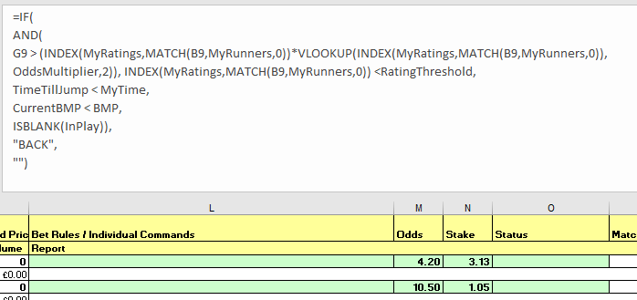
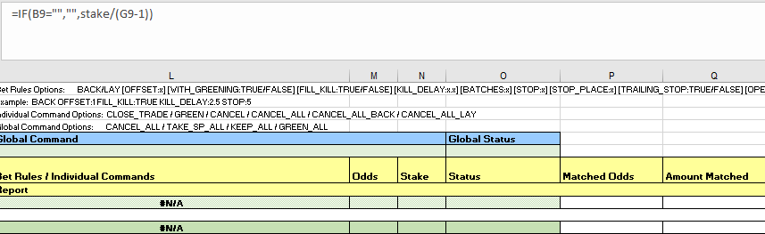

# Bet Angel - Ratings Automation

---
### Automating a ratings based strategy using Bet Angel Pro

Ratings are the basis for a lot of betting strategies, but they can be paricularly painful and time-consuming to implement manually. This makes them ideal for automation, where you use a program to place bets on your behalf while you get on with other things. 

Bet Angel Pro has a spreadsheet functionality that lets you place bets using your own variables and information from the live market, which is what I've used here to automate these ratings. There are so many different ways to use this part of Bet Angel and I'm very open to any thoughts about more effecitve ways of implementing this sort of strategy. You're welcome to reach out to me on bdp@betfair.com.au with your feedback and opinions. 

--- 
### The plan

I'm using the [Greyhound Ratings Model](https://www.betfair.com.au/hub/tools/models/greyhound-ratings-model/) put together by some of my Data Scientist colleagues. This model creates ratings for Victorian greyhound races daily and is freely available on the Hub. It's pretty good at predicting winners, so I'm going to place back bets on the dogs with shorter ratings where the market price is better than the model's rating. Bet Angel Pro's 'Guardian' feature has the capacity to let you create spreadsheets with pretty complicated rules that can be applied to multiple markets, which is what I've used for the automation here. 

Here I'll step through how I went about getting Bet Angel Pro to place bets using the ratings from [Betfair's DataScientists' Greyhound Ratings Model](https://www.betfair.com.au/hub/tools/models/greyhound-ratings-model/). Once it's set up the goal is to be able to upload a new set of ratings, choose your races, set the program running and be able to walk away.


!!! note "Resources"
    - Tips: [Betfair Data Scientists' Greyhound Ratings Model](https://www.betfair.com.au/hub/tools/models/greyhound-ratings-model/)
    - Rules: [here's the spreadsheet](./assets/BetAngel_RatingsAutomation.xls) I set up with my macros and rules included, but you'll obviously need to tweak it to suit your strategy and the format of your ratings 
    - Tool: [Bet Angel Pro](https://www.betangel.com/bet-angel-professional/)

---
### Set up 

Make sure you've downloaded and installed Bet Angel Pro, and signed in.

Once you open the program up click on the 'G' Guardian icon and open the Guardian functionality up. 


---
### Finding & formatting ratings

Here I'm using the [ratings shared by our Data Scientists on the Hub](https://www.betfair.com.au/hub/tools/models/greyhound-ratings-model/). This makes for a bit of prep work, copying the list of runners and their rating into an Excel spreadsheet. As a minimum you'll need a list of runner names (including the runner number followed by a full stop, i.e. 1. Runner Name) in one column and their rating in another in an Excel sheet. 

If you have a list of ratings already in a spreadsheet that's even better - you'll be able to tweak the Excel formulas to work with whatever format your data is in.

Wherever your ratings come from, you'll need to include them in the spreadsheet you're using to interact wtih Bet Angel. Here I'm using a [spreadsheet I edited for this strategy](./assets/BetAngel_RatingsAutomation.xls), and I've included a tab called RATINGS where you can copy in the runner names and ratings.


---
### Writing a rule 

As with any automated strategy, one of the most important steps is deciding what logical approach you want to take, and writing rules that suit. 

I'm using a [customised version of the default Bet Angel template Excel sheet](./assets/BetAngel_RatingsAutomation.xls) to implement my strategy, so it can make betting decisions based on my ratings. Excel is an excellent tool, but it can take an investment of time to be able to use it effectively. 

This is how I used Excel to implement my set of rules. 


#### Trigger to place bet

In short, I want to back runners when:

- the available to back price is better than the rating for that runner by at least 10%
- they have a rating less than 5
- the scheduled event start time is less than 2 minutes away 
- there isn't a bet already placed on the runner 
- the event isn't in play 


**This is my trigger on Excel formula:**

``` excel tab="Multi line"
=IF(
    AND(
        G9 > (INDEX(RATINGS!B:B,MATCH(B9,RATINGS!A:A,0))*1.1),
        INDEX(RATINGS!B:B,MATCH(B9,RATINGS!A:A,0)) < 5, 
        Sheet2!$E$4 < 120, 
        AB10 < 1,
        ISBLANK($G$1)),
    "BACK",
    ""
)
```

``` excel tab="Single line"
=IF(AND(G9 > (INDEX(RATINGS!B:B,MATCH(B9,RATINGS!A:A,0))*1.1),INDEX(RATINGS!B:B,MATCH(B9,RATINGS!A:A,0)) < 5, Sheet2!$E$4 < 120, AB10 < 1, ISBLANK($G$1)),"BACK","")
```

Stepping through each step:

- **Price > rating:** check whether the available to back price is better than the runner's rating multipled by 1.1 (10%) - I do this by using the runner name in column B and looking up the corresponding rating for that runner from the RATINGS sheet. 

``` excel hl_lines="3"
=IF(
    AND(
        G9 > (INDEX(RATINGS!B:B,MATCH(B9,RATINGS!A:A,0))*1.1),
        INDEX(RATINGS!B:B,MATCH(B9,RATINGS!A:A,0)) < 5, 
        Sheet2!$E$4 < 120, 
        AB10 < 1,
        ISBLANK($G$1)),
    "BACK",
    ""
)
```

!!! note "Updating references to suit your ratings format"
    If your ratings are formatted differently to my simple runner **name | rating** layout you can easily edit the formula to refence the relevant column directly, instead of changing your ratings to fit the formula. 
    Let's say your ratings sheet is set out like this: **race date | venue | runner name | last race time | weight | rating** 
    
    Here's the set up of the formula:
    
    ```RATINGS!B:B[your rating],MATCH(B9,RATINGS!A:A[runner name],0))```

    So your edited formula would be:

    ```RATINGS!F:F,MATCH(B9,RATINGS!C:C,0))```

    You need to make sure that you updated these references both in the this part of the formula, and in the next step too.  

- **Rating < 5:** check whether the runner's rating is less than 5 (because I only want to bet on the favourite few runners)

``` excel hl_lines="4"
=IF(
    AND(
        G9 > (INDEX(RATINGS!B:B,MATCH(B9,RATINGS!A:A,0))*1.1),
        INDEX(RATINGS!B:B,MATCH(B9,RATINGS!A:A,0)) < 5, 
        Sheet2!$E$4 < 120, 
        AB10 < 1,
        ISBLANK($G$1)),
    "BACK",
    ""
)
```

- **Time < 2 mins:** check whether the seconds left on the countdown are smaller than 120 (2 minutes), as the majority of markets don't fully form until the last few minutes before the off. This one's a bit complicated, as the time is actually returned as a percentage of a 24 hour day, which you need to convert into positive or negative seconds. [You can read about the formula here](https://www.betangel.com/forum/viewtopic.php?t=7657) or just keep it simple by referencing the value in cell E4 of Sheet2, where I've already done the calculations for you.

``` excel hl_lines="5"
=IF(
    AND(
        G9 > (INDEX(RATINGS!B:B,MATCH(B9,RATINGS!A:A,0))*1.1),
        INDEX(RATINGS!B:B,MATCH(B9,RATINGS!A:A,0)) < 5, 
        Sheet2!$E$4 < 120, 
        AB10 < 1,
        ISBLANK($G$1)),
    "BACK",
    ""
)
```

- **No existing bet:** checking whether a bet's already been placed on the runner, as I only want the bet to place once. The number of bets matched on the runner shows in column AB - obviously there are other ways you can check this, but whichever one you go with you'll need a check in place to make sure your bets don't fire again and again, unless that's part of your strategy! This is particularly important because I've created a macro that clears the 'status' cells in column O, which is what Bet Angel uses by default to avoid multiple bets going on unintentionally. 

``` excel hl_lines="6"
=IF(
    AND(
        G9 > (INDEX(RATINGS!B:B,MATCH(B9,RATINGS!A:A,0))*1.1),
        INDEX(RATINGS!B:B,MATCH(B9,RATINGS!A:A,0)) < 5, 
        Sheet2!$E$4 < 120, 
        AB10 < 1,
        ISBLANK($G$1)),
    "BACK",
    ""
)
```

- **Not in play:** checking whether the event has gone in play - as odds change so much in the run I only want to use this strategy pre-play. If this cell is blank it means it's not displaying the 'in-play' flag, so it's safe to place bets. I appreciate that greyhound races don't go in play, but I wanted this check in place anyway in case I (or you!) wanted to use a version of this strategy on horse racing in the future. 

``` excel hl_lines="7"
=IF(
    AND(
        G9 > (INDEX(RATINGS!B:B,MATCH(B9,RATINGS!A:A,0))*1.1),
        INDEX(RATINGS!B:B,MATCH(B9,RATINGS!A:A,0)) < 5, 
        Sheet2!$E$4 < 120, 
        AB10 < 1,
        ISBLANK($G$1)),
    "BACK",
    ""
)
```

- **Result:** if the statement above is true, the formula returns "BACK", at which point the bet will trigger, otherwise the cell will remain blank and no bet will be placed.

``` excel hl_lines="8 9"
=IF(
    AND(
        G9 > (INDEX(RATINGS!B:B,MATCH(B9,RATINGS!A:A,0))*1.1),
        INDEX(RATINGS!B:B,MATCH(B9,RATINGS!A:A,0)) < 5, 
        Sheet2!$E$4 < 120, 
        AB10 < 1,
        ISBLANK($G$1)),
    "BACK",
    ""
)
```

!!! note "Excel functions"

    - [IF statement:](https://support.office.com/en-us/article/if-function-69aed7c9-4e8a-4755-a9bc-aa8bbff73be2) IF(if this is true, do this, else do this)
    - [AND statement:](https://support.office.com/en-us/article/and-function-5f19b2e8-e1df-4408-897a-ce285a19e9d9) AND(this is true, and so is this, and so is this) - returns true or false
    - [Absolute references:](https://support.office.com/en-us/article/switch-between-relative-absolute-and-mixed-references-dfec08cd-ae65-4f56-839e-5f0d8d0baca9) if you're copy/pasting formulas it's important that you make links absolute when you don't want the cell being referenced to change relative to the new cell the formula is being pasted into. You do this by putting a $ in front of the parts of the reference you don't want to 'move'. 

---
### Preparing the spreadsheet

You need to copy/paste these three formulas into the relevant cell on each green row - I did a few extra rows than the number of runners in the markets I was looking at, just in case the fields are bigger in future events. Excel is clever enough to automatically update the relative links in the formulas, so you should be able to copy/paste the same formula into each cell as long as you've got your [relative and absolute references straight](https://support.office.com/en-us/article/switch-between-relative-absolute-and-mixed-references-dfec08cd-ae65-4f56-839e-5f0d8d0baca9). 

- **Trigger bet rule:** this is the bet trigger Excel formula we created earlier, and it needs to go in column L (L9 for the first runner).

``` excel tab="Multi line"
=IF(
    AND(
        G9 > (INDEX(RATINGS!B:B,MATCH(B9,RATINGS!A:A,0))*1.1),
        INDEX(RATINGS!B:B,MATCH(B9,RATINGS!A:A,0)) < 5, 
        Sheet2!$E$4 < 120, 
        AB10 < 1,
        ISBLANK($G$1)),
    "BACK",
    ""
)
```

``` excel tab="Single line"
=IF(AND(G9 > (INDEX(RATINGS!B:B,MATCH(B9,RATINGS!A:A,0))*1.1),INDEX(RATINGS!B:B,MATCH(B9,RATINGS!A:A,0)) < 5, Sheet2!$E$4 < 120, AB10 < 1, ISBLANK($G$1)),"BACK","")
```



- **Odds:** initially I was using the runner's rating as the price, but I got a bet placement error for some of the selections - eventually I realised that the odds the bet's being placed at need to be [valid Betfair 'ticks'](https://docs.developer.betfair.com/display/1smk3cen4v3lu3yomq5qye0ni/placeOrders#placeOrders-BetfairPriceIncrements). For simplicity's sake I'm now just using the currently available back odds (cell G9 for the first runner). This goes in column M (M9 for the first runner). Another option would be to create a look up table that rounded your rating to the nearest ['tick' price](https://docs.developer.betfair.com/display/1smk3cen4v3lu3yomq5qye0ni/placeOrders#placeOrders-BetfairPriceIncrements) - if you do this, please do [send me](mailto:bdp@betfair.com.au) through your formula and I'll add it to this article.

```=G9```


- **Stake:** it's completely up to you what staking approach you want to take. I've kept it simple, and am just using a 'to win' strategy. Each bet aims to win $10 on that runner at the curret odds. The formula divides $10 by the current available best back odds (cell G9 for the first runner) minus one to get the stake required to win $10. This goes in column N (N9 for the first runner). We've got some [good resources on the Hub](https://www.betfair.com.au/hub/better-betting/betting-principles/basic-principles/staking-plans-and-strategies/) that look at different staking approaches - these might be useful in helping you decide which strategy you want to use. 

```=10/(G9-1)```



---
### Selecting markets

I used the markets menu in the Guardian tool to navigate to the tracks I had ratings for, then multi-slected all the win markets by holding down the control key and clicking on the different markets.

If you wanted to include all horse or greyhound races for a day you could use the 'quick picks' tab to do this more efficiently. 

Once you've chosen the races you're interested in click the 'add' button and you'll see them appear in the main body of the screen. 

Make sure you sort the races by start time, so Bet Angel will automatically move through them in the right order and allocate the next race to the spreadsheet once the previous one ends. 

You do this by clicking on the 'start time' column heading until the races are in time order (when the arrow is pointing up).


---
### Linking the spreadsheet

Open the 'Excel' tab in Guardian, then use the browse functionality to choose the spreadsheet you've been working on. From there, click on 'open workbook', then make sure you have 'connect', 'auto-bind Bet Angel sheets and 'auto-clear Bet Angel bindings' all selected. You also need to make sure that the first race has the 'Bet Angel' tab selected in the 'Excel sheet' column - from there it will then automatically update this for each race as one finishes and the next one begins. 


---
### And you're set!

Once you've set your spreadsheet set up and you're comfortable using Bet Angel Pro it should only take a number of seconds to load your markets and ratings up and set your strategy running for the day. Just make sure you have all of the app settings correctly selected before you leave the bot to run, as some of them reset by default when you turn the program off.

*Note: you will need to leave your computer up and running for the duration of the chosen markets, as the program needs the computer to be 'awake' to be able to run.*

---
### Bet Angel features

Here are some Bet Angel features that you'll need to consider:

- **Clearing status cells:** if there is a value in the status cell then no bets will place for that runner, to avoid placing duplicate bets accidentally. As we want to use the same sheet for multiple races, and our bet trigger rule includes a check to see whether we already have a bet on the runner, I created a macro in [the Excel sheet](./assets/BetAngel_RatingsAutomation.xls) that auto-clears the status cells every 5 seconds. This was based on some logic I found in [a forum discussion on Bet Angel](https://www.betangel.com/forum/viewtopic.php?f=31&t=1879&start=10).
- **Turning off bet confirmation:** unless you want to manually confirm each individual bet you're placing (which you definitely might want to do until you feel comfortable that the program and strategy are behaving as you expect) you'll need to go into the 'Settings' tab on the main Bet Angel Pro program, click 'Edit settings', go to the 'Behaviour' tab, and remove the tick at the top next to 'Confirm Bets?'. You can then save these settings, but you'll need to go into the settings tab and choose the saved file each time you open the program to change the default confirmation behaviour.
- **Editing the spreadsheet:** the spreadsheet really doesn't like it when you try and edit it 'live', so make sure you untick 'connect' on the Excel tab in Guardian before you make any changes, save the sheet, then tick 'connect' again once you've finished your edits. 

---
### Areas for improvement

There are parts of this approach that I'm still trying to get to work to my liking, and I'll update this article as I find better solutions. If you have any suggestions for improvements please reach out to bdp@betfair.com.au - I'd love to hear your thoughts. 

For example, the spreadsheet only binds with one market at a time, so if one market gets delayed and runs overtime the program won't be able to move on to the next market - I missed some races because of this. 

---
### What next? 

We're working through some of the popular automation tools and creating articles like this one to help you learn how to use them to implement different styles of strategies. If you have any thoughts or feedback on this article or other programs you'd like to see us explore please reach out to bdp@betfair.com.au 

---
### Disclaimer

Note that whilst automated strategies are fun and rewarding to create, we can't promise that your betting strategy will be profitable. If you're implementing your own strategies please gamble responsibly and note that you are responsible for any winnings/losses incurred.