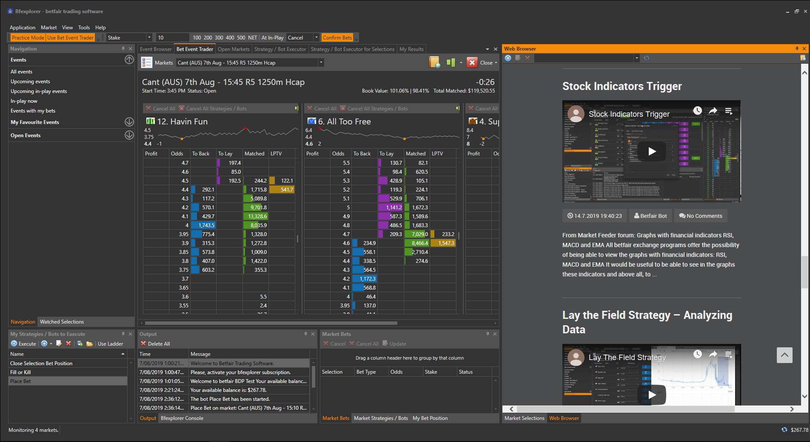
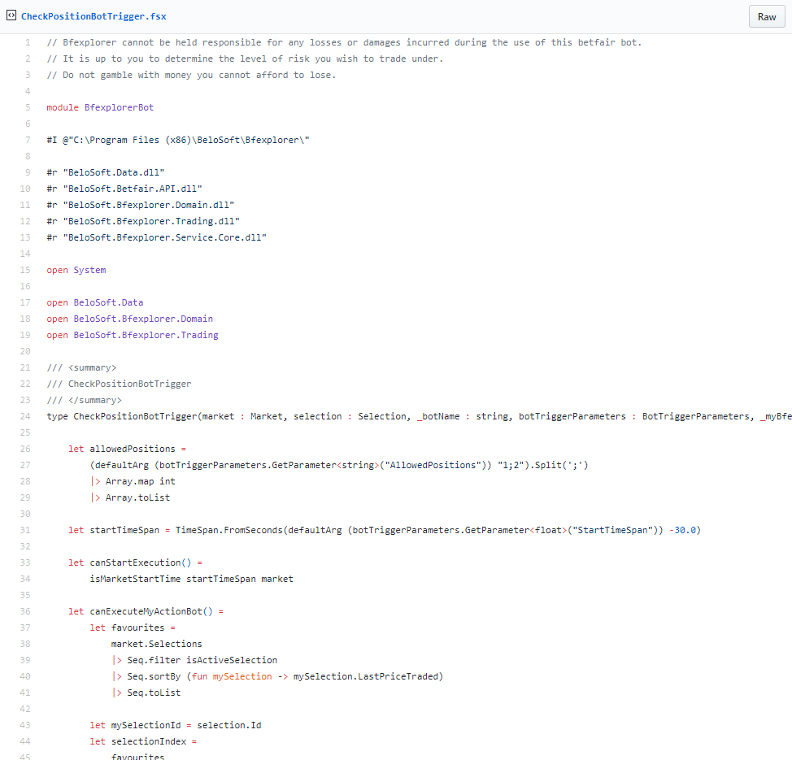

# Bfexplorer: Intorduction to automation in Bfexplorer

---
## Start automating in Bfexplorer

Bfexplorer is an application that we've just been made aware of but has some great functionality when it comes to automating strategies that may not be possible using other tools. In this article, we'll go over some of the functionalities that may appeal to those who are looking to automate their strategies. 

--- 
## Lets take a look
###- Bfexplorer Bots

Once you have started Bfexplorer and chosen a market that you're interested in, you will be able to select from a range of already created bots that are ready for you to enter specific values that you would like these to operate to. These bots can be organized to run simultaneously or successively for more intricate automations.

!!! info "Out of the box ready to go Bots"
    - Place Bet
    - Be the first in queue
    - Fill or kill
    - Close selection bet position
    - Close selection bot position at odds
    - Place bet and close selection bet position
    - Tick offset
    - Scratch trading
    - Trailing stop loss
    - Close market bet position
    - Execute on selections
    - Execute bots
    - Execute on associated market
    - Execute till target profit
    - If then else
    - Chain execution
    - Concurrent execution
    - Repeat until
    - Execute trigger bot
    - Football bot
    - Tennis bot
    - Stop market monitoring
    - Trailing stop loss on market

Like most third-party tools, Bfexplorer also includes a practice mode allows you to test your strategies without risking real money. 

---
###- Bot Executor

Bot executor is a tool that allows for any bots that you've set up to be executed at a certain time prior to a market event. 

---
###- Bfexplorer additional features

The program has a range of additional features that assist punters while automating. Users can open a web browser which can be used to look through the many examples from the Bfexplorer blog, access the community forum or browse through the Bfexplorer site, all from within the application itself. 

Bfexplorer users also have the ability to use an integrated spreadsheet functionality which can be used to record bet data from any automation that you run through the program. 

For the more tech savvy automators who may not want to fully dive into the Betfair API, Bfexplorer is an open platform that allows users to create their own plugins directly. Using F# and .Net languages, you can add any additional usability to Bfexplorer by simply placing a .fsx file into the Bfexplorer directory on your computer. This is a particularly powerful ability for users to have and is something that many other third-party tools don't include. 

---
###- Learn More

For more information on Bfexplorer, visit [their blog](http://bfexplorer.net/Community/Blog) which contains a lot of resources and examples of how to achieve different automations using their software. 

---
## What next? 

We're working through some of the popular automation tools and creating articles like this one to help you learn how to use them to implement different styles of strategies. If you have any thoughts or feedback on this article or other programs you'd like to see us explore please reach out to bdp@betfair.com.au

---
## Disclaimer

Note that whilst automated strategies are fun and rewarding to create, we can't promise that your betting strategy will be profitable, and we make no representations in relation to the information on this page. If you're implementing your own strategies, you do so entirely at your own risk and you are responsible for any winnings/losses incurred.  Under no circumstances will Betfair be liable for any loss or damage you suffer.