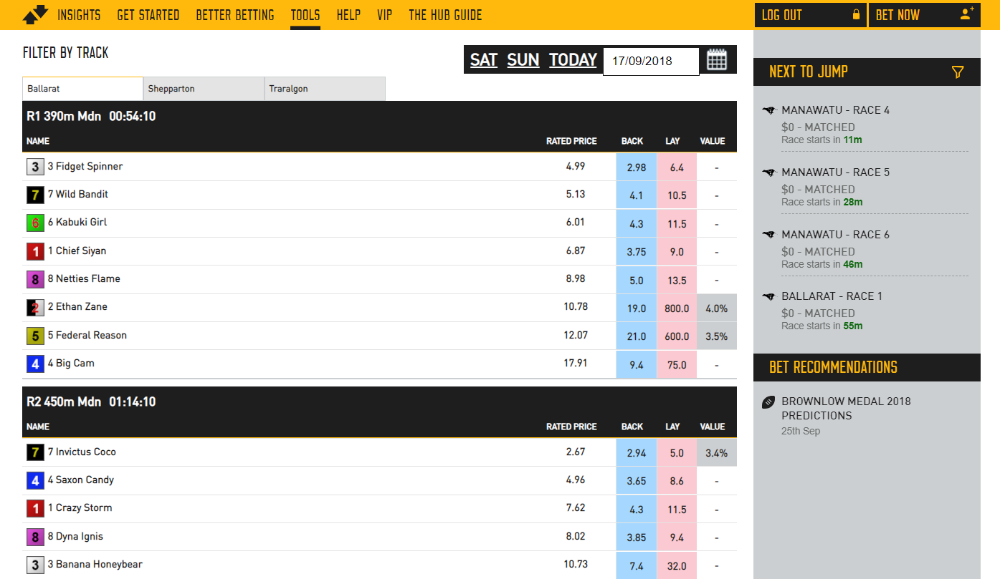
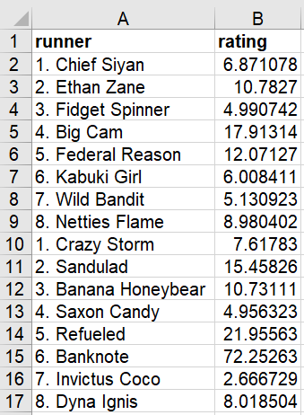
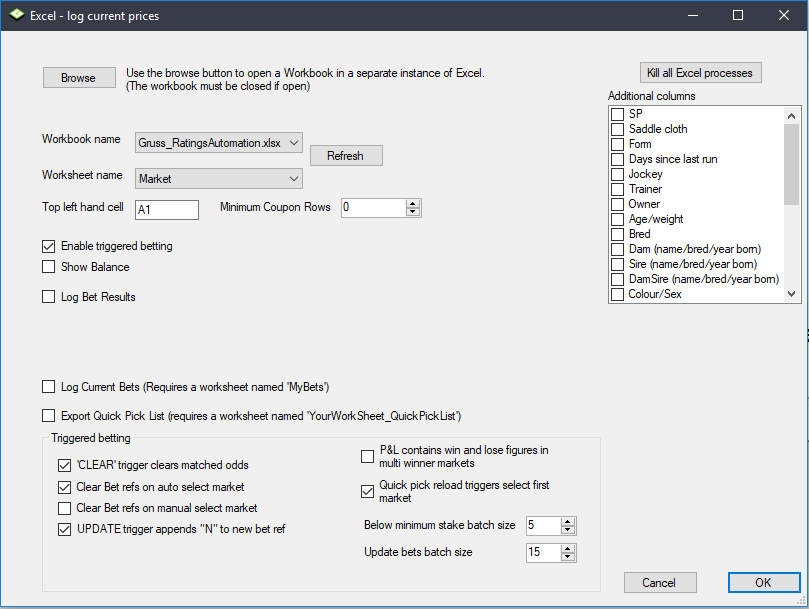

# Gruss Betting Assistant: Ratings automation

---
## Automating a ratings based strategy using Gruss Betting Assistant

Ratings are an ideal base for an automation strategy, as they're an easy metric to write a set of rule around, and are also pretty time consuming to implement manually if you're physically placing the bets yourself. 

We've previously explored using [Bet Angel Pro to implement this style of strategy](https://betfair-datascientists.github.io/thirdPartyTools/betAngelRatingsAutomation/), now we're going to use Gruss Betting Assistant to look at a different tool for automating betting on ratings. Like Bet Angel Pro, Gruss Betting Assistant also has a spreadsheet functionality that lets you place bets using your own variables and information from the live market. Gruss is a complex tool, and there are lots of different ways to use it, and we'd love any thoughts about more effective ways of implementing this sort of strategy. You're welcome to reach out to us on bdp@betfair.com.au with your feedback and opinions. 

--- 
## Lets do this
###- The plan

We're using the [Greyhound Ratings Model](https://www.betfair.com.au/hub/tools/models/greyhound-ratings-model/) put together by some of our Data Scientists. This model creates ratings for Victorian greyhound races daily and is freely available on the Hub. It's pretty good at predicting winners, so we're going to place back bets on the dogs with shorter ratings where the market price is better than the model's rating. Gruss Betting Assistant's Excel triggered betting feature has the capacity to let you create spreadsheets with pretty complicated rules that can be applied to multiple markets, which is what we've used for the automation here. 

Here we'll step through how we went about getting Gruss to place bets using [these ratings](https://www.betfair.com.au/hub/tools/models/greyhound-ratings-model/). Once it's set up the goal is to be able to upload a new set of ratings, choose your races, set the program running and be able to walk away. Obviously, you can use your own ratings and change the rules according to what your strategy is.



!!! info "Resources"
    - Ratings: [Betfair Data Scientists' Greyhound Ratings Model](https://www.betfair.com.au/hub/tools/models/greyhound-ratings-model/)
    - Rules: [here's the spreadsheet](./assets/Gruss_RatingsAutomation.xlsx) I set up with my rules included, but you'll obviously need to tweak it to suit your strategy and the format of your ratings 
    - Tool: [Gruss Betting Assistant](http://www.gruss-software.co.uk/betfair-products/betfair-betting-assistant)

---
###- Set up 

Make sure you've downloaded and installed [Gruss Betting Assistant](http://www.gruss-software.co.uk/betfair-products/betfair-betting-assistant), and signed in.


---
###- Finding & formatting ratings

Here we're using the [Betfair's Data Scientists' Greyhound Ratings Model](https://www.betfair.com.au/hub/tools/models/greyhound-ratings-model/). This makes for a bit of prep work, copying the list of runners and their rating into an Excel spreadsheet. As a minimum you'll need a list of runner names (including the runner number followed by a full stop, i.e. 1. Runner Name) in one column and their rating in another in an Excel sheet. 

If you have a list of ratings already in a spreadsheet that's even better - you'll be able to tweak the Excel formulas to work with whatever format your data is in.

Wherever your ratings come from, you'll need to include them in the spreadsheet you're using to interact with Gruss. Here we're using a [spreadsheet we've edited for this strategy](./assets/Gruss_RatingsAutomation.xlsx), and we've included a tab called RATINGS where you can copy in the runner names and ratings.



---
###- Writing a rule 

As with any automated strategy, one of the most important steps is deciding what logical approach you want to take and writing rules that suit. 

We're using a [customised version of the default Gruss template Excel sheet](./assets/Gruss_RatingsAutomation.xlsx) to implement our strategy, so it can make betting decisions based on my ratings. Excel is an excellent tool, but it can take an investment of time to be able to use it effectively. There are lots of posts on the [Gruss Forum on the topic](http://www.gruss-software.co.uk/forum/viewforum.php?f=8) if you want to explore it more yourself.

This is how we used Excel to implement our set of rules. 


###- Trigger to place bet

In short, we want to back runners when:

- the available to back price is better than the rating for that runner by a variable percentage, depending on the price
- they have a rating less than what we specify
- the scheduled event start time is less than what we specify
- the event isn't in play 

###- Using cell references to simplify formulas

Throughout this tutorial, we'll be referencing certain cells with custom names that will make it easier to understand and follow the formulas as we progress. This is an especially effective method to
keep on top of more complex strategies that require long formaulas to implement.
 
!!! info "Cell names used in this tutorial"
     - **MyRatings** refers to the entire Column B in the Ratings worksheet

     - **MyRunners** refers to the entire column A in the Ratings worksheet

     - **OddsMultiplier** refers to the table in the Settings worksheet (C11 to D17)

     - **CurrentBMP** refers to cell AC4 in the Market worksheet where the overrounds are calculated

     - **BMP** refers to cell E3 in the RATINGS worksheet which allows you to change a single value that will automatically update the formulas for all runners

     - **TimeTillJump** refers to cell E3 in the Settings work sheet 

     - **MyTime** refers to cell E4 in the RATINGS worksheet which allows you to change a single value that will automatically update the formulas for all runners

     - **NotInPlayCheck** refers to cell E2 in the Market worksheet. Gruss will populate a status in this cell such as "In Play"

     - **MarketStatus** refers to cell F2 in the Market worksheet. Gruss will populate a status in this cell such as "Suspended"

     - **RatingThreshold** refers to cell E5 in the RATINGS worksheet which allows you to change a single value that will automatically update the formulas for all runners


**This is our trigger on Excel formula:**

``` excel tab="Multi line"
=IF(
    AND(
        F5 > (INDEX(MyRatings,MATCH(A5,MyRunners,0))*VLOOKUP(INDEX(MyRatings,MATCH(A5,MyRunners,0)),OddsMultiplier,2)),
        INDEX(MyRatings,MATCH(A5,MyRunners,0)) < RatingThreshold,
        TimeTillJump < MyTime,
        CurrentBMP < BMP,
        NotInPlayCheck="Not In Play",
        MarketStatus<>"Suspended"),
    "BACK",
"")

```

``` excel tab="Single line"
=IF(AND(F5 > (INDEX(MyRatings,MATCH(A5,MyRunners,0))*VLOOKUP(INDEX(MyRatings,MATCH(A5,MyRunners,0)),OddsMultiplier,2)),INDEX(MyRatings,MATCH(A5,MyRunners,0)) < RatingThreshold,TimeTillJump < MyTime,CurrentBMP < BMP,NotInPlayCheck="Not In Play",MarketStatus<>"Suspended"),"BACK","")
```

Stepping through each step:

- **Price > rating:** check whether the available to back price is better than the runner's rating multiplied by a percentage - We do this by using the runner name in column A and looking up the corresponding rating for that runner from the RATINGS sheet. 

**Percentage offset:** There are lots of different approaches you can take to this. We're using a variable percentage offset, which is the same approach we took in [Bet Angel article implementing this same strategy](https://betfair-datascientists.github.io/thirdPartyTools/betAngelRatingsAutomation/), as we appreciate that we might want a different percentage better than the rating, depending on the price - i.e. 10% better than $2 ($2.20) is very different than 10% better than a $20 shot ($22.20), so here we're using a vlookup table to determine the percentage better than the rating that we want based on the current odds. Here are the 'ranges' of prices to percentage offset that we're using - you can disregard this and just change it to be a set percentage (i.e. *1.1 hardcoded into the formula) or just use your rating straight without an offset, or edit the ranges in the SETTINGS tab to suit your opinions. This table takes the 'min' odds for the range in the left column, and the number you want to multiply the odds by in the right column - so for 15% you'd multiply by 1.15 etc. 

**Viewing your values:** We've added columns (Y:AB) to show the rating, percentage offset and minimum acceptable odds for each runner, to add some reassurance that the spreadsheet is pulling the values we want it to.

ODDS RANGE | % MULTIPLIER
:-------|:-----------------------
1 - 6   | 1.1 (10%)
6 - 9	| 1.15 (15%)
9 - 15	| 1.2 (20%)
15 - 20	| 1.3 (30%)
20 - 35	| 1.4 (40%)
35 +	| 1.5 (50%)

``` excel hl_lines="3"
=IF(
    AND(
        F5 > (INDEX(MyRatings,MATCH(A5,MyRunners,0))*VLOOKUP(INDEX(MyRatings,MATCH(A5,MyRunners,0)),OddsMultiplier,2)),
        INDEX(MyRatings,MATCH(A5,MyRunners,0)) < RatingThreshold,
        TimeTillJump < MyTime,
        CurrentBMP < BMP,
        NotInPlayCheck="Not In Play",
        MarketStatus<>"Suspended"),
    "BACK",
"")
```

!!! info "Updating references to suit your ratings format"
    If your ratings are formatted differently to our simple runner **name | rating** layout you can easily edit the formula to refence the relevant column directly, instead of changing your ratings to fit the formula. 
    Let's say your ratings sheet is set out like this: **race date | venue | runner name | last race time | weight | rating** 
    
    Here's the set up of the formula:
    
    ```RATINGS!B:B[your rating],MATCH(A5,RATINGS!A:A[runner name],0))```

    So your edited formula would be:

    ```RATINGS!F:F,MATCH(A5,RATINGS!C:C,0))```

    You need to make sure that you updated these references both in the this part of the formula, and in the next step too.  

- **Rating < 5:** check whether the runner's rating is less than what we specify in cell E5 in the RATINGS worksheet (because I only want to bet on the favourite few runners)

``` excel hl_lines="4"
=IF(
    AND(
        F5 > (INDEX(MyRatings,MATCH(A5,MyRunners,0))*VLOOKUP(INDEX(MyRatings,MATCH(A5,MyRunners,0)),OddsMultiplier,2)),
        INDEX(MyRatings,MATCH(A5,MyRunners,0)) < RatingThreshold,
        TimeTillJump < MyTime,
        CurrentBMP < BMP,
        NotInPlayCheck="Not In Play",
        MarketStatus<>"Suspended"),
    "BACK",
"")
```

- **Time < what we specify** check whether the seconds left on the countdown are smaller than what we specify in cell E4 in the RATINGS worksheet, as the majority of markets don't fully form until the last few minutes before the off. I've taken the countdown in D2 (which is in hours, minutes, seconds) and turned it into a second countdown on the settings sheet, for simplicity's sake.

``` excel hl_lines="5"
=IF(
    AND(
        F5 > (INDEX(MyRatings,MATCH(A5,MyRunners,0))*VLOOKUP(INDEX(MyRatings,MATCH(A5,MyRunners,0)),OddsMultiplier,2)),
        INDEX(MyRatings,MATCH(A5,MyRunners,0)) < RatingThreshold,
        TimeTillJump < MyTime,
        CurrentBMP < BMP,
        NotInPlayCheck="Not In Play",
        MarketStatus<>"Suspended"),
    "BACK",
"")
```

- **BMP < what we specify** checking whether the event overrounds are less than the specific value that can be changed from cell E3 in the RATINGS tab

``` excel hl_lines="6"
=IF(
    AND(
        F5 > (INDEX(MyRatings,MATCH(A5,MyRunners,0))*VLOOKUP(INDEX(MyRatings,MATCH(A5,MyRunners,0)),OddsMultiplier,2)),
        INDEX(MyRatings,MATCH(A5,MyRunners,0)) < RatingThreshold,
        TimeTillJump < MyTime,
        CurrentBMP < BMP,
        NotInPlayCheck="Not In Play",
        MarketStatus<>"Suspended"),
    "BACK",
"")
```

- **Not in play:** checking whether the event has gone in play - as odds change so much in the run, we only want to use this strategy pre-play. We're checking two cells here, to make sure to make sure the market's not in play and also not suspended - suspended shouldn't be an issue except it will cause the program to produce errors. We appreciate that greyhound races don't go in play, but we wanted this check in place anyway in case we (or you!) wanted to use a version of this strategy on horse racing in the future. 

``` excel hl_lines="7 8"
=IF(
    AND(
        F5 > (INDEX(MyRatings,MATCH(A5,MyRunners,0))*VLOOKUP(INDEX(MyRatings,MATCH(A5,MyRunners,0)),OddsMultiplier,2)),
        INDEX(MyRatings,MATCH(A5,MyRunners,0)) < RatingThreshold,
        TimeTillJump < MyTime,
        CurrentBMP < BMP,
        NotInPlayCheck="Not In Play",
        MarketStatus<>"Suspended"),
    "BACK",
"")
```

- **Result:** if the statement above is true, the formula returns "BACK", at which point the bet will trigger, otherwise the cell will remain blank and no bet will be placed.

``` excel hl_lines="9 10"
=IF(
    AND(
        F5 > (INDEX(MyRatings,MATCH(A5,MyRunners,0))*VLOOKUP(INDEX(MyRatings,MATCH(A5,MyRunners,0)),OddsMultiplier,2)),
        INDEX(MyRatings,MATCH(A5,MyRunners,0)) < RatingThreshold,
        TimeTillJump < MyTime,
        CurrentBMP < BMP,
        NotInPlayCheck="Not In Play",
        MarketStatus<>"Suspended"),
    "BACK",
"")
```

!!! info "Excel functions"

    - [IF statement:](https://support.office.com/en-us/article/if-function-69aed7c9-4e8a-4755-a9bc-aa8bbff73be2) IF(if this is true, do this, else do this)
    - [AND statement:](https://support.office.com/en-us/article/and-function-5f19b2e8-e1df-4408-897a-ce285a19e9d9) AND(this is true, and so is this, and so is this) - returns true or false
    - [VLOOKUP:](https://support.office.com/en-us/article/vlookup-function-0bbc8083-26fe-4963-8ab8-93a18ad188a1) looking up a value from a table based on the value you pass in
    - [Absolute references:](https://support.office.com/en-us/article/switch-between-relative-absolute-and-mixed-references-dfec08cd-ae65-4f56-839e-5f0d8d0baca9) if you're copy/pasting formulas it's important that you make links absolute when you don't want the cell being referenced to change relative to the new cell the formula is being pasted into. You do this by putting a $ in front of the parts of the reference you don't want to 'move'. 

---
###- Preparing the spreadsheet

You need to copy/paste these three formulas into the relevant cell on each runner - we did a few extra rows than the number of runners in the markets we were looking at, just in case the fields are bigger in future events. Excel is clever enough to automatically update the relative links in the formulas, so you should be able to copy/paste the same formula into each cell as long as you've got your [relative and absolute references straight](https://support.office.com/en-us/article/switch-between-relative-absolute-and-mixed-references-dfec08cd-ae65-4f56-839e-5f0d8d0baca9). 

- **Trigger bet rule:** this is the bet trigger Excel formula we created earlier, and it needs to go in column Q (Q5 for the first runner).

``` excel tab="Multi line"
=IF(
    AND(
        F5 > (INDEX(MyRatings,MATCH(A5,MyRunners,0))*VLOOKUP(INDEX(MyRatings,MATCH(A5,MyRunners,0)),OddsMultiplier,2)),
        INDEX(MyRatings,MATCH(A5,MyRunners,0)) < RatingThreshold,
        TimeTillJump < MyTime,
        CurrentBMP < BMP,
        NotInPlayCheck="Not In Play",
        MarketStatus<>"Suspended"),
    "BACK",
"")
```

``` excel tab="Single line"
=IF(AND(F5 > (INDEX(MyRatings,MATCH(A5,MyRunners,0))*VLOOKUP(INDEX(MyRatings,MATCH(A5,MyRunners,0)),OddsMultiplier,2)),INDEX(MyRatings,MATCH(A5,MyRunners,0)) < RatingThreshold,TimeTillJump < MyTime,CurrentBMP < BMP,NotInPlayCheck="Not In Play",MarketStatus<>"Suspended"),"BACK","")
```


- **Odds:** initially we were using the runner's rating as the price, but we got a bet placement error for some of the selections - eventually we realised that the odds the bet's being placed at need to be [valid Betfair 'ticks'](https://docs.developer.betfair.com/display/1smk3cen4v3lu3yomq5qye0ni/placeOrders#placeOrders-BetfairPriceIncrements). For simplicity's sake we're now just using the currently available back odds (cell F5 for the first runner). This goes in column R (R5 for the first runner). Another option would be to create a look up table that rounded your rating to the nearest ['tick' price](https://docs.developer.betfair.com/display/1smk3cen4v3lu3yomq5qye0ni/placeOrders#placeOrders-BetfairPriceIncrements) - if you do this, please do [send us](mailto:bdp@betfair.com.au) through your formula and we'll add it to this article.

```=IF(F5=0,"",F5)```


- **Stake:** it's completely up to you what staking approach you want to take. We've kept it simple, and am just using a 'to win' strategy. Each bet aims to win $10 on that runner at the curret odds. The formula divides $10 by the current available best back odds (cell R5 for the first runner) minus one to get the stake required to win $10. We've then used the ROUND function to make sure we get a valid stake size that won't be rejected by the Exchange. This goes in column S (S5 for the first runner). We've got some [good resources on the Hub](https://www.betfair.com.au/hub/better-betting/betting-principles/basic-principles/staking-plans-and-strategies/) that look at different staking approaches - these might be useful in helping you decide which strategy you want to use. 

```=IF(ROUND(10/(F5-1),2)=-10,"",ROUND(10/(F5-1),2))```


---
###- Selecting markets

Gruss makes it really easy to select markets in bulk. You could go through an add each market you have in your ratings individually, but it's much easier to just use the quick Pick functionality to add all Australian racing win markets. This is safe, because bets will only fire when they link up with a runner in your RATINGS sheet. 


You also need to make sure you set it up so that the program will automatically move on to the next market, when the previous one jumps.


---
###- Linking the spreadsheet

This is a little tricky the first time, but easy once you know how. Make sure you have the [Excel sheet](./assets/Gruss_RatingsAutomation.xlsx) saved to your local computer - when we tried using a file we had saved in OneDrive it simply didn't work. Open the Excel sheet, then click on Excel/Log current prices. 


It will autofill the workbook and sheet names. You'll then need to make sure you tick:

- Enable triggered betting
- Clear Bet refs on auto select market
- Quick pick reload triggers select first market

Then click OK and the sheet with be linked with the program. 



---
## And you're set!

Once you've set your spreadsheet set up and you're comfortable using Gruss Betting Assistant it should only take a number of seconds to load your markets and ratings up and set your strategy running for the day. Just make sure you have all of the app settings correctly selected before you leave the bot to run, as some of them reset by default when you turn the program off.

!!! info "Note:" 
    you will need to leave your computer up and running for the duration of the chosen markets, as the program needs the computer to be 'awake' to be able to run.
    
---
## Areas for improvement

There are parts of this approach that we're still trying to get to work to our liking, and we'll update this article as we find better solutions. If you have any suggestions for improvements please reach out to bdp@betfair.com.au - we'd love to hear your thoughts. 

For example, the spreadsheet only binds with one market at a time, so if one market gets delayed and runs overtime the program won't be able to move on to the next market - we missed some races because of this. 

---
## What next? 

We're working through some of the popular automation tools and creating articles like this one to help you learn how to use them to implement different styles of strategies. If you have any thoughts or feedback on this article or other programs you'd like to see us explore please reach out to bdp@betfair.com.au 

---
## Disclaimer

Note that whilst automated strategies are fun and rewarding to create, we can't promise that your betting strategy will be profitable. If you're implementing your own strategies, please gamble responsibly and note that you are responsible for any winnings/losses incurred.