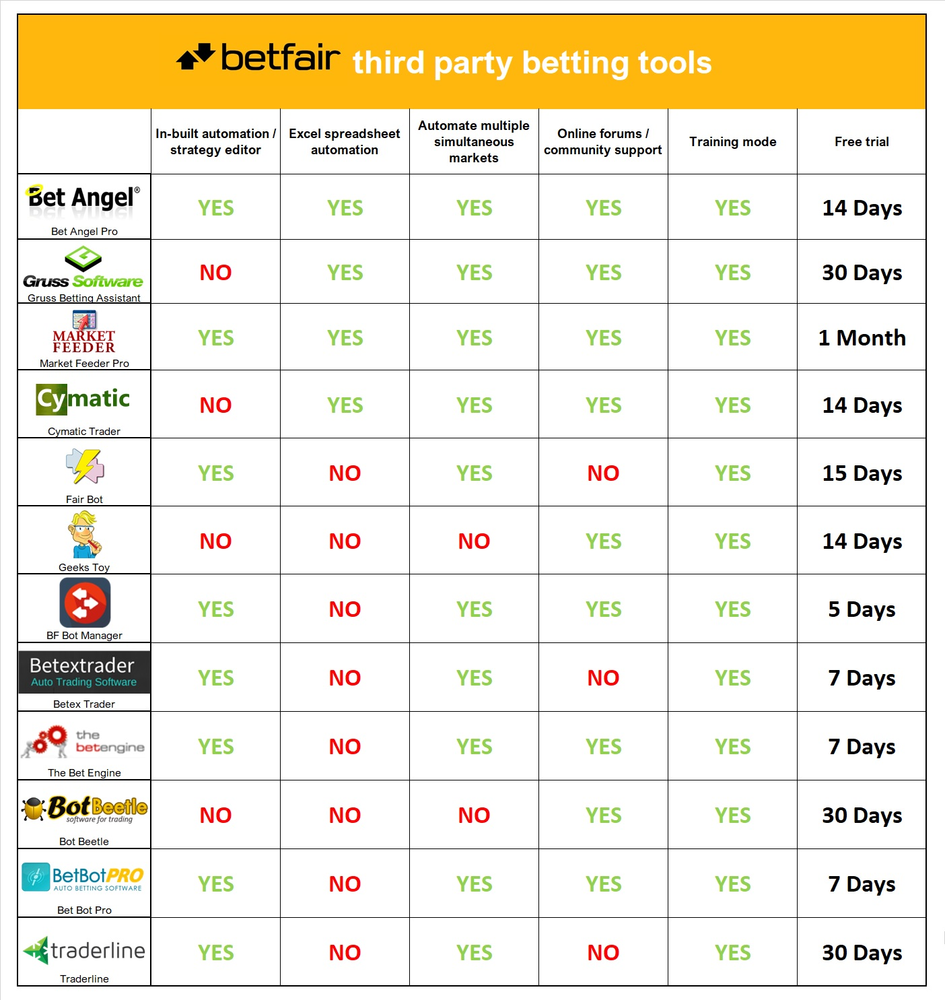

# Third party tools overview

There are many third party applications that can be used in conjunction with Betfair which can help improve your interactions with the Exchange from more detailed live information from selected markets to automating your strategies.

If you haven’t before used a third-party betting tool, below is a quick guide which will give you an idea of which tool may be best suited to your needs

On the left hand navigation menu, we will provide examples of different basic strategies and how they can be implemented into various tools listed above. These are separated by how the automation is integrated into that particular tool. (Excel) for tutorials that utilize Excel spreadsheets to automate a strategy and (Rules) for tutorials that focus on automation strategies using the applications rule editor. 

If you have any suggestions for new tutorials / improvements please reach out to bdp@betfair.com.au - We'd love to hear your thoughts and feedback. 

---
# Links to third party Tools

[Bet Angel Pro](https://www.betangel.com/) // [Gruss](https://www.gruss-software.co.uk/) // [Market Feeder](https://marketfeeder.co.uk/) // [Cymatic Trader](http://www.cymatic.co.uk/) // [Fairbot](https://binteko.com/fairbot) // [Geeks Toy](http://www.geekstoy.com/en/download) // [BF Bot Manager](https://www.bfbotmanager.com/) // [BetExTrader](https://www.betextrader.com/) // [The BetEngine](https://www.thebetengine.co.uk/) // [Bot Beetle](https://botbeetle.com/) // [Bet Bot Pro](www.betbotpro.com/) // [Traderline](https://traderline.com/)

---
# Disclaimer

Note that whilst we create tutorials for third party applications for educational use, Betfair do not own or have any control over how third party applications are created, developed and maintained. If you use any of the above third party applications, please gamble responsibly and note that you are responsible for any winnings/losses incurred.