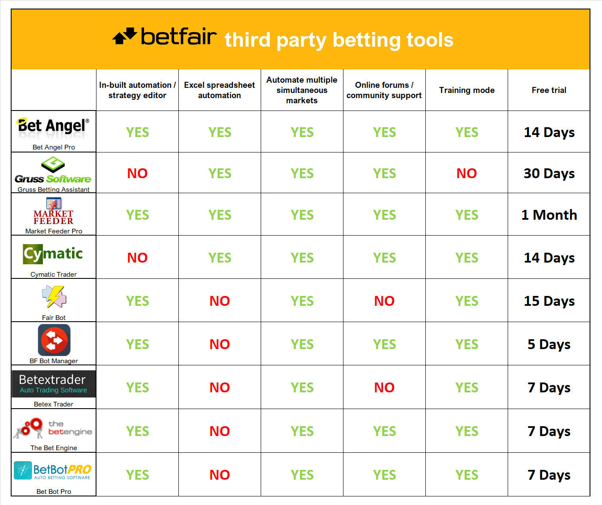

# Third party tools overview

There are many third party applications that can be used in conjunction with Betfair which can help improve your interactions with the Exchange from more detailed live information from selected markets to automating your strategies.

If you haven’t before used a third-party betting tool, below is a small overview of each program

If you have any suggestions for new tutorials / improvements please reach out to bdp@betfair.com.au - We'd love to hear your thoughts and feedback. 

---
# Links to third party Tools

[Bet Angel Pro](https://www.betangel.com/) // [Gruss](https://www.gruss-software.co.uk/) // [Market Feeder](https://marketfeeder.co.uk/) //  [Bfexplorer](http://bfexplorer.net/) // [Cymatic Trader](http://www.cymatic.co.uk/) // [BF Bot Manager](https://www.bfbotmanager.com/)

---
# Disclaimer

Note that whilst automated strategies are fun and rewarding to create, we can't promise that your betting strategy will be profitable, and we make no representations in relation to the information on this page. If you're implementing your own strategies, you do so entirely at your own risk and you are responsible for any winnings/losses incurred.  Under no circumstances will Betfair be liable for any loss or damage you suffer.

