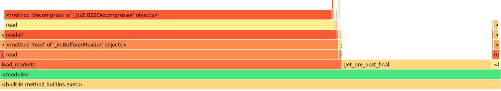

# JSON to CSV | Revisited
---

!!! note "Before you start"

    This tutorial follows on from our [previous JSON to CSV tutorial](../jsonToCsvTutorial.md) where we stepped through how to work with the historic recordings of Betfair's price data. You should make sure you read that first before continuing here! 

So we're nearly a year on from our original [JSON to CSV tutorial](../jsonToCsvTutorial.md), and while it was generally well received a very common (and fair!) complaint was how long it took the script to run. Many people said that it could take all day, or they had to leave their PC on over night to finish, which obviously makes the data processing and back testing process a lot less accessible, which was the whole point of the original article. So we're circling back around to see what we can do to decrease the running time and to make working with larger samples of data less of an all day affair. 

You might want to stick around, because the final results are really something. 

!!! note "Cheat sheet"
    - If you're looking for the complete code [head to the bottom of the page](https://betfair-datascientists.github.io/historicData/jsonToCsvRevisited/#completed-code) or [download the script from Github](https://github.com/betfair-down-under/autoHubTutorials/tree/master/jsonToCsvRevisited).

    - To run the code, save it to your machine, open a command prompt, or a terminal in your text editor of choice (we're using [VS code](https://code.visualstudio.com/download)), make sure you've navigated in the terminal to the folder you've saved the script in and then type `py main.py` (or whatever you've called your script file if not main) then hit enter. To stop the code running use Ctrl C. 

    - Make sure you amend your data path to point to your data file. We'll be taking in an input of a historical tar file downloaded from the [Betfair historic data site](https://historicdata.betfair.com/#/help). We're using a PRO version, though the code should work on ADVANCED too. This approach won't work with the BASIC data tier. 

    - We're using the  [`betfair_data`](https://github.com/tarb/betfair_data) package to do the heavy lifting; it's a Python library with a Rust backend, which makes it incredibly fast (spoiler alert!)

---
## Let's get a baseline
So how slow are we talking? Let's pick some data and run our script as it is from our last tutorial and see how long it takes. We'll be using 3 months worth of PRO Australian Racing data, from October to December 2021, as the basis for this benchmark and our other tests going forward.

```py title="Files used through this article"
market_paths = [
    "data/2021_10_OctRacingAUPro.tar",
    "data/2021_11_NovRacingAUPro.tar",
    "data/2021_12_DecRacingAUPro.tar",
]
```

Now let's run the [OG script](https://github.com/betfair-down-under/autoHubTutorials/blob/master/jsonToCsv/main.py) and time how long it takes with the terminal command below:

```console title="Terminal"
gtime python json2csv.py

9665.79user 18.27system 2:41:26elapsed 99%CPU (0avgtext+0avgdata 96624maxresident)k
0inputs+0outputs (405major+10862minor)pagefaults 0swaps

```
... oof. This took a while: ```2h 41m 26s``` to be precise. 

This is less 'run to the kitchen and grab a cup of coffee' and more 'head to the pub and settle in for the night' territory, and thats on a new, very fast, MacBook Pro... if you have an older pc you should expect this to take significantly longer again.

But *is* this actually slow? Let's count up how many files there are in our TAR archives, and then how many lines in each of the files, with each line being an update to a market, to give us an ideal of the scale of data we're dealing with:

```Markets: 22,001 | Updates: 166,677,569```

Each update can effect any or all of the runners in a market, and, to be fair, we are keeping track of a sizeable amount of data for each runner, including all the prices and volumes available in both back and lay ladders, all the money matched at every price point, the money in the BSP pools at each limit, plus a lot more... how much faster can we really expect this to run?

---
## RTFM (Read the *** manual)

The `betfairlightweight` library is doing all the computationally heavy lifting in our script, and speeding it up even slightly could save us a lot of total run time, so we figured we should probably take a look online to see if there were known ways of speeding it up. 

Whoops. [There is a page addressing performance](https://liampauling.github.io/betfair/advanced/#performance) on the `betfairlightweight` docs discussing how to speed up parsing historic files. Although we were pretty upfront in our initial tutorial about our lack of Python coding ability, that's not an excuse for us to not read the instructions...

Let's implement these changes and see if that's enough to let us keep this article to just a couple of paragraphs!

Firstly, let's install the speed version of betfairlightweight; it says we should have this by default on Mac but there's no harm in checking anyway.

```console title="Terminal"
pip install 'betfairlightweight[speed]'
```

There's some quick and easy code changes to throw in as well while we're at it:

```py title="Performance parameters" hl_lines="6 7 8 9"
# create trading instance (don't need username/password)
trading = betfairlightweight.APIClient("username", "password", "appkey")

# create listener
listener = betfairlightweight.StreamListener(
    max_latency=None,  # ignore latency errors
    output_queue=None,  # use generator rather than a queue (faster)
    lightweight=True,  # lightweight mode is faster
    update_clk=False,  # do not update clk on updates (not required when backtesting)

    # We need these as were using historic files
    cumulative_runner_tv=True,  
    calculate_market_tv=True
)
```

Okay, so let's give it a go with these changes:

```console title="Terminal"
python json2csv.py      
Traceback (most recent call last):
  File "xxx/json2csv.py", line 162, in <module>
    (preplay_market, postplay_market, final_market) = get_pre_post_final(stream)
  File "xxx/json2csv.py", line 146, in get_pre_post_final
    if eval_market is None and ((eval_market := filter_market(market_book)) == False):
  File "xxx/json2csv.py", line 104, in filter_market
    d = market.market_definition
AttributeError: 'dict' object has no attribute 'market_definition'
```
... and now it's broken. Taking another look at the docs reveals the culprit to be ```lightweight=True``` which makes the library skip parsing into objects and returns the raw JSON in dicts instead. This reportedly has a decent speed increase, but will come with some pretty significant usability constraints which undermines the point of the tutorial, and we would also need to rewrite our whole script. Let's just set that back to false ```lightweight=False```, and see how much performance we gain from the other changes.

```console title="Terminal"
gtime python json2csv.py  

9716.23user 39.08system 2:42:44elapsed 99%CPU (0avgtext+0avgdata 106784maxresident)k
0inputs+0outputs (80major+11965minor)pagefaults 0swaps

```
... so that's basically the same. Without switching to the slightly faster, but significantly harder to use ```lightweight``` mode, this may be the best we are going to get from `betfairlightweight` in this context. 

It's worth noting here that `betfairlightweight` is a Python library, written predominantly in Python (more on this in a minute). Looking at this execution through a profiler, we can see the vast majority of our time (> 90%) is spent in parsing and creating objects. The only other significant time was a relatively small (~4%) amount spent both reading the file from disk and decompressing the data.

=== "Betfairlightweight"

    

Python sits in a peculiar space as both a very fast and simlutaneously very slow programming language. When your program is spending most of its time running slow interpreted Python code it can be one of the slowest languages around - much slower then many other popular languages. Having said that though, there is a good chance if you're working in Python that a lot of your program isn't actually written in Python, but is instead written in a very fast systems language like C, C++ or Rust; much of the Python standard library, and many popular libraries like numpy, scipy and tensorflow are all examples of this. In these cases when Python is just acting as glue between code written in lower, faster languages a Python program can actually be really fast. 

This leaves us with two paths: stay with `betfairlightweight` and try and optimise the performance up to a sufficiently faster level, or rewrite the portion of `betfairlightweight` that handles parsing the JSON stream files in a much faster language and expose that back to Python as a new library. It is worth noting that `betfairlightweight` is not a new library - it's been around for a good period of time and has been actively developed enough that the chance of us finding some ground breaking optimisations that could dramatically speed up performance is low, and we would ideally like to see a very large performance increase to move the dial on our original numbers. 

So we took the path less travelled. And that made all the difference. 


---
## RIIR (Rewrite it in Rust)

So we've chosen path two: write a new, faster library. I've been playing round in Rust for the last few years - it's a great, modern, and extremely fast language, with a well-loved mascot (hi Ferris!), but most importantly we know it has really great support for writing fast Python libraries. If this was a movie this is where they would show a montage of us staying up late, chugging coffee, and tapping away at our keyboards, but I'll save you that and instead just give you a [link to our new library, betfair_data](https://github.com/tarb/betfair_data). Quite a bit of effort has gone into making this library as fast as we can, and if there's interest we might write a follow up article that discusses the techniques we used to increase it's speed - let us know if you're keen for that - but for the purpose of this discussion the internals of the library don't really matter.

To use our library we'll only need to make a few small changes to our script. You can [jump ahead and see the completed file](https://betfair-datascientists.github.io/historicData/jsonToCsvRevisited/#complete-code) for this stage, but we'll walk through the main changes step by step below.

We need to start by importing the new library - it's available in pypi and can be easily installed with pip.

```console title="Terminal"
pip install betfair_data
```

```py title="Import the new library"
from betfair_data import PriceSize
from betfair_data import bflw
```

We'll also need to update our `load-markets` function to return the bytes of the file, instead of the file object itself. This saves us the complexity of having to make our library know how to read Python files.

```py title="Change load_markets function" hl_lines="6 7 15 16 21 22"
def load_markets(file_paths: List[str]):
    for file_path in file_paths:
        if os.path.isdir(file_path):
            for path in glob.iglob(file_path + '**/**/*.bz2', recursive=True):
                with bz2.BZ2File(path, 'rb') as f:
                    bytes = f.read()
                    yield (path, bytes) 
        elif os.path.isfile(file_path):
            ext = os.path.splitext(file_path)[1]
            # iterate through a tar archive
            if ext == '.tar':
                with tarfile.TarFile(file_path) as archive:
                    for file in archive:
                        file = file.name
                        bytes = bz2.open(archive.extractfile(file)).read()
                        yield (file, bytes)
            # or a zip archive
            elif ext == '.zip':
                with zipfile.ZipFile(file_path) as archive:
                    for file in archive.namelist():
                        bytes = bz2.open(archive.open(file)).read()
                        yield (file, bytes)
```

Then we just need to use these values, passing them to our new library in a similar way to how we previously passed the data to `betfairlightweight`.

```py title="iterate over bflw.BflwIter" hl_lines="1 9"
for file, bytes in load_markets(market_paths):

    def get_pre_post_final():
        eval_market = None
        prev_market = None
        preplay_market = None
        postplay_market = None       

        for market_books in bflw.BflwIter(file, bytes):
            for market_book in market_books:
                # if market doesn't meet filter return out
                if eval_market is None and ((eval_market := filter_market(market_book)) == False):
                    return (None, None, None)

                # final market view before market goes in play
                if prev_market is not None and prev_market.inplay != market_book.inplay:
                    preplay_market = prev_market

                # final market view at the conclusion of the market
                if prev_market is not None and prev_market.status == "OPEN" and market_book.status != prev_market.status:
                    postplay_market = market_book

                # update reference to previous market
                prev_market = market_book

        return (preplay_market, postplay_market, prev_market) 
```

---
## Testing it out

```console title="Terminal"
gtime python json2csv_bfd.py

628.52user 23.37system 10:52.03elapsed 99%CPU (0avgtext+0avgdata 730080maxresident)k
0inputs+0outputs (0major+46267minor)pagefaults 0swaps
```  

Not bad! ```10m 52s``` - that's roughly a 93% reduction in run time, and nicely in the range we hoped to achieve. We *could* stop here, having happily achieved our goals. But can we go **even faster?**

Loading up the profiler again shows us some interesting results.

=== "Rust Library"

    

=== "Betfairlightweight"

    


The work seems to be divided into two main areas. On the left you can see `load_markets` making up about ~70% of the computation time, and the parsing (`get_pre_post_final`) comprising the majority of the remaining.

Interestingly, we've now sped up our parsing and object creation so much that it no longer comprises the majority of the workload of our script. Looking back at the `betfairlightweight` example from our original implementation we can see that the parsing took up a touch over 90% of the run time, while reading and decompressing the files only took only ~4%. Now because our parsing and object creation is so much faster, that same decompressing work that was previously only a small fraction is the vast majority of our workload! 

This split work loads highlights another opportunity. Unlike the JSON parsing, which needs to interact closely with the Python environment to create new objects and merge data, the process of reading and decompressing the files can be completed completely isolated and can therefor take place concurrently in another thread. 

A simple visualisation of our current workload can be seen in the chart below, where between each parsing workload we need to load and decompress the file. 


However if we were to move the file loading and decompression process to another thread we could free up the main Python thread to just spend its time on the JSON parsing, object creation, merging values and execution of our script. Essentially our worker thread would load and decompress the file and free up the main Python thread to complete the tasks that can only run on there.


---
## Gotta go fast

This version only has a few additional code changes to the previous `betfair_data` example - we'll be removing the ```load_markets``` generator function from the previous script, and will replace it with a call to a new Rust function that we have added to our library. Now the ```betfair_data.TarBz2``` function is doing all the heavy lifting. It creates its only thread, loads the files, decompresses them if needed and buffers them for the main Python thread to take as needed.

```py title='Loading the files in a seperate thread' hl_lines="1 8"
for file in betfair_data.TarBz2(market_paths).bflw():
    def get_pre_post_final():
        eval_market = None
        prev_market = None
        preplay_market = None
        postplay_market = None       

        for market_books in file:
            for market_book in market_books:

```

Now we can run it again as usual.

```console title="Terminal"
gtime python json2csv_bfd_Rustsrc.py
746.42user 18.94system 5:20.07elapsed 239%CPU (0avgtext+0avgdata 887264maxresident)k
0inputs+0outputs (0major+72557minor)pagefaults 0swaps
```

Down to ```5m 20s```, an over 100% improvement again! Realistically though it's probably better to think of this change as a reduction of a fixed amount of work, as opposed to a doubling of performance. We are removing the loading and decompressing workload from the main thread, and in all fairness, we could take this exact same approach to the original `betfairlightweight` solution and expect to save roughly the same amount of time, ```5mins``` (from ```2h 41m``` to ```2h 36m```). 

When this workload is the majority of the computation time, this optimisation feels necessary, but much less so when it represents only a small fraction of the total run time.

Loading up the profiler, we can see that our flamegraph has gotten pretty bare. There's not much Python code left anymore, and what is left is truly just acting as glue between fast systems libraries to join them together and retrieve our result. Future optimisations will probably need to happen inside our new library, but whilst there are probably some performance gains to be found, we'll be unlikely to achieve anywhere near the scale of the speed increase we've already made.

=== "Rust Library, threaded loading"

    

=== "Rust Library, Python loading"

    

=== "`Betfairlightweight`"

    


---
## Validating our results
All of this effort measuring speed, and we haven't actually stopped to look at our output! Getting an answer quickly is only useful if we actually get the right answer, so let's run some comarisons between our original output and the output of the new library.

All of the outputted CSV files are ```52,483``` lines long, which is definitely a good start. We do need to go deeper though to make sure the values in every row are the same - we have essentially rewritten all the complex data handling logic so small differences in the output are to be expected.

Luckily as CSV files are just plain text we can check the outputs of each line using ```diff```:

```console title="Terminal"
diff output_bfd.csv output_bflw.csv  

12845c12845
< 1.189493358,2021-10-23 07:50:00,AU,Ascot,R6 1200m Hcap,27445569,3. Puli,REMOVED,50.00,,,,32.00,0.00,,,,32.00,
---
> 1.189493358,2021-10-23 07:50:00,AU,Ascot,R6 1200m Hcap,27445569,3. Puli,REMOVED,,,,,32.00,0.00,,,,32.00,

30267,30273c30267,30273
< 1.191109876,2021-11-20 06:22:00,AU,Roma,R5 1640m Hcap,41321391,2. Salazar,REMOVED,4.10,1.35,4.40,3.69,2.86,4143.99,3.95,23.00,4.25,23.00,54.35
< 1.191109876,2021-11-20 06:22:00,AU,Roma,R5 1640m Hcap,26736210,3. Maximum Hustle,REMOVED,3.53,3.30,400.00,7.29,32.00,5906.40,3.20,4.60,3.68,4.00,327.63
< 1.191109876,2021-11-20 06:22:00,AU,Roma,R5 1640m Hcap,21188968,4. The Kroc,REMOVED,18.56,6.40,30.00,18.59,24.00,267.17,1.17,20.00,17.96,1.17,27.40
< 1.191109876,2021-11-20 06:22:00,AU,Roma,R5 1640m Hcap,40459277,5. Buddie Ollie,REMOVED,3.50,2.20,18.00,3.43,18.00,7277.99,3.35,4.60,3.50,4.50,79.99
< 1.191109876,2021-11-20 06:22:00,AU,Roma,R5 1640m Hcap,689661,6. Grey Falcon,REMOVED,28.21,14.00,920.00,34.59,920.00,464.90,28.00,34.00,30.20,28.00,47.04
< 1.191109876,2021-11-20 06:22:00,AU,Roma,R5 1640m Hcap,21577050,7. Shake On It,REMOVED,14.00,7.80,23.00,15.46,12.00,760.48,8.00,15.00,8.80,15.00,5.56
< 1.191109876,2021-11-20 06:22:00,AU,Roma,R5 1640m Hcap,23200459,8. Nine Cigars,REMOVED,24.07,14.50,36.00,25.97,36.00,240.73,24.00,28.00,25.36,25.00,64.03
---
> 1.191109876,2021-11-20 06:22:00,AU,Roma,R5 1640m Hcap,41321391,2. Salazar,REMOVED,,1.35,4.40,3.69,2.86,3829.59,3.95,23.00,4.25,23.00,54.35
> 1.191109876,2021-11-20 06:22:00,AU,Roma,R5 1640m Hcap,26736210,3. Maximum Hustle,REMOVED,,3.30,400.00,7.29,32.00,5623.95,3.20,4.60,3.68,4.00,327.63
> 1.191109876,2021-11-20 06:22:00,AU,Roma,R5 1640m Hcap,21188968,4. The Kroc,REMOVED,,6.40,30.00,18.59,24.00,210.01,1.17,20.00,17.96,1.17,27.40
> 1.191109876,2021-11-20 06:22:00,AU,Roma,R5 1640m Hcap,40459277,5. Buddie Ollie,REMOVED,,2.20,18.00,3.43,18.00,7089.47,3.35,4.60,3.50,4.50,79.99
> 1.191109876,2021-11-20 06:22:00,AU,Roma,R5 1640m Hcap,689661,6. Grey Falcon,REMOVED,,14.00,920.00,34.59,920.00,377.11,28.00,34.00,30.20,28.00,47.04
> 1.191109876,2021-11-20 06:22:00,AU,Roma,R5 1640m Hcap,21577050,7. Shake On It,REMOVED,,7.80,23.00,15.46,12.00,719.35,8.00,15.00,8.80,15.00,5.56
> 1.191109876,2021-11-20 06:22:00,AU,Roma,R5 1640m Hcap,23200459,8. Nine Cigars,REMOVED,,14.50,36.00,25.97,36.00,185.19,24.00,28.00,25.36,25.00,64.03

```

`diff` found just 8 lines out of the >50,000 that were different, and all of them appear to be runners who were removed:

* The first line shows a runner where our new library shows the BSP value for the runner, but `betfairlightweight` does not. A pretty minor difference, and personally we prefer our output.
* The second set of 7 lines continues with us showing BSP for removed runners, while `betfairlightweight` does not. We also show a slightly higher value for pre-play traded which is potentially worth further investigation, but is negligible.

---
## Conclusion

These comparisons leave us confident that we're getting the same outputs from our new library as we were getting from our original implementation, but now we can run a year's worth of data in ~20 minutes, instead of close to 11 hours... 

Also, with our new library being able to be a drop in replacement for the `betfairlightweights` object structure, we only needed to make a small number of changes to our script, and most of those changes were deleting lines (always a good feeling). 

We'll clock that up as a win.

---
## Completed code

=== "Rust Library, threaded loading"
    [Download from Github](https://github.com/betfair-down-under/autoHubTutorials/blob/master/jsonToCsvRevisited/json2csv_bfd_threaded_loading.py)

    ``` python
    import logging
    from typing import List, Tuple

    from itertools import zip_longest
    import functools

    from betfair_data import PriceSize
    from betfair_data import bflw
    import betfair_data

    file_output = "output_bfd_rust_source.csv"

    market_paths = [
        "data/2021_10_OctRacingAUPro.tar",
        "data/2021_11_NovRacingAUPro.tar",
        "data/2021_12_DecRacingAUPro.tar",
    ]

    # setup logging
    logging.basicConfig(level=logging.FATAL)

    # rounding to 2 decimal places or returning '' if blank
    def as_str(v) -> str:
        return '%.2f' % v if (type(v) is float) or (type(v) is int) else v if type(v) is str else ''

    # returning smaller of two numbers where min not 0
    def min_gr0(a: float, b: float) -> float:
        if a <= 0:
            return b
        if b <= 0:
            return a

        return min(a, b)

    # parsing price data and pulling out weighted avg price, matched, min price and max price
    def parse_traded(traded: List[PriceSize]) -> Tuple[float, float, float, float]:
        if len(traded) == 0: 
            return (None, None, None, None)

        (wavg_sum, matched, min_price, max_price) = functools.reduce(
            lambda total, ps: (
                total[0] + (ps.price * ps.size), # wavg_sum before we divide by total matched
                total[1] + ps.size, # total matched
                min(total[2], ps.price), # min price matched
                max(total[3], ps.price), # max price matched
            ),
            traded,
            (0, 0, 1001, 0) # starting default values
        )

        wavg_sum = (wavg_sum / matched) if matched > 0 else None # dividing sum of wavg by total matched
        matched = matched if matched > 0 else None 
        min_price = min_price if min_price != 1001 else None
        max_price = max_price if max_price != 0 else None

        return (wavg_sum, matched, min_price, max_price)

    # splitting race name and returning the parts 
    def split_anz_horse_market_name(market_name: str) -> Tuple[str, str, str]:
        # return race no, length, race type
        # input samples: 
        # 'R6 1400m Grp1' -> ('R6','1400m','grp1')
        # 'R1 1609m Trot M' -> ('R1', '1609m', 'trot')
        # 'R4 1660m Pace M' -> ('R4', '1660m', 'pace')
        parts = market_name.split(' ')
        race_no = parts[0] 
        race_len = parts[1] 
        race_type = parts[2].lower() 

        return (race_no, race_len, race_type)

    # filtering markets to those that fit the following criteria
    def filter_market(market: bflw.MarketBook) -> bool: 
        d = market.market_definition
        return (d != None
            and d.country_code == 'AU' 
            and d.market_type == 'WIN' 
            and (c := split_anz_horse_market_name(d.name)[2]) != 'trot' and c != 'pace')


    # record prices to a file
    with open(file_output, "w") as output:
        # defining column headers
        output.write("market_id,event_date,country,track,market_name,selection_id,selection_name,result,bsp,pp_min,pp_max,pp_wap,pp_ltp,pp_volume,ip_min,ip_max,ip_wap,ip_ltp,ip_volume\n")

        for i, g in enumerate(betfair_data.TarBz2(market_paths).bflw()):
            print("Market {}".format(i), end='\r')

            def get_pre_post_final():
                eval_market = None
                prev_market = None
                preplay_market = None
                postplay_market = None       

                for market_books in g:
                    for market_book in market_books:
                        # if market doesn't meet filter return out
                        if eval_market is None and ((eval_market := filter_market(market_book)) == False):
                            return (None, None, None)

                        # final market view before market goes in play
                        if prev_market is not None and prev_market.inplay != market_book.inplay:
                            preplay_market = prev_market

                        # final market view at the conclusion of the market
                        if prev_market is not None and prev_market.status == "OPEN" and market_book.status != prev_market.status:
                            postplay_market = market_book

                        # update reference to previous market
                        prev_market = market_book

                return (preplay_market, postplay_market, prev_market) # prev is now final

            (preplay_market, postplay_market, final_market) = get_pre_post_final()

            # no price data for market
            if postplay_market is None:
                continue; 

            preplay_traded = [ (r.last_price_traded, r.ex.traded_volume) for r in preplay_market.runners ] if preplay_market is not None else None
            postplay_traded = [ (
                r.last_price_traded,
                r.ex.traded_volume,
                # calculating SP traded vol as smaller of back_stake_taken or (lay_liability_taken / (BSP - 1))        
                min_gr0(
                    next((pv.size for pv in r.sp.back_stake_taken if pv.size > 0), 0),
                    next((pv.size for pv in r.sp.lay_liability_taken if pv.size > 0), 0)  / ((r.sp.actual_sp if (type(r.sp.actual_sp) is float) or (type(r.sp.actual_sp) is int) else 0) - 1)
                ) if r.sp.actual_sp is not None else 0,
            ) for r in postplay_market.runners ]

            # generic runner data
            runner_data = [
                {
                    'selection_id': r.selection_id,
                    'selection_name': next((rd.name for rd in final_market.market_definition.runners if rd.selection_id == r.selection_id), None),
                    'selection_status': r.status,
                    'sp': as_str(r.sp.actual_sp),
                }
                for r in final_market.runners 
            ]

            # runner price data for markets that go in play
            if preplay_traded is not None:
                def runner_vals(r):
                    (pre_ltp, pre_traded), (post_ltp, post_traded, sp_traded) = r

                    inplay_only = list(filter(lambda ps: ps.size > 0, [
                        PriceSize(
                            price=post_ps.price, 
                            size=post_ps.size - next((pre_ps.size for pre_ps in pre_traded if pre_ps.price == post_ps.price), 0)
                        )
                        for post_ps in post_traded 
                    ]))

                    (ip_wavg, ip_matched, ip_min, ip_max) = parse_traded(inplay_only)
                    (pre_wavg, pre_matched, pre_min, pre_max) = parse_traded(pre_traded)

                    return {
                        'preplay_ltp': as_str(pre_ltp),
                        'preplay_min': as_str(pre_min),
                        'preplay_max': as_str(pre_max),
                        'preplay_wavg': as_str(pre_wavg),
                        'preplay_matched': as_str((pre_matched or 0) + (sp_traded or 0)),
                        'inplay_ltp': as_str(post_ltp),
                        'inplay_min': as_str(ip_min),
                        'inplay_max': as_str(ip_max),
                        'inplay_wavg': as_str(ip_wavg),
                        'inplay_matched': as_str(ip_matched),
                    }

                runner_traded = [ runner_vals(r) for r in zip_longest(preplay_traded, postplay_traded, fillvalue=PriceSize(0, 0)) ]

            # runner price data for markets that don't go in play
            else:
                def runner_vals(r):
                    (ltp, traded, sp_traded) = r
                    (wavg, matched, min_price, max_price) = parse_traded(traded)

                    return {
                        'preplay_ltp': as_str(ltp),
                        'preplay_min': as_str(min_price),
                        'preplay_max': as_str(max_price),
                        'preplay_wavg': as_str(wavg),
                        'preplay_matched': as_str((matched or 0) + (sp_traded or 0)),
                        'inplay_ltp': '',
                        'inplay_min': '',
                        'inplay_max': '',
                        'inplay_wavg': '',
                        'inplay_matched': '',
                    }

                runner_traded = [ runner_vals(r) for r in postplay_traded ]

            # printing to csv for each runner
            for (rdata, rprices) in zip(runner_data, runner_traded):
                # defining data to go in each column
                output.write(
                    "{},{},{},{},{},{},{},{},{},{},{},{},{},{},{},{},{},{},{}\n".format(
                        postplay_market.market_id,
                        postplay_market.market_definition.market_time,
                        postplay_market.market_definition.country_code,
                        postplay_market.market_definition.venue,
                        postplay_market.market_definition.name,
                        rdata['selection_id'],
                        rdata['selection_name'],
                        rdata['selection_status'],
                        rdata['sp'],
                        rprices['preplay_min'],
                        rprices['preplay_max'],
                        rprices['preplay_wavg'],
                        rprices['preplay_ltp'],
                        rprices['preplay_matched'],
                        rprices['inplay_min'],
                        rprices['inplay_max'],
                        rprices['inplay_wavg'],
                        rprices['inplay_ltp'],
                        rprices['inplay_matched'],
                    )
                )
    ```

=== "Rust Library, Python loading"
    [Download from Github](https://github.com/betfair-down-under/autoHubTutorials/blob/master/jsonToCsvRevisited/json2csv_bfd_py_loading.py)

    ``` python
    import logging
    from typing import List, Tuple

    from itertools import zip_longest
    import functools

    import os
    import tarfile
    import zipfile
    import bz2
    import glob
    from betfair_data import PriceSize
    from betfair_data import bflw

    file_output = "output_bfd_py_source.csv"

    market_paths = [
        "data/2021_10_OctRacingAUPro.tar",
        "data/2021_11_NovRacingAUPro.tar",
        "data/2021_12_DecRacingAUPro.tar",
    ]

    # setup logging
    logging.basicConfig(level=logging.FATAL)

    # loading from tar and extracting files
    def load_markets(file_paths: List[str]):
        for file_path in file_paths:
            if os.path.isdir(file_path):
                for path in glob.iglob(file_path + '**/**/*.bz2', recursive=True):
                    with bz2.BZ2File(path, 'rb') as f:
                        bytes = f.read()
                        yield (path, bytes) 
            elif os.path.isfile(file_path):
                ext = os.path.splitext(file_path)[1]
                # iterate through a tar archive
                if ext == '.tar':
                    with tarfile.TarFile(file_path) as archive:
                        for file in archive:
                            file = file.name
                            bytes = bz2.open(archive.extractfile(file)).read()
                            yield (file, bytes)
                # or a zip archive
                elif ext == '.zip':
                    with zipfile.ZipFile(file_path) as archive:
                        for file in archive.namelist():
                            bytes = bz2.open(archive.open(file)).read()
                            yield (file, bytes)
        return None

    # rounding to 2 decimal places or returning '' if blank
    def as_str(v) -> str:
        return '%.2f' % v if (type(v) is float) or (type(v) is int) else v if type(v) is str else ''

    # returning smaller of two numbers where min not 0
    def min_gr0(a: float, b: float) -> float:
        if a <= 0:
            return b
        if b <= 0:
            return a

        return min(a, b)

    # parsing price data and pulling out weighted avg price, matched, min price and max price
    def parse_traded(traded: List[PriceSize]) -> Tuple[float, float, float, float]:
        if len(traded) == 0: 
            return (None, None, None, None)

        (wavg_sum, matched, min_price, max_price) = functools.reduce(
            lambda total, ps: (
                total[0] + (ps.price * ps.size), # wavg_sum before we divide by total matched
                total[1] + ps.size, # total matched
                min(total[2], ps.price), # min price matched
                max(total[3], ps.price), # max price matched
            ),
            traded,
            (0, 0, 1001, 0) # starting default values
        )

        wavg_sum = (wavg_sum / matched) if matched > 0 else None # dividing sum of wavg by total matched
        matched = matched if matched > 0 else None 
        min_price = min_price if min_price != 1001 else None
        max_price = max_price if max_price != 0 else None

        return (wavg_sum, matched, min_price, max_price)

    # splitting race name and returning the parts 
    def split_anz_horse_market_name(market_name: str) -> Tuple[str, str, str]:
        # return race no, length, race type
        # input samples: 
        # 'R6 1400m Grp1' -> ('R6','1400m','grp1')
        # 'R1 1609m Trot M' -> ('R1', '1609m', 'trot')
        # 'R4 1660m Pace M' -> ('R4', '1660m', 'pace')
        parts = market_name.split(' ')
        race_no = parts[0] 
        race_len = parts[1] 
        race_type = parts[2].lower() 

        return (race_no, race_len, race_type)

    # filtering markets to those that fit the following criteria
    def filter_market(market: bflw.MarketBook) -> bool: 
        d = market.market_definition
        return (d != None
            and d.country_code == 'AU' 
            and d.market_type == 'WIN' 
            and (c := split_anz_horse_market_name(d.name)[2]) != 'trot' and c != 'pace')

    # record prices to a file
    with open(file_output, "w") as output:
        # defining column headers
        output.write("market_id,event_date,country,track,market_name,selection_id,selection_name,result,bsp,pp_min,pp_max,pp_wap,pp_ltp,pp_volume,ip_min,ip_max,ip_wap,ip_ltp,ip_volume\n")

        for i, (file, bytes) in enumerate(load_markets(market_paths)):
            print("Market {}".format(i), end='\r')

            def get_pre_post_final():
                eval_market = None
                prev_market = None
                preplay_market = None
                postplay_market = None       

                for market_books in bflw.BflwIter(file, bytes):
                    for market_book in market_books:
                        # if market doesn't meet filter return out
                        if eval_market is None and ((eval_market := filter_market(market_book)) == False):
                            return (None, None, None)

                        # final market view before market goes in play
                        if prev_market is not None and prev_market.inplay != market_book.inplay:
                            preplay_market = prev_market

                        # final market view at the conclusion of the market
                        if prev_market is not None and prev_market.status == "OPEN" and market_book.status != prev_market.status:
                            postplay_market = market_book

                        # update reference to previous market
                        prev_market = market_book

                return (preplay_market, postplay_market, prev_market) # prev is now final

            (preplay_market, postplay_market, final_market) = get_pre_post_final()

            # no price data for market
            if postplay_market is None:
                continue; 

            preplay_traded = [ (r.last_price_traded, r.ex.traded_volume) for r in preplay_market.runners ] if preplay_market is not None else None
            postplay_traded = [ (
                r.last_price_traded,
                r.ex.traded_volume,
                # calculating SP traded vol as smaller of back_stake_taken or (lay_liability_taken / (BSP - 1))        
                min_gr0(
                    next((pv.size for pv in r.sp.back_stake_taken if pv.size > 0), 0),
                    next((pv.size for pv in r.sp.lay_liability_taken if pv.size > 0), 0)  / ((r.sp.actual_sp if (type(r.sp.actual_sp) is float) or (type(r.sp.actual_sp) is int) else 0) - 1)
                ) if r.sp.actual_sp is not None else 0,
            ) for r in postplay_market.runners ]

            # generic runner data
            runner_data = [
                {
                    'selection_id': r.selection_id,
                    'selection_name': next((rd.name for rd in final_market.market_definition.runners if rd.selection_id == r.selection_id), None),
                    'selection_status': r.status,
                    'sp': as_str(r.sp.actual_sp),
                }
                for r in final_market.runners 
            ]

            # runner price data for markets that go in play
            if preplay_traded is not None:
                def runner_vals(r):
                    (pre_ltp, pre_traded), (post_ltp, post_traded, sp_traded) = r

                    inplay_only = list(filter(lambda ps: ps.size > 0, [
                        PriceSize(
                            price=post_ps.price, 
                            size=post_ps.size - next((pre_ps.size for pre_ps in pre_traded if pre_ps.price == post_ps.price), 0)
                        )
                        for post_ps in post_traded 
                    ]))

                    (ip_wavg, ip_matched, ip_min, ip_max) = parse_traded(inplay_only)
                    (pre_wavg, pre_matched, pre_min, pre_max) = parse_traded(pre_traded)

                    return {
                        'preplay_ltp': as_str(pre_ltp),
                        'preplay_min': as_str(pre_min),
                        'preplay_max': as_str(pre_max),
                        'preplay_wavg': as_str(pre_wavg),
                        'preplay_matched': as_str((pre_matched or 0) + (sp_traded or 0)),
                        'inplay_ltp': as_str(post_ltp),
                        'inplay_min': as_str(ip_min),
                        'inplay_max': as_str(ip_max),
                        'inplay_wavg': as_str(ip_wavg),
                        'inplay_matched': as_str(ip_matched),
                    }

                runner_traded = [ runner_vals(r) for r in zip_longest(preplay_traded, postplay_traded, fillvalue=PriceSize(0, 0)) ]

            # runner price data for markets that don't go in play
            else:
                def runner_vals(r):
                    (ltp, traded, sp_traded) = r
                    (wavg, matched, min_price, max_price) = parse_traded(traded)

                    return {
                        'preplay_ltp': as_str(ltp),
                        'preplay_min': as_str(min_price),
                        'preplay_max': as_str(max_price),
                        'preplay_wavg': as_str(wavg),
                        'preplay_matched': as_str((matched or 0) + (sp_traded or 0)),
                        'inplay_ltp': '',
                        'inplay_min': '',
                        'inplay_max': '',
                        'inplay_wavg': '',
                        'inplay_matched': '',
                    }

                runner_traded = [ runner_vals(r) for r in postplay_traded ]

            # printing to csv for each runner
            for (rdata, rprices) in zip(runner_data, runner_traded):
                # defining data to go in each column
                output.write(
                    "{},{},{},{},{},{},{},{},{},{},{},{},{},{},{},{},{},{},{}\n".format(
                        postplay_market.market_id,
                        postplay_market.market_definition.market_time,
                        postplay_market.market_definition.country_code,
                        postplay_market.market_definition.venue,
                        postplay_market.market_definition.name,
                        rdata['selection_id'],
                        rdata['selection_name'],
                        rdata['selection_status'],
                        rdata['sp'],
                        rprices['preplay_min'],
                        rprices['preplay_max'],
                        rprices['preplay_wavg'],
                        rprices['preplay_ltp'],
                        rprices['preplay_matched'],
                        rprices['inplay_min'],
                        rprices['inplay_max'],
                        rprices['inplay_wavg'],
                        rprices['inplay_ltp'],
                        rprices['inplay_matched'],
                    )
                )
    ```

=== "`Betfairlightweight` implementation"
    [Download from Github](https://github.com/betfair-down-under/autoHubTutorials/blob/master/jsonToCsvRevisited/json2csv_bflw.py)

    ``` python
    import logging
    from typing import List, Tuple

    from unittest.mock import patch
    from itertools import zip_longest
    import functools

    import os
    import tarfile
    import zipfile
    import bz2
    import glob

    # importing data types
    import betfairlightweight
    from betfairlightweight.resources.bettingresources import (
        PriceSize,
        MarketBook 
    )

    file_output = "output_bflw.csv"

    market_paths = [
        "data/2021_10_OctRacingAUPro.tar",
        "data/2021_11_NovRacingAUPro.tar",
        "data/2021_12_DecRacingAUPro.tar",
    ]

    # setup logging
    logging.basicConfig(level=logging.FATAL)

    # create trading instance (don't need username/password)
    trading = betfairlightweight.APIClient("username", "password", "appkey")

    # create listener
    listener = betfairlightweight.StreamListener(
        max_latency=None,   # ignore latency errors
        output_queue=None,  # use generator rather than a queue (faster)
        lightweight=False,  # lightweight mode is faster
        update_clk=False,   # do not update clk on updates (not required when backtesting)

        cumulative_runner_tv=True, 
        calculate_market_tv=True
    )

    # loading from tar and extracting files
    def load_markets(file_paths: List[str]):
        for file_path in file_paths:
            if os.path.isdir(file_path):
                for path in glob.iglob(file_path + '**/**/*.bz2', recursive=True):
                    f = bz2.BZ2File(path, 'rb')
                    yield f
                    f.close()
            elif os.path.isfile(file_path):
                ext = os.path.splitext(file_path)[1]
                # iterate through a tar archive
                if ext == '.tar':
                    with tarfile.TarFile(file_path) as archive:
                        for file in archive:
                            yield bz2.open(archive.extractfile(file))
                # or a zip archive
                elif ext == '.zip':
                    with zipfile.ZipFile(file_path) as archive:
                        for file in archive.namelist():
                            yield bz2.open(archive.open(file))
        return None

    # rounding to 2 decimal places or returning '' if blank
    def as_str(v) -> str:
        return '%.2f' % v if (type(v) is float) or (type(v) is int) else v if type(v) is str else ''

    # returning smaller of two numbers where min not 0
    def min_gr0(a: float, b: float) -> float:
        if a <= 0:
            return b
        if b <= 0:
            return a

        return min(a, b)

    # parsing price data and pulling out weighted avg price, matched, min price and max price
    def parse_traded(traded: List[PriceSize]) -> Tuple[float, float, float, float]:
        if len(traded) == 0: 
            return (None, None, None, None)

        (wavg_sum, matched, min_price, max_price) = functools.reduce(
            lambda total, ps: (
                total[0] + (ps.price * ps.size), # wavg_sum before we divide by total matched
                total[1] + ps.size, # total matched
                min(total[2], ps.price), # min price matched
                max(total[3], ps.price), # max price matched
            ),
            traded,
            (0, 0, 1001, 0) # starting default values
        )

        wavg_sum = (wavg_sum / matched) if matched > 0 else None # dividing sum of wavg by total matched
        matched = matched if matched > 0 else None 
        min_price = min_price if min_price != 1001 else None
        max_price = max_price if max_price != 0 else None

        return (wavg_sum, matched, min_price, max_price)

    # splitting race name and returning the parts 
    def split_anz_horse_market_name(market_name: str) -> Tuple[str, str, str]:
        # return race no, length, race type
        # input samples: 
        # 'R6 1400m Grp1' -> ('R6','1400m','grp1')
        # 'R1 1609m Trot M' -> ('R1', '1609m', 'trot')
        # 'R4 1660m Pace M' -> ('R4', '1660m', 'pace')
        parts = market_name.split(' ')
        race_no = parts[0] 
        race_len = parts[1] 
        race_type = parts[2].lower() 

        return (race_no, race_len, race_type)

    # filtering markets to those that fit the following criteria
    def filter_market(market: MarketBook) -> bool: 
        d = market.market_definition
        return (d != None
            and d.country_code == 'AU' 
            and d.market_type == 'WIN' 
            and (c := split_anz_horse_market_name(d.name)[2]) != 'trot' and c != 'pace')

    # record prices to a file
    with open(file_output, "w") as output:
        # defining column headers
        output.write("market_id,event_date,country,track,market_name,selection_id,selection_name,result,bsp,pp_min,pp_max,pp_wap,pp_ltp,pp_volume,ip_min,ip_max,ip_wap,ip_ltp,ip_volume\n")

        for i, file_obj in enumerate(load_markets(market_paths)):
            print("Market {}".format(i), end='\r')

            stream = trading.streaming.create_historical_generator_stream(
                file_path=file_obj,
                listener=listener,
            )

            def get_pre_post_final(s):
                with patch("builtins.open", lambda f, _: f):   
                    eval_market = None
                    prev_market = None
                    preplay_market = None
                    postplay_market = None       

                    gen = stream.get_generator()

                    for market_books in gen():
                        for market_book in market_books:
                            # if market doesn't meet filter return out
                            if eval_market is None and ((eval_market := filter_market(market_book)) == False):
                                return (None, None, None)

                            # final market view before market goes in play
                            if prev_market is not None and prev_market.inplay != market_book.inplay:
                                preplay_market = prev_market

                            # final market view at the conclusion of the market
                            if prev_market is not None and prev_market.status == "OPEN" and market_book.status != prev_market.status:
                                postplay_market = market_book

                            # update reference to previous market
                            prev_market = market_book

                    return (preplay_market, postplay_market, prev_market) # prev is now final

            (preplay_market, postplay_market, final_market) = get_pre_post_final(stream)

            # no price data for market
            if postplay_market is None:
                continue; 

            preplay_traded = [ (r.last_price_traded, r.ex.traded_volume) for r in preplay_market.runners ] if preplay_market is not None else None
            postplay_traded = [ (
                r.last_price_traded,
                r.ex.traded_volume,
                # calculating SP traded vol as smaller of back_stake_taken or (lay_liability_taken / (BSP - 1))        
                min_gr0(
                    next((pv.size for pv in r.sp.back_stake_taken if pv.size > 0), 0),
                    next((pv.size for pv in r.sp.lay_liability_taken if pv.size > 0), 0)  / ((r.sp.actual_sp if (type(r.sp.actual_sp) is float) or (type(r.sp.actual_sp) is int) else 0) - 1)
                ) if r.sp.actual_sp is not None else 0,
            ) for r in postplay_market.runners ]

            # generic runner data
            runner_data = [
                {
                    'selection_id': r.selection_id,
                    'selection_name': next((rd.name for rd in final_market.market_definition.runners if rd.selection_id == r.selection_id), None),
                    'selection_status': r.status,
                    'sp': as_str(r.sp.actual_sp),
                }
                for r in final_market.runners 
            ]

            # runner price data for markets that go in play
            if preplay_traded is not None:
                def runner_vals(r):
                    (pre_ltp, pre_traded), (post_ltp, post_traded, sp_traded) = r

                    inplay_only = list(filter(lambda ps: ps.size > 0, [
                        PriceSize(
                            price=post_ps.price, 
                            size=post_ps.size - next((pre_ps.size for pre_ps in pre_traded if pre_ps.price == post_ps.price), 0)
                        )
                        for post_ps in post_traded 
                    ]))

                    (ip_wavg, ip_matched, ip_min, ip_max) = parse_traded(inplay_only)
                    (pre_wavg, pre_matched, pre_min, pre_max) = parse_traded(pre_traded)

                    return {
                        'preplay_ltp': as_str(pre_ltp),
                        'preplay_min': as_str(pre_min),
                        'preplay_max': as_str(pre_max),
                        'preplay_wavg': as_str(pre_wavg),
                        'preplay_matched': as_str((pre_matched or 0) + (sp_traded or 0)),
                        'inplay_ltp': as_str(post_ltp),
                        'inplay_min': as_str(ip_min),
                        'inplay_max': as_str(ip_max),
                        'inplay_wavg': as_str(ip_wavg),
                        'inplay_matched': as_str(ip_matched),
                    }

                runner_traded = [ runner_vals(r) for r in zip_longest(preplay_traded, postplay_traded, fillvalue=PriceSize(0, 0)) ]

            # runner price data for markets that don't go in play
            else:
                def runner_vals(r):
                    (ltp, traded, sp_traded) = r
                    (wavg, matched, min_price, max_price) = parse_traded(traded)

                    return {
                        'preplay_ltp': as_str(ltp),
                        'preplay_min': as_str(min_price),
                        'preplay_max': as_str(max_price),
                        'preplay_wavg': as_str(wavg),
                        'preplay_matched': as_str((matched or 0) + (sp_traded or 0)),
                        'inplay_ltp': '',
                        'inplay_min': '',
                        'inplay_max': '',
                        'inplay_wavg': '',
                        'inplay_matched': '',
                    }

                runner_traded = [ runner_vals(r) for r in postplay_traded ]

            # printing to csv for each runner
            for (rdata, rprices) in zip(runner_data, runner_traded):
                # defining data to go in each column
                output.write(
                    "{},{},{},{},{},{},{},{},{},{},{},{},{},{},{},{},{},{},{}\n".format(
                        postplay_market.market_id,
                        postplay_market.market_definition.market_time,
                        postplay_market.market_definition.country_code,
                        postplay_market.market_definition.venue,
                        postplay_market.market_definition.name,
                        rdata['selection_id'],
                        rdata['selection_name'],
                        rdata['selection_status'],
                        rdata['sp'],
                        rprices['preplay_min'],
                        rprices['preplay_max'],
                        rprices['preplay_wavg'],
                        rprices['preplay_ltp'],
                        rprices['preplay_matched'],
                        rprices['inplay_min'],
                        rprices['inplay_max'],
                        rprices['inplay_wavg'],
                        rprices['inplay_ltp'],
                        rprices['inplay_matched'],
                    )
                )
    ```

---
## Disclaimer

Note that whilst models and automated strategies are fun and rewarding to create, we can't promise that your model or betting strategy will be profitable, and we make no representations in relation to the code shared or information on this page. If you're using this code or implementing your own strategies, you do so entirely at your own risk and you are responsible for any winnings/losses incurred. Under no circumstances will Betfair be liable for any loss or damage you suffer.