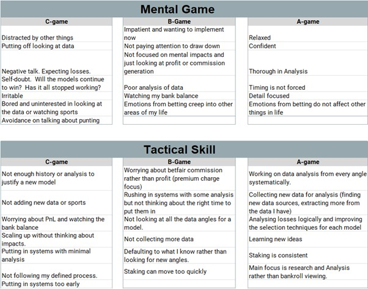

# 3: Handling Bad Variance

No one likes to lose, but when variance is the cause, losing takes on new meaning. As much as you might wish punting was more predictable, it’s not. It’s nothing like, for example, a game of chess.

On chess the board, the pieces and the moves your opponent makes are all there right in front of your eyes. There are no unknown variables. The game is played face up and whoever is the better player that day will win. 

Punting, however, is full of unknowns and even the factors that are known have huge amounts of variability, with swings that can drive you mad. You spend an incredible amount of time building a system, putting in long hours, staying up late at night, getting up early to complete testing, revising and resetting before finally nailing something that is profitable. And what happens when you run into a downswing and the variance, or luck, and the game turns against you? 

If you’re like the punters that I coach, bad variance will make you question whether you need to tweak your system, and you’ll face a barrage of internal questions: Should I let it run? What could be going wrong? How much longer is this going to last? How much more losing can I take? These and other questions race around in your mind, and go unanswered because they’re unanswerable questions. Yet they intensify your doubt and frustration, making an already difficult situation unbearable. Some punters will even turn off a winning system if the streak is bad enough. Others will decrease stakes, hoping that will be the answer to their losses. 

What makes variance so sinister, is that it hides in plain sight. Outside of the obvious scenarios where bad luck strikes, there’s a myriad of scenarios where accurately judging the influence of variance is a fool's errand. Misperception thrives in situations like this, and for less experienced punters it can be their undoing. The punters who have an edge, and have been in this game long-enough learn to deal with the inherent volatility that comes with it. Of course they’re always looking for new edges and ways to improve, but they also know when to do nothing and to keep firing, knowing that variance will eventually turn in their favour. 

The problem is that many punters never reach that point. There’s a graveyard of those who aspired to profitability and were undone by their inability to handle variance. That fact drives   me to do what I do. Sure, some people are naturally more suited for punting, but those who love it and want to be successful should not fail simply because they don’t have the required emotional stability from the start. Especially when that’s a skill that can be learned and not a personality trait given to a fortunate few.

To learn this skill here’s a tool that has helped punters, poker players and traders alike to handle bad variance with poise and confidence: **The A to C-game Analysis**

## What is an A to C-game Analysis?

Most punters by default use monetary results as the metric to determine how they’re doing. Many do so not even realizing that it’s wrong. Punters default into using results as a measure of their performance because that’s common and easy. The problem is that in the short-term results can be wildly uncorrelated with your performance. There are times when you’re losing money making the right decision and making money making the wrong decision. The A to C-game Analysis is the answer to breaking out of this cycle of misperception. 

Imagine being given a superpower that allowed punting to be like chess, where you can see where exactly variance affects your results. *It’s not a superpower sexy enough to make a movie about, but you can imagine how valuable it would be.* 

While the A to C-game Analysis can’t give you that superpower, it gets you closer than anything I’ve seen. The basic idea of the tool is to become aware of the variability in your performance. Thus, when you can accurately account for that, you remove a key component to misperception–your mental and emotional state. First let me tell you a bit about what it is and how to create it, and then I’ll explain how to use it. 

Imagine if we rated the quality of all the decisions you make in and around punting over the past six months and we could categorize them as being A-game (best), B-game (average) or C-game (poor). The A to C-game Analysis identifies the traits or characteristics in your mental game and tactical skills that highlight each level of your performance. Here’s an example to give you an idea of what it looks like:

You can see that each level has distinct differences. This is key and where the superpower of this tool comes from. Imagine that you’re going through a downswing, but based on your performance ratings over the past several weeks, you’ve been in your A-game. Your confident you have been performing well and the data shows that Since short-term results aren’t your primary metric of success, the recent losses don’t affect you. You’ve been in control of what you can control and that allows your confidence to stay consistent. That doesn’t mean your system doesn’t need to be adjusted either, there could be something that needs to be updated or improved. But because you're in a good mental state, your ability to make those changes is more likely to be accurate, rather than desperate.   

## Creating and Using an A to C-game Analysis

So how do you actually complete the A to C-game analysis? The first step is to brainstorm three different levels of your game both mentally and tactically. You want to get an accurate picture of your performance, so focus on the last 3 to 6 months. Anything less than that and your A to C-game Analysis is likely to be skewed towards the negative or positive based on how you’ve been doing recently. 

The easiest way to start out is by focusing on the parts of your performance that are the most obvious. For my clients that means their A-game and C-game. Focusing on the two extremes is easier, and then once you’ve got that nailed down, you can fill in B-game. Here a few tips to help:

 - Take a few minutes to think about your performance at the start and end of the day, then during the day make note of any new details you find.
 - Think about the situations or factors most likely to cause you to be in your B or C-game. That will help you remember so you aren’t making those mistakes again to find them out.
 - Don’t get hung up on distinguishing between what is mental and what is technical. Being able to clearly identify the differences between your best, worst and average is much more important.
 - At first the process can be a bit messy and hard, that’s common. Don’t be discouraged, just keep at it. This is a skill like any other. 

The goal is to get your A to C-game Analysis to a point where you stop finding new things to add. That could take you a few days or a few weeks, or even longer if you have to go through different cycles to nail it down. Don’t worry, even just thinking about your performance in these terms is helpful. 

Once it’s solid, you now have a measuring stick that you can use to grade your performance daily. And you guessed it, doing this also helps you to improve how you handle good luck by focusing you more and more on your performance, and less on short-term results, regardless of whether they’re positive or negative

Handling bad variance is a game of: How well can you maintain an accurate view of your results. Don’t let variance torment you and force your perspective on your system to become inaccurate. Do the work to create an A to C-game Analysis and it will keep you level headed. 

---

Jared Tendler, MS is a mental game coach for world champion poker players, PGA Tour players, sports bettors and financial traders from 45 countries. He is the author of three highly acclaimed books, The Mental Game of Poker 1 & 2 and his newest book The Mental Game of Trading. Find out more about Jared’s work at: [https://jaredtendler.com/](https://jaredtendler.com/) 
