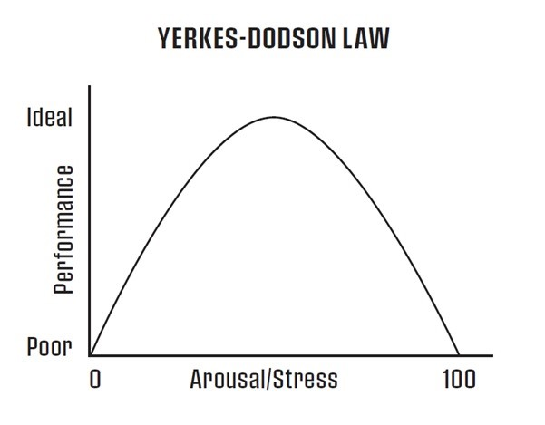

# Map Your Emotions

---

Wagering is intense. The nature of it makes it easy for emotions to come out and affect your decisions. Whether you’re turning a model on to run live for the first time, dealing with a big win or loss, or spending a long time developing a model only to have your back-testing show poor results, emotions will come up. 

Even with all these opportunities in wagering for your emotions to get out of control, they don’t have to cause poor decisions. In this series of articles, I’ll be providing you with perspective and tools that can help you to deal with your emotions in the right way. To begin, I want you to do something I call “mapping your emotions.”

This may sound like a strange idea, but it’s a very practical step that has been instrumental for my clients over the years. Some were even able to make solid improvements right away after just this first step. But before I get into the specific instructions for how to map your emotions, I want to give you one more bit of context to emphasize why this is so important.

---

## Yerkes-Dodson Law

[In the previous article](../roleOfEmotions) I talked about how emotions can override your ability to think and make decisions, leading to errors that not only cost you money but also decrease your enjoyment from punting.

The graphic below gives you a visual of what this looks like. It’s called the [Yerkes-Dodson Law](https://en.wikipedia.org/wiki/Yerkes%E2%80%93Dodson_law) (I also like to call it the Performance/Stress curve) and it's been around for over 100 years. 

What you see here is the relationship between performance and stress, or performance and emotion.
 
As the graphic depicts, your performance is equally bad when your emotions are either too high or too low. When your energy or emotions are really low, you feel tired or burned out, and you procrastinate, get easily distracted and bored. You're on the left side of this curve and your performance is poor because you don’t have enough energy or emotion to fuel you to be at your best. In my experience, most discipline issues come from lacking energy and being on this side of the curve. To perform better, you need more energy to power your mind.
 
On the other side of the curve, when emotions like anger, fear, greed, or confidence get too high, your mind progressively shuts down until you reach the point where your mind completely shuts off and you're in a blind rage, panic or euphoria.

Mapping your emotions is how you begin to prevent that scenario from happening. It gives you the awareness to see the early warning signs that intense fear, anger or overconfidence is coming, while you still have enough mental functioning to take action.

---

## How to Map Your Emotions

Funny enough, your emotional reactions are very much like patterns in the betting market—with enough study and examination, you can turn something that happens again and again into an opportunity. That idea is obvious when it comes to developing your model, but you’re probably wondering how to do it for your emotions.

Many of you right now are blind to the patterns in your mental game, much like you were unable to spot patterns in the betting market when you first started punting. But the more you worked at it the better you became. The same is true with your emotions.

Start by focusing on the times when you already know that your emotions are more intense than ideal or when you’re making repetitive mistakes. At those times, examine and note what’s going on with your emotions, thoughts, actions, or changes in your decision-making, and what’s causing your emotions to be high. Here’s an example of what to write down:

**Situation/mistake**: Winning a lot, consistently for a few days/week.

**Thoughts**: Counting all the money I have made and thinking about spending it. I just need to collect the money each day.  My mind focuses on staking and how can I get on more money as more money on each bet means more profits. 

**Emotions**: Extreme overconfidence

**Behaviors**: Bragging to people about how much money I am making per month without explaining the losses I also take at times.

**Changes to your decision-making**: Projecting the profits into the future at these unrealistic levels.

Of course, you can also think back to previous situations or mistakes and write down as much as you can remember. It will take time, but eventually you will be able to recognize more and more of the signals and the payoff is huge. 

As this process gets easier, start looking for earlier signals. What happened before your emotions became too intense? If you tend to get too caught up in the day to remember to track your emotions, consider setting an alarm at some regular frequency that isn’t too disruptive (i.e., every 15, 30, or 60 minutes) to take stock of where you are. 

Continue to capture this mental game data until you gather enough where you can begin to create a map that charts the intensification of your emotion using a scale of 1 to 10. Basically you’re going to look at the data you’ve captured and assign a ranking where 1 would characterize the lowest level of anger, fear, overconfidence or loss of confidence, and 10 would equate with the highest level of those emotions. 

You don’t need to have details for all 10 levels, certainly not at the start. Most of my clients are able to develop a map distinguishing around 4 or 5 levels, as you’ll see in this example of a map of Anger: 

**1**: Dismissive of the loss like it didn’t happen.

**2**: Impatient. Especially when people or things are not happening.  It's like I need small quick wins inside and outside of gambling to feel like I am in control of the situation. My caffeine intake rises to include another cup of coffee for the day. This can be accompanied with feeling tired all the time. Unable to sit still (more than usual).

**3**:

**4**: Become more inward focused and analytical, but still social. I’m thinking about “What have I done differently?” “What can I change?” “What am I not seeing?” I eat more chocolate and ice cream and know that I shouldn’t. I can see things which are not there as I try and avoid the pain of a loss.  Changes made during this level can either be enormously beneficial or a massive mistake. 

**5**:

**6**: Inwardly focused and cut off from the world. Swearing at myself. Irritable and want to be left alone and don't want people around. Interruptions and people talking to me cause me to be anxious and I am inconsiderate of others at this point. My decisions are urgent. There is an urgency to data analysis. It’s hard to see the larger picture and I start to look for other signs such as a new player in the market, or see patterns which don't exist.

**7**:

**8**: Disbelief from the losses. Blaming others - “How could this happen!?!” “This is impossible!” are common phrases as I’m raging inside. My decisions are really bad, and based on the immediate need to stop the losses.

**9**:

**10**: Intense physical symptoms - like the anger is pulsing through my veins. I have to leave immediately and go for a walk to burn off the anger. I’m blunt with other people and generally in a bad mood.

I’m sure some of you feel overwhelmed by what I’m asking you to do. Don’t be. Many of my clients and readers of my books have felt that same way, unnecessarily, until they got started.  Building knowledge for the emotional patterns in your mental game is a skill like any other and you do this all the time with the betting markets! The only difference is you’ve never done it with your emotions. But so what? Put in a bit of time starting to collect data and wait until you see how much knowledge has been waiting to be organized. 

To help you, you can download both the data collection worksheet and maps for anger, fear, and confidence below. 

- [Data Collection Worksheet](assets/dataCollectionWorksheet.pdf)
- [Anger Profile](assets/angerProfile.docx)
- [Confidence Profile](assets/confidenceProfile.docx)
- [Fear Profile](assets/fearProfile.docx)

Once you have a solid draft, you can use it throughout the day to recognize when your emotions are at risk of escalating. Take action then, while you still have the literal capacity in your brain to do so, and you’ll have a chance at avoiding those costly mistakes. 

Some of you will be more successful with this task than others. For those who aren’t, it’s not a failing on your part. It’s an indication that you need to build a more robust mental game strategy and the remaining articles in this series will help you to do just that.

---

Jared Tendler, MS is a mental game coach for world champion poker players, PGA Tour players, sports bettors and financial traders from 45 countries. He is the author of three highly acclaimed books, The Mental Game of Poker 1 & 2 and his newest book The Mental Game of Trading. Find out more about Jared’s work at: [https://jaredtendler.com/](https://jaredtendler.com/) 
