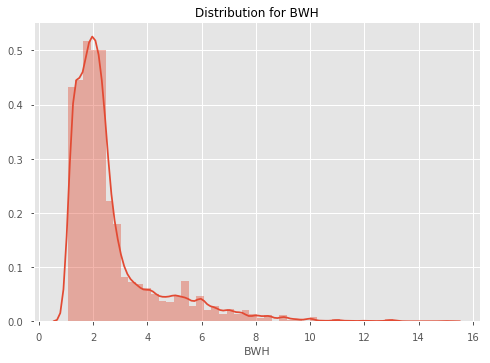
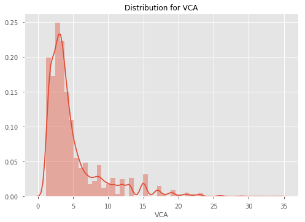

# EPL Machine Learning Walkthrough

---
# 01. Data Acquisition & Exploration
Welcome to the first part of this Machine Learning Walkthrough. This tutorial will be made of four parts; how we actually acquired our data (programmatically), exploring the data to find potential features, building the model and using the model to make predictions.

---
## Data Acquisition
We will be grabbing our data from [football-data.co.uk](http://www.football-data.co.uk/englandm.php), which has an enormous amount of soccer data dating back to the 90s. They also generously allow us to use it for free! However, the data is in separate CSVs based on the season. That means we would need to manually download 20 different files if we wanted the past 20 seasons. Rather than do this laborious and boring task, let's create a function which downloads the files for us, and appends them all into one big CSV.

To do this, we will use BeautifulSoup, a Python library which helps to pull data from HTML and XML files. We will then define a function which collates all the data for us into one DataFrame.

```python
# Import Modules

import pandas as pd
import requests
from bs4 import BeautifulSoup
import datetime
pd.set_option('display.max_columns', 100)
import seaborn as sns
import matplotlib.pyplot as plt
%matplotlib inline
from data_preparation_functions import *
```

```python
def grab_epl_data():
    # Connect to football-data.co.uk
    res = requests.get("http://www.football-data.co.uk/englandm.php")
    
    # Create a BeautifulSoup object
    soup = BeautifulSoup(res.content, 'lxml')
    
    # Find the tables with the links to the data in them.
    table = soup.find_all('table', {'align': 'center', 'cellspacing': '0', 'width': '800'})[1]
    body = table.find_all('td', {'valign': 'top'})[1]

    # Grab the urls for the csv files
    links = [link.get('href') for link in body.find_all('a')]
    links_text = [link_text.text for link_text in body.find_all('a')]

    data_urls = []
    
    # Create a list of links
    prefix = 'http://www.football-data.co.uk/'
    for i, text in enumerate(links_text):
        if text == 'Premier League':
            data_urls.append(prefix + links[i])

    # Get rid of last 11 uls as these don't include match stats and odds, and we
    # only want from 2005 onwards
    data_urls = data_urls[:-12]

    df = pd.DataFrame()

    # Iterate over the urls
    for url in data_urls:
        # Get the season and make it a column
        season = url.split('/')[4]
        
        print(f"Getting data for season {season}")
        
        # Read the data from the url into a DataFrame
        temp_df = pd.read_csv(url)
        temp_df['season'] = season
        
        # Create helpful columns like Day, Month, Year, Date etc. so that our data is clean
        temp_df = (temp_df.dropna(axis='columns', thresh=temp_df.shape[0]-30)
                          .assign(Day=lambda df: df.Date.str.split('/').str[0],
                                  Month=lambda df: df.Date.str.split('/').str[1],
                                  Year=lambda df: df.Date.str.split('/').str[2])
                          .assign(Date=lambda df: df.Month + '/' + df.Day + '/' + df.Year)
                          .assign(Date=lambda df: pd.to_datetime(df.Date))
                          .dropna())
        
        # Append the temp_df to the main df
        df = df.append(temp_df, sort=True)
    
    # Drop all NAs
    df = df.dropna(axis=1).dropna().sort_values(by='Date')
    print("Finished grabbing data.")
    
    return df
```

```python
df = grab_epl_data()
# df.to_csv("data/epl_data.csv", index=False)

    Getting data for season 1819
    Getting data for season 1718
    Getting data for season 1617
    Getting data for season 1516
    Getting data for season 1415
    Getting data for season 1314
    Getting data for season 1213
    Getting data for season 1112
    Getting data for season 1011
    Getting data for season 0910
    Getting data for season 0809
    Getting data for season 0708
    Getting data for season 0607
    Getting data for season 0506
    Finished grabbing data.
```
    
Whenever we want to update our data (for example if we want the most recent Gameweek included), all we have to do is run that function and then save the data to a csv with the commented out line above.

---
## Data Exploration
Now that we have our data, let's explore it. Let's first look at home team win rates since 2005 to see if there is a consistent trend. To get an idea of what our data looks like, we'll look at the tail of the dataset first.

```python
df.tail(3)
```

|  | AC | AF | AR | AS | AST | AY | AwayTeam | B365A | B365D | B365H | BWA | BWD | BWH | Bb1X2 | BbAH | BbAHh | BbAv<2.5 | BbAv>2.5 | BbAvA | BbAvAHA | BbAvAHH | BbAvD | BbAvH | BbMx<2.5 | BbMx>2.5 | BbMxA | BbMxAHA | BbMxAHH | BbMxD | BbMxH | BbOU | Date | Day | Div | FTAG | FTHG | FTR | HC | HF | HR | HS | HST | HTAG | HTHG | HTR | HY | HomeTeam | IWA | IWD | IWH | LBA | LBD | LBH | Month | Referee | VCA | VCD | VCH | Year | season |
| --- | --- | --- | --- | --- | --- | --- | --- | --- | --- | --- | --- | --- | --- | --- | --- | --- | --- | --- | --- | --- | --- | --- | --- | --- | --- | --- | --- | --- | --- | --- | --- | --- | --- | --- | --- | --- | --- | --- | --- | --- | --- | --- | --- | --- | --- | --- | --- | --- | --- | --- | --- | --- | --- | --- | --- | --- | --- | --- | --- | --- |
| 28 | 3.0 | 11.0 | 0.0 | 9.0 | 3.0 | 2.0 | Crystal Palace | 3.00 | 3.25 | 2.60 | 2.95 | 3.1 | 2.55 | 42.0 | 20.0 | -0.25 | 1.71 | 2.13 | 2.92 | 1.73 | 2.16 | 3.22 | 2.55 | 1.79 | 2.21 | 3.04 | 1.77 | 2.23 | 3.36 | 2.66 | 39.0 | 2018-08-26 | 26 | E0 | 1.0 | 2.0 | H | 6.0 | 14.0 | 0.0 | 13.0 | 5.0 | 0.0 | 0.0 | D | 4.0 | Watford | 2.95 | 3.20 | 2.5 | 2.90 | 3.1 | 2.50 | 08 | A Taylor | 2.90 | 3.3 | 2.6 | 18 | 1819 |
| 27 | 5.0 | 8.0 | 0.0 | 15.0 | 3.0 | 1.0 | Chelsea | 1.66 | 4.00 | 5.75 | 1.67 | 3.8 | 5.25 | 42.0 | 22.0 | 1.00 | 1.92 | 1.88 | 1.67 | 2.18 | 1.71 | 3.90 | 5.25 | 2.01 | 1.95 | 1.71 | 2.28 | 1.76 | 4.17 | 5.75 | 40.0 | 2018-08-26 | 26 | E0 | 2.0 | 1.0 | A | 4.0 | 16.0 | 0.0 | 6.0 | 2.0 | 0.0 | 0.0 | D | 3.0 | Newcastle | 1.70 | 3.75 | 5.0 | 1.67 | 3.8 | 5.25 | 08 | P Tierney | 1.67 | 4.0 | 5.5 | 18 | 1819 |
| 29 | 2.0 | 16.0 | 0.0 | 9.0 | 5.0 | 4.0 | Tottenham | 2.90 | 3.30 | 2.62 | 2.90 | 3.2 | 2.55 | 42.0 | 20.0 | -0.25 | 1.79 | 2.03 | 2.86 | 1.72 | 2.18 | 3.27 | 2.56 | 1.84 | 2.10 | 3.00 | 1.76 | 2.25 | 3.40 | 2.67 | 40.0 | 2018-08-27 | 27 | E0 | 3.0 | 0.0 | A | 5.0 | 11.0 | 0.0 | 23.0 | 5.0 | 0.0 | 0.0 | D | 2.0 | Man United | 2.75 | 3.25 | 2.6 | 2.75 | 3.2 | 2.55 | 08 | C Pawson | 2.90 | 3.3 | 2.6 | 18 | 1819 |

```python
# Create Home Win, Draw Win and Away Win columns
df = df.assign(homeWin=lambda df: df.apply(lambda row: 1 if row.FTHG > row.FTAG else 0, axis='columns'),
              draw=lambda df: df.apply(lambda row: 1 if row.FTHG == row.FTAG else 0, axis='columns'),
              awayWin=lambda df: df.apply(lambda row: 1 if row.FTHG < row.FTAG else 0, axis='columns'))
```

### Home Ground Advantage

```python
win_rates = \
(df.groupby('season')
    .mean()
    .loc[:, ['homeWin', 'draw', 'awayWin']])

win_rates
```

|  | homeWin | draw | awayWin |
| --- | --- | --- | --- |
| season |  |  |  |
| 0506 | 0.505263 | 0.202632 | 0.292105 |
| 0607 | 0.477573 | 0.258575 | 0.263852 |
| 0708 | 0.463158 | 0.263158 | 0.273684 |
| 0809 | 0.453826 | 0.255937 | 0.290237 |
| 0910 | 0.507895 | 0.252632 | 0.239474 |
| 1011 | 0.471053 | 0.292105 | 0.236842 |
| 1112 | 0.450000 | 0.244737 | 0.305263 |
| 1213 | 0.433862 | 0.285714 | 0.280423 |
| 1314 | 0.472973 | 0.208108 | 0.318919 |
| 1415 | 0.453826 | 0.245383 | 0.300792 |
| 1516 | 0.414248 | 0.282322 | 0.303430 |
| 1617 | 0.492105 | 0.221053 | 0.286842 |
| 1718 | 0.455263 | 0.260526 | 0.284211 |
| 1819 | 0.466667 | 0.200000 | 0.333333 |

### Findings
As we can see, winrates across home team wins, draws and away team wins are very consistent. It seems that the home team wins around 46-47% of the time, the draw happens about 25% of the time, and the away team wins about 27% of the time. Let's plot this DataFrame so that we can see the trend more easily.

```python
# Set the style
plt.style.use('ggplot')

fig = plt.figure()
ax = fig.add_subplot(111)

home_line = ax.plot(win_rates.homeWin, label='Home Win Rate')
away_line = ax.plot(win_rates.awayWin, label='Away Win Rate')
draw_line = ax.plot(win_rates.draw, label='Draw Win Rate')
ax.set_xlabel("season")
ax.set_ylabel("Win Rate")
plt.title("Win Rates", fontsize=16)

# Add the legend locations
home_legend = plt.legend(handles=home_line, loc='upper right', bbox_to_anchor=(1, 1))
ax = plt.gca().add_artist(home_legend)
away_legend = plt.legend(handles=away_line, loc='center right', bbox_to_anchor=(0.95, 0.4))
ax = plt.gca().add_artist(away_legend)
draw_legend = plt.legend(handles=draw_line, loc='center right', bbox_to_anchor=(0.95, 0.06))
```


As we can see, the winrates are relatively stable each season, except for in 14/15 when the home win rate drops dramatically.

Out of interest, let's also have a look at which team has the best home ground advantage. Let's define HGA as home win rate - away win rate. And then plot some of the big clubs' HGA against each other.

```python
home_win_rates = \
(df.groupby(['HomeTeam'])
    .homeWin
    .mean())

away_win_rates = \
(df.groupby(['AwayTeam'])
    .awayWin
    .mean())

hga = (home_win_rates - away_win_rates).reset_index().rename(columns={0: 'HGA'}).sort_values(by='HGA', ascending=False)
```

```python
hga.head(10)
```

|  | HomeTeam | HGA |
| --- | --- | --- |
| 15 | Fulham | 0.315573 |
| 7 | Brighton | 0.304762 |
| 20 | Man City | 0.244980 |
| 14 | Everton | 0.241935 |
| 30 | Stoke | 0.241131 |
| 10 | Charlton | 0.236842 |
| 0 | Arsenal | 0.236140 |
| 27 | Reading | 0.234962 |
| 33 | Tottenham | 0.220207 |
| 21 | Man United | 0.215620 |

So the club with the best HGA is Fulham - interesting. This is most likely because Fulham have won 100% of home games in 2018 so far which is skewing the mean. Let's see how the HGA for some of the big clubs based compare over seasons.

```python
big_clubs = ['Liverpool', 'Man City', 'Man United', 'Chelsea', 'Arsenal']
home_win_rates_5 = df[df.HomeTeam.isin(big_clubs)].groupby(['HomeTeam', 'season']).homeWin.mean()
away_win_rates_5 = df[df.AwayTeam.isin(big_clubs)].groupby(['AwayTeam', 'season']).awayWin.mean()

hga_top_5 = home_win_rates_5 - away_win_rates_5

hga_top_5.unstack(level=0)
```

| HomeTeam | Arsenal | Chelsea | Liverpool | Man City | Man United |
| --- | --- | --- | --- | --- | --- |
| season |  |  |  |  |  |
| 0506 | 0.421053 | 0.368421 | 0.263158 | 0.263158 | 0.052632 |
| 0607 | 0.263158 | 0.000000 | 0.421053 | -0.052632 | 0.105263 |
| 0708 | 0.210526 | -0.052632 | 0.157895 | 0.368421 | 0.368421 |
| 0809 | 0.105263 | -0.157895 | -0.052632 | 0.578947 | 0.210526 |
| 0910 | 0.368421 | 0.368421 | 0.421053 | 0.315789 | 0.263158 |
| 1011 | 0.157895 | 0.368421 | 0.368421 | 0.263158 | 0.684211 |
| 1112 | 0.157895 | 0.315789 | -0.105263 | 0.421053 | 0.105263 |
| 1213 | 0.052632 | 0.105263 | 0.105263 | 0.248538 | 0.201754 |
| 1314 | 0.143275 | 0.251462 | 0.307018 | 0.362573 | -0.026316 |
| 1415 | 0.131579 | 0.210526 | 0.105263 | 0.210526 | 0.421053 |
| 1516 | 0.210526 | -0.105263 | 0.000000 | 0.263158 | 0.263158 |
| 1617 | 0.263158 | 0.210526 | 0.105263 | -0.052632 | -0.105263 |
| 1718 | 0.578947 | 0.052632 | 0.157895 | 0.000000 | 0.263158 |
| 1819 | 0.500000 | 0.000000 | 0.000000 | 0.500000 | 0.500000 |

Now let's plot it.

```python
sns.lineplot(x='season', y='HGA', hue='team', data=hga_top_5.reset_index().rename(columns={0: 'HGA', 'HomeTeam': 'team'}))
plt.legend(loc='lower center', ncol=6, bbox_to_anchor=(0.45, -0.2))
plt.title("HGA Among the top 5 clubs", fontsize=14)
plt.show()
```


The results here seem to be quite erratic, although it seems that Arsenal consistently has a HGA above 0.

Let's now look at the distributions of each of our columns. The odds columns are likely to be highly skewed, so we may have to account for this later.

```python
for col in df.select_dtypes('number').columns:
    sns.distplot(df[col])
    plt.title(f"Distribution for {col}")
    plt.show()
```








---
## Exploring Referee Home Ground Bias
What may be of interest is whether certain referees are correlated with the home team winning more often. Let's explore referee home ground bias for referees for the top 10 Referees based on games.

```python
print('Overall Home Win Rate: {:.4}%'.format(df.homeWin.mean() * 100))

# Get the top 10 refs based on games
top_10_refs = df.Referee.value_counts().head(10).index

df[df.Referee.isin(top_10_refs)].groupby('Referee').homeWin.mean().sort_values(ascending=False)
```
    Overall Home Win Rate: 46.55%
    
    Referee
    L Mason          0.510373
    C Foy            0.500000
    M Clattenburg    0.480000
    M Jones          0.475248
    P Dowd           0.469880
    M Atkinson       0.469565
    M Oliver         0.466019
    H Webb           0.456604
    A Marriner       0.455516
    M Dean           0.442049
    Name: homeWin, dtype: float64

It seems that L Mason may be the most influenced by the home crowd. Whilst the overall home win rate is 46.5%, the home win rate when he is the Referee is 51%. However it should be noted that this doesn't mean that he causes the win through bias. It could just be that he referees the best clubs, so naturally their home win rate is high.

---
## Variable Correlation With Margin
Let's now explore different variables' relationships with margin. First, we'll create a margin column, then we will pick a few different variables to look at the correlations amongst each other, using a correlation heatmap.

```python
df['margin'] = df['FTHG'] - df['FTAG']
```

```python
stat_cols = ['AC', 'AF', 'AR', 'AS', 'AST', 'AY', 'HC', 'HF', 'HR', 'HS', 'HST', 'HTR', 'HY', 'margin']

stat_correlations = df[stat_cols].corr()
stat_correlations['margin'].sort_values()

    AST      -0.345703
    AS       -0.298665
    HY       -0.153806
    HR       -0.129393
    AC       -0.073204
    HF       -0.067469
    AF        0.005474
    AY        0.013746
    HC        0.067433
    AR        0.103528
    HS        0.275847
    HST       0.367591
    margin    1.000000
    Name: margin, dtype: float64
```

Unsurprisingly, Home Shots on Target correlate the most with Margin, and Away Reds is also high. What is surprising is that Home Yellows has quite a strong negative correlation with margin - this may be because players will play more aggresively when they are losing to try and get the lead back, and hence receive more yellow cards.

Let's now look at the heatmap between variables.

```python
sns.heatmap(stat_correlations, annot=True, annot_kws={'size': 10})
    <matplotlib.axes._subplots.AxesSubplot at 0x220a4227048>
```


---
## Analysing Features
What we are really interested in, is how our features (creating in the next tutorial), correlate with winning. We will skip ahead here and use a function to create our features for us, and then examine how the moving averages/different features correlate with winning.

```python
# Create a cleaned df of all of our data
pre_features_df = create_df('data/epl_data.csv')

# Create our features
features = create_feature_df(pre_features_df)
    Creating all games feature DataFrame
    
    C:\Users\wardj\Documents\Betfair Public Github\predictive-models\epl\data_preparation_functions.py:419: RuntimeWarning: invalid value encountered in double_scalars
      .pipe(lambda df: (df.eloAgainst * df[goalsForOrAgainstCol]).sum() / df.eloAgainst.sum()))
    
    Creating stats feature DataFrame
    Creating odds feature DataFrame
    Creating market values feature DataFrame
    Filling NAs
    Merging stats, odds and market values into one features DataFrame
    Complete.
```
   
```python
features = (pre_features_df.assign(margin=lambda df: df.FTHG - df.FTAG)
                           .loc[:, ['gameId', 'margin']]
                           .pipe(pd.merge, features, on=['gameId']))
```

```python
features.corr().margin.sort_values(ascending=False)[:20]

    margin                     1.000000
    f_awayOdds                 0.413893
    f_totalMktH%               0.330420
    f_defMktH%                 0.325392
    f_eloAgainstAway           0.317853
    f_eloForHome               0.317853
    f_midMktH%                 0.316080
    f_attMktH%                 0.312262
    f_sizeOfHandicapAway       0.301667
    f_goalsForHome             0.298930
    f_wtEloGoalsForHome        0.297157
    f_shotsForHome             0.286239
    f_cornersForHome           0.279917
    f_gkMktH%                  0.274732
    f_homeWinPc38Away          0.271326
    f_homeWinPc38Home          0.271326
    f_wtEloGoalsAgainstAway    0.269663
    f_goalsAgainstAway         0.258418
    f_cornersAgainstAway       0.257148
    f_drawOdds                 0.256807
    Name: margin, dtype: float64
```

As we can see away odds is most highly correlated to margin. This makes sense, as odds generally have most/all information included in the price. What is interesting is that elo seems to also be highly correlated, which is good news for our elo model that we made. Similarly, weighted goals and the the value of the defence relative to other teams ('defMktH%' etc.) is strongly correlated to margin.

---
# 02. Data Preparation & Feature Engineering

Welcome to the second part of this Machine Learning Walkthrough. This tutorial will focus on data preparation and feature creation, before we dive into modelling in the next tutorial.

Specifically, this tutorial will cover a few things:

1. Data wrangling specifically for sport
2. Feature creation - focussing on commonly used features in sports modelling, such as exponential moving averages
3. Using functions to modularise the data preparation process

---
## Data Wrangling
We will begin by utilising functions we have defined in our data_preparation_functions script to wrangle our data into a format that can be consumed by Machine Learning algorithms.

A typical issue faced by aspect of modelling sport is the issue of Machine Learning algorithms requiring all features for the teams playing to be on the same row of a table, whereas when we actual calculate these features, we usually require the teams to be on separate rows as it makes it a lot easier to calculate typical features, such as [expontentially weighted moving averages](https://en.wikipedia.org/wiki/Moving_average#Exponential_moving_average). We will explore this issue and show how we deal with issues like these.

```python
# Import libraries
from data_preparation_functions import *
from sklearn.metrics import log_loss
from sklearn.linear_model import LogisticRegression
from sklearn.preprocessing import LabelEncoder
from sklearn.model_selection import StratifiedKFold, cross_val_score
import matplotlib.pyplot as plt
pd.set_option('display.max_columns', 100)
```

We have created some functions which prepare the data for you. For thoroughly commented explanation of how the functions work, read through the data_preparation_functions.py script along side this walkthrough.

Essentially, each functions wrangles the data through a similar process. It first reads in the data from a csv file, then converts the columns to datatypes that we can work with, such as converting the Date column to a datetime data type. It then adds a Game ID column, so each game is easily identifiable and joined on. We then assign the DataFrame some other columns which may be useful, such as 'Year', 'Result' and 'homeWin'. Finally, we drop redundant column and return the DataFrame.

Let us now create six different DataFrames, which we will use to create features. Later, we will join these features back into one main feature DataFrame.

### Create 6 distinct DataFrames

```python
# This table includes all of our data in one big DataFrame
df = create_df('data/epl_data.csv')
df.head(3)
```

|  | AC | AF | AR | AS | AST | AY | AwayTeam | B365A | B365D | B365H | BWA | BWD | BWH | Bb1X2 | BbAH | BbAHh | BbAv<2.5 | BbAv>2.5 | BbAvA | BbAvAHA | BbAvAHH | BbAvD | BbAvH | BbMx<2.5 | BbMx>2.5 | BbMxA | BbMxAHA | BbMxAHH | BbMxD | BbMxH | BbOU | Date | Day | Div | FTAG | FTHG | FTR | HC | HF | HR | HS | HST | HTAG | HTHG | HTR | HY | HomeTeam | IWA | IWD | IWH | LBA | LBD | LBH | Month | Referee | VCA | VCD | VCH | Year | season | gameId | homeWin | awayWin | result |
| --- | --- | --- | --- | --- | --- | --- | --- | --- | --- | --- | --- | --- | --- | --- | --- | --- | --- | --- | --- | --- | --- | --- | --- | --- | --- | --- | --- | --- | --- | --- | --- | --- | --- | --- | --- | --- | --- | --- | --- | --- | --- | --- | --- | --- | --- | --- | --- | --- | --- | --- | --- | --- | --- | --- | --- | --- | --- | --- | --- | --- | --- | --- | --- | --- |
| 0 | 6.0 | 14.0 | 1.0 | 11.0 | 5.0 | 1.0 | Blackburn | 2.75 | 3.20 | 2.5 | 2.90 | 3.30 | 2.20 | 55.0 | 20.0 | 0.00 | 1.71 | 2.02 | 2.74 | 2.04 | 1.82 | 3.16 | 2.40 | 1.80 | 2.25 | 2.9 | 2.08 | 1.86 | 3.35 | 2.60 | 35.0 | 2005-08-13 | 13 | E0 | 1.0 | 3.0 | H | 2.0 | 11.0 | 0.0 | 13.0 | 5.0 | 1.0 | 0.0 | A | 0.0 | West Ham | 2.7 | 3.0 | 2.3 | 2.75 | 3.0 | 2.38 | 8 | A Wiley | 2.75 | 3.25 | 2.4 | 2005 | 0506 | 1 | 1 | 0 | home |
| 1 | 8.0 | 16.0 | 0.0 | 13.0 | 6.0 | 2.0 | Bolton | 3.00 | 3.25 | 2.3 | 3.15 | 3.25 | 2.10 | 56.0 | 22.0 | -0.25 | 1.70 | 2.01 | 3.05 | 1.84 | 2.01 | 3.16 | 2.20 | 1.87 | 2.20 | 3.4 | 1.92 | 2.10 | 3.30 | 2.40 | 36.0 | 2005-08-13 | 13 | E0 | 2.0 | 2.0 | D | 7.0 | 14.0 | 0.0 | 3.0 | 2.0 | 2.0 | 2.0 | D | 0.0 | Aston Villa | 3.1 | 3.0 | 2.1 | 3.20 | 3.0 | 2.10 | 8 | M Riley | 3.10 | 3.25 | 2.2 | 2005 | 0506 | 2 | 0 | 0 | draw |
| 2 | 6.0 | 14.0 | 0.0 | 12.0 | 5.0 | 1.0 | Man United | 1.72 | 3.40 | 5.0 | 1.75 | 3.35 | 4.35 | 56.0 | 23.0 | 0.75 | 1.79 | 1.93 | 1.69 | 1.86 | 2.00 | 3.36 | 4.69 | 1.87 | 2.10 | 1.8 | 1.93 | 2.05 | 3.70 | 5.65 | 36.0 | 2005-08-13 | 13 | E0 | 2.0 | 0.0 | A | 8.0 | 15.0 | 0.0 | 10.0 | 5.0 | 1.0 | 0.0 | A | 3.0 | Everton | 1.8 | 3.1 | 3.8 | 1.83 | 3.2 | 3.75 | 8 | G Poll | 1.80 | 3.30 | 4.5 | 2005 | 0506 | 3 | 0 | 1 | away |

```python
# This includes only the typical soccer stats, like home corners, home shots on target etc.
stats = create_stats_df('data/epl_data.csv')
stats.head(3)
```

|  | gameId | HomeTeam | AwayTeam | FTHG | FTAG | HTHG | HTAG | HS | AS | HST | AST | HF | AF | HC | AC | HY | AY | HR | AR |
| --- | --- | --- | --- | --- | --- | --- | --- | --- | --- | --- | --- | --- | --- | --- | --- | --- | --- | --- | --- |
| 0 | 1 | West Ham | Blackburn | 3.0 | 1.0 | 0.0 | 1.0 | 13.0 | 11.0 | 5.0 | 5.0 | 11.0 | 14.0 | 2.0 | 6.0 | 0.0 | 1.0 | 0.0 | 1.0 |
| 1 | 2 | Aston Villa | Bolton | 2.0 | 2.0 | 2.0 | 2.0 | 3.0 | 13.0 | 2.0 | 6.0 | 14.0 | 16.0 | 7.0 | 8.0 | 0.0 | 2.0 | 0.0 | 0.0 |
| 2 | 3 | Everton | Man United | 0.0 | 2.0 | 0.0 | 1.0 | 10.0 | 12.0 | 5.0 | 5.0 | 15.0 | 14.0 | 8.0 | 6.0 | 3.0 | 1.0 | 0.0 | 0.0 |


```python
# This includes all of our betting related data, such as win/draw/lose odds, asian handicaps etc.
betting = create_betting_df('data/epl_data.csv')
betting.head(3)
```

|  | B365A | B365D | B365H | BWA | BWD | BWH | Bb1X2 | BbAH | BbAHh | BbAv<2.5 | BbAv>2.5 | BbAvA | BbAvAHA | BbAvAHH | BbAvD | BbAvH | BbMx<2.5 | BbMx>2.5 | BbMxA | BbMxAHA | BbMxAHH | BbMxD | BbMxH | BbOU | Day | Div | IWA | IWD | IWH | LBA | LBD | LBH | Month | VCA | VCD | VCH | Year | homeWin | awayWin | result | HomeTeam | AwayTeam | gameId |
| --- | --- | --- | --- | --- | --- | --- | --- | --- | --- | --- | --- | --- | --- | --- | --- | --- | --- | --- | --- | --- | --- | --- | --- | --- | --- | --- | --- | --- | --- | --- | --- | --- | --- | --- | --- | --- | --- | --- | --- | --- | --- | --- | --- |
| 0 | 2.75 | 3.20 | 2.5 | 2.90 | 3.30 | 2.20 | 55.0 | 20.0 | 0.00 | 1.71 | 2.02 | 2.74 | 2.04 | 1.82 | 3.16 | 2.40 | 1.80 | 2.25 | 2.9 | 2.08 | 1.86 | 3.35 | 2.60 | 35.0 | 13 | E0 | 2.7 | 3.0 | 2.3 | 2.75 | 3.0 | 2.38 | 8 | 2.75 | 3.25 | 2.4 | 2005 | 1 | 0 | home | West Ham | Blackburn | 1 |
| 1 | 3.00 | 3.25 | 2.3 | 3.15 | 3.25 | 2.10 | 56.0 | 22.0 | -0.25 | 1.70 | 2.01 | 3.05 | 1.84 | 2.01 | 3.16 | 2.20 | 1.87 | 2.20 | 3.4 | 1.92 | 2.10 | 3.30 | 2.40 | 36.0 | 13 | E0 | 3.1 | 3.0 | 2.1 | 3.20 | 3.0 | 2.10 | 8 | 3.10 | 3.25 | 2.2 | 2005 | 0 | 0 | draw | Aston Villa | Bolton | 2 |
| 2 | 1.72 | 3.40 | 5.0 | 1.75 | 3.35 | 4.35 | 56.0 | 23.0 | 0.75 | 1.79 | 1.93 | 1.69 | 1.86 | 2.00 | 3.36 | 4.69 | 1.87 | 2.10 | 1.8 | 1.93 | 2.05 | 3.70 | 5.65 | 36.0 | 13 | E0 | 1.8 | 3.1 | 3.8 | 1.83 | 3.2 | 3.75 | 8 | 1.80 | 3.30 | 4.5 | 2005 | 0 | 1 | away | Everton | Man United | 3 |

```python
# This includes all of the team information for each game.
team_info = create_team_info_df('data/epl_data.csv')
team_info.head(3)
```

|  | gameId | Date | season | HomeTeam | AwayTeam | FTR | HTR | Referee |
| --- | --- | --- | --- | --- | --- | --- | --- | --- |
| 0 | 1 | 2005-08-13 | 0506 | West Ham | Blackburn | H | A | A Wiley |
| 1 | 2 | 2005-08-13 | 0506 | Aston Villa | Bolton | D | D | M Riley |
| 2 | 3 | 2005-08-13 | 0506 | Everton | Man United | A | A | G Poll |

```python
# Whilst the other DataFrames date back to 2005, this DataFrame has data from 2001 to 2005.
historic_games = create_historic_games_df('data/historic_games_pre2005.csv')
historic_games.head(3)
```

|  | Date | HomeTeam | AwayTeam | FTHG | FTAG | gameId | season | homeWin |
| --- | --- | --- | --- | --- | --- | --- | --- | --- |
| 0 | 2001-08-18 | Charlton | Everton | 1 | 2 | -1 | 20012002 | 0 |
| 1 | 2001-08-18 | Derby | Blackburn | 2 | 1 | -1 | 20012002 | 1 |
| 2 | 2001-08-18 | Leeds | Southampton | 2 | 0 | -1 | 20012002 | 1 |

```python
# This is the historic_games DataFrame appended to the df DataFrame.
all_games = create_all_games_df('data/epl_data.csv', 'data/historic_games_pre2005.csv')
all_games.head(3)
```

|  | Date | HomeTeam | AwayTeam | FTHG | FTAG | gameId | season | homeWin | awayWin | homeWinPc5 | homeWinPc38 | awayWinPc5 | awayWinPc38 | gameIdHistoric |
| --- | --- | --- | --- | --- | --- | --- | --- | --- | --- | --- | --- | --- | --- | --- |
| 0 | 2001-08-18 | Charlton | Everton | 1.0 | 2.0 | -1 | 20012002 | 0 | 1 | NaN | NaN | NaN | NaN | 1 |
| 1 | 2001-08-18 | Derby | Blackburn | 2.0 | 1.0 | -1 | 20012002 | 1 | 0 | NaN | NaN | NaN | NaN | 2 |
| 2 | 2001-08-18 | Leeds | Southampton | 2.0 | 0.0 | -1 | 20012002 | 1 | 0 | NaN | NaN | NaN | NaN | 3 |

---
## Feature Creation
Now that we have all of our pre-prepared DataFrames, and we know that the data is clean, we can move onto feature creation. As is common practice with sports modelling, we are going to start by creating expontentially weighted moving averages (EMA) as features. To get a better understanding of how EMAs work, read [here](https://en.wikipedia.org/wiki/Moving_average#Exponential_moving_average). 

In short, an EMA is like a simple moving average, except it weights recent instances more than older instances based on an alpha parameter. The documentation for the pandas (emw method)[https://pandas.pydata.org/pandas-docs/stable/generated/pandas.DataFrame.ewm.html] we will be using states that we can specify alpha in a number of ways. We will specify it in terms of span, where $\alpha = 2 / (span+1), span ≥ 1 $.

Let's first define a function which calculates the exponential moving average for each column in the stats DataFrame. We will then apply this function with other functions we have created, such as create_betting_features_ema, which creates moving averages of betting data.

However, we must first change the structure of our data. Notice that currently each row has both the Home Team's data and the Away Team's data on a single row. This makes it difficult to calculate rolling averages, so we will restructure our DataFrames to ensure each row only contains single team's data. To do this, we will define a function, reate_multiline_df_stats.

```python
# Define a function which restructures our DataFrame
def create_multiline_df_stats(old_stats_df):
    # Create a list of columns we want and their mappings to more interpretable names
    home_stats_cols = ['HomeTeam', 'FTHG', 'FTAG', 'HTHG', 'HTAG', 'HS', 'AS', 'HST', 'AST', 'HF', 'AF', 'HC', 'AC', 'HY', 'AY',
                       'HR', 'AR']
    
    away_stats_cols = ['AwayTeam', 'FTAG', 'FTHG', 'HTAG', 'HTHG', 'AS', 'HS', 'AST', 'HST', 'AF', 'HF', 'AC', 'HC', 'AY', 'HY',
                       'AR', 'HR']
    
    stats_cols_mapping = ['team', 'goalsFor', 'goalsAgainst', 'halfTimeGoalsFor', 'halfTimeGoalsAgainst', 'shotsFor',
                          'shotsAgainst', 'shotsOnTargetFor', 'shotsOnTargetAgainst', 'freesFor', 'freesAgainst', 
                          'cornersFor', 'cornersAgainst', 'yellowsFor', 'yellowsAgainst', 'redsFor', 'redsAgainst']
    
    # Create a dictionary of the old column names to new column names
    home_mapping = {old_col: new_col for old_col, new_col in zip(home_stats_cols, stats_cols_mapping)}
    away_mapping = {old_col: new_col for old_col, new_col in zip(away_stats_cols, stats_cols_mapping)}
    
    # Put each team onto an individual row
    multi_line_stats = (old_stats_df[['gameId'] + home_stats_cols] # Filter for only the home team columns
                    .rename(columns=home_mapping) # Rename the columns
                    .assign(homeGame=1) # Assign homeGame=1 so that we can use a general function later
                    .append((old_stats_df[['gameId'] + away_stats_cols]) # Append the away team columns
                            .rename(columns=away_mapping) # Rename the away team columns
                            .assign(homeGame=0), sort=True)
                    .sort_values(by='gameId') # Sort the values
                    .reset_index(drop=True))
    return multi_line_stats
```

```python
# Define a function which creates an EMA DataFrame from the stats DataFrame
def create_stats_features_ema(stats, span):
    # Create a restructured DataFrames so that we can calculate EMA
    multi_line_stats = create_multiline_df_stats(stats)
    
    # Create a copy of the DataFrame
    ema_features = multi_line_stats[['gameId', 'team', 'homeGame']].copy()
    
    # Get the columns that we want to create EMA for
    feature_names = multi_line_stats.drop(columns=['gameId', 'team', 'homeGame']).columns
    
    # Loop over the features
    for feature_name in feature_names:
        feature_ema = (multi_line_stats.groupby('team')[feature_name] # Calculate the EMA
                                                  .transform(lambda row: row.ewm(span=span, min_periods=2)
                                                             .mean()
                                                             .shift(1))) # Shift the data down 1 so we don't leak data
        ema_features[feature_name] = feature_ema # Add the new feature to the DataFrame
    return ema_features
```

```python
# Apply the function
stats_features = create_stats_features_ema(stats, span=5)
stats_features.tail()
```

|  | gameId | team | homeGame | cornersAgainst | cornersFor | freesAgainst | freesFor | goalsAgainst | goalsFor | halfTimeGoalsAgainst | halfTimeGoalsFor | redsAgainst | redsFor | shotsAgainst | shotsFor | shotsOnTargetAgainst | shotsOnTargetFor | yellowsAgainst | yellowsFor |
| --- | --- | --- | --- | --- | --- | --- | --- | --- | --- | --- | --- | --- | --- | --- | --- | --- | --- | --- | --- |
| 9903 | 4952 | Newcastle | 1 | 4.301743 | 4.217300 | 11.789345 | 12.245066 | 0.797647 | 0.833658 | 0.644214 | 0.420832 | 2.323450e-10 | 3.333631e-01 | 11.335147 | 13.265955 | 3.211345 | 4.067990 | 1.848860 | 1.627140 |
| 9904 | 4953 | Burnley | 0 | 4.880132 | 5.165915 | 13.326703 | 8.800033 | 1.945502 | 0.667042 | 0.609440 | 0.529409 | 3.874405e-03 | 3.356120e-10 | 13.129631 | 10.642381 | 4.825874 | 3.970285 | 0.963527 | 0.847939 |
| 9905 | 4953 | Fulham | 1 | 4.550255 | 4.403060 | 10.188263 | 8.555589 | 2.531046 | 1.003553 | 0.860573 | 0.076949 | 1.002518e-04 | 8.670776e-03 | 17.463779 | 12.278877 | 8.334019 | 4.058213 | 0.980097 | 1.102974 |
| 9906 | 4954 | Man United | 1 | 3.832573 | 4.759683 | 11.640608 | 10.307946 | 1.397234 | 1.495032 | 1.034251 | 0.809280 | 6.683080e-05 | 1.320468e-05 | 8.963022 | 10.198642 | 3.216957 | 3.776900 | 1.040077 | 1.595650 |
| 9907 | 4954 | Tottenham | 0 | 3.042034 | 5.160211 | 8.991460 | 9.955635 | 1.332704 | 2.514789 | 0.573728 | 1.010491 | 4.522878e-08 | 1.354409e-05 | 12.543406 | 17.761004 | 3.757437 | 7.279845 | 1.478976 | 1.026601 |

As we can see, we now have averages for each team. Let's create a quick table to see the top 10 teams' goalsFor average EMAs since 2005.

```python
pd.DataFrame(stats_features.groupby('team')
                           .goalsFor
                           .mean()
                           .sort_values(ascending=False)[:10])
```

|  | goalsFor |
| --- | --- |
| team |  |
| Man United | 1.895026 |
| Chelsea | 1.888892 |
| Arsenal | 1.876770 |
| Man City | 1.835863 |
| Liverpool | 1.771125 |
| Tottenham | 1.655063 |
| Leicester | 1.425309 |
| Blackpool | 1.390936 |
| Everton | 1.387110 |
| Southampton | 1.288349 |

---
## Optimising Alpha
It looks like Man United and Chelsea have been two of the best teams since 2005, based on goalsFor. Now that we have our stats features, we may be tempted to move on. However, we have arbitrarily chosen a span of 5. How do we know that this is the best value? We don't. Let's try and optimise this value. 

To do this, we will use a simple Logistic Regression model to create probabilistic predictions based on the stats features we created before. We will iterate a range of span values, from say, 3 to 15, and choose the value which produces a model with the lowest log loss, based on cross validation.

To do this, we need to restructure our DataFrame back to how it was before.

```python
def restructure_stats_features(stats_features):
    non_features = ['homeGame', 'team', 'gameId']

    stats_features_restructured = (stats_features.query('homeGame == 1')
                                    .rename(columns={col: 'f_' + col + 'Home' for col in stats_features.columns if col not in non_features})
                                    .rename(columns={'team': 'HomeTeam'})
                                    .pipe(pd.merge, (stats_features.query('homeGame == 0')
                                                        .rename(columns={'team': 'AwayTeam'})
                                                        .rename(columns={col: 'f_' + col + 'Away' for col in stats_features.columns 
                                                                         if col not in non_features})), on=['gameId'])
                                    .pipe(pd.merge, df[['gameId', 'result']], on='gameId')
                                    .dropna())
    return stats_features_restructured

restructure_stats_features(stats_features).head()
```

|  | gameId | HomeTeam | homeGame_x | f_cornersAgainstHome | f_cornersForHome | f_freesAgainstHome | f_freesForHome | f_goalsAgainstHome | f_goalsForHome | f_halfTimeGoalsAgainstHome | f_halfTimeGoalsForHome | f_redsAgainstHome | f_redsForHome | f_shotsAgainstHome | f_shotsForHome | f_shotsOnTargetAgainstHome | f_shotsOnTargetForHome | f_yellowsAgainstHome | f_yellowsForHome | AwayTeam | homeGame_y | f_cornersAgainstAway | f_cornersForAway | f_freesAgainstAway | f_freesForAway | f_goalsAgainstAway | f_goalsForAway | f_halfTimeGoalsAgainstAway | f_halfTimeGoalsForAway | f_redsAgainstAway | f_redsForAway | f_shotsAgainstAway | f_shotsForAway | f_shotsOnTargetAgainstAway | f_shotsOnTargetForAway | f_yellowsAgainstAway | f_yellowsForAway | result |
| --- | --- | --- | --- | --- | --- | --- | --- | --- | --- | --- | --- | --- | --- | --- | --- | --- | --- | --- | --- | --- | --- | --- | --- | --- | --- | --- | --- | --- | --- | --- | --- | --- | --- | --- | --- | --- | --- | --- |
| 20 | 21 | Birmingham | 1 | 4.8 | 7.8 | 12.0 | 9.4 | 1.2 | 0.6 | 0.6 | 0.6 | 0.0 | 0.0 | 11.4 | 8.2 | 6.4 | 2.8 | 1.0 | 2.6 | Middlesbrough | 0 | 3.0 | 5.6 | 14.0 | 12.8 | 1.2 | 0.0 | 0.0 | 0.0 | 0.0 | 0.4 | 17.2 | 8.8 | 7.6 | 2.6 | 3.0 | 1.4 | away |
| 21 | 22 | Portsmouth | 1 | 2.6 | 4.6 | 21.8 | 16.6 | 2.0 | 0.6 | 1.0 | 0.0 | 0.0 | 0.0 | 8.0 | 10.4 | 3.6 | 4.0 | 3.2 | 1.8 | Aston Villa | 0 | 9.8 | 7.0 | 14.2 | 18.2 | 1.4 | 0.8 | 0.8 | 0.8 | 0.0 | 0.0 | 16.0 | 3.0 | 9.6 | 2.6 | 2.0 | 0.6 | draw |
| 22 | 23 | Sunderland | 1 | 5.0 | 5.0 | 11.6 | 18.0 | 1.8 | 0.4 | 1.0 | 0.4 | 0.4 | 0.6 | 14.6 | 6.0 | 5.2 | 3.2 | 1.2 | 2.6 | Man City | 0 | 7.8 | 3.6 | 8.6 | 12.4 | 0.6 | 1.2 | 0.6 | 0.6 | 0.0 | 0.0 | 10.6 | 11.4 | 2.4 | 6.8 | 3.0 | 1.4 | away |
| 23 | 24 | Arsenal | 1 | 3.0 | 7.4 | 17.0 | 18.6 | 0.6 | 0.8 | 0.0 | 0.0 | 0.4 | 0.0 | 6.2 | 11.4 | 4.0 | 6.6 | 1.6 | 1.8 | Fulham | 0 | 7.2 | 3.0 | 20.8 | 13.2 | 1.2 | 0.6 | 0.6 | 0.0 | 0.0 | 0.0 | 12.4 | 10.8 | 7.0 | 5.2 | 2.0 | 1.6 | home |
| 24 | 25 | Blackburn | 1 | 1.4 | 7.2 | 12.8 | 21.2 | 1.8 | 1.6 | 0.0 | 1.0 | 0.0 | 0.4 | 10.0 | 14.0 | 4.4 | 7.4 | 1.2 | 1.6 | Tottenham | 0 | 6.4 | 3.8 | 11.2 | 18.8 | 0.0 | 2.0 | 0.0 | 0.4 | 0.0 | 0.0 | 11.6 | 15.2 | 4.6 | 7.2 | 0.6 | 2.6 | draw |

Now let's write a function that optimises our span based on log loss of the output of a Logistic Regression model.

```python
def optimise_alpha(features):
    le = LabelEncoder()
    y = le.fit_transform(features.result) # Encode the result from away, draw, home win to 0, 1, 2
    X = features[[col for col in features.columns if col.startswith('f_')]] # Only get the features - these all start with f_
    lr = LogisticRegression()
    
    kfold = StratifiedKFold(n_splits=5)
    ave_cv_score = cross_val_score(lr, X, y, scoring='neg_log_loss', cv=kfold).mean()
    return ave_cv_score
```

```python
best_score = np.float('inf')
best_span = 0
cv_scores = []

# Iterate over a range of spans
for span in range(1, 120, 3):
    stats_features = create_stats_features_ema(stats, span=span)
    restructured_stats_features = restructure_stats_features(stats_features)
    cv_score = optimise_alpha(restructured_stats_features)
    cv_scores.append(cv_score)
    
    if cv_score * -1 < best_score:
        best_score = cv_score * -1
        best_span = span
```

```python
plt.style.use('ggplot')
plt.plot(list(range(1, 120, 3)), (pd.Series(cv_scores)*-1)) # Plot our results

plt.title("Optimising alpha")
plt.xlabel("Span")
plt.ylabel("Log Loss")
plt.show()

print("Our lowest log loss ({:2f}) occurred at a span of {}".format(best_score, best_span))
```


    Our lowest log loss (0.980835) occurred at a span of 55
    
The above method is just an example of how you can optimise hyparameters. Obviously this example has many limitations, such as attempting to optimise each statistic with the same alpha. However, for the rest of these tutorial series we will use this span value.

Now let's create the rest of our features. For thorough explanations and the actual code behind some of the functions used, please refer to the data_preparation_functions.py script.

---
## Creating our Features DataFrame
We will utilise pre-made functions to create all of our features in just a few lines of code.

As part of this process we will create features which include margin weighted elo, an exponential average for asian handicap data, and odds as features.

Our Elo function is essentially the same as the one we created in the AFL tutorial; if you would like to know more about Elo models please read [this](https://en.wikipedia.org/wiki/Elo_rating_system) article.

Note that the cell below may take a few minutes to run.

```python
# Create feature DataFrames
features_all_games = create_all_games_features(all_games)
```
    C:\Users\wardj\Documents\Betfair Public Github\predictive-models\epl\data_preparation_functions.py:419: RuntimeWarning: invalid value encountered in double_scalars
      .pipe(lambda df: (df.eloAgainst * df[goalsForOrAgainstCol]).sum() / df.eloAgainst.sum()))
    
The features_all_games df includes elo for each team, as well as their win percentage at home and away over the past 5 and 38 games. For more information on how it was calculated, read through the data_preparation_functions script.

```python
features_all_games.head(3)
```

|  | Date | awayWin | awayWinPc38 | awayWinPc5 | eloAgainst | eloFor | gameId | gameIdHistoric | goalsAgainst | goalsFor | homeGame | homeWin | homeWinPc38 | homeWinPc5 | season | team | wtEloGoalsFor | wtEloGoalsAgainst |
| --- | --- | --- | --- | --- | --- | --- | --- | --- | --- | --- | --- | --- | --- | --- | --- | --- | --- | --- |
| 0 | 2001-08-18 | 1 | NaN | NaN | 1500.0 | 1500.0 | -1 | 1 | 2.0 | 1.0 | 1 | 0 | NaN | NaN | 20012002 | Charlton | NaN | NaN |
| 1 | 2001-08-18 | 1 | NaN | NaN | 1500.0 | 1500.0 | -1 | 1 | 1.0 | 2.0 | 0 | 0 | NaN | NaN | 20012002 | Everton | NaN | NaN |
| 2 | 2001-08-18 | 0 | NaN | NaN | 1500.0 | 1500.0 | -1 | 2 | 1.0 | 2.0 | 1 | 1 | NaN | NaN | 20012002 | Derby | NaN | NaN |

The features_stats df includes all the expontential weighted averages for each stat in the stats df.

```python
# Create feature stats df
features_stats = create_stats_features_ema(stats, span=best_span)
features_stats.tail(3)
```

|  | gameId | team | homeGame | cornersAgainst | cornersFor | freesAgainst | freesFor | goalsAgainst | goalsFor | halfTimeGoalsAgainst | halfTimeGoalsFor | redsAgainst | redsFor | shotsAgainst | shotsFor | shotsOnTargetAgainst | shotsOnTargetFor | yellowsAgainst | yellowsFor |
| --- | --- | --- | --- | --- | --- | --- | --- | --- | --- | --- | --- | --- | --- | --- | --- | --- | --- | --- | --- |
| 9905 | 4953 | Fulham | 1 | 6.006967 | 5.045733 | 10.228997 | 9.965651 | 2.147069 | 1.093550 | 0.630485 | 0.364246 | 0.032937 | 0.043696 | 16.510067 | 11.718122 | 7.184386 | 4.645762 | 1.310424 | 1.389716 |
| 9906 | 4954 | Man United | 1 | 4.463018 | 5.461075 | 11.605712 | 10.870367 | 0.843222 | 1.586308 | 0.427065 | 0.730650 | 0.042588 | 0.027488 | 10.865754 | 13.003121 | 3.562675 | 4.626450 | 1.740735 | 1.712785 |
| 9907 | 4954 | Tottenham | 0 | 3.868619 | 6.362901 | 10.784145 | 10.140388 | 0.954928 | 2.100166 | 0.439129 | 0.799968 | 0.024351 | 0.026211 | 9.947515 | 16.460598 | 3.370010 | 6.136120 | 1.925005 | 1.364268 |

The features_odds df includes a moving average of some of the odds data.

```python
# Create feature_odds df
features_odds = create_betting_features_ema(betting, span=10)
features_odds.tail(3)
```

|  | gameId | team | avAsianHandicapOddsAgainst | avAsianHandicapOddsFor | avgreaterthan2.5 | avlessthan2.5 | sizeOfHandicap |
| --- | --- | --- | --- | --- | --- | --- | --- |
| 9905 | 4953 | Fulham | 1.884552 | 1.985978 | 1.756776 | 2.128261 | 0.502253 |
| 9906 | 4954 | Man United | 1.871586 | 2.031787 | 1.900655 | 1.963478 | -0.942445 |
| 9907 | 4954 | Tottenham | 1.947833 | 1.919607 | 1.629089 | 2.383593 | -1.235630 |


The features market values has market values and the % of total market for each position. These values are in millions.

```python
# Create feature market values df
features_market_values = create_market_values_features(df) # This creates a df with one game per row
features_market_values.head(3)
```

|  | gameId | Year | HomeTeam | AwayTeam | defMktValH | attMktValH | gkMktValH | totalMktValH | midMktValH | defMktValA | attMktValA | gkMktValA | totalMktValA | midMktValA | attMktH% | attMktA% | midMktH% | midMktA% | defMktH% | defMktA% | gkMktH% | gkMktA% | totalMktH% | totalMktA% |
| --- | --- | --- | --- | --- | --- | --- | --- | --- | --- | --- | --- | --- | --- | --- | --- | --- | --- | --- | --- | --- | --- | --- | --- | --- |
| 0 | 1 | 2005 | West Ham | Blackburn | 16.90 | 18.50 | 6.40 | 46.40 | 4.60 | 27.25 | 13.00 | 3.25 | 70.70 | 27.20 | 2.252911 | 1.583126 | 0.588168 | 3.477861 | 2.486940 | 4.010007 | 4.524247 | 2.297469 | 1.913986 | 2.916354 |
| 1 | 2 | 2005 | Aston Villa | Bolton | 27.63 | 31.85 | 7.60 | 105.83 | 38.75 | 9.60 | 24.55 | 8.50 | 72.40 | 29.75 | 3.878659 | 2.989673 | 4.954673 | 3.803910 | 4.065926 | 1.412700 | 5.372543 | 6.008766 | 4.365456 | 2.986478 |
| 2 | 3 | 2005 | Everton | Man United | 44.35 | 31.38 | 8.55 | 109.78 | 25.50 | 82.63 | 114.60 | 9.25 | 288.48 | 82.00 | 3.821423 | 13.955867 | 3.260494 | 10.484727 | 6.526378 | 12.159517 | 6.044111 | 6.538951 | 4.528392 | 11.899714 |

```python
all_games_cols = ['Date', 'gameId', 'team', 'season', 'homeGame', 'homeWinPc38', 'homeWinPc5', 'awayWinPc38', 'awayWinPc5', 'eloFor', 'eloAgainst', 'wtEloGoalsFor', 'wtEloGoalsAgainst']

# Join the features together
features_multi_line = (features_all_games[all_games_cols]
                                         .pipe(pd.merge, features_stats.drop(columns='homeGame'), on=['gameId', 'team'])
                                         .pipe(pd.merge, features_odds, on=['gameId', 'team']))
```

```python
# Put each instance on an individual row
features_with_na = put_features_on_one_line(features_multi_line)

market_val_feature_names = ['attMktH%', 'attMktA%', 'midMktH%', 'midMktA%', 'defMktH%', 'defMktA%', 'gkMktH%', 'gkMktA%', 'totalMktH%', 'totalMktA%']

# Merge our team values dataframe to features and result from df
features_with_na = (features_with_na.pipe(pd.merge, (features_market_values[market_val_feature_names + ['gameId']])
                                                      .rename({col: 'f_' + col for col in market_val_feature_names}), on='gameId')
                            .pipe(pd.merge, df[['HomeTeam', 'AwayTeam', 'gameId', 'result', 'B365A', 'B365D', 'B365H']], on=['HomeTeam', 'AwayTeam', 'gameId']))

# Drop NAs from calculating the rolling averages - don't drop Win Pc 38 and Win Pc 5 columns
features = features_with_na.dropna(subset=features_with_na.drop(columns=[col for col in features_with_na.columns if 'WinPc' in col]).columns)

# Fill NAs for the Win Pc columns
features = features.fillna(features.mean())
```

```python
features.head(3)
```

|  | Date | gameId | HomeTeam | season | homeGame | f_homeWinPc38Home | f_homeWinPc5Home | f_awayWinPc38Home | f_awayWinPc5Home | f_eloForHome | f_eloAgainstHome | f_wtEloGoalsForHome | f_wtEloGoalsAgainstHome | f_cornersAgainstHome | f_cornersForHome | f_freesAgainstHome | f_freesForHome | f_goalsAgainstHome | f_goalsForHome | f_halfTimeGoalsAgainstHome | f_halfTimeGoalsForHome | f_redsAgainstHome | f_redsForHome | f_shotsAgainstHome | f_shotsForHome | f_shotsOnTargetAgainstHome | f_shotsOnTargetForHome | f_yellowsAgainstHome | f_yellowsForHome | f_avAsianHandicapOddsAgainstHome | f_avAsianHandicapOddsForHome | f_avgreaterthan2.5Home | f_avlessthan2.5Home | f_sizeOfHandicapHome | AwayTeam | f_homeWinPc38Away | f_homeWinPc5Away | f_awayWinPc38Away | f_awayWinPc5Away | f_eloForAway | f_eloAgainstAway | f_wtEloGoalsForAway | f_wtEloGoalsAgainstAway | f_cornersAgainstAway | f_cornersForAway | f_freesAgainstAway | f_freesForAway | f_goalsAgainstAway | f_goalsForAway | f_halfTimeGoalsAgainstAway | f_halfTimeGoalsForAway | f_redsAgainstAway | f_redsForAway | f_shotsAgainstAway | f_shotsForAway | f_shotsOnTargetAgainstAway | f_shotsOnTargetForAway | f_yellowsAgainstAway | f_yellowsForAway | f_avAsianHandicapOddsAgainstAway | f_avAsianHandicapOddsForAway | f_avgreaterthan2.5Away | f_avlessthan2.5Away | f_sizeOfHandicapAway | attMktH% | attMktA% | midMktH% | midMktA% | defMktH% | defMktA% | gkMktH% | gkMktA% | totalMktH% | totalMktA% | result | B365A | B365D | B365H |
| --- | --- | --- | --- | --- | --- | --- | --- | --- | --- | --- | --- | --- | --- | --- | --- | --- | --- | --- | --- | --- | --- | --- | --- | --- | --- | --- | --- | --- | --- | --- | --- | --- | --- | --- | --- | --- | --- | --- | --- | --- | --- | --- | --- | --- | --- | --- | --- | --- | --- | --- | --- | --- | --- | --- | --- | --- | --- | --- | --- | --- | --- | --- | --- | --- | --- | --- | --- | --- | --- | --- | --- | --- | --- | --- | --- | --- | --- | --- |
| 20 | 2005-08-23 | 21 | Birmingham | 0506 | 1 | 0.394737 | 0.4 | 0.263158 | 0.2 | 1478.687038 | 1492.866048 | 1.061763 | 1.260223 | 4.981818 | 7.527273 | 12.000000 | 9.945455 | 1.018182 | 0.509091 | 0.509091 | 0.509091 | 0.000000 | 0.000000 | 11.945455 | 8.018182 | 6.490909 | 2.981818 | 1.000000 | 2.509091 | 1.9090 | 1.9455 | 2.0510 | 1.6735 | -0.1375 | Middlesbrough | 0.394737 | 0.4 | 0.263158 | 0.2 | 1492.866048 | 1478.687038 | 1.12994 | 1.279873 | 2.545455 | 5.509091 | 13.545455 | 13.436364 | 1.018182 | 0.000000 | 0.000000 | 0.000000 | 0.0 | 0.490909 | 17.018182 | 8.072727 | 7.509091 | 2.509091 | 3.0 | 1.490909 | 1.9395 | 1.9095 | 2.0035 | 1.7155 | 0.3875 | 5.132983 | 5.260851 | 3.341048 | 4.289788 | 3.502318 | 4.168935 | 2.332815 | 3.216457 | 3.934396 | 4.522205 | away | 2.75 | 3.2 | 2.50 |
| 21 | 2005-08-23 | 22 | Portsmouth | 0506 | 1 | 0.447368 | 0.4 | 0.263158 | 0.4 | 1405.968416 | 1489.229314 | 1.147101 | 1.503051 | 2.509091 | 4.963636 | 21.981818 | 16.054545 | 2.000000 | 0.509091 | 1.000000 | 0.000000 | 0.000000 | 0.000000 | 8.454545 | 10.490909 | 3.963636 | 4.454545 | 3.018182 | 1.527273 | 1.8965 | 1.9690 | 2.0040 | 1.7005 | 0.2500 | Aston Villa | 0.447368 | 0.4 | 0.263158 | 0.4 | 1489.229314 | 1405.968416 | 1.17516 | 1.263229 | 9.527273 | 7.000000 | 14.472727 | 17.563636 | 1.490909 | 0.981818 | 0.981818 | 0.981818 | 0.0 | 0.000000 | 15.545455 | 3.000000 | 9.054545 | 2.509091 | 2.0 | 0.509091 | 1.8565 | 1.9770 | 1.8505 | 1.8485 | 0.7125 | 3.738614 | 3.878659 | 4.494368 | 4.954673 | 2.884262 | 4.065926 | 3.746642 | 5.372543 | 3.743410 | 4.365456 | draw | 2.75 | 3.2 | 2.50 |
| 22 | 2005-08-23 | 23 | Sunderland | 0506 | 1 | 0.236842 | 0.0 | 0.236842 | 0.4 | 1277.888970 | 1552.291880 | 0.650176 | 1.543716 | 5.000000 | 5.000000 | 12.418182 | 17.545455 | 1.981818 | 0.490909 | 1.000000 | 0.490909 | 0.490909 | 0.509091 | 14.509091 | 6.909091 | 5.018182 | 3.927273 | 1.018182 | 2.509091 | 1.8520 | 1.9915 | 1.8535 | 1.8500 | 0.7125 | Man City | 0.236842 | 0.0 | 0.236842 | 0.4 | 1552.291880 | 1277.888970 | 1.28875 | 1.287367 | 7.527273 | 3.509091 | 8.963636 | 12.490909 | 0.509091 | 1.018182 | 0.509091 | 0.509091 | 0.0 | 0.000000 | 10.963636 | 11.945455 | 2.490909 | 6.981818 | 3.0 | 1.490909 | 1.8150 | 2.0395 | 2.0060 | 1.7095 | -0.2000 | 0.706318 | 3.750792 | 1.476812 | 1.070209 | 2.634096 | 4.455890 | 0.777605 | 4.913050 | 1.499427 | 3.151477 | away | 2.50 | 3.2 | 2.75 |

We now have a features DataFrame ready, with all the feature columns beginning with the "f_". In the next section, we will walk through the modelling process to try and find the best type of model to use.

---
# 03. Model Building & Hyperparameter Tuning
Welcome to the third part of this Machine Learning Walkthrough. This tutorial will focus on the model building process, including how to tune hyperparameters. In the next tutorial, we will create weekly predictions based on the model we have created here.

Specifically, this tutorial will cover a few things:

1. Choosing which Machine Learning algorithm to use from a variety of choices
2. Hyperparameter Tuning
3. Overfitting/Underfitting

---
## Choosing an Algorithm
The best way to decide on specific algorithm to use, is to try them all! To do this, we will define a function which we first used in our AFL Predictions tutorial. This will iterate over a number of algorithms and give us a good indication of which algorithms are suited for this dataset and exercise.

Let's first use grab the features we created in the last tutorial. This may take a minute or two to run.

```python
## Import libraries
from data_preparation_functions import *
import pandas as pd
import numpy as np
import matplotlib as plt
import seaborn as sns
import warnings
from sklearn import linear_model, tree, discriminant_analysis, naive_bayes, ensemble, gaussian_process
from sklearn.linear_model import LogisticRegression
from sklearn.preprocessing import LabelEncoder
from sklearn.model_selection import StratifiedKFold, cross_val_score, GridSearchCV
from sklearn.metrics import log_loss, confusion_matrix
warnings.filterwarnings('ignore')
pd.set_option('display.max_columns', 100)
```

```python
features = create_feature_df()
    Creating all games feature DataFrame
    Creating stats feature DataFrame
    Creating odds feature DataFrame
    Creating market values feature DataFrame
    Filling NAs
    Merging stats, odds and market values into one features DataFrame
    Complete.
```

To start our modelling process, we need to make a training set, a test set and a holdout set. As we are using cross validation, we will make our training set all of the seasons up until 2017/18, and we will use the 2017/18 season as the test set.

```python
feature_list = [col for col in features.columns if col.startswith("f_")]
betting_features = []

le = LabelEncoder() # Initiate a label encoder to transform the labels 'away', 'draw', 'home' to 0, 1, 2

# Grab all seasons except for 17/18 to use CV with
all_x = features.loc[features.season != '1718', ['gameId'] + feature_list]
all_y = features.loc[features.season != '1718', 'result']
all_y = le.fit_transform(all_y)

# Create our training vector as the seasons except 16/17 and 17/18
train_x = features.loc[~features.season.isin(['1617', '1718']), ['gameId'] + feature_list]
train_y = le.transform(features.loc[~features.season.isin(['1617', '1718']), 'result'])

# Create our holdout vectors as the 16/17 season
holdout_x = features.loc[features.season == '1617', ['gameId'] + feature_list]
holdout_y = le.transform(features.loc[features.season == '1617', 'result'])

# Create our test vectors as the 17/18 season
test_x = features.loc[features.season == '1718', ['gameId'] + feature_list]
test_y = le.transform(features.loc[features.season == '1718', 'result'])
```

```python
# Create a list of standard classifiers
classifiers = [

    #GLM
    linear_model.LogisticRegressionCV(),
    
    #Navies Bayes
    naive_bayes.BernoulliNB(),
    naive_bayes.GaussianNB(),
    
    #Discriminant Analysis
    discriminant_analysis.LinearDiscriminantAnalysis(),
    discriminant_analysis.QuadraticDiscriminantAnalysis(),

    #Ensemble Methods
    ensemble.AdaBoostClassifier(),
    ensemble.BaggingClassifier(),
    ensemble.ExtraTreesClassifier(),
    ensemble.GradientBoostingClassifier(),
    ensemble.RandomForestClassifier(),

    #Gaussian Processes
    gaussian_process.GaussianProcessClassifier(),
    
    #xgboost: http://xgboost.readthedocs.io/en/latest/model.html
#     xgb.XGBClassifier()    
]
```

```python
def find_best_algorithms(classifier_list, X, y):
    # This function is adapted from https://www.kaggle.com/yassineghouzam/titanic-top-4-with-ensemble-modeling
    # Cross validate model with Kfold stratified cross validation
    kfold = StratifiedKFold(n_splits=5)
    
    # Grab the cross validation scores for each algorithm
    cv_results = [cross_val_score(classifier, X, y, scoring = "neg_log_loss", cv = kfold) for classifier in classifier_list]
    cv_means = [cv_result.mean() * -1 for cv_result in cv_results]
    cv_std = [cv_result.std() for cv_result in cv_results]
    algorithm_names = [alg.__class__.__name__ for alg in classifiers]
    
    # Create a DataFrame of all the CV results
    cv_results = pd.DataFrame({
        "Mean Log Loss": cv_means,
        "Log Loss Std": cv_std,
        "Algorithm": algorithm_names
    }).sort_values(by='Mean Log Loss')
    return cv_results
```

```python
algorithm_results = find_best_algorithms(classifiers, all_x, all_y)
```

```python
algorithm_results
```

|  | Mean Log Loss | Log Loss Std | Algorithm |
| --- | --- | --- | --- |
| 0 | 0.966540 | 0.020347 | LogisticRegressionCV |
| 3 | 0.986679 | 0.015601 | LinearDiscriminantAnalysis |
| 1 | 1.015197 | 0.017466 | BernoulliNB |
| 10 | 1.098612 | 0.000000 | GaussianProcessClassifier |
| 5 | 1.101281 | 0.044383 | AdaBoostClassifier |
| 8 | 1.137778 | 0.153391 | GradientBoostingClassifier |
| 7 | 2.093981 | 0.284831 | ExtraTreesClassifier |
| 9 | 2.095088 | 0.130367 | RandomForestClassifier |
| 6 | 2.120571 | 0.503132 | BaggingClassifier |
| 4 | 4.065796 | 1.370119 | QuadraticDiscriminantAnalysis |
| 2 | 5.284171 | 0.826991 | GaussianNB |

We can see that LogisticRegression seems to perform the best out of all the algorithms, and some algorithms have a very high log loss. This is most likely due to overfitting. It would definitely be useful to condense our features down to reduce the dimensionality of the dataset.

---
## Hyperparameter Tuning
For now, however, we will use logistic regression. Let's first try and tune a logistic regression model with cross validation. To do this, we will use [grid search](https://en.wikipedia.org/wiki/Hyperparameter_optimization). Grid search essentially tries out each combination of values and finds the model with the lowest error metric, which in our case is log loss. 'C' in logistic regression determines the amount of regularization. Lower values increase regularization.

```python
# Define our parameters to run a grid search over
lr_grid = {
    "C": [0.0001, 0.01, 0.05, 0.2, 1],
    "solver": ["newton-cg", "lbfgs", "liblinear"]
}

kfold = StratifiedKFold(n_splits=5)

gs = GridSearchCV(LogisticRegression(), param_grid=lr_grid, cv=kfold, scoring='neg_log_loss')
gs.fit(all_x, all_y)
print("Best log loss: {}".format(gs.best_score_ *-1))
best_lr_params = gs.best_params_

  Best log loss: 0.9669551970849734
```
    
---
## Defining a Baseline
We should also define a baseline, as we don't really know if our log loss is good or bad. Randomly assigning a 1/3 chance to each selection yields a log loss of log3 = 1.09. However, what we are really interested in, is how our model performs relative to the odds. So let's find the log loss of the odds.

```python
# Finding the log loss of the odds
log_loss(all_y, 1 / all_x[['f_awayOdds', 'f_drawOdds', 'f_homeOdds']])

  0.9590114943474463
```

This is good news: our algorithm almost beats the bookies in terms of log loss. It would be great if we could beat this result.

---
## Analysing the Errors Made
Now that we have a logistic regression model tuned, let's see what type of errors it made. To do this we will look at the confusion matrix produced when we predict our holdout set.

```python
lr = LogisticRegression(**best_lr_params) # Instantiate the model
lr.fit(train_x, train_y) # Fit our model
lr_predict = lr.predict(holdout_x) # Predict the holdout values
```

```python
# Create a confusion matrix
c_matrix = (pd.DataFrame(confusion_matrix(holdout_y, lr_predict), columns=le.classes_, index=le.classes_)
 .rename_axis('Actual')
 .rename_axis('Predicted', axis='columns'))

c_matrix
```

| Predicted | away | draw | home |
| --- | --- | --- | --- |
| Actual |  |  |  |
| away | 77 | 0 | 32 |
| draw | 26 | 3 | 55 |
| home | 33 | 7 | 147 |


As we can see, when we predicted 'away' as the result, we correctly predicted 79 / 109 results, a hit rate of 70.6%. However, when we look at our draw hit rate, we only predicted 6 / 84 correctly, meaning we only had a hit rate of around 8.3%. For a more in depth analysis of our predictions, please skip to the Analysing Predictions & Staking Strategies section of the tutorial.

Before we move on, however, let's use our model to predict the 17/18 season and compare how we went with the odds.

```python
# Get test predictions

test_lr = LogisticRegression(**best_lr_params)
test_lr.fit(all_x, all_y)
test_predictions_probs = lr.predict_proba(test_x)
test_predictions = lr.predict(test_x)

test_ll = log_loss(test_y, test_predictions_probs)
test_accuracy = (test_predictions == test_y).mean()

print("Our predictions for the 2017/18 season have a log loss of: {0:.5f} and an accuracy of: {1:.2f}".format(test_ll, test_accuracy))
```
    Our predictions for the 2017/18 season have a log loss of: 0.95767 and an accuracy of: 0.56
    
```python
# Get accuracy and log loss based on the odds
odds_ll = log_loss(test_y, 1 / test_x[['f_awayOdds', 'f_drawOdds', 'f_homeOdds']])

odds_predictions = test_x[['f_awayOdds', 'f_drawOdds', 'f_homeOdds']].apply(lambda row: row.idxmin()[2:6], axis=1).values
odds_accuracy = (odds_predictions == le.inverse_transform(test_y)).mean()

print("Odds predictions for the 2017/18 season have a log loss of: {0:.5f} and an accuracy of: {1:.3f}".format(odds_ll, odds_accuracy))
```
    Odds predictions for the 2017/18 season have a log loss of: 0.94635 and an accuracy of: 0.545
    
---
## Results
There we have it! The odds predicted 54.5% of EPL games correctly in the 2017/18 season, whilst our model predicted 54% correctly. This is a decent result for the first iteration of our model. In future iterations, we could wait a certain number of matches each season and calculate EMAs for on those first n games. This may help the issue of players switching clubs and teams becoming relatively stronger/weaker compared to previous seasons.

---
# 04. Weekly Predictions

Welcome to the final part of this Machine Learning Walkthrough. This tutorial will be a walk through of creating weekly EPL predictions from the basic logistic regression model we built in the previous tutorial. We will then analyse our predictions and create staking strategies in the next tutorial.

Specifically, this tutorial will cover a few things:

1. Obtaining Weekly Odds / Game Info Using Betfair's API
2. Data Wrangling This Week's Game Info Into Our Feature Set

---
## Obtaining Weekly Odds / Game Info Using Betfair's API
The first thing we need to do to create weekly predictions is get both the games being played this week, as well as match odds from Betfair to be used as features.

To make this process easier, I have created a csv file with the fixture for the 2018/19 season. Let's load that now.

```python
## Import libraries
import pandas as pd
from weekly_prediction_functions import *
from data_preparation_functions import *
from sklearn.metrics import log_loss, confusion_matrix
import warnings
warnings.filterwarnings('ignore')
pd.set_option('display.max_columns', 100)
```

```python
fixture = (pd.read_csv('data/fixture.csv')
              .assign(Date=lambda df: pd.to_datetime(df.Date)))
```

```python
fixture.head()
```

|  | Date | Time (AEST) | HomeTeam | AwayTeam | Venue | TV | Year | round | season |
| --- | --- | --- | --- | --- | --- | --- | --- | --- | --- |
| 0 | 2018-08-11 | 5:00 AM | Man United | Leicester | Old Trafford, Manchester | Optus, Fox Sports (delay) | 2018 | 1 | 1819 |
| 1 | 2018-08-11 | 9:30 PM | Newcastle | Tottenham | St.James’ Park, Newcastle | Optus, SBS | 2018 | 1 | 1819 |
| 2 | 2018-08-12 | 12:00 AM | Bournemouth | Cardiff | Vitality Stadium, Bournemouth | Optus | 2018 | 1 | 1819 |
| 3 | 2018-08-12 | 12:00 AM | Fulham | Crystal Palace | Craven Cottage, London | Optus | 2018 | 1 | 1819 |
| 4 | 2018-08-12 | 12:00 AM | Huddersfield | Chelsea | John Smith’s Stadium, Huddersfield | Optus, Fox Sports (delay) | 2018 | 1 | 1819 |

Now we are going to connect to the API and retrieve game level information for the next week. To do this, we will use an R script. If you are not familiar with R, don't worry, it is relatively simple to read through. For this, we will run the script weekly_game_info_puller.R. Go ahead and run that script now.

Note that for this step, you will require a Betfair API App Key. If you don't have one, visit [this page and follow the instructions](../../api/apiappkey).

I will upload an updated weekly file, so you can follow along regardless of if you have an App Key or not. Let's load that file in now.

```python
game_info = create_game_info_df("data/weekly_game_info.csv")
```

```python
game_info.head(3)
```

|  | AwayTeam | HomeTeam | awaySelectionId | drawSelectionId | homeSelectionId | draw | marketId | marketStartTime | totalMatched | eventId | eventName | homeOdds | drawOdds | awayOdds | competitionId | Date | localMarketStartTime |
| --- | --- | --- | --- | --- | --- | --- | --- | --- | --- | --- | --- | --- | --- | --- | --- | --- | --- |
| 0 | Arsenal | Cardiff | 1096 | 58805 | 79343 | The Draw | 1.146897152 | 2018-09-02 12:30:00 | 30123.595116 | 28852020 | Cardiff v Arsenal | 7.00 | 4.3 | 1.62 | 10932509 | 2018-09-02 | Sun September  2, 10:30PM |
| 1 | Bournemouth | Chelsea | 1141 | 58805 | 55190 | The Draw | 1.146875421 | 2018-09-01 14:00:00 | 30821.329656 | 28851426 | Chelsea v Bournemouth | 1.32 | 6.8 | 12.00 | 10932509 | 2018-09-01 | Sun September  2, 12:00AM |
| 2 | Fulham | Brighton | 56764 | 58805 | 18567 | The Draw | 1.146875746 | 2018-09-01 14:00:00 | 16594.833096 | 28851429 | Brighton v Fulham | 2.36 | 3.5 | 3.50 | 10932509 | 2018-09-01 | Sun September  2, 12:00AM |

Finally, we will use the API to grab the weekly odds. This R script is also provided, but I have also included the weekly odds csv for convenience.

```python
odds = (pd.read_csv('data/weekly_epl_odds.csv')
           .replace({
                'Man Utd': 'Man United',
                'C Palace': 'Crystal Palace'}))
```

```python
odds.head(3)
```

|  | HomeTeam | AwayTeam | f_homeOdds | f_drawOdds | f_awayOdds |
| --- | --- | --- | --- | --- | --- |
| 0 | Leicester | Liverpool | 7.80 | 5.1 | 1.48 |
| 1 | Brighton | Fulham | 2.36 | 3.5 | 3.50 |
| 2 | Everton | Huddersfield | 1.54 | 4.4 | 8.20 |

---
## Data Wrangling This Week's Game Info Into Our Feature Set
Now we have the arduous task of wrangling all of this info into a feature set that we can use to predict this week's games. Luckily our functions we created earlier should work if we just append the non-features to our main dataframe.

```python
df = create_df('data/epl_data.csv')
```

```python
df.head()
```

|  | AC | AF | AR | AS | AST | AY | AwayTeam | B365A | B365D | B365H | BWA | BWD | BWH | Bb1X2 | BbAH | BbAHh | BbAv<2.5 | BbAv>2.5 | BbAvA | BbAvAHA | BbAvAHH | BbAvD | BbAvH | BbMx<2.5 | BbMx>2.5 | BbMxA | BbMxAHA | BbMxAHH | BbMxD | BbMxH | BbOU | Date | Day | Div | FTAG | FTHG | FTR | HC | HF | HR | HS | HST | HTAG | HTHG | HTR | HY | HomeTeam | IWA | IWD | IWH | LBA | LBD | LBH | Month | Referee | VCA | VCD | VCH | Year | season | gameId | homeWin | awayWin | result |
| --- | --- | --- | --- | --- | --- | --- | --- | --- | --- | --- | --- | --- | --- | --- | --- | --- | --- | --- | --- | --- | --- | --- | --- | --- | --- | --- | --- | --- | --- | --- | --- | --- | --- | --- | --- | --- | --- | --- | --- | --- | --- | --- | --- | --- | --- | --- | --- | --- | --- | --- | --- | --- | --- | --- | --- | --- | --- | --- | --- | --- | --- | --- | --- | --- |
| 0 | 6.0 | 14.0 | 1.0 | 11.0 | 5.0 | 1.0 | Blackburn | 2.75 | 3.20 | 2.50 | 2.90 | 3.30 | 2.20 | 55.0 | 20.0 | 0.00 | 1.71 | 2.02 | 2.74 | 2.04 | 1.82 | 3.16 | 2.40 | 1.80 | 2.25 | 2.90 | 2.08 | 1.86 | 3.35 | 2.60 | 35.0 | 2005-08-13 | 13 | E0 | 1.0 | 3.0 | H | 2.0 | 11.0 | 0.0 | 13.0 | 5.0 | 1.0 | 0.0 | A | 0.0 | West Ham | 2.7 | 3.0 | 2.3 | 2.75 | 3.00 | 2.38 | 8 | A Wiley | 2.75 | 3.25 | 2.40 | 2005 | 0506 | 1 | 1 | 0 | home |
| 1 | 8.0 | 16.0 | 0.0 | 13.0 | 6.0 | 2.0 | Bolton | 3.00 | 3.25 | 2.30 | 3.15 | 3.25 | 2.10 | 56.0 | 22.0 | -0.25 | 1.70 | 2.01 | 3.05 | 1.84 | 2.01 | 3.16 | 2.20 | 1.87 | 2.20 | 3.40 | 1.92 | 2.10 | 3.30 | 2.40 | 36.0 | 2005-08-13 | 13 | E0 | 2.0 | 2.0 | D | 7.0 | 14.0 | 0.0 | 3.0 | 2.0 | 2.0 | 2.0 | D | 0.0 | Aston Villa | 3.1 | 3.0 | 2.1 | 3.20 | 3.00 | 2.10 | 8 | M Riley | 3.10 | 3.25 | 2.20 | 2005 | 0506 | 2 | 0 | 0 | draw |
| 2 | 6.0 | 14.0 | 0.0 | 12.0 | 5.0 | 1.0 | Man United | 1.72 | 3.40 | 5.00 | 1.75 | 3.35 | 4.35 | 56.0 | 23.0 | 0.75 | 1.79 | 1.93 | 1.69 | 1.86 | 2.00 | 3.36 | 4.69 | 1.87 | 2.10 | 1.80 | 1.93 | 2.05 | 3.70 | 5.65 | 36.0 | 2005-08-13 | 13 | E0 | 2.0 | 0.0 | A | 8.0 | 15.0 | 0.0 | 10.0 | 5.0 | 1.0 | 0.0 | A | 3.0 | Everton | 1.8 | 3.1 | 3.8 | 1.83 | 3.20 | 3.75 | 8 | G Poll | 1.80 | 3.30 | 4.50 | 2005 | 0506 | 3 | 0 | 1 | away |
| 3 | 6.0 | 13.0 | 0.0 | 7.0 | 4.0 | 2.0 | Birmingham | 2.87 | 3.25 | 2.37 | 2.80 | 3.20 | 2.30 | 56.0 | 21.0 | 0.00 | 1.69 | 2.04 | 2.87 | 2.05 | 1.81 | 3.16 | 2.31 | 1.77 | 2.24 | 3.05 | 2.11 | 1.85 | 3.30 | 2.60 | 36.0 | 2005-08-13 | 13 | E0 | 0.0 | 0.0 | D | 6.0 | 12.0 | 0.0 | 15.0 | 7.0 | 0.0 | 0.0 | D | 1.0 | Fulham | 2.9 | 3.0 | 2.2 | 2.88 | 3.00 | 2.25 | 8 | R Styles | 2.80 | 3.25 | 2.35 | 2005 | 0506 | 4 | 0 | 0 | draw |
| 4 | 6.0 | 11.0 | 0.0 | 13.0 | 3.0 | 3.0 | West Brom | 5.00 | 3.40 | 1.72 | 4.80 | 3.45 | 1.65 | 55.0 | 23.0 | -0.75 | 1.77 | 1.94 | 4.79 | 1.76 | 2.10 | 3.38 | 1.69 | 1.90 | 2.10 | 5.60 | 1.83 | 2.19 | 3.63 | 1.80 | 36.0 | 2005-08-13 | 13 | E0 | 0.0 | 0.0 | D | 3.0 | 13.0 | 0.0 | 15.0 | 8.0 | 0.0 | 0.0 | D | 2.0 | Man City | 4.2 | 3.2 | 1.7 | 4.50 | 3.25 | 1.67 | 8 | C Foy | 5.00 | 3.25 | 1.75 | 2005 | 0506 | 5 | 0 | 0 | draw |

Now we need to specify which game week we would like to predict. We will then filter the fixture for this game week and append this info to the main DataFrame

```python
round_to_predict = int(input("Which game week would you like to predict? Please input next week's Game Week\n"))
```

    Which game week would you like to predict? Please input next week's Game Week
    4

```python
future_predictions = (fixture.loc[fixture['round'] == round_to_predict, ['Date', 'HomeTeam', 'AwayTeam', 'season']]
                             .pipe(pd.merge, odds, on=['HomeTeam', 'AwayTeam'])
                             .rename(columns={
                                 'f_homeOdds': 'B365H',
                                 'f_awayOdds': 'B365A',
                                 'f_drawOdds': 'B365D'})
                             .assign(season=lambda df: df.season.astype(str)))
```

```python
df_including_future_games = (pd.read_csv('data/epl_data.csv', dtype={'season': str})
                .assign(Date=lambda df: pd.to_datetime(df.Date))
                .pipe(lambda df: df.dropna(thresh=len(df) - 2, axis=1))  # Drop cols with NAs
                .dropna(axis=0)  # Drop rows with NAs
                .sort_values('Date')
                .append(future_predictions, sort=True)
                .reset_index(drop=True)
                .assign(gameId=lambda df: list(df.index + 1),
                            Year=lambda df: df.Date.apply(lambda row: row.year),
                            homeWin=lambda df: df.apply(lambda row: 1 if row.FTHG > row.FTAG else 0, axis=1),
                            awayWin=lambda df: df.apply(lambda row: 1 if row.FTAG > row.FTHG else 0, axis=1),
                            result=lambda df: df.apply(lambda row: 'home' if row.FTHG > row.FTAG else ('draw' if row.FTHG == row.FTAG else 'away'), axis=1)))
```

```python
df_including_future_games.tail(12)
```

|  | AC | AF | AR | AS | AST | AY | AwayTeam | B365A | B365D | B365H | BWA | BWD | BWH | Bb1X2 | BbAH | BbAHh | BbAv<2.5 | BbAv>2.5 | BbAvA | BbAvAHA | BbAvAHH | BbAvD | BbAvH | BbMx<2.5 | BbMx>2.5 | BbMxA | BbMxAHA | BbMxAHH | BbMxD | BbMxH | BbOU | Date | Day | Div | FTAG | FTHG | FTR | HC | HF | HR | HS | HST | HTAG | HTHG | HTR | HY | HomeTeam | IWA | IWD | IWH | LBA | LBD | LBH | Month | Referee | VCA | VCD | VCH | Year | season | gameId | homeWin | awayWin | result |
| --- | --- | --- | --- | --- | --- | --- | --- | --- | --- | --- | --- | --- | --- | --- | --- | --- | --- | --- | --- | --- | --- | --- | --- | --- | --- | --- | --- | --- | --- | --- | --- | --- | --- | --- | --- | --- | --- | --- | --- | --- | --- | --- | --- | --- | --- | --- | --- | --- | --- | --- | --- | --- | --- | --- | --- | --- | --- | --- | --- | --- | --- | --- | --- | --- |
| 4952 | 4.0 | 8.0 | 0.0 | 12.0 | 2.0 | 1.0 | Burnley | 4.33 | 3.40 | 2.00 | 4.0 | 3.3 | 2.00 | 39.0 | 20.0 | -0.25 | 1.65 | 2.22 | 4.14 | 2.22 | 1.69 | 3.36 | 1.98 | 1.72 | 2.31 | 4.5 | 2.32 | 1.74 | 3.57 | 2.04 | 36.0 | 2018-08-26 | 26.0 | E0 | 2.0 | 4.0 | H | 6.0 | 11.0 | 0.0 | 25.0 | 12.0 | 2.0 | 3.0 | H | 2.0 | Fulham | 4.10 | 3.35 | 1.97 | 3.90 | 3.2 | 2.00 | 8.0 | D Coote | 4.33 | 3.4 | 2.0 | 2018 | 1819 | 4953 | 1 | 0 | home |
| 4953 | 2.0 | 16.0 | 0.0 | 9.0 | 5.0 | 4.0 | Tottenham | 2.90 | 3.30 | 2.62 | 2.9 | 3.2 | 2.55 | 42.0 | 20.0 | -0.25 | 1.79 | 2.03 | 2.86 | 1.72 | 2.18 | 3.27 | 2.56 | 1.84 | 2.10 | 3.0 | 1.76 | 2.25 | 3.40 | 2.67 | 40.0 | 2018-08-27 | 27.0 | E0 | 3.0 | 0.0 | A | 5.0 | 11.0 | 0.0 | 23.0 | 5.0 | 0.0 | 0.0 | D | 2.0 | Man United | 2.75 | 3.25 | 2.60 | 2.75 | 3.2 | 2.55 | 8.0 | C Pawson | 2.90 | 3.3 | 2.6 | 2018 | 1819 | 4954 | 0 | 1 | away |
| 4954 | NaN | NaN | NaN | NaN | NaN | NaN | Liverpool | 1.48 | 5.10 | 7.80 | NaN | NaN | NaN | NaN | NaN | NaN | NaN | NaN | NaN | NaN | NaN | NaN | NaN | NaN | NaN | NaN | NaN | NaN | NaN | NaN | NaN | 2018-09-01 | NaN | NaN | NaN | NaN | NaN | NaN | NaN | NaN | NaN | NaN | NaN | NaN | NaN | NaN | Leicester | NaN | NaN | NaN | NaN | NaN | NaN | NaN | NaN | NaN | NaN | NaN | 2018 | 1819 | 4955 | 0 | 0 | away |
| 4955 | NaN | NaN | NaN | NaN | NaN | NaN | Fulham | 3.50 | 3.50 | 2.36 | NaN | NaN | NaN | NaN | NaN | NaN | NaN | NaN | NaN | NaN | NaN | NaN | NaN | NaN | NaN | NaN | NaN | NaN | NaN | NaN | NaN | 2018-09-02 | NaN | NaN | NaN | NaN | NaN | NaN | NaN | NaN | NaN | NaN | NaN | NaN | NaN | NaN | Brighton | NaN | NaN | NaN | NaN | NaN | NaN | NaN | NaN | NaN | NaN | NaN | 2018 | 1819 | 4956 | 0 | 0 | away |
| 4956 | NaN | NaN | NaN | NaN | NaN | NaN | Man United | 1.70 | 3.90 | 6.60 | NaN | NaN | NaN | NaN | NaN | NaN | NaN | NaN | NaN | NaN | NaN | NaN | NaN | NaN | NaN | NaN | NaN | NaN | NaN | NaN | NaN | 2018-09-02 | NaN | NaN | NaN | NaN | NaN | NaN | NaN | NaN | NaN | NaN | NaN | NaN | NaN | NaN | Burnley | NaN | NaN | NaN | NaN | NaN | NaN | NaN | NaN | NaN | NaN | NaN | 2018 | 1819 | 4957 | 0 | 0 | away |
| 4957 | NaN | NaN | NaN | NaN | NaN | NaN | Bournemouth | 12.00 | 6.80 | 1.32 | NaN | NaN | NaN | NaN | NaN | NaN | NaN | NaN | NaN | NaN | NaN | NaN | NaN | NaN | NaN | NaN | NaN | NaN | NaN | NaN | NaN | 2018-09-02 | NaN | NaN | NaN | NaN | NaN | NaN | NaN | NaN | NaN | NaN | NaN | NaN | NaN | NaN | Chelsea | NaN | NaN | NaN | NaN | NaN | NaN | NaN | NaN | NaN | NaN | NaN | 2018 | 1819 | 4958 | 0 | 0 | away |
| 4958 | NaN | NaN | NaN | NaN | NaN | NaN | Southampton | 4.50 | 3.55 | 2.04 | NaN | NaN | NaN | NaN | NaN | NaN | NaN | NaN | NaN | NaN | NaN | NaN | NaN | NaN | NaN | NaN | NaN | NaN | NaN | NaN | NaN | 2018-09-02 | NaN | NaN | NaN | NaN | NaN | NaN | NaN | NaN | NaN | NaN | NaN | NaN | NaN | NaN | Crystal Palace | NaN | NaN | NaN | NaN | NaN | NaN | NaN | NaN | NaN | NaN | NaN | 2018 | 1819 | 4959 | 0 | 0 | away |
| 4959 | NaN | NaN | NaN | NaN | NaN | NaN | Huddersfield | 8.20 | 4.40 | 1.54 | NaN | NaN | NaN | NaN | NaN | NaN | NaN | NaN | NaN | NaN | NaN | NaN | NaN | NaN | NaN | NaN | NaN | NaN | NaN | NaN | NaN | 2018-09-02 | NaN | NaN | NaN | NaN | NaN | NaN | NaN | NaN | NaN | NaN | NaN | NaN | NaN | NaN | Everton | NaN | NaN | NaN | NaN | NaN | NaN | NaN | NaN | NaN | NaN | NaN | 2018 | 1819 | 4960 | 0 | 0 | away |
| 4960 | NaN | NaN | NaN | NaN | NaN | NaN | Wolves | 2.98 | 3.50 | 2.62 | NaN | NaN | NaN | NaN | NaN | NaN | NaN | NaN | NaN | NaN | NaN | NaN | NaN | NaN | NaN | NaN | NaN | NaN | NaN | NaN | NaN | 2018-09-02 | NaN | NaN | NaN | NaN | NaN | NaN | NaN | NaN | NaN | NaN | NaN | NaN | NaN | NaN | West Ham | NaN | NaN | NaN | NaN | NaN | NaN | NaN | NaN | NaN | NaN | NaN | 2018 | 1819 | 4961 | 0 | 0 | away |
| 4961 | NaN | NaN | NaN | NaN | NaN | NaN | Newcastle | 32.00 | 12.50 | 1.12 | NaN | NaN | NaN | NaN | NaN | NaN | NaN | NaN | NaN | NaN | NaN | NaN | NaN | NaN | NaN | NaN | NaN | NaN | NaN | NaN | NaN | 2018-09-02 | NaN | NaN | NaN | NaN | NaN | NaN | NaN | NaN | NaN | NaN | NaN | NaN | NaN | NaN | Man City | NaN | NaN | NaN | NaN | NaN | NaN | NaN | NaN | NaN | NaN | NaN | 2018 | 1819 | 4962 | 0 | 0 | away |
| 4962 | NaN | NaN | NaN | NaN | NaN | NaN | Arsenal | 1.62 | 4.30 | 7.00 | NaN | NaN | NaN | NaN | NaN | NaN | NaN | NaN | NaN | NaN | NaN | NaN | NaN | NaN | NaN | NaN | NaN | NaN | NaN | NaN | NaN | 2018-09-02 | NaN | NaN | NaN | NaN | NaN | NaN | NaN | NaN | NaN | NaN | NaN | NaN | NaN | NaN | Cardiff | NaN | NaN | NaN | NaN | NaN | NaN | NaN | NaN | NaN | NaN | NaN | 2018 | 1819 | 4963 | 0 | 0 | away |
| 4963 | NaN | NaN | NaN | NaN | NaN | NaN | Tottenham | 1.68 | 4.30 | 5.90 | NaN | NaN | NaN | NaN | NaN | NaN | NaN | NaN | NaN | NaN | NaN | NaN | NaN | NaN | NaN | NaN | NaN | NaN | NaN | NaN | NaN | 2018-09-03 | NaN | NaN | NaN | NaN | NaN | NaN | NaN | NaN | NaN | NaN | NaN | NaN | NaN | NaN | Watford | NaN | NaN | NaN | NaN | NaN | NaN | NaN | NaN | NaN | NaN | NaN | 2018 | 1819 | 4964 | 0 | 0 | away |

As we can see, what we have done is appended the Game information to our main DataFrame. The rest of the info is left as NAs, but this will be filled when we created our rolling average features. This is a 'hacky' type of way to complete this task, but works well as we can use the same functions that we created in the previous tutorials on this DataFrame. We now need to add the odds from our odds DataFrame, then we can just run our create features functions as usual.

---
## Predicting Next Gameweek's Results
Now that we have our feature DataFrame, all we need to do is split the feature DataFrame up into a training set and next week's games, then use the model we tuned in the last tutorial to create predictions!

```python
features = create_feature_df(df=df_including_future_games)

    Creating all games feature DataFrame
    Creating stats feature DataFrame
    Creating odds feature DataFrame
    Creating market values feature DataFrame
    Filling NAs
    Merging stats, odds and market values into one features DataFrame
    Complete.
```

```python
# Create a feature DataFrame for this week's games.
production_df = pd.merge(future_predictions, features, on=['Date', 'HomeTeam', 'AwayTeam', 'season'])
```

```python
# Create a training DataFrame
training_df = features[~features.gameId.isin(production_df.gameId)]
```

```python
feature_names = [col for col in training_df if col.startswith('f_')]

le = LabelEncoder()
train_y = le.fit_transform(training_df.result)
train_x = training_df[feature_names]
```

```python
lr = LogisticRegression(C=0.01, solver='liblinear')
lr.fit(train_x, train_y)
predicted_probs = lr.predict_proba(production_df[feature_names])
predicted_odds = 1 / predicted_probs
```

```python
# Assign the modelled odds to our predictions df
predictions_df = (production_df.loc[:, ['Date', 'HomeTeam', 'AwayTeam', 'B365H', 'B365D', 'B365A']]
                               .assign(homeModelledOdds=[i[2] for i in predicted_odds],
                                      drawModelledOdds=[i[1] for i in predicted_odds],
                                      awayModelledOdds=[i[0] for i in predicted_odds])
                               .rename(columns={
                                   'B365H': 'BetfairHomeOdds',
                                   'B365D': 'BetfairDrawOdds',
                                   'B365A': 'BetfairAwayOdds'}))
```

```python
predictions_df
```

|  | Date | HomeTeam | AwayTeam | BetfairHomeOdds | BetfairDrawOdds | BetfairAwayOdds | homeModelledOdds | drawModelledOdds | awayModelledOdds |
| --- | --- | --- | --- | --- | --- | --- | --- | --- | --- |
| 0 | 2018-09-01 | Leicester | Liverpool | 7.80 | 5.10 | 1.48 | 5.747661 | 5.249857 | 1.573478 |
| 1 | 2018-09-02 | Brighton | Fulham | 2.36 | 3.50 | 3.50 | 2.183193 | 3.803120 | 3.584057 |
| 2 | 2018-09-02 | Burnley | Man United | 6.60 | 3.90 | 1.70 | 5.282620 | 4.497194 | 1.699700 |
| 3 | 2018-09-02 | Chelsea | Bournemouth | 1.32 | 6.80 | 12.00 | 1.308366 | 6.079068 | 14.047070 |
| 4 | 2018-09-02 | Crystal Palace | Southampton | 2.04 | 3.55 | 4.50 | 2.202871 | 4.213695 | 3.239122 |
| 5 | 2018-09-02 | Everton | Huddersfield | 1.54 | 4.40 | 8.20 | 1.641222 | 3.759249 | 8.020055 |
| 6 | 2018-09-02 | West Ham | Wolves | 2.62 | 3.50 | 2.98 | 1.999816 | 4.000456 | 4.000279 |
| 7 | 2018-09-02 | Man City | Newcastle | 1.12 | 12.50 | 32.00 | 1.043103 | 29.427939 | 136.231983 |
| 8 | 2018-09-02 | Cardiff | Arsenal | 7.00 | 4.30 | 1.62 | 6.256929 | 4.893445 | 1.572767 |
| 9 | 2018-09-03 | Watford | Tottenham | 5.90 | 4.30 | 1.68 | 5.643663 | 4.338926 | 1.688224 |

Above are the predictions for this Gameweek's matches. In the next tutorial we will explore the errors our model has made, and work on creating a profitable betting strategy.

---
### Disclaimer

Note that whilst models and automated strategies are fun and rewarding to create, we can't promise that your model or betting strategy will be profitable, and we make no representations in relation to the code shared or information on this page. If you're using this code or implementing your own strategies, you do so entirely at your own risk and you are responsible for any winnings/losses incurred. Under no circumstances will Betfair be liable for any loss or damage you suffer.