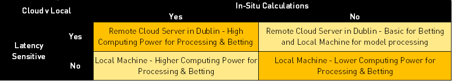
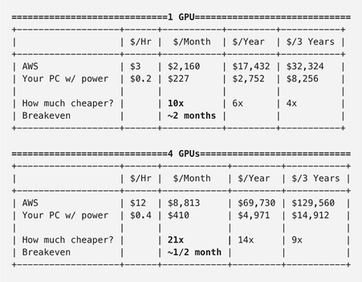

# Cloud Based Virtual Machines VS Local Machines in Machine Learning

---
## Introduction

In the world of machine learning, where datasets can become enormous and the computational power required to train a ML model increases, there is some debate circulating in the circles of the Automation world as to the benefits of using a local desktop or laptop (with or without GPU augmentation) versus utilisation of cloud serves (also known as “someone else’s computer”)

Local machines, with their tangible presence and direct accessibility, have long been the cornerstone of ML models. From individual laptops to high-performance desktops, these setups offer users a sense of control and familiarity. However, as ML models grow in complexity and dataset sizes swell, the limitations of local hardware become increasingly apparent.

On the other hand, cloud services emerge as a compelling alternative, promising virtually limitless computational resources on-demand. With services like Amazon Web Services (AWS), Google Cloud Platform (GCP), and Microsoft Azure, modellers can tap into vast arrays of CPUs, GPUs, and specialized accelerators, paying only for what they use. Yet, transitioning to the cloud introduces its own set of challenges, including cost management, security concerns, and navigating the myriad of available services.

## Understanding Your Requirements

To approach this, it is vital that you understand what you are trying to do and in what context a cloud based machine might be more functional than a local machine.

One potential solution to this conundrum would be to initially utilise a cloud-based solution to understand the computational requirements of your use-case, as you can easily increase or decrease processing power as required (which is effectively the same as trying out many different physical graphics cards or CPUs without investing time or money in physically performing this task). Once you understand the requirements, you could then look at investing in your own local machine tailored to your requirements. 

How then do you assess what your requirements are? Well first you should consider how you would look to implement a betting model. 

 - If your requirements involve intensive in-situ calculations as well as dependency on low latency, then it’s likely worth investing in that cloud server with high processing power. This could be something like calculating in-play probabilities on Horse Racing and then placing bets. 
 - If your requirements involve calculating probabilities for all races at the start of the day using a static dataset and then placing bets at BSP, a local machine should be sufficient for your requirements.
 - For latency sensitive strategies which don’t involve intensive in-situ calculations then a hybrid model could be considered (a basic cloud server for betting and local machine for processing)

## Pros & Cons

Let’s discuss the nuances between using local machines and the cloud for ML tasks. By delving into the strengths, weaknesses, and trade-offs of each approach, we aim to equip modeller with the insights necessary to make informed decisions tailored to their specific needs and objectives. 

### Local Machine

**Pros**

 - **Control and Privacy:** With a local machine, you have full control over your hardware and data, ensuring privacy and security, which is crucial when dealing with sensitive datasets or proprietary algorithms.
 - **Low User Latency:** Working directly on a local machine often results in lower latency, especially for tasks that require frequent interaction or real-time feedback, such as model development and experimentation.
 - **No Dependency on Internet Connectivity:** Since all computations are performed locally, you're not reliant on stable internet connectivity, making it suitable for environments with limited or intermittent internet access.
 - **One-time Cost:** While purchasing a high-performance local machine can be initially expensive, there are no ongoing subscription fees, making it cost-effective over the long term, especially for users with consistent computational needs.

**Cons**

 - **Limited Scalability:** The computational power of a local machine is finite and may not scale easily to handle large datasets or complex models, limiting the scope of your machine learning experiments.
 - **Hardware Constraints:** Upgrading hardware components, such as CPUs or GPUs, can be costly and time-consuming, potentially leading to bottlenecks in performance or compatibility issues with newer algorithms or frameworks.
 - **Maintenance Overhead:** Maintaining hardware infrastructure, installing software dependencies, and troubleshooting technical issues fall entirely on the user, consuming valuable time and resources that could be dedicated to actual model development and research.
 - **Risk of Data Loss:** Local machines are susceptible to hardware failures, theft, or natural disasters, putting your data at risk unless proper backup and disaster recovery measures are implemented.

### Cloud Computing

**Pros**

 - **Scalability and Flexibility:** Cloud platforms offer virtually unlimited scalability, allowing you to seamlessly scale up or down based on fluctuating computational demands, making it ideal for handling large-scale machine learning tasks or “bursty” workloads.
 - **Wide Range of Services:** Cloud providers offer a diverse array of managed services, including pre-configured virtual machines, GPU instances, and specialized AI accelerators, streamlining the setup and deployment of machine learning workflows.
 - **Pay-as-you-go Pricing:** Cloud computing follows a pay-as-you-go pricing model, where you only pay for the resources you consume, eliminating upfront hardware costs and providing cost-effective solutions for both small-scale experiments and large-scale production deployments.
 - **Collaboration and Accessibility:** Cloud platforms facilitate seamless collaboration among team members, enabling real-time sharing of data, code, and models regardless of geographical location, fostering a more collaborative and productive research environment.

**Cons**

 - **Potential Security Risks:** Entrusting sensitive data to a third-party cloud provider raises concerns about data privacy, security breaches, and regulatory compliance, necessitating robust encryption, access controls, and compliance measures to mitigate risks.
 - **Vendor Lock-in:** Adopting proprietary cloud services may result in vendor lock-in, where migrating to a different provider or transitioning back to on-premises infrastructure becomes challenging and costly due to dependencies on vendor-specific APIs and services.
 - **Latency and Network Overhead:** Cloud computing relies on internet connectivity, which introduces latency and network overhead, particularly for data-intensive machine learning tasks, potentially impacting performance and responsiveness.
 - **Cost Management Complexity:** While pay-as-you-go pricing offers cost flexibility, it also requires diligent monitoring and optimization to prevent cost overruns, as cloud bills can quickly escalate due to unexpected usage spikes, idle resources, or inefficient configurations.

## Cost Considerations

[This article](https://medium.com/the-mission/why-building-your-own-deep-learning-computer-is-10x-cheaper-than-aws-b1c91b55ce8c) maintains that building a local machine is cheaper than a cloud solution in the long run, especially when scaling up for models that require greater computing power. They performed a cost analysis to build your own local machine versus paying for cloud services (Analysis performed in 2018 in $USD)

As you can see, costs can begin to scale quickly when using cloud-based services, however, this is dependent on your computing requirements. In addition, there may also be the requirement to pay for your data storage when you’re not using the machine. 

## Hardware

If you make the decision to go down the route of a local machine, then it is possible to find second hand machines available at the fraction of the cost of a ready made new machine or building your own from new parts. The caveat here being that it is the responsibility of the user to ensure that any second hand hardware is properly wiped to safeguard the user’s data and privacy. 

Here are some aspects to consider when exploring this route:

 - **Cost Savings:** Second-hand hardware typically comes at a fraction of the cost of new equipment. This can be particularly advantageous for those on a tight budget or individuals who are just starting out in machine learning and want to experiment without significant financial investment.
 - **Availability of High-End Components:** As technology advances, high-performance hardware becomes more accessible in the second-hand market. You may find GPUs, CPUs, or even entire workstations with specifications that were considered top-of-the-line just a few years ago but are now available at significantly reduced prices.
 - **DIY Upgrades and Customization:** Buying second-hand hardware allows for customization and upgrades tailored to your specific machine learning requirements. You can mix and match components, such as adding more RAM or swapping out GPUs, to create a setup optimized for your workload.
 - **Environmental Sustainability:** Opting for second-hand hardware promotes sustainability by extending the lifespan of electronic devices and reducing electronic waste. By reusing existing equipment, you contribute to minimizing the environmental footprint associated with manufacturing new hardware.
 - **Risks and Caveats:** While purchasing second-hand hardware can offer substantial cost savings, it also comes with certain risks and caveats. Older hardware may lack support for the latest software frameworks or may be prone to hardware failures due to wear and tear. Additionally, warranties and technical support may be limited or non-existent, requiring users to be proficient in troubleshooting and maintenance.
 - **Research and Due Diligence:** Before making a purchase, it's essential to research the specifications, performance benchmarks, and compatibility of the second-hand hardware with your machine learning tasks. Look for reputable sellers or platforms that offer warranties, return policies, or verification of the hardware's condition to minimize the risk of receiving faulty or subpar equipment.
 - **Consider Future Scalability:** While second-hand hardware may meet your current needs, consider your future scalability requirements. Will the hardware be able to accommodate larger datasets or more computationally intensive models as your projects grow? Planning for future upgrades or expansion can help ensure that your investment remains viable in the long term.

## Conclusion

All in all, there is much to consider in this debate. Careful consideration of computing and betting requirements, budget and future-proofing should be entered into before making a decision on this front. However, whatever you have is a good place to start, so start there and only buy more when you run out of RAM, disk space or patience!

As always, there are many wise minds in our Quants Discord server with experience and advice on implementing these solutions who are more than happy to share their expertise. If you’d like to join the discussion, [fill out the form here](https://forms.office.com/r/ZG9ea1xQj1)