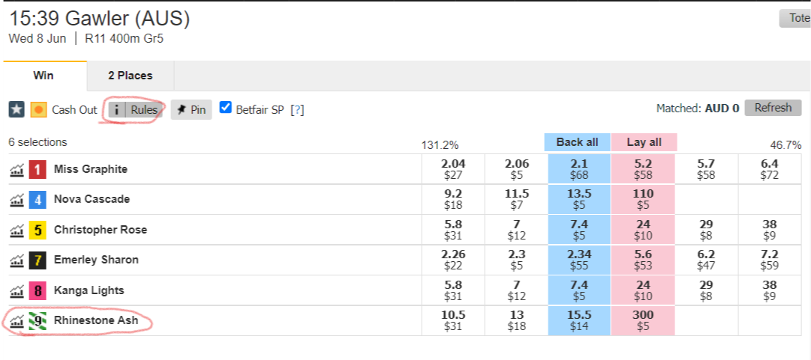

# How to Automate IV: Automate your own Model

---

For this tutorial we will be automating the model that Bruno taught us how to make in the Greyhound Modelling Tutorial. This tutorial follows on logically from [How to Automate III](../How_to_Automate_3). If you haven't already, make sure you take a look at the rest of the series first those before continuing here as they cover some key concepts!

I've actually rewritten this post multiple times and refactored/changed the code many times, if you have any suggestions for improvements, do let me know. If you have followed this tutorial before, there is an archived  versions of this tutorial are available [here](../How_to_Automate_4_archived)

---

Before we start let's think about what we are trying to achieve and build out a road map, our goal is to automate the model we built earlier. I've split it up into three main steps and a prerequisite step:

<ol start="0">
  <li>Before automating anything we need to save the model that we built in Bruno's tutorial </li>
  <li>Download live data </li>
  <li>Clean our data and create our features</li>
  <li>Generate predictions and automate our model</li>
</ol>

We will create three separate python scripts, one for each step. This will drastically reduce the complexity of our code and make things way easier to understand. We will be generating our model predictions about 1min before the scheduled start of the race, as this will allow us to account for things like scratchings, reserve dogs and we can confirm the box number. As always, the complete code will be available at the bottom of this post!

(You might think that because we split it up into three scripts you will need to click run on the first script, wait for it to finish executing before going on the next one, but we will use a way to link all the scripts together later on, so you can just hit go once!)

We will also create a separate fourth script that generates historical predictions which we can feed into our simulator for [How to Automate V](../How_to_Automate_5)

---

## Prerequisites

Before we even do anything here we need to save the model we learnt to build in the [Greyhound modelling in Python tutorial](../modelling/greyhoundModellingPython.ipynb), this is super simple as we can just need to run this extra line code (which I have copied from the [documentation page](https://scikit-learn.org/stable/model_persistence.html)) at the end of the notebook to save the model:

```
from joblib import dump
dump(models['LogisticRegression'], 'logistic_regression.joblib')
```

If you are following the tutorial and have cloned the github repo you won't actually need to do this, as I have saved the model in the repo and you can read it in directly. (You may have to fiddle with your working directory)

---

## Downloading live data

First off the bat is downloading live data i.e. data for today's races. My plan for this part is to reuse the original code that downloads/reads-in the historic data then also download the live data and add that on. Then we can save that as a csv (two: one for dog results and once for race details).

Downloading/reading-in the historic data is super simple as most of the code is copied from Bruno's greyhound modelling tutorial (which I've heard is copied from the original FastTrack tutorial). However, the data is stored in a monthly format which if you're not careful can lead to missing data. I've changed the code to a daily format which fixes this issue. However, this means if you followed the old tutorial you will need to need to redownload the data (from my experience the change to daily format is so worth it!).

I also have a pretty old and slow laptop and the pandas append method is being deprecated, so let's change it to the faster and more efficient concat method:

```py title="Downloading/reading-in historic data (code changes highlighted)" hl_lines="30 31 32 36 37 38"

    import os
    import sys
    import pandas as pd
    from datetime import datetime
    from dateutil.relativedelta import relativedelta

    # Allow imports from src folder
    module_path = os.path.abspath(os.path.join('src'))
    if module_path not in sys.path:
        sys.path.append(module_path)

    import fasttrack as ft
    from dotenv import load_dotenv
    load_dotenv()

    # Validate FastTrack API connection
    api_key = os.getenv('FAST_TRACK_API_KEY',)
    client = ft.Fasttrack(api_key)
    track_codes = client.listTracks()

    # Import race data excluding NZ races
    au_tracks_filter = list(track_codes[track_codes['state'] != 'NZ']['track_code'])

    # Time window to import data
    # First day of the month 46 months back from now
    date_from = (datetime.today() - relativedelta(months=46)).replace(day=1).strftime('%Y-%m-%d')
    # Download historic data up untill yesterday
    date_to = (datetime.today() - relativedelta(days=1)).strftime('%Y-%m-%d')

    # List to populate data with, convert to dataframe after fully populated
    race_details = []
    dog_results = []

    # Download/load historic (up until yesterday) data
    # For each day, either fetch data from API or use local CSV file if we already have downloaded it
    for start in pd.date_range(date_from, date_to, freq='d'):
        start_date = start.strftime("%Y-%m-%d")
        end_date = start_date
        try:
            filename_races = f'FT_AU_RACES_{start_date}.csv'
            filename_dogs = f'FT_AU_DOGS_{start_date}.csv'

            filepath_races = f'../data/{filename_races}'
            filepath_dogs = f'../data/{filename_dogs}'

            print(f'Loading data from {start_date} to {end_date}')
            if os.path.isfile(filepath_races):
                # Load local CSV file
                day_race_details = pd.read_csv(filepath_races) 
                day_dog_results = pd.read_csv(filepath_dogs) 
            else:
                # Fetch data from API
                day_race_details, day_dog_results = client.getRaceResults(start_date, end_date, au_tracks_filter)
                day_race_details.to_csv(filepath_races, index=False)
                day_dog_results.to_csv(filepath_dogs, index=False)

            # Combine daily data
            race_details.append(day_race_details)
            dog_results.append(day_dog_results)
        except:
            print(f'Could not load data from {start_date} to {end_date}')

```

Now let's download the live data from the FastTrack API:

```py 

    # Download todays data from the api
    todays_date = pd.Timestamp.now().strftime('%Y-%m-%d')
    todays_race_details, todays_dog_results = client.getFullFormat(todays_date)

```

The live data from the API has a few extra columns that we don't need and a few columns with different names, lets fixed that and combine the live data with historic and save it to a csv. 

```py 

    # Make live API data in the same form as historic data
    todays_race_details = todays_race_details.rename(columns={"Date":"date"})
    todays_dog_results = todays_dog_results.rename(columns={"RaceBox":"Box"})
    # Only keep the columns we have in the historic data
    usecols_race_details = ['@id','RaceNum','RaceName','RaceTime','Distance','RaceGrade','Track','date']
    usecols_dog_results = ['@id','DogName','Box','RaceId','TrainerId','TrainerName']
    # dog_results columns not in live data ['Place','Rug','Weight','StartPrice','Handicap','Margin1', 'Margin2','PIR','Checks','Comments','SplitMargin', 'RunTime', 'Prizemoney',]
    todays_race_details = todays_race_details[usecols_race_details]
    todays_dog_results = todays_dog_results[usecols_dog_results]

    # Now that todays data looks similar to our historic data lets add todays data to the rest of our historic data
    race_details.append(todays_race_details)
    dog_results.append(todays_dog_results)
    # Convert our data into a nice DataFrame
    race_details = pd.concat(race_details)
    dog_results = pd.concat(dog_results)

    # Save our data to csv files
    race_details.to_csv('../data/race_details.csv', index = False)
    dog_results.to_csv('../data/dog_results.csv', index = False)
    # Ready for data cleaning and feature creation

```

That's all the code for part 1 (how easy was that!), we are ready to create our features now.

---

## Data cleaning and feature creation

The second script gets everything ready to be fed into Flumine. So we will read in the data we downloaded in the first script, clean the data, create our features and set our DataFrame to be easily referenced like in [How to Automate III](../How_to_Automate_3).

We need to clean our data in the same way that we did when training our model. The great thing is it means we can copy and paste most of our code from Bruno's tutorial. Initially, all the code is the same, except we are going to add one extra line of code, highlighted at the bottom to save our box win percentages to a csv file. 

The reason is we can't reliably determine the Box number from FastTrack data when there are  reserve dogs. E.g. some reserve dogs will have RaceBox/Box 9 or 10 and if there is a scratching they may start from Box 1/2/3..8 etc. Therefore we can't merge box win percentages to our DataFrame until we start hitting the API in the third script.

```py title="Data cleaning" hl_lines="77"

    import numpy as np
    import pandas as pd
    # settings to display all columns
    pd.set_option("display.max_columns", None)
    from sklearn.preprocessing import MinMaxScaler
    import itertools

    race_details = pd.read_csv('../data/race_details.csv')
    dog_results = pd.read_csv('../data/dog_results.csv')

    ## Cleanse and normalise the data
    # Clean up the race dataset
    race_details = race_details.rename(columns = {'@id': 'FastTrack_RaceId'})
    race_details['Distance'] = race_details['Distance'].apply(lambda x: int(x.replace("m", "")))
    race_details['date_dt'] = pd.to_datetime(race_details['date'], format = '%d %b %y')
    # Clean up the dogs results dataset
    dog_results = dog_results.rename(columns = {'@id': 'FastTrack_DogId', 'RaceId': 'FastTrack_RaceId'})

    # Combine dogs results with race attributes
    dog_results = dog_results.merge(
        race_details, 
        how = 'left',
        on = 'FastTrack_RaceId'
    )

    # Convert StartPrice to probability
    dog_results['StartPrice'] = dog_results['StartPrice'].apply(lambda x: None if x is None else float(x.replace('$', '').replace('F', '')) if isinstance(x, str) else x)
    dog_results['StartPrice_probability'] = (1 / dog_results['StartPrice']).fillna(0)
    dog_results['StartPrice_probability'] = dog_results.groupby('FastTrack_RaceId')['StartPrice_probability'].apply(lambda x: x / x.sum())

    # Discard entries without results (scratched or did not finish)
    dog_results = dog_results[~dog_results['Box'].isnull()]
    dog_results['Box'] = dog_results['Box'].astype(int)

    # Clean up other attributes
    dog_results['RunTime'] = dog_results['RunTime'].astype(float)
    dog_results['SplitMargin'] = dog_results['SplitMargin'].astype(float)
    dog_results['Prizemoney'] = dog_results['Prizemoney'].astype(float).fillna(0)
    dog_results['Place'] = pd.to_numeric(dog_results['Place'].apply(lambda x: x.replace("=", "") if isinstance(x, str) else 0), errors='coerce').fillna(0)
    dog_results['win'] = dog_results['Place'].apply(lambda x: 1 if x == 1 else 0)

    # Normalise some of the raw values
    dog_results['Prizemoney_norm'] = np.log10(dog_results['Prizemoney'] + 1) / 12
    dog_results['Place_inv'] = (1 / dog_results['Place']).fillna(0)
    dog_results['Place_log'] = np.log10(dog_results['Place'] + 1).fillna(0)
    dog_results['RunSpeed'] = (dog_results['RunTime'] / dog_results['Distance']).fillna(0)

    ## Generate features using raw data
    # Calculate median winner time per track/distance
    win_results = dog_results[dog_results['win'] == 1]
    median_win_time = pd.DataFrame(data=win_results[win_results['RunTime'] > 0].groupby(['Track', 'Distance'])['RunTime'].median()).rename(columns={"RunTime": "RunTime_median"}).reset_index()
    median_win_split_time = pd.DataFrame(data=win_results[win_results['SplitMargin'] > 0].groupby(['Track', 'Distance'])['SplitMargin'].median()).rename(columns={"SplitMargin": "SplitMargin_median"}).reset_index()
    median_win_time.head()

    # Calculate track speed index
    median_win_time['speed_index'] = (median_win_time['RunTime_median'] / median_win_time['Distance'])
    median_win_time['speed_index'] = MinMaxScaler().fit_transform(median_win_time[['speed_index']])
    median_win_time.head()

    # Compare dogs finish time with median winner time
    dog_results = dog_results.merge(median_win_time, on=['Track', 'Distance'], how='left')
    dog_results = dog_results.merge(median_win_split_time, on=['Track', 'Distance'], how='left')

    # Normalise time comparison
    dog_results['RunTime_norm'] = (dog_results['RunTime_median'] / dog_results['RunTime']).clip(0.9, 1.1)
    dog_results['RunTime_norm'] = MinMaxScaler().fit_transform(dog_results[['RunTime_norm']])
    dog_results['SplitMargin_norm'] = (dog_results['SplitMargin_median'] / dog_results['SplitMargin']).clip(0.9, 1.1)
    dog_results['SplitMargin_norm'] = MinMaxScaler().fit_transform(dog_results[['SplitMargin_norm']])
    dog_results.head()

    # Calculate box winning percentage for each track/distance
    box_win_percent = pd.DataFrame(data=dog_results.groupby(['Track', 'Distance', 'Box'])['win'].mean()).rename(columns={"win": "box_win_percent"}).reset_index()
    # Add to dog results dataframe
    dog_results = dog_results.merge(box_win_percent, on=['Track', 'Distance', 'Box'], how='left')
    # Display example of barrier winning probabilities
    print(box_win_percent.head(8))
    box_win_percent.to_csv('../data/box_win_percentage.csv')
    
```

As a single greyhound can be a reserve dog for multiple races on the same day this creates a second issue for us. FastTrack will list each race a greyhound is a reserve in as a new row. For example, 'MACI REID' is a reserve dog for three different races on the 2022-09-02:


When we try lag our data by using `.shift(1)` like in Bruno's original code it will produce the wrong values for our features. In the above example only the first race The Gardens Race 4 (the third row) will have correct data but all the rows under it will have incorrectly calculated features. We need each of the following rows to be the same as the third row. The solution that I have come up with is a little bit complicated, but it gets the job done:

=== "Solution to reserve dogs"

    ```py

        # Please submit a pull request if you have a better solution
        temp = rolling_result.reset_index()
        temp = temp[temp['date_dt'] == pd.Timestamp.now().normalize()]
        temp.groupby(['FastTrack_DogId','date_dt']).first()
        rolling_result.loc[pd.IndexSlice[:, pd.Timestamp.now().normalize()], :] = temp.groupby(['FastTrack_DogId','date_dt']).first()

    ```

=== "Optimised code"

    Because my laptop is old and slow lets also make the code a little bit more efficient

    ```py title="Old inefficient code"

        # Add features to dataset
        dataset[agg_features_cols] = rolling_result

    ```

    ```py title="Optimised code"

        # More efficient method to add features to dataset
        rolling_result.columns = agg_features_cols
        dataset = pd.concat([dataset,rolling_result],axis = 1)

    ```

=== "Complete code chunk"

    So now our feature creation code looks like this:

    ```py title="Code changes highlighted" hl_lines="27 28 29 30 31 36 37 38"

        # Generate rolling window features
        dataset = dog_results.copy()
        dataset = dataset.set_index(['FastTrack_DogId', 'date_dt']).sort_index()

        # Use rolling window of 28, 91 and 365 days
        rolling_windows = ['28D', '91D', '365D']
        # Features to use for rolling windows calculation
        features = ['RunTime_norm', 'SplitMargin_norm', 'Place_inv', 'Place_log', 'Prizemoney_norm']
        # Aggregation functions to apply
        aggregates = ['min', 'max', 'mean', 'median', 'std']
        # Keep track of generated feature names
        feature_cols = ['speed_index', 'box_win_percent']

        for rolling_window in rolling_windows:
                print(f'Processing rolling window {rolling_window}')

                rolling_result = (
                    dataset
                    .reset_index(level=0).sort_index()
                    .groupby('FastTrack_DogId')[features]
                    .rolling(rolling_window)
                    .agg(aggregates)
                    .groupby(level=0)  # Thanks to Brett for finding this!
                    .shift(1)
                )

                # My own dodgey code to work with reserve dogs
                temp = rolling_result.reset_index()
                temp = temp[temp['date_dt'] == pd.Timestamp.now().normalize()]
                temp = temp.sort_index(axis=1)
                rolling_result.loc[pd.IndexSlice[:, pd.Timestamp.now().normalize()], :] = temp.groupby(['FastTrack_DogId','date_dt']).first()

                # Generate list of rolling window feature names (eg: RunTime_norm_min_365D)
                agg_features_cols = [f'{f}_{a}_{rolling_window}' for f, a in itertools.product(features, aggregates)]
                
                # More efficient method to add features to dataset
                rolling_result.columns = agg_features_cols
                dataset = pd.concat([dataset,rolling_result],axis = 1)
                
                # Keep track of generated feature names
                feature_cols.extend(agg_features_cols)

        # print(feature_cols) 
        # feature_cols = ['speed_index', 'box_win_percent', 'RunTime_norm_min_28D', 'RunTime_norm_max_28D', 'RunTime_norm_mean_28D', 'RunTime_norm_median_28D', 'RunTime_norm_std_28D', 'SplitMargin_norm_min_28D', 'SplitMargin_norm_max_28D', 'SplitMargin_norm_mean_28D', 'SplitMargin_norm_median_28D', 'SplitMargin_norm_std_28D', 'Place_inv_min_28D', 'Place_inv_max_28D', 'Place_inv_mean_28D', 'Place_inv_median_28D', 'Place_inv_std_28D', 'Place_log_min_28D', 'Place_log_max_28D', 'Place_log_mean_28D', 'Place_log_median_28D', 'Place_log_std_28D', 'Prizemoney_norm_min_28D', 'Prizemoney_norm_max_28D', 'Prizemoney_norm_mean_28D', 'Prizemoney_norm_median_28D', 'Prizemoney_norm_std_28D', 'RunTime_norm_min_91D', 'RunTime_norm_max_91D', 'RunTime_norm_mean_91D', 'RunTime_norm_median_91D', 'RunTime_norm_std_91D', 'SplitMargin_norm_min_91D', 'SplitMargin_norm_max_91D', 'SplitMargin_norm_mean_91D', 'SplitMargin_norm_median_91D', 'SplitMargin_norm_std_91D', 'Place_inv_min_91D', 'Place_inv_max_91D', 'Place_inv_mean_91D', 'Place_inv_median_91D', 'Place_inv_std_91D', 'Place_log_min_91D', 'Place_log_max_91D', 'Place_log_mean_91D', 'Place_log_median_91D', 'Place_log_std_91D', 'Prizemoney_norm_min_91D', 'Prizemoney_norm_max_91D', 'Prizemoney_norm_mean_91D', 'Prizemoney_norm_median_91D', 'Prizemoney_norm_std_91D', 'RunTime_norm_min_365D', 'RunTime_norm_max_365D', 'RunTime_norm_mean_365D', 'RunTime_norm_median_365D', 'RunTime_norm_std_365D', 'SplitMargin_norm_min_365D', 'SplitMargin_norm_max_365D', 'SplitMargin_norm_mean_365D', 'SplitMargin_norm_median_365D', 'SplitMargin_norm_std_365D', 'Place_inv_min_365D', 'Place_inv_max_365D', 'Place_inv_mean_365D', 'Place_inv_median_365D', 'Place_inv_std_365D', 'Place_log_min_365D', 'Place_log_max_365D', 'Place_log_mean_365D', 'Place_log_median_365D', 'Place_log_std_365D', 'Prizemoney_norm_min_365D', 'Prizemoney_norm_max_365D', 'Prizemoney_norm_mean_365D', 'Prizemoney_norm_median_365D', 'Prizemoney_norm_std_365D']

    ```

Following Bruno's code, we have a few lines of cleaning left that we can just copy and paste over. But afterwards we also need to do some minor formatting changes to the FastTrack names so we can match them onto the Betfair names. Betfair excludes all apostrophes and full stops in their naming convention, so we'll create a Betfair equivalent dog name on the dataset removing these characters. We also need to do this for the tracks, sometimes FastTrack will name tracks differently to Betfair e.g., Sandown Park from Betfair is known as Sandown (SAP) in the FastTrack database. I've also included a line in there to save the dataframe `model_df`, so we can use it to generate historical predictions in our fourth script.

```py
    # Replace missing values with 0
    dataset.fillna(0, inplace=True)
    print(dataset.head(8))

    # Only keep data after 2018-12-01
    model_df = dataset.reset_index()
    feature_cols = np.unique(feature_cols).tolist()
    model_df = model_df[model_df['date_dt'] >= '2018-12-01']

    # This line was originally part of Bruno's tutorial, but we don't run it in this script
    # model_df = model_df[['date_dt', 'FastTrack_RaceId', 'DogName', 'win', 'StartPrice_probability'] + feature_cols]

    # Only train model off of races where each dog has a value for each feature
    races_exclude = model_df[model_df.isnull().any(axis = 1)]['FastTrack_RaceId'].drop_duplicates()
    model_df = model_df[~model_df['FastTrack_RaceId'].isin(races_exclude)]
    model_df.to_csv('../data/model_df.csv')  # Save data for part_4

    # Select todays data and prepare data for easy reference in flumine
    todays_data = model_df[model_df['date_dt'] == pd.Timestamp.now().strftime('%Y-%m-%d')]
    todays_data['DogName_bf'] = todays_data['DogName'].apply(lambda x: x.replace("'", "").replace(".", "").replace("Res", "").strip())
    final_data.replace('Sandown (SAP)','Sandown Park',inplace = True)
    final_data.replace('Murray Bridge (MBR)','Murray Bridge',inplace = True)
    todays_data = todays_data.set_index(['DogName_bf','Track','RaceNum'])
    print(todays_data)

    todays_data.to_csv('../data/todays_data.csv', index = True)
```

Now we are done with our second script too! We have cleaned all our data and generated all but one of our features (Box) and our data is saved and ready to be fed into Flumine. We are now ready to move onto the third script and start making live predictions and betting. We have even saved some historic data for our fourth script so we can generate historic predictions.

---

## Automating our predictions

Before we can do our model predictions, we have one feature left to collect which is the box number a greyhound is racing from. Then we can do our final prediction, renormalise our probabilities so they sum to unity (100%) and start placing bets. We will also add on our Auto-terminate and bet logging code we learnt from previous tutorials.

If you look closely at the below screenshot, you will notice Rhinestone Ash is number 9. For non-reserve dogs (number one to eight), the number corresponds to the Box number, however reserve dogs will have a number such as 9 or 10 and there are only ever eight boxes. So, if any of the original line up is scratched the reserve dogs will be placed into one of the remaining boxes. FastTrack data won't give us which Box the reserve dog will go into, in fact it will give us Box 9 (which doesn't exist). So, we need some way to find the Box number it is actually racing from. I didn't notice this issue for quite a while, but the good thing is the website gives us the info we need to adjust:



If you click on rules, you can see what Box it is starting from:


After going through the [documentation](https://docs.developer.betfair.com/display/1smk3cen4v3lu3yomq5qye0ni/Betting+Type+Definitions#BettingTypeDefinitions-MarketDescription) again, changes to boxes are available through the API under the `clarifications` attribute of `marketDescription`. You will be able to access this within Flumine as `market.market_catalogue.description.clarifications`, but it's a bit weird. It returns box changes as a string that looks like this:


Originally, I had planned to leave this post as it is since, I've never worked with anything like this before and its already getting pretty long, however huge shoutout to [Brett](https://github.com/Landrin-br) from the Betfair Quants community who provided his solution to working with box changes.

```py title="Brett's Solution"
    from nltk.tokenize import regexp_tokenize
    # my_string is an example string, that you will need to get live from the api via: market.market_catalogue.description.clarifications.replace("<br> Dog","<br>Dog")
    my_string = "<br>Box changes:<br>Dog 9. Tralee Blaze starts from box no. 8<br><br>Dog 6. That Other One starts from box no. 2<br><br>"
    print(f'HTML Comment: {my_string}')
    pattern1 = r'(?<=<br>Dog ).+?(?= starts)'
    pattern2 = r"(?<=\bbox no. )(\w+)"
    runners_df = pd.DataFrame (regexp_tokenize(my_string, pattern1), columns = ['runner_name'])
    runners_df['runner_name'] = runners_df['runner_name'].astype(str)
    # Remove dog name from runner_number
    runners_df['runner_number'] = runners_df['runner_name'].apply(lambda x: x[:(x.find(" ") - 1)].upper())
    # Remove dog number from runner_name
    runners_df['runner_name'] = runners_df['runner_name'].apply(lambda x: x[(x.find(" ") + 1):].upper())
    runners_df['Box'] = regexp_tokenize(my_string, pattern2)
    runners_df

```

Running Brett's code will give us a DataFrame like this:


So now, if there are no changes in Boxes we can default to the FastTrack data, and if there are changes, we can replace Box in our original DataFrame (`todays_data`) with the info from `runners_df` and then we can merge our `box_win_percentage` feature across.

```py

    # Replace any old Box info in our original dataframe with data available in runners_df
    runners_df = runners_df.set_index('runner_name')
    todays_data.loc[(runners_df.index[runners_df.index.isin(dog_names)],track,race_number),'Box'] = runners_df.loc[runners_df.index.isin(dog_names),'Box'].to_list()
    # Merge box_win_percentage back on:
    todays_data = todays_data.drop(columns = 'box_win_percentage', axis = 1)
    todays_data = todays_data.reset_index().merge(box_win_percent, on = ['Track', 'Distance','Box'], how = 'left').set_index(['DogName_bf','Track','RaceNum'])

```

Since we are now editing our todays_data dataframe inside our Flumine strategy we will also need to convert todays_data to a global variable which is a simple one liner:

```py
   
   global todays_data

```


Now that we have all our features collected, we can predict our probabilities, renormalise and convert them to ratings

```py

    # Generate probabilities using Bruno's model
    todays_data.loc[(dog_names,track,race_number),'prob_LogisticRegression'] = brunos_model.predict_proba(todays_data.loc[(dog_names,track,race_number)][feature_cols])[:,1]
    # renomalise probabilities
    probabilities = todays_data.loc[dog_names,track,race_number]['prob_LogisticRegression']
    todays_data.loc[(dog_names,track,race_number),'renormalised_prob'] = probabilities/probabilities.sum()
    # convert probabilities to ratings
    todays_data.loc[(dog_names,track,race_number),'rating'] = 1/todays_data.loc[dog_names,track,race_number]['renormalised_prob']

```

Now that we have our data nicely set up. We can reference our probabilities by getting the DogName, Track and RaceNum from the Betfair polling API and after that the rest is the same as [How to Automate III](https://betfair-datascientists.github.io/api/How_to_Automate_3/).

I also wanted to call out one gotcha that, Brett found that is almost impossible to find unless you are keeping a close eye on your logs. Sometimes the polling API and streaming API doesn't match up when there are scratchings, so we need to check if it does:

```py

    # Check the polling API and streaming API matches up (sometimes it doesn't)
    if runner_cata.selection_id == runner.selection_id:

```

Okay, so I've just walked through different parts of code that I am introducing, lets bring it all together now.

Import our libraries, logging in and reading in our model and data:

```py
from flumine import Flumine, clients
from flumine import BaseStrategy 
from flumine.order.trade import Trade
from flumine.order.order import LimitOrder
from flumine.markets.market import Market
import betfairlightweight
from betfairlightweight.filters import streaming_market_filter
from betfairlightweight.resources import MarketBook
import re
import pandas as pd
import numpy as np
import datetime
import logging
from nltk.tokenize import regexp_tokenize
from joblib import load

# Credentials to login and logging in 
trading = betfairlightweight.APIClient('Username','Password',app_key='Appkey')
client = clients.BetfairClient(trading, interactive_login=True)

# Login
framework = Flumine(client=client)

# Code to login when using security certificates
# trading = betfairlightweight.APIClient('username','password',app_key='appkey', certs=r'C:\Users\zhoui\openssl_certs')
# client = clients.BetfairClient(trading)
# framework = Flumine(client=client)

# read in model and DataFrames
todays_data = pd.read_csv(r'D:\FastTrack_data\todays_data.csv', index_col=['DogName_bf','Track','RaceNum'])
box_win_percentages = pd.read_csv(r'D:\FastTrack_data\box_win_percentage.csv')
brunos_model = load(r'C:\Users\Ivan\Documents\GitHub\How-to-Automate-Public-Version\how_to_automate_IV\logistic_regression.joblib')
feature_cols = ['speed_index', 'box_win_percent', 'RunTime_norm_min_28D', 'RunTime_norm_max_28D', 'RunTime_norm_mean_28D', 'RunTime_norm_median_28D', 'RunTime_norm_std_28D', 'SplitMargin_norm_min_28D', 'SplitMargin_norm_max_28D', 'SplitMargin_norm_mean_28D', 'SplitMargin_norm_median_28D', 'SplitMargin_norm_std_28D', 'Place_inv_min_28D', 'Place_inv_max_28D', 'Place_inv_mean_28D', 'Place_inv_median_28D', 'Place_inv_std_28D', 'Place_log_min_28D', 'Place_log_max_28D', 'Place_log_mean_28D', 'Place_log_median_28D', 'Place_log_std_28D', 'Prizemoney_norm_min_28D', 'Prizemoney_norm_max_28D', 'Prizemoney_norm_mean_28D', 'Prizemoney_norm_median_28D', 'Prizemoney_norm_std_28D', 'RunTime_norm_min_91D', 'RunTime_norm_max_91D', 'RunTime_norm_mean_91D', 'RunTime_norm_median_91D', 'RunTime_norm_std_91D', 'SplitMargin_norm_min_91D', 'SplitMargin_norm_max_91D', 'SplitMargin_norm_mean_91D', 'SplitMargin_norm_median_91D', 'SplitMargin_norm_std_91D', 'Place_inv_min_91D', 'Place_inv_max_91D', 'Place_inv_mean_91D', 'Place_inv_median_91D', 'Place_inv_std_91D', 'Place_log_min_91D', 'Place_log_max_91D', 'Place_log_mean_91D', 'Place_log_median_91D', 'Place_log_std_91D', 'Prizemoney_norm_min_91D', 'Prizemoney_norm_max_91D', 'Prizemoney_norm_mean_91D', 'Prizemoney_norm_median_91D', 'Prizemoney_norm_std_91D', 'RunTime_norm_min_365D', 'RunTime_norm_max_365D', 'RunTime_norm_mean_365D', 'RunTime_norm_median_365D', 'RunTime_norm_std_365D', 'SplitMargin_norm_min_365D', 'SplitMargin_norm_max_365D', 'SplitMargin_norm_mean_365D', 'SplitMargin_norm_median_365D', 'SplitMargin_norm_std_365D', 'Place_inv_min_365D', 'Place_inv_max_365D', 'Place_inv_mean_365D', 'Place_inv_median_365D', 'Place_inv_std_365D', 'Place_log_min_365D', 'Place_log_max_365D', 'Place_log_mean_365D', 'Place_log_median_365D', 'Place_log_std_365D', 'Prizemoney_norm_min_365D', 'Prizemoney_norm_max_365D', 'Prizemoney_norm_mean_365D', 'Prizemoney_norm_median_365D', 'Prizemoney_norm_std_365D']
logging.basicConfig(filename = 'how_to_automate_4.log', level=logging.INFO, format='%(asctime)s:%(levelname)s:%(message)s')

```

Creating our Flumine Strategy:

```py

    class FlatBetting(BaseStrategy):
        def start(self) -> None:
            print("starting strategy 'FlatBetting' using the model we created the Greyhound modelling in Python Tutorial")

        def check_market_book(self, market: Market, market_book: MarketBook) -> bool:
            if market_book.status != "CLOSED":
                return True

        def process_market_book(self, market: Market, market_book: MarketBook) -> None:
            # Convert dataframe to a global variable
            global todays_data

            # At the 60 second mark:
            if market.seconds_to_start < 60 and market_book.inplay == False:
                # get the list of dog_names, name of the track/venue and race_number/RaceNum from Betfair Polling API
                dog_names = []
                track = market.market_catalogue.event.venue
                race_number = market.market_catalogue.market_name.split(' ',1)[0]  # comes out as R1/R2/R3 .. etc
                race_number = re.sub("[^0-9]", "", race_number)  # only keep the numbers 
                race_number = int(race_number)
                for runner_cata in market.market_catalogue.runners:
                    dog_name = runner_cata.runner_name.split(' ',1)[1].upper()
                    dog_names.append(dog_name)

                # Check if there are box changes, if there are then use Brett's code
                if market.market_catalogue.description.clarifications != None:
                    # Brett's code to get Box changes:
                    my_string = market.market_catalogue.description.clarifications.replace("<br> Dog","<br>Dog")
                    pattern1 = r'(?<=<br>Dog ).+?(?= starts)'
                    pattern2 = r"(?<=\bbox no. )(\w+)"
                    runners_df = pd.DataFrame (regexp_tokenize(my_string, pattern1), columns = ['runner_name'])
                    runners_df['runner_name'] = runners_df['runner_name'].astype(str)
                    # Remove dog name from runner_number
                    runners_df['runner_number'] = runners_df['runner_name'].apply(lambda x: x[:(x.find(" ") - 1)].upper())
                    # Remove dog number from runner_name
                    runners_df['runner_name'] = runners_df['runner_name'].apply(lambda x: x[(x.find(" ") + 1):].upper())
                    runners_df['Box'] = regexp_tokenize(my_string, pattern2)

                    # Replace any old Box info in our original dataframe with data available in runners_df
                    runners_df = runners_df.set_index('runner_name')
                    todays_data.loc[(runners_df.index[runners_df.index.isin(dog_names)],track,race_number),'Box'] = runners_df.loc[runners_df.index.isin(dog_names),'Box'].to_list()
                    # Merge box_win_percentage back on:
                    todays_data = todays_data.drop(columns = 'box_win_percentage', axis = 1)
                    todays_data = todays_data.reset_index().merge(box_win_percent, on = ['Track', 'Distance','Box'], how = 'left').set_index(['DogName_bf','Track','RaceNum'])

                # Generate probabilities using Bruno's model
                todays_data.loc[(dog_names,track,race_number),'prob_LogisticRegression'] = brunos_model.predict_proba(todays_data.loc[(dog_names,track,race_number)][feature_cols])[:,1]
                # renomalise probabilities
                probabilities = todays_data.loc[dog_names,track,race_number]['prob_LogisticRegression']
                todays_data.loc[(dog_names,track,race_number),'renormalised_prob'] = probabilities/probabilities.sum()
                # convert probaiblities to ratings
                todays_data.loc[(dog_names,track,race_number),'rating'] = 1/todays_data.loc[dog_names,track,race_number]['renormalised_prob']

                # Use both the polling api (market.catalogue) and the streaming api at once:
                for runner_cata, runner in zip(market.market_catalogue.runners, market_book.runners):
                    # Check the polling api and streaming api matches up (sometimes it doesn't)
                    if runner_cata.selection_id == runner.selection_id:
                        # Get the dog_name from polling api then reference our data for our model rating
                        dog_name = runner_cata.runner_name.split(' ',1)[1].upper()

                        # Rest is the same as How to Automate III
                        model_price = todays_data.loc[dog_name,track,race_number]['rating']
                        ### If you have an issue such as:
                            # Unknown error The truth value of a Series is ambiguous. Use a.empty, a.bool(), a.item(), a.any() or a.all().
                            # Then do model_price = todays_data.loc[dog_name,track,race_number]['rating'].item()

                        # Log info before placing bets
                        logging.info(f'dog_name: {dog_name}')
                        logging.info(f'model_price: {model_price}')
                        logging.info(f'market_id: {market_book.market_id}')
                        logging.info(f'selection_id: {runner.selection_id}')

                        # If best available to back price is > rated price then flat $5 back
                        if runner.status == "ACTIVE" and runner.ex.available_to_back[0]['price'] > model_price:
                            trade = Trade(
                            market_id=market_book.market_id,
                            selection_id=runner.selection_id,
                            handicap=runner.handicap,
                            strategy=self,
                            )
                            order = trade.create_order(
                                side="BACK", order_type=LimitOrder(price=runner.ex.available_to_back[0]['price'], size=5.00)
                            )
                            market.place_order(order)
                        # If best available to lay price is < rated price then flat $5 lay
                        if runner.status == "ACTIVE" and runner.ex.available_to_lay[0]['price'] < model_price:
                            trade = Trade(
                            market_id=market_book.market_id,
                            selection_id=runner.selection_id,
                            handicap=runner.handicap,
                            strategy=self,
                            )
                            order = trade.create_order(
                                side="LAY", order_type=LimitOrder(price=runner.ex.available_to_lay[0]['price'], size=5.00)
                            )
                            market.place_order(order)

```

As the model we have built is a greyhound model for Australian racing let's point our strategy to Australian greyhound win markets

```py

    greyhounds_strategy = FlatBetting(
        market_filter=streaming_market_filter(
            event_type_ids=["4339"], # Greyhounds markets
            country_codes=["AU"], # Australian markets
            market_types=["WIN"], # Win markets
        ),
        max_order_exposure= 50, # Max exposure per order = 50
        max_trade_count=1, # Max 1 trade per selection
        max_live_trade_count=1, # Max 1 unmatched trade per selection
    )

    framework.add_strategy(greyhounds_strategy)

```

And add our auto-terminate and bet logging from the previous tutorials:

```py

    # import logging
    import datetime
    from flumine.worker import BackgroundWorker
    from flumine.events.events import TerminationEvent

    # logger = logging.getLogger(__name__)

    """
    Worker can be used as followed:
        framework.add_worker(
            BackgroundWorker(
                framework,
                terminate,
                func_kwargs={"today_only": True, "seconds_closed": 1200},
                interval=60,
                start_delay=60,
            )
        )
    This will run every 60s and will terminate 
    the framework if all markets starting 'today' 
    have been closed for at least 1200s
    """


    # Function that stops automation running at the end of the day
    def terminate(
        context: dict, flumine, today_only: bool = True, seconds_closed: int = 600
    ) -> None:
        """terminate framework if no markets
        live today.
        """
        markets = list(flumine.markets.markets.values())
        markets_today = [
            m
            for m in markets
            if m.market_start_datetime.date() == datetime.datetime.utcnow().date()
            and (
                m.elapsed_seconds_closed is None
                or (m.elapsed_seconds_closed and m.elapsed_seconds_closed < seconds_closed)
            )
        ]
        if today_only:
            market_count = len(markets_today)
        else:
            market_count = len(markets)
        if market_count == 0:
            # logger.info("No more markets available, terminating framework")
            flumine.handler_queue.put(TerminationEvent(flumine))

    # Add the stopped to our framework
    framework.add_worker(
        BackgroundWorker(
            framework,
            terminate,
            func_kwargs={"today_only": True, "seconds_closed": 1200},
            interval=60,
            start_delay=60,
        )
    )

import os
import csv
import logging
from flumine.controls.loggingcontrols import LoggingControl
from flumine.order.ordertype import OrderTypes

logger = logging.getLogger(__name__)

FIELDNAMES = [
    "bet_id",
    "strategy_name",
    "market_id",
    "selection_id",
    "trade_id",
    "date_time_placed",
    "price",
    "price_matched",
    "size",
    "size_matched",
    "profit",
    "side",
    "elapsed_seconds_executable",
    "order_status",
    "market_note",
    "trade_notes",
    "order_notes",
]


class LiveLoggingControl(LoggingControl):
    NAME = "BACKTEST_LOGGING_CONTROL"

    def __init__(self, *args, **kwargs):
        super(LiveLoggingControl, self).__init__(*args, **kwargs)
        self._setup()

    # Changed file path and checks if the file orders_hta_4.csv already exists, if it doens't then create it
    def _setup(self):
        if os.path.exists("orders_hta_4.csv"):
            logging.info("Results file exists")
        else:
            with open("orders_hta_4.csv", "w") as m:
                csv_writer = csv.DictWriter(m, delimiter=",", fieldnames=FIELDNAMES)
                csv_writer.writeheader()

    def _process_cleared_orders_meta(self, event):
        orders = event.event
        with open("orders_hta_4.csv", "a") as m:
            for order in orders:
                if order.order_type.ORDER_TYPE == OrderTypes.LIMIT:
                    size = order.order_type.size
                else:
                    size = order.order_type.liability
                if order.order_type.ORDER_TYPE == OrderTypes.MARKET_ON_CLOSE:
                    price = None
                else:
                    price = order.order_type.price
                try:
                    order_data = {
                        "bet_id": order.bet_id,
                        "strategy_name": order.trade.strategy,
                        "market_id": order.market_id,
                        "selection_id": order.selection_id,
                        "trade_id": order.trade.id,
                        "date_time_placed": order.responses.date_time_placed,
                        "price": price,
                        "price_matched": order.average_price_matched,
                        "size": size,
                        "size_matched": order.size_matched,
                        "profit": 0 if not order.cleared_order else order.cleared_order.profit,
                        "side": order.side,
                        "elapsed_seconds_executable": order.elapsed_seconds_executable,
                        "order_status": order.status.value,
                        "market_note": order.trade.market_notes,
                        "trade_notes": order.trade.notes_str,
                        "order_notes": order.notes_str,
                    }
                    csv_writer = csv.DictWriter(m, delimiter=",", fieldnames=FIELDNAMES)
                    csv_writer.writerow(order_data)
                except Exception as e:
                    logger.error(
                        "_process_cleared_orders_meta: %s" % e,
                        extra={"order": order, "error": e},
                    )

        logger.info("Orders updated", extra={"order_count": len(orders)})

    def _process_cleared_markets(self, event):
        cleared_markets = event.event
        for cleared_market in cleared_markets.orders:
            logger.info(
                "Cleared market",
                extra={
                    "market_id": cleared_market.market_id,
                    "bet_count": cleared_market.bet_count,
                    "profit": cleared_market.profit,
                    "commission": cleared_market.commission,
                },
            )

framework.add_logging_control(
    LiveLoggingControl()
)

```

```py

framework.run()

```

And we are all done. Lets GOOOO!!!
Once you run this script, 1 minute from the scheduled start of the race it will creating our predictions and start placing $5 bets. 

--

## Generating historical predictions 

Feeding our predictions through the simulator is entirely optional, but, in my opinion it is where the real sauce is made. The idea is that if we are testing our model live, we can also use the simulator to test what would happen if we tested different staking methodologies, market timings and bet placement to optimise our model. This way you can have a model but test out different strategies to optimise model performance. The thing is, I have had a play with the simulator already and we can't simulate market_catalogue unless you have recorded it yourself (which is what I'll be using to get market_id and selection_id to place live bets). The simulator we will use later on will only take your ratings, market_id and selection_id, so we need our data in a similar format to what we had in How to automate III. In other words, since we don't have market_catalogue in the simulator, we need another way to get the market_id and selection_id.

My hacky work around is to generate the probabilities like normal, using basically the same code as above, and since the data is historical its actually even easier as we don't need to deal with reserve dogs and scratching's. Once we have our model predictions, we cheat and get the market_id and selection_id from the Betfair datascience greyhound model by merging on DogName and date. We can take the code we wrote in [How to automate III](../How_to_Automate_3) that downloads the greyhound ratings and convert that into a function that downloads the ratings for a date range. This is what the complete code looks like:

```py 

    import pandas as pd
    from joblib import load

    model_df = pd.read_csv('../data/model_df.csv')
    feature_cols = ['speed_index', 'box_win_percent', 'RunTime_norm_min_28D', 'RunTime_norm_max_28D', 'RunTime_norm_mean_28D', 'RunTime_norm_median_28D', 'RunTime_norm_std_28D', 'SplitMargin_norm_min_28D', 'SplitMargin_norm_max_28D', 'SplitMargin_norm_mean_28D', 'SplitMargin_norm_median_28D', 'SplitMargin_norm_std_28D', 'Place_inv_min_28D', 'Place_inv_max_28D', 'Place_inv_mean_28D', 'Place_inv_median_28D', 'Place_inv_std_28D', 'Place_log_min_28D', 'Place_log_max_28D', 'Place_log_mean_28D', 'Place_log_median_28D', 'Place_log_std_28D', 'Prizemoney_norm_min_28D', 'Prizemoney_norm_max_28D', 'Prizemoney_norm_mean_28D', 'Prizemoney_norm_median_28D', 'Prizemoney_norm_std_28D', 'RunTime_norm_min_91D', 'RunTime_norm_max_91D', 'RunTime_norm_mean_91D', 'RunTime_norm_median_91D', 'RunTime_norm_std_91D', 'SplitMargin_norm_min_91D', 'SplitMargin_norm_max_91D', 'SplitMargin_norm_mean_91D', 'SplitMargin_norm_median_91D', 'SplitMargin_norm_std_91D', 'Place_inv_min_91D', 'Place_inv_max_91D', 'Place_inv_mean_91D', 'Place_inv_median_91D', 'Place_inv_std_91D', 'Place_log_min_91D', 'Place_log_max_91D', 'Place_log_mean_91D', 'Place_log_median_91D', 'Place_log_std_91D', 'Prizemoney_norm_min_91D', 'Prizemoney_norm_max_91D', 'Prizemoney_norm_mean_91D', 'Prizemoney_norm_median_91D', 'Prizemoney_norm_std_91D', 'RunTime_norm_min_365D', 'RunTime_norm_max_365D', 'RunTime_norm_mean_365D', 'RunTime_norm_median_365D', 'RunTime_norm_std_365D', 'SplitMargin_norm_min_365D', 'SplitMargin_norm_max_365D', 'SplitMargin_norm_mean_365D', 'SplitMargin_norm_median_365D', 'SplitMargin_norm_std_365D', 'Place_inv_min_365D', 'Place_inv_max_365D', 'Place_inv_mean_365D', 'Place_inv_median_365D', 'Place_inv_std_365D', 'Place_log_min_365D', 'Place_log_max_365D', 'Place_log_mean_365D', 'Place_log_median_365D', 'Place_log_std_365D', 'Prizemoney_norm_min_365D', 'Prizemoney_norm_max_365D', 'Prizemoney_norm_mean_365D', 'Prizemoney_norm_median_365D', 'Prizemoney_norm_std_365D']
    brunos_model = load('../data/logistic_regression.joblib')

    # Generate predictions like normal
    # Range of dates that we want to simulate later '2022-03-01' to '2022-04-01'
    model_df['date_dt'] = pd.to_datetime(model_df['date_dt'])
    todays_data = model_df[(model_df['date_dt'] >= pd.Timestamp('2022-03-01').strftime('%Y-%m-%d')) & (model_df['date_dt'] < pd.Timestamp('2022-04-01').strftime('%Y-%m-%d'))]
    dog_win_probabilities = brunos_model.predict_proba(todays_data[feature_cols])[:,1]
    todays_data['prob_LogisticRegression'] = dog_win_probabilities
    todays_data['renormalise_prob'] = todays_data.groupby('FastTrack_RaceId')['prob_LogisticRegression'].apply(lambda x: x / x.sum())
    todays_data['rating'] = 1/todays_data['renormalise_prob']
    todays_data = todays_data.sort_values(by = 'date_dt')
    todays_data

    def download_iggy_ratings(date):
        """Downloads the Betfair Iggy model ratings for a given date and formats it into a nice DataFrame.

        Args:
            date (datetime): the date we want to download the ratings for
        """
        iggy_url_1 = 'https://betfair-data-supplier-prod.herokuapp.com/api/widgets/iggy-joey/datasets?date='
        iggy_url_2 = date.strftime("%Y-%m-%d")
        iggy_url_3 = '&presenter=RatingsPresenter&csv=true'
        iggy_url = iggy_url_1 + iggy_url_2 + iggy_url_3

        # Download todays greyhounds ratings
        iggy_df = pd.read_csv(iggy_url)

        # Data clearning
        iggy_df = iggy_df.rename(
        columns={
            "meetings.races.bfExchangeMarketId":"market_id",
            "meetings.races.runners.bfExchangeSelectionId":"selection_id",
            "meetings.races.runners.ratedPrice":"rating",
            "meetings.races.number":"RaceNum",
            "meetings.name":"Track",
            "meetings.races.runners.name":"DogName"
            }
        )
        # iggy_df = iggy_df[['market_id','selection_id','rating']]
        iggy_df['market_id'] = iggy_df['market_id'].astype(str)
        iggy_df['date_dt'] = date

        # Set market_id and selection_id as index for easy referencing
        # iggy_df = iggy_df.set_index(['market_id','selection_id'])
        return(iggy_df)

    # Download historical ratings over a time period and convert into a big DataFrame.
    back_test_period = pd.date_range(start='2022-03-01', end='2022-04-01')
    frames = [download_iggy_ratings(day) for day in back_test_period]
    iggy_df = pd.concat(frames)
    iggy_df

    # format DogNames to merge
    todays_data['DogName'] = todays_data['DogName'].apply(lambda x: x.replace("'", "").replace(".", "").replace("Res", "").strip())
    iggy_df['DogName'] = iggy_df['DogName'].str.upper()
    # Merge
    backtest = iggy_df[['market_id','selection_id','DogName','date_dt']].merge(todays_data[['rating','DogName','date_dt']], how = 'inner', on = ['DogName','date_dt'])
    backtest

    # Save predictions for if we want to backtest/simulate it later
    backtest.to_csv('../data/backtest.csv', index=False) # Csv format

```

---

## Conclusions and next steps

Boom! We now have a set of automated script that will download all the data we need in the morning, generates a set of predictions, place flat stakes bets, logs all bets and switches itself off at the end of the day. (If you look in the github repo you will find a script that links all three scripts together so all we need to do is hit play once in the morning!)

We have now written code automation code for three different strategies, however we haven't actually backtested any of our strategies or models yet. So for the final part of the How to Automate series we will be writing code to How to simulate the Exchange to backtest and optimise our strategies. Make sure not to miss it as this is where I believe the sauce is made (not that I have made significant sauce).

### Complete code

Run the code from your ide by using py `<filename>`.py, making sure you amend the path to point to your input data.

=== "Part 1"

    [Download from Github](https://github.com/betfair-down-under/autoHubTutorials/tree/master/howToAutomate/how_to_automate_IV)

    ```py

        import os
        import sys
        import pandas as pd
        from datetime import datetime
        from dateutil.relativedelta import relativedelta

        # Allow imports from src folder
        module_path = os.path.abspath(os.path.join('src'))
        if module_path not in sys.path:
            sys.path.append(module_path)

        import fasttrack as ft
        from dotenv import load_dotenv
        load_dotenv()

        # Validate FastTrack API connection
        api_key = os.getenv('FAST_TRACK_API_KEY',)
        client = ft.Fasttrack(api_key)
        track_codes = client.listTracks()

        # Import race data excluding NZ races
        au_tracks_filter = list(track_codes[track_codes['state'] != 'NZ']['track_code'])

        # Time window to import data
        # First day of the month 46 months back from now
        date_from = (datetime.today() - relativedelta(months=46)).replace(day=1).strftime('%Y-%m-%d')
        # Download historic data up untill yesterday
        date_to = (datetime.today() - relativedelta(days=1)).strftime('%Y-%m-%d')

        # List to populate data with, convert to dataframe after fully populated
        race_details = []
        dog_results = []

        # Download/load historic (up until yesterday) data
        # For each day, either fetch data from API or use local CSV file if we already have downloaded it
        for start in pd.date_range(date_from, date_to, freq='d'):
            start_date = start.strftime("%Y-%m-%d")
            end_date = start_date
            try:
                filename_races = f'FT_AU_RACES_{start_date}.csv'
                filename_dogs = f'FT_AU_DOGS_{start_date}.csv'

                filepath_races = f'../data/{filename_races}'
                filepath_dogs = f'../data/{filename_dogs}'

                print(f'Loading data from {start_date} to {end_date}')
                if os.path.isfile(filepath_races):
                    # Load local CSV file
                    day_race_details = pd.read_csv(filepath_races) 
                    day_dog_results = pd.read_csv(filepath_dogs) 
                else:
                    # Fetch data from API
                    day_race_details, day_dog_results = client.getRaceResults(start_date, end_date, au_tracks_filter)
                    day_race_details.to_csv(filepath_races, index=False)
                    day_dog_results.to_csv(filepath_dogs, index=False)

                # Combine daily data
                race_details.append(day_race_details)
                dog_results.append(day_dog_results)
            except:
                print(f'Could not load data from {start_date} to {end_date}')

        # Download todays data from the api
        todays_date = pd.Timestamp.now().strftime('%Y-%m-%d')
        todays_race_details, todays_dog_results = client.getFullFormat(todays_date)

        # Make live API data in the same form as historic data
        todays_race_details = todays_race_details.rename(columns={"Date":"date"})
        todays_dog_results = todays_dog_results.rename(columns={"RaceBox":"Box"})
        # Only keep the columns we have in the historic data
        usecols_race_details = ['@id','RaceNum','RaceName','RaceTime','Distance','RaceGrade','Track','date']
        usecols_dog_results = ['@id','DogName','Box','RaceId','TrainerId','TrainerName']
        # dog_results columns not in live data ['Place','Rug','Weight','StartPrice','Handicap','Margin1', 'Margin2','PIR','Checks','Comments','SplitMargin', 'RunTime', 'Prizemoney',]
        todays_race_details = todays_race_details[usecols_race_details]
        todays_dog_results = todays_dog_results[usecols_dog_results]

        # Now that todays data looks similar to our historic data lets add todays data to the rest of our historic data
        race_details.append(todays_race_details)
        dog_results.append(todays_dog_results)
        # Convert our data into a nice DataFrame
        race_details = pd.concat(race_details)
        dog_results = pd.concat(dog_results)

        # Save our data to csv files
        race_details.to_csv('../data/race_details.csv', index = False)
        dog_results.to_csv('../data/dog_results.csv', index = False)
        # Ready for data cleaning and feature creation

    ```

=== "Part 2"

    [Download from Github](https://github.com/betfair-down-under/autoHubTutorials/tree/master/howToAutomate/how_to_automate_IV)

    ```py

        import numpy as np
        import pandas as pd
        # settings to display all columns
        pd.set_option("display.max_columns", None)
        from sklearn.preprocessing import MinMaxScaler
        import itertools

        race_details = pd.read_csv('../data/race_details.csv')
        dog_results = pd.read_csv('../data/dog_results.csv')

        ## Cleanse and normalise the data
        # Clean up the race dataset
        race_details = race_details.rename(columns = {'@id': 'FastTrack_RaceId'})
        race_details['Distance'] = race_details['Distance'].apply(lambda x: int(x.replace("m", "")))
        race_details['date_dt'] = pd.to_datetime(race_details['date'], format = '%d %b %y')
        # Clean up the dogs results dataset
        dog_results = dog_results.rename(columns = {'@id': 'FastTrack_DogId', 'RaceId': 'FastTrack_RaceId'})

        # Combine dogs results with race attributes
        dog_results = dog_results.merge(
            race_details, 
            how = 'left',
            on = 'FastTrack_RaceId'
        )

        # Convert StartPrice to probability
        dog_results['StartPrice'] = dog_results['StartPrice'].apply(lambda x: None if x is None else float(x.replace('$', '').replace('F', '')) if isinstance(x, str) else x)
        dog_results['StartPrice_probability'] = (1 / dog_results['StartPrice']).fillna(0)
        dog_results['StartPrice_probability'] = dog_results.groupby('FastTrack_RaceId')['StartPrice_probability'].apply(lambda x: x / x.sum())

        # Discard entries without results (scratched or did not finish)
        dog_results = dog_results[~dog_results['Box'].isnull()]
        dog_results['Box'] = dog_results['Box'].astype(int)

        # Clean up other attributes
        dog_results['RunTime'] = dog_results['RunTime'].astype(float)
        dog_results['SplitMargin'] = dog_results['SplitMargin'].astype(float)
        dog_results['Prizemoney'] = dog_results['Prizemoney'].astype(float).fillna(0)
        dog_results['Place'] = pd.to_numeric(dog_results['Place'].apply(lambda x: x.replace("=", "") if isinstance(x, str) else 0), errors='coerce').fillna(0)
        dog_results['win'] = dog_results['Place'].apply(lambda x: 1 if x == 1 else 0)

        # Normalise some of the raw values
        dog_results['Prizemoney_norm'] = np.log10(dog_results['Prizemoney'] + 1) / 12
        dog_results['Place_inv'] = (1 / dog_results['Place']).fillna(0)
        dog_results['Place_log'] = np.log10(dog_results['Place'] + 1).fillna(0)
        dog_results['RunSpeed'] = (dog_results['RunTime'] / dog_results['Distance']).fillna(0)

        ## Generate features using raw data
        # Calculate median winner time per track/distance
        win_results = dog_results[dog_results['win'] == 1]
        median_win_time = pd.DataFrame(data=win_results[win_results['RunTime'] > 0].groupby(['Track', 'Distance'])['RunTime'].median()).rename(columns={"RunTime": "RunTime_median"}).reset_index()
        median_win_split_time = pd.DataFrame(data=win_results[win_results['SplitMargin'] > 0].groupby(['Track', 'Distance'])['SplitMargin'].median()).rename(columns={"SplitMargin": "SplitMargin_median"}).reset_index()
        median_win_time.head()

        # Calculate track speed index
        median_win_time['speed_index'] = (median_win_time['RunTime_median'] / median_win_time['Distance'])
        median_win_time['speed_index'] = MinMaxScaler().fit_transform(median_win_time[['speed_index']])
        median_win_time.head()

        # Compare dogs finish time with median winner time
        dog_results = dog_results.merge(median_win_time, on=['Track', 'Distance'], how='left')
        dog_results = dog_results.merge(median_win_split_time, on=['Track', 'Distance'], how='left')

        # Normalise time comparison
        dog_results['RunTime_norm'] = (dog_results['RunTime_median'] / dog_results['RunTime']).clip(0.9, 1.1)
        dog_results['RunTime_norm'] = MinMaxScaler().fit_transform(dog_results[['RunTime_norm']])
        dog_results['SplitMargin_norm'] = (dog_results['SplitMargin_median'] / dog_results['SplitMargin']).clip(0.9, 1.1)
        dog_results['SplitMargin_norm'] = MinMaxScaler().fit_transform(dog_results[['SplitMargin_norm']])
        dog_results.head()

        # Calculate box winning percentage for each track/distance
        box_win_percent = pd.DataFrame(data=dog_results.groupby(['Track', 'Distance', 'Box'])['win'].mean()).rename(columns={"win": "box_win_percent"}).reset_index()
        # Add to dog results dataframe
        dog_results = dog_results.merge(box_win_percent, on=['Track', 'Distance', 'Box'], how='left')
        # Display example of barrier winning probabilities
        print(box_win_percent.head(8))
        box_win_percent.to_csv('../data/box_win_percentage.csv')

        # Generate rolling window features
        dataset = dog_results.copy()
        dataset = dataset.set_index(['FastTrack_DogId', 'date_dt']).sort_index()

        # Use rolling window of 28, 91 and 365 days
        rolling_windows = ['28D', '91D', '365D']
        # Features to use for rolling windows calculation
        features = ['RunTime_norm', 'SplitMargin_norm', 'Place_inv', 'Place_log', 'Prizemoney_norm']
        # Aggregation functions to apply
        aggregates = ['min', 'max', 'mean', 'median', 'std']
        # Keep track of generated feature names
        feature_cols = ['speed_index', 'box_win_percent']

        for rolling_window in rolling_windows:
                print(f'Processing rolling window {rolling_window}')

                rolling_result = (
                    dataset
                    .reset_index(level=0).sort_index()
                    .groupby('FastTrack_DogId')[features]
                    .rolling(rolling_window)
                    .agg(aggregates)
                    .groupby(level=0)  # Thanks to Brett for finding this!
                    .shift(1)
                )

                # My own dodgey code to work with reserve dogs
                temp = rolling_result.reset_index()
                temp = temp[temp['date_dt'] == pd.Timestamp.now().normalize()]
                temp = temp.sort_index(axis=1)
                rolling_result.loc[pd.IndexSlice[:, pd.Timestamp.now().normalize()], :] = temp.groupby(['FastTrack_DogId','date_dt']).first()

                # Generate list of rolling window feature names (eg: RunTime_norm_min_365D)
                agg_features_cols = [f'{f}_{a}_{rolling_window}' for f, a in itertools.product(features, aggregates)]
                
                # More efficient method to add features to dataset
                rolling_result.columns = agg_features_cols
                dataset = pd.concat([dataset,rolling_result],axis = 1)
                
                # Keep track of generated feature names
                feature_cols.extend(agg_features_cols)

        # print(feature_cols) 
        # feature_cols = ['speed_index', 'box_win_percent', 'RunTime_norm_min_28D', 'RunTime_norm_max_28D', 'RunTime_norm_mean_28D', 'RunTime_norm_median_28D', 'RunTime_norm_std_28D', 'SplitMargin_norm_min_28D', 'SplitMargin_norm_max_28D', 'SplitMargin_norm_mean_28D', 'SplitMargin_norm_median_28D', 'SplitMargin_norm_std_28D', 'Place_inv_min_28D', 'Place_inv_max_28D', 'Place_inv_mean_28D', 'Place_inv_median_28D', 'Place_inv_std_28D', 'Place_log_min_28D', 'Place_log_max_28D', 'Place_log_mean_28D', 'Place_log_median_28D', 'Place_log_std_28D', 'Prizemoney_norm_min_28D', 'Prizemoney_norm_max_28D', 'Prizemoney_norm_mean_28D', 'Prizemoney_norm_median_28D', 'Prizemoney_norm_std_28D', 'RunTime_norm_min_91D', 'RunTime_norm_max_91D', 'RunTime_norm_mean_91D', 'RunTime_norm_median_91D', 'RunTime_norm_std_91D', 'SplitMargin_norm_min_91D', 'SplitMargin_norm_max_91D', 'SplitMargin_norm_mean_91D', 'SplitMargin_norm_median_91D', 'SplitMargin_norm_std_91D', 'Place_inv_min_91D', 'Place_inv_max_91D', 'Place_inv_mean_91D', 'Place_inv_median_91D', 'Place_inv_std_91D', 'Place_log_min_91D', 'Place_log_max_91D', 'Place_log_mean_91D', 'Place_log_median_91D', 'Place_log_std_91D', 'Prizemoney_norm_min_91D', 'Prizemoney_norm_max_91D', 'Prizemoney_norm_mean_91D', 'Prizemoney_norm_median_91D', 'Prizemoney_norm_std_91D', 'RunTime_norm_min_365D', 'RunTime_norm_max_365D', 'RunTime_norm_mean_365D', 'RunTime_norm_median_365D', 'RunTime_norm_std_365D', 'SplitMargin_norm_min_365D', 'SplitMargin_norm_max_365D', 'SplitMargin_norm_mean_365D', 'SplitMargin_norm_median_365D', 'SplitMargin_norm_std_365D', 'Place_inv_min_365D', 'Place_inv_max_365D', 'Place_inv_mean_365D', 'Place_inv_median_365D', 'Place_inv_std_365D', 'Place_log_min_365D', 'Place_log_max_365D', 'Place_log_mean_365D', 'Place_log_median_365D', 'Place_log_std_365D', 'Prizemoney_norm_min_365D', 'Prizemoney_norm_max_365D', 'Prizemoney_norm_mean_365D', 'Prizemoney_norm_median_365D', 'Prizemoney_norm_std_365D']

        # Replace missing values with 0
        dataset.fillna(0, inplace=True)
        print(dataset.head(8))

        # Only keep data after 2018-12-01
        model_df = dataset.reset_index()
        feature_cols = np.unique(feature_cols).tolist()
        model_df = model_df[model_df['date_dt'] >= '2018-12-01']

        # This line was originally part of Bruno's tutorial, but we don't run it in this script
        # model_df = model_df[['date_dt', 'FastTrack_RaceId', 'DogName', 'win', 'StartPrice_probability'] + feature_cols]

        # Only train model off of races where each dog has a value for each feature
        races_exclude = model_df[model_df.isnull().any(axis = 1)]['FastTrack_RaceId'].drop_duplicates()
        model_df = model_df[~model_df['FastTrack_RaceId'].isin(races_exclude)]
        model_df.to_csv('../data/model_df.csv')  # Save data for part_4

        # Select todays data and prepare data for easy reference in flumine
        todays_data = model_df[model_df['date_dt'] == pd.Timestamp.now().strftime('%Y-%m-%d')]
        todays_data['DogName_bf'] = todays_data['DogName'].apply(lambda x: x.replace("'", "").replace(".", "").replace("Res", "").strip())
        final_data.replace('Sandown (SAP)','Sandown Park',inplace = True)
        final_data.replace('Murray Bridge (MBR)','Murray Bridge',inplace = True)
        todays_data = todays_data.set_index(['DogName_bf','Track','RaceNum'])
        print(todays_data)

        todays_data.to_csv('../data/todays_data.csv', index = True)

    ```

=== "Part 3"

    [Download from Github](https://github.com/betfair-down-under/autoHubTutorials/tree/master/howToAutomate/how_to_automate_IV)

    ```py

        # Import libraries for logging in
        import betfairlightweight
        from flumine import Flumine, clients

        # Credentials to login and logging in 
        trading = betfairlightweight.APIClient('Username','Password',app_key='Appkey')
        client = clients.BetfairClient(trading, interactive_login=True)

        # Login
        framework = Flumine(client=client)

        # Code to login when using security certificates
        # trading = betfairlightweight.APIClient('username','password',app_key='appkey', certs=r'C:\Users\zhoui\openssl_certs')
        # client = clients.BetfairClient(trading)

        # framework = Flumine(client=client)

        # Import libraries and logging
        from flumine import BaseStrategy 
        from flumine.order.trade import Trade
        from flumine.order.order import LimitOrder
        from flumine.markets.market import Market
        from betfairlightweight.filters import streaming_market_filter
        from betfairlightweight.resources import MarketBook
        import re
        import pandas as pd
        import numpy as np
        import datetime
        import logging
        from nltk.tokenize import regexp_tokenize
        from joblib import load

        # read in model and DataFrames
        todays_data = pd.read_csv(r'D:\FastTrack_data\todays_data.csv', index_col=['DogName_bf','Track','RaceNum'])
        box_win_percentages = pd.read_csv(r'D:\FastTrack_data\box_win_percentage.csv')
        brunos_model = load(r'C:\Users\Ivan\Documents\GitHub\How-to-Automate-Public-Version\how_to_automate_IV\logistic_regression.joblib')
        feature_cols = ['speed_index', 'box_win_percent', 'RunTime_norm_min_28D', 'RunTime_norm_max_28D', 'RunTime_norm_mean_28D', 'RunTime_norm_median_28D', 'RunTime_norm_std_28D', 'SplitMargin_norm_min_28D', 'SplitMargin_norm_max_28D', 'SplitMargin_norm_mean_28D', 'SplitMargin_norm_median_28D', 'SplitMargin_norm_std_28D', 'Place_inv_min_28D', 'Place_inv_max_28D', 'Place_inv_mean_28D', 'Place_inv_median_28D', 'Place_inv_std_28D', 'Place_log_min_28D', 'Place_log_max_28D', 'Place_log_mean_28D', 'Place_log_median_28D', 'Place_log_std_28D', 'Prizemoney_norm_min_28D', 'Prizemoney_norm_max_28D', 'Prizemoney_norm_mean_28D', 'Prizemoney_norm_median_28D', 'Prizemoney_norm_std_28D', 'RunTime_norm_min_91D', 'RunTime_norm_max_91D', 'RunTime_norm_mean_91D', 'RunTime_norm_median_91D', 'RunTime_norm_std_91D', 'SplitMargin_norm_min_91D', 'SplitMargin_norm_max_91D', 'SplitMargin_norm_mean_91D', 'SplitMargin_norm_median_91D', 'SplitMargin_norm_std_91D', 'Place_inv_min_91D', 'Place_inv_max_91D', 'Place_inv_mean_91D', 'Place_inv_median_91D', 'Place_inv_std_91D', 'Place_log_min_91D', 'Place_log_max_91D', 'Place_log_mean_91D', 'Place_log_median_91D', 'Place_log_std_91D', 'Prizemoney_norm_min_91D', 'Prizemoney_norm_max_91D', 'Prizemoney_norm_mean_91D', 'Prizemoney_norm_median_91D', 'Prizemoney_norm_std_91D', 'RunTime_norm_min_365D', 'RunTime_norm_max_365D', 'RunTime_norm_mean_365D', 'RunTime_norm_median_365D', 'RunTime_norm_std_365D', 'SplitMargin_norm_min_365D', 'SplitMargin_norm_max_365D', 'SplitMargin_norm_mean_365D', 'SplitMargin_norm_median_365D', 'SplitMargin_norm_std_365D', 'Place_inv_min_365D', 'Place_inv_max_365D', 'Place_inv_mean_365D', 'Place_inv_median_365D', 'Place_inv_std_365D', 'Place_log_min_365D', 'Place_log_max_365D', 'Place_log_mean_365D', 'Place_log_median_365D', 'Place_log_std_365D', 'Prizemoney_norm_min_365D', 'Prizemoney_norm_max_365D', 'Prizemoney_norm_mean_365D', 'Prizemoney_norm_median_365D', 'Prizemoney_norm_std_365D']
        logging.basicConfig(filename = 'how_to_automate_4.log', level=logging.INFO, format='%(asctime)s:%(levelname)s:%(message)s')

        class FlatBetting(BaseStrategy):
            def start(self) -> None:
                print("starting strategy 'FlatBetting' using the model we created the Greyhound modelling in Python Tutorial")

            def check_market_book(self, market: Market, market_book: MarketBook) -> bool:
                if market_book.status != "CLOSED":
                    return True

            def process_market_book(self, market: Market, market_book: MarketBook) -> None:
                # Convert dataframe to a global variable
                global todays_data

                # At the 60 second mark:
                if market.seconds_to_start < 60 and market_book.inplay == False:
                    # get the list of dog_names, name of the track/venue and race_number/RaceNum from Betfair Polling API
                    dog_names = []
                    track = market.market_catalogue.event.venue
                    race_number = market.market_catalogue.market_name.split(' ',1)[0]  # comes out as R1/R2/R3 .. etc
                    race_number = re.sub("[^0-9]", "", race_number)  # only keep the numbers 
                    race_number = int(race_number)
                    for runner_cata in market.market_catalogue.runners:
                        dog_name = runner_cata.runner_name.split(' ',1)[1].upper()
                        dog_names.append(dog_name)

                    # Check if there are box changes, if there are then use Brett's code
                    if market.market_catalogue.description.clarifications != None:
                        # Brett's code to get Box changes:
                        my_string = market.market_catalogue.description.clarifications.replace("<br> Dog","<br>Dog")
                        pattern1 = r'(?<=<br>Dog ).+?(?= starts)'
                        pattern2 = r"(?<=\bbox no. )(\w+)"
                        runners_df = pd.DataFrame (regexp_tokenize(my_string, pattern1), columns = ['runner_name'])
                        runners_df['runner_name'] = runners_df['runner_name'].astype(str)
                        # Remove dog name from runner_number
                        runners_df['runner_number'] = runners_df['runner_name'].apply(lambda x: x[:(x.find(" ") - 1)].upper())
                        # Remove dog number from runner_name
                        runners_df['runner_name'] = runners_df['runner_name'].apply(lambda x: x[(x.find(" ") + 1):].upper())
                        runners_df['Box'] = regexp_tokenize(my_string, pattern2)

                        # Replace any old Box info in our original dataframe with data available in runners_df
                        runners_df = runners_df.set_index('runner_name')
                        todays_data.loc[(runners_df.index[runners_df.index.isin(dog_names)],track,race_number),'Box'] = runners_df.loc[runners_df.index.isin(dog_names),'Box'].to_list()
                        # Merge box_win_percentage back on:
                        todays_data = todays_data.drop(columns = 'box_win_percentage', axis = 1)
                        todays_data = todays_data.reset_index().merge(box_win_percent, on = ['Track', 'Distance','Box'], how = 'left').set_index(['DogName_bf','Track','RaceNum'])

                    # Generate probabilities using Bruno's model
                    todays_data.loc[(dog_names,track,race_number),'prob_LogisticRegression'] = brunos_model.predict_proba(todays_data.loc[(dog_names,track,race_number)][feature_cols])[:,1]
                    # renomalise probabilities
                    probabilities = todays_data.loc[dog_names,track,race_number]['prob_LogisticRegression']
                    todays_data.loc[(dog_names,track,race_number),'renormalised_prob'] = probabilities/probabilities.sum()
                    # convert probaiblities to ratings
                    todays_data.loc[(dog_names,track,race_number),'rating'] = 1/todays_data.loc[dog_names,track,race_number]['renormalised_prob']

                    # Use both the polling api (market.catalogue) and the streaming api at once:
                    for runner_cata, runner in zip(market.market_catalogue.runners, market_book.runners):
                        # Check the polling api and streaming api matches up (sometimes it doesn't)
                        if runner_cata.selection_id == runner.selection_id:
                            # Get the dog_name from polling api then reference our data for our model rating
                            dog_name = runner_cata.runner_name.split(' ',1)[1].upper()

                            # Rest is the same as How to Automate III
                            model_price = todays_data.loc[dog_name,track,race_number]['rating']
                            ### If you have an issue such as:
                                # Unknown error The truth value of a Series is ambiguous. Use a.empty, a.bool(), a.item(), a.any() or a.all().
                                # Then do model_price = todays_data.loc[dog_name,track,race_number]['rating'].item()

                            # Log info before placing bets
                            logging.info(f'dog_name: {dog_name}')
                            logging.info(f'model_price: {model_price}')
                            logging.info(f'market_id: {market_book.market_id}')
                            logging.info(f'selection_id: {runner.selection_id}')

                            # If best available to back price is > rated price then flat $5 back
                            if runner.status == "ACTIVE" and runner.ex.available_to_back[0]['price'] > model_price:
                                trade = Trade(
                                market_id=market_book.market_id,
                                selection_id=runner.selection_id,
                                handicap=runner.handicap,
                                strategy=self,
                                )
                                order = trade.create_order(
                                    side="BACK", order_type=LimitOrder(price=runner.ex.available_to_back[0]['price'], size=5.00)
                                )
                                market.place_order(order)
                            # If best available to lay price is < rated price then flat $5 lay
                            if runner.status == "ACTIVE" and runner.ex.available_to_lay[0]['price'] < model_price:
                                trade = Trade(
                                market_id=market_book.market_id,
                                selection_id=runner.selection_id,
                                handicap=runner.handicap,
                                strategy=self,
                                )
                                order = trade.create_order(
                                    side="LAY", order_type=LimitOrder(price=runner.ex.available_to_lay[0]['price'], size=5.00)
                                )
                                market.place_order(order)

        greyhounds_strategy = FlatBetting(
            market_filter=streaming_market_filter(
                event_type_ids=["4339"], # Greyhounds markets
                country_codes=["AU"], # Australian markets
                market_types=["WIN"], # Win markets
            ),
            max_order_exposure= 50, # Max exposure per order = 50
            max_trade_count=1, # Max 1 trade per selection
            max_live_trade_count=1, # Max 1 unmatched trade per selection
        )

        framework.add_strategy(greyhounds_strategy)

        # import logging
        import datetime
        from flumine.worker import BackgroundWorker
        from flumine.events.events import TerminationEvent

        # logger = logging.getLogger(__name__)

        """
        Worker can be used as followed:
            framework.add_worker(
                BackgroundWorker(
                    framework,
                    terminate,
                    func_kwargs={"today_only": True, "seconds_closed": 1200},
                    interval=60,
                    start_delay=60,
                )
            )
        This will run every 60s and will terminate 
        the framework if all markets starting 'today' 
        have been closed for at least 1200s
        """


        # Function that stops automation running at the end of the day
        def terminate(
            context: dict, flumine, today_only: bool = True, seconds_closed: int = 600
        ) -> None:
            """terminate framework if no markets
            live today.
            """
            markets = list(flumine.markets.markets.values())
            markets_today = [
                m
                for m in markets
                if m.market_start_datetime.date() == datetime.datetime.utcnow().date()
                and (
                    m.elapsed_seconds_closed is None
                    or (m.elapsed_seconds_closed and m.elapsed_seconds_closed < seconds_closed)
                )
            ]
            if today_only:
                market_count = len(markets_today)
            else:
                market_count = len(markets)
            if market_count == 0:
                # logger.info("No more markets available, terminating framework")
                flumine.handler_queue.put(TerminationEvent(flumine))

        # Add the stopped to our framework
        framework.add_worker(
            BackgroundWorker(
                framework,
                terminate,
                func_kwargs={"today_only": True, "seconds_closed": 1200},
                interval=60,
                start_delay=60,
            )
        )

        import os
        import csv
        import logging
        from flumine.controls.loggingcontrols import LoggingControl
        from flumine.order.ordertype import OrderTypes

        logger = logging.getLogger(__name__)

        FIELDNAMES = [
            "bet_id",
            "strategy_name",
            "market_id",
            "selection_id",
            "trade_id",
            "date_time_placed",
            "price",
            "price_matched",
            "size",
            "size_matched",
            "profit",
            "side",
            "elapsed_seconds_executable",
            "order_status",
            "market_note",
            "trade_notes",
            "order_notes",
        ]

        class LiveLoggingControl(LoggingControl):
            NAME = "BACKTEST_LOGGING_CONTROL"

            def __init__(self, *args, **kwargs):
                super(LiveLoggingControl, self).__init__(*args, **kwargs)
                self._setup()

            # Changed file path and checks if the file orders_hta_4.csv already exists, if it doens't then create it
            def _setup(self):
                if os.path.exists("orders_hta_4.csv"):
                    logging.info("Results file exists")
                else:
                    with open("orders_hta_4.csv", "w") as m:
                        csv_writer = csv.DictWriter(m, delimiter=",", fieldnames=FIELDNAMES)
                        csv_writer.writeheader()

            def _process_cleared_orders_meta(self, event):
                orders = event.event
                with open("orders_hta_4.csv", "a") as m:
                    for order in orders:
                        if order.order_type.ORDER_TYPE == OrderTypes.LIMIT:
                            size = order.order_type.size
                        else:
                            size = order.order_type.liability
                        if order.order_type.ORDER_TYPE == OrderTypes.MARKET_ON_CLOSE:
                            price = None
                        else:
                            price = order.order_type.price
                        try:
                            order_data = {
                                "bet_id": order.bet_id,
                                "strategy_name": order.trade.strategy,
                                "market_id": order.market_id,
                                "selection_id": order.selection_id,
                                "trade_id": order.trade.id,
                                "date_time_placed": order.responses.date_time_placed,
                                "price": price,
                                "price_matched": order.average_price_matched,
                                "size": size,
                                "size_matched": order.size_matched,
                                "profit": 0 if not order.cleared_order else order.cleared_order.profit,
                                "side": order.side,
                                "elapsed_seconds_executable": order.elapsed_seconds_executable,
                                "order_status": order.status.value,
                                "market_note": order.trade.market_notes,
                                "trade_notes": order.trade.notes_str,
                                "order_notes": order.notes_str,
                            }
                            csv_writer = csv.DictWriter(m, delimiter=",", fieldnames=FIELDNAMES)
                            csv_writer.writerow(order_data)
                        except Exception as e:
                            logger.error(
                                "_process_cleared_orders_meta: %s" % e,
                                extra={"order": order, "error": e},
                            )

                logger.info("Orders updated", extra={"order_count": len(orders)})

            def _process_cleared_markets(self, event):
                cleared_markets = event.event
                for cleared_market in cleared_markets.orders:
                    logger.info(
                        "Cleared market",
                        extra={
                            "market_id": cleared_market.market_id,
                            "bet_count": cleared_market.bet_count,
                            "profit": cleared_market.profit,
                            "commission": cleared_market.commission,
                        },
                    )

        framework.add_logging_control(
            LiveLoggingControl()
        )

        framework.run()

    ```

=== "Part 4"

    [Download from Github](https://github.com/betfair-down-under/autoHubTutorials/tree/master/howToAutomate/how_to_automate_IV)

    ```py

        import pandas as pd
        from joblib import load

        model_df = pd.read_csv('../data/model_df.csv')
        feature_cols = ['speed_index', 'box_win_percent', 'RunTime_norm_min_28D', 'RunTime_norm_max_28D', 'RunTime_norm_mean_28D', 'RunTime_norm_median_28D', 'RunTime_norm_std_28D', 'SplitMargin_norm_min_28D', 'SplitMargin_norm_max_28D', 'SplitMargin_norm_mean_28D', 'SplitMargin_norm_median_28D', 'SplitMargin_norm_std_28D', 'Place_inv_min_28D', 'Place_inv_max_28D', 'Place_inv_mean_28D', 'Place_inv_median_28D', 'Place_inv_std_28D', 'Place_log_min_28D', 'Place_log_max_28D', 'Place_log_mean_28D', 'Place_log_median_28D', 'Place_log_std_28D', 'Prizemoney_norm_min_28D', 'Prizemoney_norm_max_28D', 'Prizemoney_norm_mean_28D', 'Prizemoney_norm_median_28D', 'Prizemoney_norm_std_28D', 'RunTime_norm_min_91D', 'RunTime_norm_max_91D', 'RunTime_norm_mean_91D', 'RunTime_norm_median_91D', 'RunTime_norm_std_91D', 'SplitMargin_norm_min_91D', 'SplitMargin_norm_max_91D', 'SplitMargin_norm_mean_91D', 'SplitMargin_norm_median_91D', 'SplitMargin_norm_std_91D', 'Place_inv_min_91D', 'Place_inv_max_91D', 'Place_inv_mean_91D', 'Place_inv_median_91D', 'Place_inv_std_91D', 'Place_log_min_91D', 'Place_log_max_91D', 'Place_log_mean_91D', 'Place_log_median_91D', 'Place_log_std_91D', 'Prizemoney_norm_min_91D', 'Prizemoney_norm_max_91D', 'Prizemoney_norm_mean_91D', 'Prizemoney_norm_median_91D', 'Prizemoney_norm_std_91D', 'RunTime_norm_min_365D', 'RunTime_norm_max_365D', 'RunTime_norm_mean_365D', 'RunTime_norm_median_365D', 'RunTime_norm_std_365D', 'SplitMargin_norm_min_365D', 'SplitMargin_norm_max_365D', 'SplitMargin_norm_mean_365D', 'SplitMargin_norm_median_365D', 'SplitMargin_norm_std_365D', 'Place_inv_min_365D', 'Place_inv_max_365D', 'Place_inv_mean_365D', 'Place_inv_median_365D', 'Place_inv_std_365D', 'Place_log_min_365D', 'Place_log_max_365D', 'Place_log_mean_365D', 'Place_log_median_365D', 'Place_log_std_365D', 'Prizemoney_norm_min_365D', 'Prizemoney_norm_max_365D', 'Prizemoney_norm_mean_365D', 'Prizemoney_norm_median_365D', 'Prizemoney_norm_std_365D']
        brunos_model = load('../data/logistic_regression.joblib')

        # Generate predictions like normal
        # Range of dates that we want to simulate later '2022-03-01' to '2022-04-01'
        model_df['date_dt'] = pd.to_datetime(model_df['date_dt'])
        todays_data = model_df[(model_df['date_dt'] >= pd.Timestamp('2022-03-01').strftime('%Y-%m-%d')) & (model_df['date_dt'] < pd.Timestamp('2022-04-01').strftime('%Y-%m-%d'))]
        dog_win_probabilities = brunos_model.predict_proba(todays_data[feature_cols])[:,1]
        todays_data['prob_LogisticRegression'] = dog_win_probabilities
        todays_data['renormalise_prob'] = todays_data.groupby('FastTrack_RaceId')['prob_LogisticRegression'].apply(lambda x: x / x.sum())
        todays_data['rating'] = 1/todays_data['renormalise_prob']
        todays_data = todays_data.sort_values(by = 'date_dt')
        todays_data

        def download_iggy_ratings(date):
            """Downloads the Betfair Iggy model ratings for a given date and formats it into a nice DataFrame.

            Args:
                date (datetime): the date we want to download the ratings for
            """
            iggy_url_1 = 'https://betfair-data-supplier-prod.herokuapp.com/api/widgets/iggy-joey/datasets?date='
            iggy_url_2 = date.strftime("%Y-%m-%d")
            iggy_url_3 = '&presenter=RatingsPresenter&csv=true'
            iggy_url = iggy_url_1 + iggy_url_2 + iggy_url_3

            # Download todays greyhounds ratings
            iggy_df = pd.read_csv(iggy_url)

            # Data clearning
            iggy_df = iggy_df.rename(
            columns={
                "meetings.races.bfExchangeMarketId":"market_id",
                "meetings.races.runners.bfExchangeSelectionId":"selection_id",
                "meetings.races.runners.ratedPrice":"rating",
                "meetings.races.number":"RaceNum",
                "meetings.name":"Track",
                "meetings.races.runners.name":"DogName"
                }
            )
            # iggy_df = iggy_df[['market_id','selection_id','rating']]
            iggy_df['market_id'] = iggy_df['market_id'].astype(str)
            iggy_df['date_dt'] = date

            # Set market_id and selection_id as index for easy referencing
            # iggy_df = iggy_df.set_index(['market_id','selection_id'])
            return(iggy_df)

        # Download historical ratings over a time period and convert into a big DataFrame.
        back_test_period = pd.date_range(start='2022-03-01', end='2022-04-01')
        frames = [download_iggy_ratings(day) for day in back_test_period]
        iggy_df = pd.concat(frames)
        iggy_df

        # format DogNames to merge
        todays_data['DogName'] = todays_data['DogName'].apply(lambda x: x.replace("'", "").replace(".", "").replace("Res", "").strip())
        iggy_df['DogName'] = iggy_df['DogName'].str.upper()
        # Merge
        backtest = iggy_df[['market_id','selection_id','DogName','date_dt']].merge(todays_data[['rating','DogName','date_dt']], how = 'inner', on = ['DogName','date_dt'])
        backtest

        # Save predictions for if we want to backtest/simulate it later
        backtest.to_csv('../data/backtest.csv', index=False) # Csv format

    ```

---

## Disclaimer

Note that whilst models and automated strategies are fun and rewarding to create, we can't promise that your model or betting strategy will be profitable, and we make no representations in relation to the code shared or information on this page. If you're using this code or implementing your own strategies, you do so entirely at your own risk and you are responsible for any winnings/losses incurred. Under no circumstances will Betfair be liable for any loss or damage you suffer.