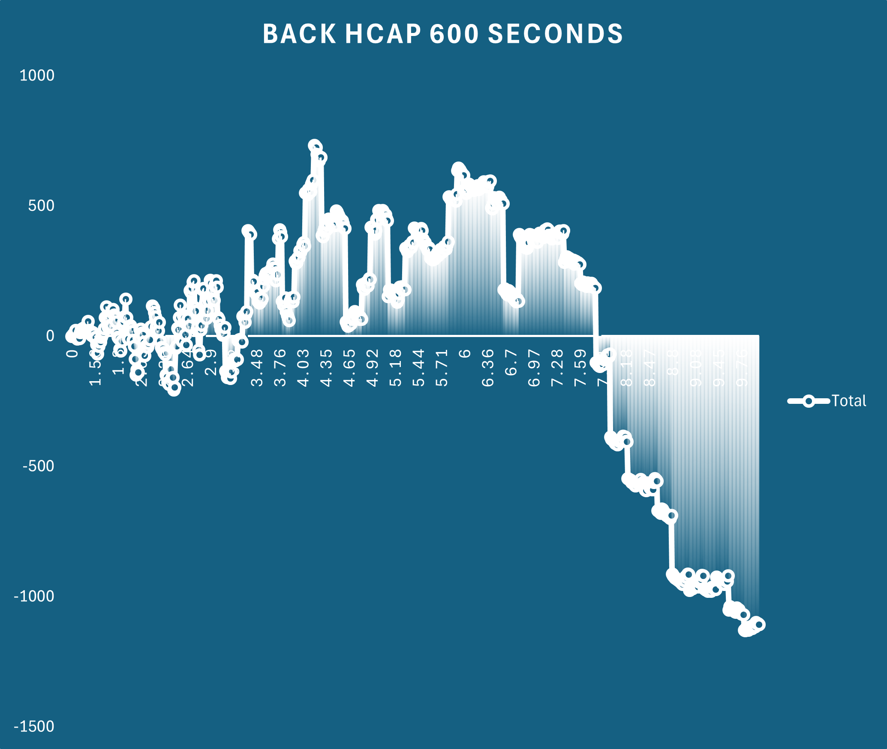
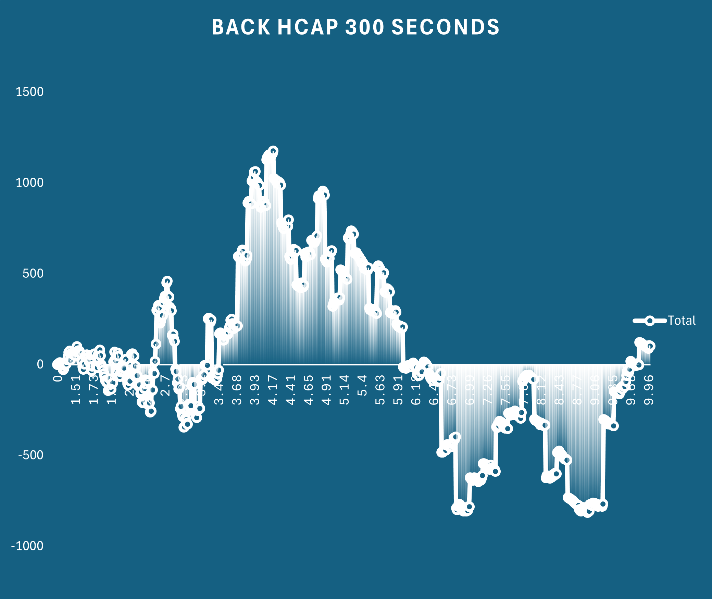
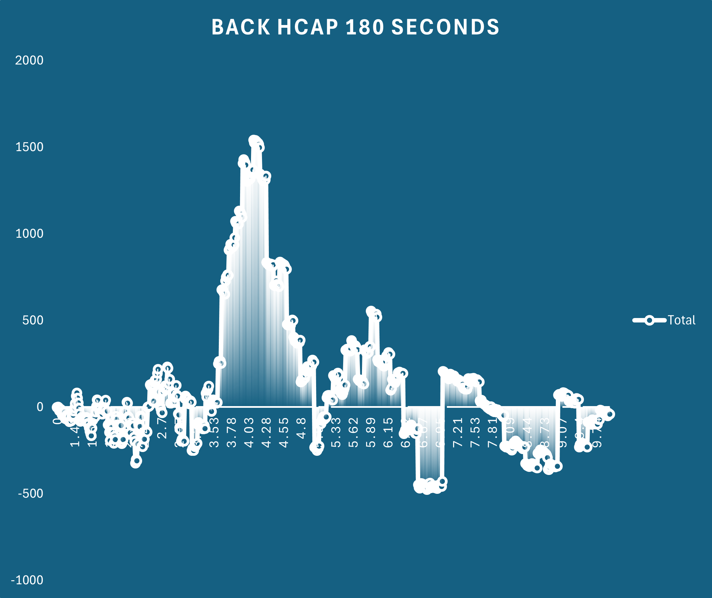
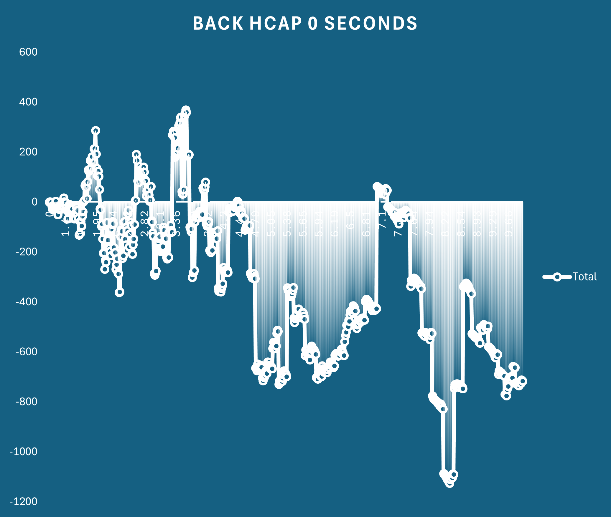

# Simulating Past Betfair Markets

It seems to be a common experience of designing and backtesting a model using a csv dataset, only to find that the behaviour of the model in production doesn't match the backtesting.
There could be instances of not being matched despite being at the front of the queue or just some weird unexplainable behaviour in the markets.

Thankfully Flumine, the python wrapper for the Betfair API, natively has a simulation mode that can be used to playback the historic data files and simulate placing bets in the market.
We have run through how to process a small set of markets in simulation model in our [How To Automate Series](../How_to_Automate_5.md) tutorials.
So powerful is the simulation mode however, that it deserves its own standalone tutorial!

## Limitations

The historic data files and their use in simulation mode have some limitations compared to using the live API.

 - Market Catalogue is not included in the historic stream files, so things like Runner Metadata cannot be accessed from the stream files
 - Cross matching (Virtual Bets) is also not included in the historic stream files, though for racing this should have limited impact
 - Live markets react to changes in volume on the exchange, so there will be no data on how any simulated bets would have affected other players in the market. This is salient if you wanted to test a strategy utilising large bet sizes or on high odds selections or using a trading model
 - The simulation is suited to Australian or New Zealand races but can be adapted for use in other countries with some minor changes.

This tutorial will utilise the PRO level files only, and has not been tested on the BASIC or ADVANCED level files. Australian and New Zealand customers can reach out to us at [automation@betfair.com.au](mailto:automation@betfair.com.au) to gain access to the PRO data files

## Tutorial Outline

In this tutorial, we will:

 - Create a list of market ids from publicly available CSV files
 - Unzip the .tar files and decompress the stream files only for the markets we're interested in
 - Run the simulation on our racing win markets (Code will be for Thoroughbred markets but can easily be adapted for Harness or Greyhounds)
 - Process the output of listClearedOrders to understand where we might find an angle

The important thing that we'll test here is entering the market at different points in time relative to the scheduled race time to determine if we can find better prices (both back and lay) depending on how far out from the off we decide to enter the market! The advice regarding stake size for the simulations is to be realistic; don't use $1000 stakes if you would realistically only bet $10 as the behaviour of live markets will be much different.

Without further ado, let's jump straight into it!

### Step 1 - Gather our markets and extract our files

!!! note "Stream Files"

    - You will need to have downloaded the tar files to your machine before starting

```py title="Import Libraries and Load Predictions"

import os
import glob
import shutil
import tarfile
import bz2
import pandas as pd
from datetime import datetime, timedelta

'''
Here we will specify the folder where we are storing our stream files and where we want to extract the files to
The code will check if the output folder exists, and will create one if it does not.
It will then check the folder and delete any files in the folder that are not tar or csv files
This deletion is to clear any previously extracted stream files and will be much faster than manually deleting them
'''

# Specify the directory where your stream files are stored and where you want to extract the files
source_folder = 'D:/Stream Files/Thoroughbreds/Australia'
output_folder = 'D:/Unzipped Stream Files'

# Define the start and end date for our timeline
end_date = datetime.today() - timedelta(months=1)
start_date = datetime(2023,1,1) # The files used below don't go further back than this

# Ensure the output folder exists
os.makedirs(output_folder, exist_ok=True)

# Get a list of all files in the directory
files = glob.glob(os.path.join(output_folder, '*'))

# Loop through the files and delete if they are not .tar files
for file in files:
    if not file.endswith('.tar') and not file.endswith('.csv'):
        try:
            os.remove(file)
            print(f'Deleted: {file}')
        except Exception as e:
            print(f'Error deleting {file}: {e}')

'''
The following section will iterate over all files in your folder, so the options to optimize are:

    - Move the files you don't want to process to another folder
    - Copy the files you do want to process to a new folder
    - Use string matching to remove unwanted files from the tar_files list
    - Manually specify each file by typing out a list
'''

# Iterate over all .tar files in the source folder
tar_files = glob.glob(os.path.join(source_folder, '*.tar'))

# Remove any files for markets before 2023
for tar in tar_files:
    if '2023' not in tar and '2024' not in tar:
        tar_files[tar].remove

''''
The next section will be used to retrieve a list of win market ids from online csv files.
If you have the market_ids already in a csv file, use the below code instead

win_markets = pd.read_csv('marketIds.csv',dtype={'WIN_MARKET_ID' : str})
win_market_ids = win_markets['WIN_MARKET_ID'].tolist()
'''

def retrieve_betfair_markets(end_date, start_date):
    # List to store DataFrames
    result_dataframes = []
    # Define our date variable that will be changed
    current_date = start_date
    # Initialise the while loop to ensure we cover our whole date range
    while current_date <= end_date:
        # Generate the URL
        url = f'https://betfair-datascientists.github.io/data/assets/ANZ_Thoroughbreds_{current_date.year}_{current_date.month:02d}.csv'
        try:
            # Read CSV data into a DataFrame directly from the URL
            df = pd.read_csv(url)
            result_dataframes.append(df)
            print(f"Processed: {url}")
        except Exception as e:
            print(f"Failed to fetch data from: {url}, Error: {e}")
        # Move to the next month
        current_date = current_date.replace(day=1) + pd.DateOffset(months=1)
    # Concatenate all DataFrames into one
    betfair_results = pd.concat(result_dataframes, ignore_index=True)
    # Keep only the win market ids
    win_markets=betfair_results['WIN_MARKET_ID'].unique().tolist()

    return win_markets

win_markets = retrieve_betfair_markets(end_date, start_date)

'''
The next code block here will iterate over each stream file and check if the market_id is in the list of our win market ids
Only the win markets will be extracted to the folder.
'''

for tar_path in tar_files:

    with tarfile.open(tar_path, 'r') as tar:
        # Iterate over each file in the tar archive
        for member in tar.getmembers():
            if member.name.endswith('.bz2'):
                # Extract the .bz2 file to a temporary location
                extracted_bz2_path = os.path.join(output_folder, os.path.basename(member.name))

                # Determine the final output path by removing the .bz2 extension
                final_output_path = extracted_bz2_path[:-4]
                market_id = extracted_bz2_path[-13:-4]
                
                if market_id in win_markets:
                    with tar.extractfile(member) as extracted_file, open(extracted_bz2_path, 'wb') as temp_bz2_file:
                        shutil.copyfileobj(extracted_file, temp_bz2_file)

                    # Extract the .bz2 file to the final destination
                    with bz2.BZ2File(extracted_bz2_path, 'rb') as bz2_file, open(final_output_path, 'wb') as output_file:
                        shutil.copyfileobj(bz2_file, output_file)
                
                    # Remove the temporary .bz2 file
                    os.remove(extracted_bz2_path)
                    
                    print(f'Extracted {member.name} to {final_output_path}')


```

### Step 2 Run the simulation

```py title="Running the simulation"

# Import libraries
import os
import time
import logging
import csv
import pandas as pd
import math
import re
from pythonjsonlogger import jsonlogger
from flumine import FlumineSimulation, BaseStrategy, utils, clients
from flumine.order.trade import Trade
from flumine.order.order import LimitOrder
from flumine.order.ordertype import OrderTypes
from flumine.markets.market import Market
from flumine.controls.loggingcontrols import LoggingControl
from betfairlightweight.resources import MarketBook
from pythonjsonlogger import jsonlogger
from concurrent import futures 
from flumine.utils import price_ticks_away
from collections import OrderedDict
from tqdm import tqdm

# Logging
logger = logging.getLogger()
custom_format = "%(asctime) %(levelname) %(message)"
log_handler = logging.StreamHandler()
formatter = jsonlogger.JsonFormatter(custom_format)
formatter.converter = time.gmtime
log_handler.setFormatter(formatter)
logger.addHandler(log_handler)
logger.setLevel(logging.CRITICAL)

'''
This code file is designed to iterate over the folder with the previously unzipped win market stream files
and place simulated bets on selections at certain time points before the scheduled race start time

We will speed this process up using multi-threading
'''
# Specify the folder where the unzipped stream files are stored
source_folder = 'D:/Unzipped Stream Files'
output_folder = 'C:/Users/mitch/Documents/Scripts/Flumine-Simulations'

# Function to split our list into chunks
def split_list(lst, chunk_size):
    for i in range(0, len(lst), chunk_size):
        yield lst[i:i + chunk_size]

# Function to extract the race distance from the market_name
def race_distance_split(market_book: MarketBook):
    # Define the variable market_name and use regex to extract the distance
    market_name = market_book.market_definition.name
    match = re.search(r'\s(\d+)m', market_name)
    distance = int(match.group(1))

    return distance

# Function to extract the race type from the market_name
def race_type_split(market_book: MarketBook):
    market_name = market_book.market_definition.name
    match = re.search(r'[^ ]+$',market_name)
    race_type = match.group(0)

    return race_type

# Defining our flumine class
class AusThoroughbredSimulation(BaseStrategy):

    '''
    Define an empty list called processed_selection_ids and import an element called 'time_point'
    '''
    def __init__(self, *args, time_point,**kwargs):
        super().__init__(*args, **kwargs)
        self.processed_selection_ids = []
        self.time_point = time_point

    def check_market_book(self, market: Market, market_book: MarketBook) -> bool:
        # process_market_book only executed if this returns True
        if market_book.status != "CLOSED":
            return True

    def process_market_book(self, market: Market, market_book: MarketBook) -> None:
        # Define the distance according to our function
        distance = race_distance_split(market_book)
        race_type = race_type_split(market_book)

         # If the time before the scheduled off matched our time_point, then placed a bet
        if (round(market.seconds_to_start, 0) == self.time_point and not market_book.inplay):
            # Create an ordered dictionary for collecting our notes
            notes = OrderedDict()
            # Here we are collecting information about the market to write to our results files
            notes["venue"] = "venue:"+str(market_book.market_definition.venue)
            notes["race_distance"] = "race_distance:"+str(distance)
            notes["field_size"] = "field_size:"+str(market_book.number_of_active_runners)
            notes["race_type"] = "race_type:"+race_type
            notes["time_point"] = "seconds_before_scheduled_off:"+str(self.time_point)
            
            for runner in market_book.runners:
                
                # Check runner hasn't scratched and that first layer of back price and lay price exists
                if runner.status == "ACTIVE" and runner.ex.available_to_back and runner.ex.available_to_lay:
                    ''''
                    The below code will place a lay bet at the best available back price and a back bet at the best available lay price,
                    putting our order to the back of the queue for both orders, leaving them in the market until the market goes inplay,
                    at which point these orders will lapse. 
                    After the simulations have been run, we will then cut the files of cleared orders to find a profitable angle
                    '''
                    if runner.selection_id not in self.processed_selection_ids:
                        trade = Trade(
                            market_id=market_book.market_id,
                            selection_id=runner.selection_id,
                            handicap=runner.handicap,
                            notes=notes,
                            strategy=self,
                        )
                        order = trade.create_order(
                            side="LAY",
                            order_type=LimitOrder(
                                price=price_ticks_away(runner.ex.available_to_back[0]['price'], 0),
                                size=round((20 / (price_ticks_away(runner.ex.available_to_back[0]['price'], 0))), 2),
                                persistence_type="LAPSE"
                            )
                        )
                        market.place_order(order)

                        trade = Trade(
                            market_id=market_book.market_id,
                            selection_id=runner.selection_id,
                            handicap=runner.handicap,
                            notes=notes,
                            strategy=self,
                        )
                        order = trade.create_order(
                            side="BACK",
                            order_type=LimitOrder(
                                price=price_ticks_away(runner.ex.available_to_lay[0]['price'], 0),
                                size=round((20 / (price_ticks_away(runner.ex.available_to_lay[0]['price'], 0))), 2),
                                persistence_type="LAPSE"
                            )
                        )
                        market.place_order(order)
                        self.processed_selection_ids.append(runner.selection_id)


# Fields we want to log in our simulations
FIELDNAMES = [
    "bet_id",
    "strategy_name",
    "market_id",
    "selection_id",
    "trade_id",
    "date_time_placed",
    "price",
    "price_matched",
    "size",
    "size_matched",
    "profit",
    "side",
    "elapsed_seconds_executable",
    "order_status",
    "market_note",
    "trade_notes",
    "order_notes",
]

# Class to define logging class and output results to csv files
class BacktestLoggingControl(LoggingControl):
    NAME = "BACKTEST_LOGGING_CONTROL"

    def __init__(self, time_point, *args, **kwargs):
        self.time_point = time_point
        super().__init__(*args, **kwargs)
        self._setup()

    def _setup(self):
        if os.path.exists(f"tho_simulation_{self.time_point}_seconds.csv"):
            logging.info("Results file exists")
        else:
            with open(f"tho_simulation_{self.time_point}_seconds.csv", "w") as m:
                csv_writer = csv.DictWriter(m, delimiter=",", fieldnames=FIELDNAMES)
                csv_writer.writeheader()

    def _process_cleared_orders_meta(self, event):
        orders = event.event
        with open(f"tho_simulation_{self.time_point}_seconds.csv", "a") as m:
            for order in orders:
                if order.order_type.ORDER_TYPE == OrderTypes.LIMIT:
                    size = order.order_type.size
                else:
                    size = order.order_type.liability
                if order.order_type.ORDER_TYPE == OrderTypes.MARKET_ON_CLOSE:
                    price = None
                else:
                    price = order.order_type.price
                try:
                    order_data = {
                        "bet_id": order.bet_id,
                        "strategy_name": order.trade.strategy,
                        "market_id": order.market_id,
                        "selection_id": order.selection_id,
                        "trade_id": order.trade.id,
                        "date_time_placed": order.responses.date_time_placed,
                        "price": price,
                        "price_matched": order.average_price_matched,
                        "size": size,
                        "size_matched": order.size_matched,
                        "profit": order.simulated.profit,
                        "side": order.side,
                        "elapsed_seconds_executable": order.elapsed_seconds_executable,
                        "order_status": order.status.value,
                        "market_note": order.trade.market_notes,
                        "trade_notes": order.trade.notes_str,
                        "order_notes": order.notes_str,
                    }
                    csv_writer = csv.DictWriter(m, delimiter=",", fieldnames=FIELDNAMES)
                    csv_writer.writerow(order_data)
                except Exception as e:
                    logger.error(
                        "_process_cleared_orders_meta: %s" % e,
                        extra={"order": order, "error": e},
                    )

        logger.info("Orders updated", extra={"order_count": len(orders)})
        

def run_process(chunk,time_point):  
    try:
        # Set Flumine to simulation mode
        client = clients.SimulatedClient(min_bet_validation=False)
        framework = FlumineSimulation(client=client)

        # Set parameters for our strategy
        strategy = AusThoroughbredSimulation(
            market_filter={
                "markets": chunk,  
                'market_types': ['WIN'],
                "listener_kwargs": {"inplay": False, "seconds_to_start": 610},  
            },
            max_order_exposure=100,
            max_selection_exposure=100,
            max_live_trade_count=2,
            max_trade_count=2,
            time_point = time_point
        )
        # Run our strategy on the simulated market
        framework.add_strategy(strategy)
        framework.add_logging_control(BacktestLoggingControl(time_point))
        framework.run()
    except Exception as e:
        logger.error(f"Error in run_process: {e}")

# Define our list of time points before the off where we want to try placing bets
time_points = [600, 480, 360, 300, 240, 180, 120, 60, 30, 0, -30]

# Iterate over our stream files using different time points
for time_point in time_points:

    if __name__ == "__main__":
        data_folder = source_folder
        data_files = os.listdir(data_folder)
        data_files = [f'{data_folder}/{path}' for path in data_files]
        '''
        Here we split our stream files into chunks of 1000 markets, so that each thread will discard the chunk once the list is complete
        Not splitting this list into chunks will cause memory allocation issues and the process will crash
        When iterating over a small number of markets, the chunking will not be required
        '''
        chunks = list(split_list(data_files, 1000))

        print(f'Processing simulation for {time_point} seconds before the off')
        # Iterate over each chunk and print a progress bar using tqdm
        for chunk_index, chunk in enumerate(tqdm(chunks, desc=f"Chunks Progress")):
                    
            all_markets = chunk
            processes = os.cpu_count()
            markets_per_process = 8  # Optimal to prevent data leakage

            _process_jobs = []

            with futures.ProcessPoolExecutor(max_workers=processes) as p:
                subset = math.ceil(len(all_markets) / processes)
                for m in utils.chunks(all_markets, subset):
                    _process_jobs.append(
                        p.submit(run_process, m, time_point)
                    )
                for job in futures.as_completed(_process_jobs):
                    job.result()

def process_csv_file(file_path):
    df = pd.read_csv(file_path, on_bad_lines='skip',low_memory=False)

    df.dropna(subset=['trade_notes'],inplace=True)

    # Process market_id column
    df['market_id'] = df['market_id'].astype(str).str.replace('1.', '', regex=False).str.ljust(9, '0')
    
    # Split trade_notes column into three new columns
    df[['venue','race_distance','field_size','race_type','seconds_before_scheduled_off']] = df['trade_notes'].str.split(',', expand=True)
    
    # Remove column names from the strings in each row
    df['venue'] = df['venue'].str.replace('venue:', '', regex=False)
    df['race_distance'] = df['race_distance'].str.replace('race_distance:', '', regex=False).astype(int)
    df['field_size'] = df['field_size'].str.replace('field_size:', '', regex=False).astype(int)
    df['race_type'] = df['race_type'].str.replace('race_type:', '', regex=False)
    df['seconds_before_scheduled_off'] = df['seconds_before_scheduled_off'].str.replace('seconds_before_scheduled_off:', '', regex=False).astype(int)
    
    # Process date_time_placed column
    df['date_time_placed'] = pd.to_datetime(df['date_time_placed'], dayfirst=True,format='mixed')
    df['date_time_placed'] = df['date_time_placed'].dt.tz_localize('UTC', ambiguous=False).dt.tz_convert('Australia/Melbourne')

    # Select relevant columns
    columns_to_keep = [
        'date_time_placed', 'venue', 'race_distance', 'race_type', 'field_size','seconds_before_scheduled_off',
        'market_id', 'selection_id', 'side', 'price', 'price_matched', 'size',
        'size_matched', 'elapsed_seconds_executable', 'profit'
    ]
    df = df[columns_to_keep]
    
    # Save the modified DataFrame to a new CSV file
    new_file_path = os.path.join(os.path.dirname(file_path), 'processed_' + os.path.basename(file_path))
    df.to_csv(new_file_path, index=False)

def process_all_files_in_folder(source_folder):
    for filename in os.listdir(source_folder):
        if filename.startswith('tho_simulation') and filename.endswith('.csv'):
            print(filename)
            file_path = os.path.join(source_folder, filename)
            process_csv_file(file_path)

# Process all our simulation files
process_all_files_in_folder(output_folder)

```

### Analysis

Now that we've done our simulations lets look at the output. 

Let's load up a sub selection of the bets - BACKING every selection on HANDICAP races at a price of less than $10.
The graphs are cumulative profit in price matched









The shapes of the graph seems to indicate the odds range for which there is value seems to narrow as the race start approaches with value very much concentrated in the $3.50-$4.50 range.
At the time of the off however (0 seconds) this peak has almost completely disappeared, which could indicate there's no value left in the market. 

This of course is a very basic and narrow view of this dataset. There are many other ways to cut it including by field size, race distance, track or price movement.
You could also join this to an additional dataset like the Betfair Hub Prediction Model or a dataset with data like trainer, barrier or jockey to determine if additional info could prove to be more profitable

---

## Disclaimer

Note that whilst models and automated strategies are fun and rewarding to create, we can't promise that your model or betting strategy will be profitable, and we make no representations in relation to the code shared or information on this page. If you're using this code or implementing your own strategies, you do so entirely at your own risk and you are responsible for any winnings/losses incurred. Under no circumstances will Betfair be liable for any loss or damage you suffer.